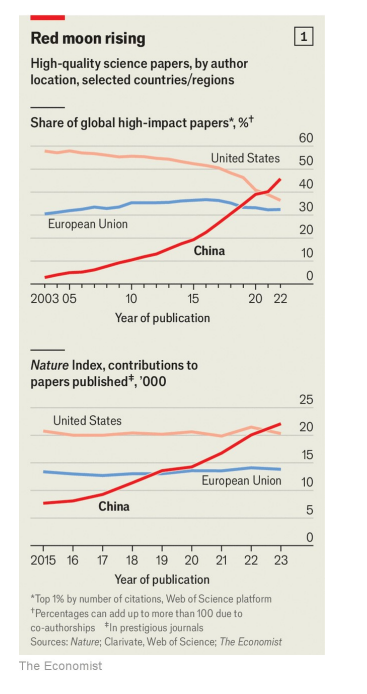
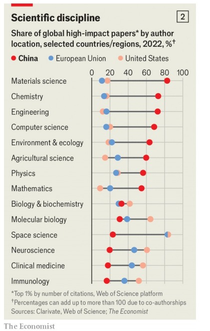
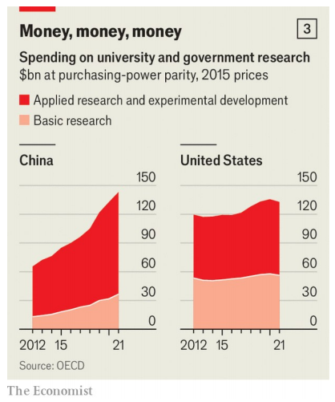
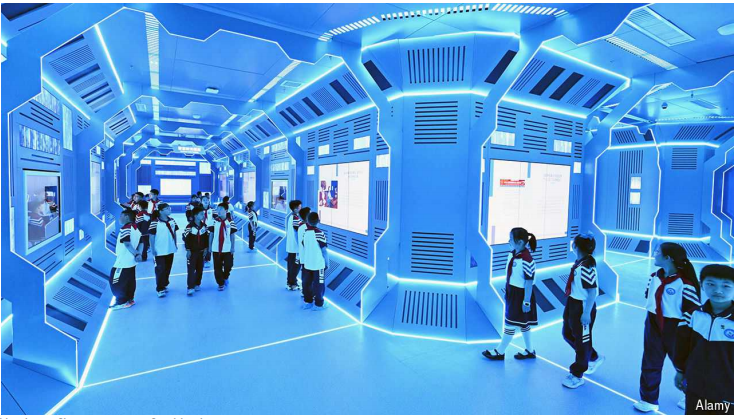

# **China has become a scientific superpower**

**From plant biology to superconductor physics the country is at the cutting edge**

本文是学习《经济学人》杂志2024年6月15日版 **China has become a scientific superpower**这篇文章的学习记录。

superconductor：超导体

原文：

In the atrium of a research building at the Chinese Academy of Sciences (CAS)

in Beijing is a wall of patents. Around five metres wide and two storeys

high, the wall displays 192 certificates, positioned in neat rows and

tastefully lit from behind. At ground level, behind a velvet rope, an array of

glass jars contain the innovations that the patents protect: seeds.

在北京中国科学院(CAS)研究大楼的中庭，是一堵专利墙。大约五米宽，两层楼高，这面墙展示了192个证书，整齐地排列着，从后面优雅地照亮。在地面上，天鹅绒绳子后面，一排玻璃罐里装着专利保护的创新:种子。

学习：

atrium：美 [ˈeɪtriəm] 门厅；正厅；

patent:专利

storey：美 [ˈstɔːri] 楼层；层

tastefully：美 ['teɪstfəlɪ] 高雅地；雅致地

lit：照亮；点火；（light的过去式和过去分词）

velvet： [ˈvelvɪt]  丝绒；天鹅绒；绒制品；

glass jars：玻璃罐子

原文：

CAS—the world’s largest research organisation—and institutions around China

produce a huge amount of research into the biology of food crops. In the

past few years Chinese scientists have discovered a gene that, when

removed, boosts the length and weight of wheat grains, another that

improves the ability of crops like sorghum and millet to grow in salty soils

and one that can increase the yield of maize by around 10%. In autumn last

year, farmers in Guizhou completed the second harvest of genetically

modified giant rice that was developed by scientists at CAS.

中科院——世界上最大的研究机构——和中国各地的机构对粮食作物的生物学进行了大量的研究。在过去的几年里，中国科学家发现了一种基因，当它被移除时，会增加小麦颗粒的长度和重量，另一种基因会提高高粱和小米等作物在盐渍土壤中的生长能力，还有一种基因可以使玉米产量增加约10%。去年秋天，贵州农民完成了中科院科学家开发的转基因巨型水稻的第二次收获。

学习：

produce a huge amount of research: 进行了大量的研究

food crops：粮食作物

grains：美 [greɪnz] 谷物；谷粒；粮食；颗粒；grain的复数形式

wheat grains：小麦颗粒

sorghum：美 [ˈsɔːrɡəm] 高粱

millet：美 [ˈmɪlɪt] 黍；稷；小米；

salty soils：盐渍土壤

increase the yield：增加产量

maize：美 [meɪz]   玉米

rice：米饭，水稻

genetically modified giant rice：转基因巨型水稻

原文：

The Chinese Communist Party (CCP) has made agricultural research—which it

sees as key to ensuring the country’s food security—a priority for scientists.

Over the past decade the quality and the quantity of crop research that China

produces has grown immensely, and now the country is widely regarded as a

leader in the field. According to an editor of a prestigious European plant-

sciences journal, there are some months when half of the submissions can

come from China.

CCP已将农业研究作为科学家的优先事项，认为农业研究是确保国家粮食安全的关键。在过去的十年里，中国农作物研究的质量和数量都有了巨大的增长，现在这个国家被广泛认为是该领域的领导者。据一家著名的欧洲植物科学杂志的编辑称，有些月份一半的投稿可能来自中国。

学习：

food security：粮食安全

grow immensely：巨大的增长

prestigious: 美 [preˈstɪdʒəs]  有威信的；有威望的；有声望的；地位显赫的 prestigious university 名牌大学，著名学府

## **A journey of a thousand miles**

原文：

The rise of plant-science research is not unique in China. In 2019 *The*

*Economist* surveyed the research landscape in the country and asked whether

China could one day become a scientific superpower. Today, that question

has been unequivocally answered: “yes”. Chinese scientists recently gained

the edge in two closely watched measures of high-quality science, and the

country’s growth in top-notch research shows no sign of slowing. The old

science world order, dominated by America, Europe and Japan, is coming to

an end

植物科学研究的兴起并非中国独有。2019年,《经济学人》调查了该国的研究前景，并询问中国是否有一天会成为科学超级大国。今天，这个问题得到了明确的回答:“是”。中国科学家最近在两项备受关注的高质量科学指标上取得了优势，中国在顶尖研究领域的增长没有放缓的迹象。由美国、欧洲和日本主导的旧的科学世界秩序即将结束

学习：

unequivocally：美 [ˌʌnɪˈkwɪvəklɪ] 清楚明确地；毫不含糊地

closely watched：密切关注的，备受关注的

top-notch：最高质量的；极好的          

top-notch research：尖端研究

show no sign of slowing：没有放缓的迹象

原文：

One way to measure the quality of a country’s scientific research is to tally

the number of high-impact papers produced each year—that is, publications

that are cited most often by other scientists in their own, later work. In 2003

America produced 20 times more of these high-impact papers than China,

according to data from Clarivate, a science analytics company (see chart 1).

By 2013 America produced about four times the number of top papers and,

in the most recent release of data, which examines papers from 2022, China

had surpassed both America and the entire European Union (EU).

衡量一个国家科学研究质量的一个方法是记录每年产生的高影响力论文的数量，即其他科学家在自己的后期工作中引用最多的出版物。根据科学分析公司Clarivate的数据，2003年美国高影响力论文的产量是中国的20倍。截至2013年，美国发表的顶级论文数量大约是中国的四倍，在最近发布的数据中，中国已经超过了美国和整个欧盟。

学习：

tally：美 [ˈtæli] 同意；一致；合计；统计

tally the number of high-impact papers： 统计高影响力的文章数量

原文：

Metrics based on citations can be gamed, of course. Scientists can, and do,

find ways to boost the number of times their paper is mentioned in other

studies, and a recent working paper, by Qui Shumin, Claudia Steinwender

and Pierre Azoulay, three economists, argues that Chinese researchers cite

their compatriots far more than Western researchers do theirs. But China

now leads the world on other benchmarks that are less prone to being

gamed. It tops the *Nature* Index, created by the publisher of the same name,

which counts the contributions to articles that appear in a set of prestigious

journals. To be selected for publication, papers must be approved by a panel

of peer reviewers who assess the study’s quality, novelty and potential for

impact. When the index was first launched, in 2014, China came second, but

its contribution to eligible papers was less than a third of America’s. By

2023 China had reached the top spot.

当然，基于引用的度量标准也是可以钻空子的。科学家可以，也确实找到了提高他们的论文在其他研究中被提及次数的方法，三位经济学家Qui Shumin、Claudia Steinwender和Pierre Azoulay最近的一篇工作论文认为，中国研究人员引用他们同胞的次数远远多于西方研究人员。但是中国现在在其他不太容易被欺骗的基准上领先世界。它在自然指数上名列前茅，该指数由同名出版商创建，统计了在一系列知名期刊上发表的文章的贡献。要被选中发表，论文必须经过同行评审小组的批准，他们评估研究的质量、新颖性和潜在影响。当该指数在2014年首次推出时，中国位居第二，但其对合格论文的贡献不到美国的三分之一。到2023年，中国已经成为第一名。

学习：

compatriot：美 [kəmˈpeɪtriət] 同国人；同胞

a panel of：一组

eligible：美 [ˈelɪdʒəbl]合格的；有资格的；符合条件的；

reach the top spot：登上榜首

原文：

According to the Leiden Ranking of the volume of scientific research output,

there are now six Chinese universities or institutions in the world top ten,

and seven according to the *Nature* Index. They may not be household names

in the West yet, but get used to hearing about Shanghai Jiao Tong, Zhejiang

and Peking (Beida) Universities in the same breath as Cambridge, Harvard

and ETH Zurich. “Tsinghua is now the number one science and technology

university in the world,” says Simon Marginson, a professor of higher

education at Oxford University. “That’s amazing. They’ve done that in a

generation.”

根据莱顿大学对科研产出量的排名，现在有六所中国大学或机构进入了世界前十名，根据自然指数，有七所。在西方，他们可能还不是家喻户晓的名字，但已经习惯于将上海交通大学、浙江大学和北京大学(北大)与剑桥大学、哈佛大学和苏黎世联邦理工学院相提并论。“清华现在是世界上排名第一的科技大学，”牛津大学高等教育教授Simon Marginson说。“太神奇了。他们在一代人的时间里做到了这一点。”

学习：

household name：家喻户晓的名字

原文：

Today China leads the world in the physical sciences, chemistry and Earth

and environmental sciences, according to both the *Nature* Index and citation

measures (see chart 2). But America and Europe still have substantial leads

in both general biology and medical sciences. “Engineering is the ultimate

Chinese discipline in the modern period,” says Professor Marginson, “I think

that’s partly about military technology and partly because that’s what you

need to develop a nation.”

今天，根据自然指数和引用指标，中国在物理科学、化学、地球和环境科学方面领先世界(见图表2)。但是美国和欧洲在普通生物学和医学领域仍然有很大的领先优势。“工程是现代中国的终极学科，”玛吉森教授说，“我认为这部分是因为军事技术，部分是因为这是发展一个国家所需要的。”

学习：

have substantial leads：有很大的领先优势

general biology：普通生物学

原文：

Applied research is a Chinese strength. The country dominates publications

on perovskite solar panels, for example, which offer the possibility of being

far more efficient than conventional silicon cells at converting sunlight into

electricity. Chinese chemists have developed a new way to extract hydrogen

from seawater using a specialised membrane to separate out pure water,

which can then be split by electrolysis. In May 2023 it was announced that

the scientists, in collaboration with a state-owned Chinese energy company,

had developed a pilot floating hydrogen farm off the country’s south-eastern

coast.

应用研究是中国的强项。例如，该国主导了钙钛矿太阳能电池板的出版物，这种电池板在将阳光转化为电能方面可能比传统的硅电池更有效。中国化学家开发了一种从海水中提取氢气的新方法，使用一种特殊的膜分离出纯水，然后通过电解分离。2023年5月，科学家宣布与一家中国国有能源公司合作，在中国东南沿海开发了一个试点浮动氢农场。

学习：

perovskite：美 [pəˈrɑvzkaɪt] 钙钛矿

solar panels：太阳能电池板

silicon cells：硅电池

convert sunlight into electricity：将太阳能转化为电能

chemist：美 [ˈkemɪst] 化学家；化学研究员；化学实验师；

membrane：美 [ˈmembreɪn] 薄膜；（身体内的）膜；膜状物；细胞膜

electrolysis：英 [ˌɪlɛkˈtrɒlɪsɪs] 电解

pilot:试验性的，试点

off the south-eastern coast：东南沿海

原文：

China also now produces more patents than any other country, although

many are for incremental tweaks to designs, as opposed to truly original

inventions. New developments tend to spread and be adopted more slowly in

China than in the West. But its strong industrial base, combined with cheap

energy, means that it can quickly spin up large-scale production of physical

innovations like materials. “That’s where China really has an advantage on

Western countries,” says Jonathan Bean, 

CEO of Materials Nexus, a British

firm that uses AI to discover new materials.

中国现在也比其他任何国家产生更多的专利，尽管许多是对设计的渐进调整，而不是真正的原创发明。与西方相比，新的发展在中国传播和被采纳的速度更慢。但其强大的工业基础，加上廉价的能源，意味着它可以快速推动材料等物理创新的大规模生产。英国Materials Nexus公司首席执行官乔纳森·比恩(Jonathan Bean)说:“这是中国相对于西方国家真正具有优势的地方。”Materials Nexus公司利用人工智能发现新材料。

学习：

tweak：微调，调整

spin up：自旋向上

spin up large-scale production：推动大规模生产

原文：

The country is also signalling its scientific prowess in more conspicuous

ways. Earlier this month, China’s *Chang’e-6* robotic spacecraft touched

down in a gigantic crater on the far side of the Moon, scooped up some

samples of rock, planted a Chinese flag and set off back towards Earth. If it

successfully returns to Earth at the end of the month, it will be the first

mission to bring back samples from this hard-to-reach side of the Moon

中国还以更引人注目的方式展示其科学实力。本月早些时候，中国的嫦娥6号机器人飞船在月球远端的一个巨大的陨石坑着陆，收集了一些岩石样本，插上一面中国国旗，然后返回地球。如果它在月底成功返回地球，这将是第一次从月球难以到达的一侧带回样本的任务

学习：

prowess：美 [ˈpraʊəs]  英勇；勇猛；无畏；卓越技能；高超本领；杰出才能；

signalling its scientific prowess: 展示科学实力

conspicuous：美 [kənˈspɪkjuəs]显而易见的；引人注目的；

crater：美 [ˈkreɪtər] 坑；火山口；

touch down in a gigantic crater: 在巨大的陨石坑着陆

scoop up：掘；挖空；搜集；

## **First, sharpen your tools**

原文：

The reshaping of Chinese science has been achieved by focusing on three

areas: money, equipment and people. In real terms, China’s spending on

research and development (R&D) has grown 16-fold since 2000. According to

the most recent data from the  OECD, from 2021, China still lagged behind

America on overall R&D spending, dishing out $668bn, compared with

$806bn for America at purchasing-power parity. But in terms of spending by

universities and government institutions only, China has nudged ahead. In

these places America still spends around 50% more on basic research,

accounting for costs, but China is splashing the cash on applied research and

experimental development (see chart 3).

中国科学的重塑是通过关注三个领域实现的:资金、设备和人员。按实际价值计算，自2000年以来，中国(R&D)的研发支出增长了16倍。根据经合组织的最新数据，从2021年开始，中国在R&D的总支出仍落后于美国，为6680亿美元，而按购买力平价计算，美国为8060亿美元。但仅从大学和政府机构的支出来看，中国已经遥遥领先。在这些地方，考虑到成本因素，美国在基础研究上的支出仍然高出50%左右，但中国在应用研究和实验开发上投入了大量资金(见图表3)。

学习：

has grown 16-fold：增长了16倍

lag behind：落后

overall R&D spending：研发总支出

dishing out \$668 bn: 支出6680亿元

purchasing power：购买力

nudge：美 [nʌdʒ] 达到；接近；使达到；使接近

nudge ahead：领先

splash the cash on：投入资金

原文：

Money is meticulously directed into strategic areas. In 2006 the 

CCP published its vision for how science should develop over the next 15 years. Blueprints

for science have since been included in the CCP’s five-year development plans.

The current plan, published in 2021, aims to boost research in quantum

technologies,  AI, semiconductors, neuroscience, genetics and biotechnology,

regenerative medicine, and exploration of “frontier areas” like deep space,

deep oceans and Earth’s poles.

资金被小心翼翼地导向战略领域。2006年，CCP发表了其对未来15年科学发展的展望。科学蓝图已经被纳入CCP的五年发展计划。目前的计划于2021年发布，旨在推动量子技术、人工智能、半导体、神经科学、遗传学和生物技术、再生医学以及探索深空、深海和地球两极等“前沿领域”的研究。

学习：

meticulously：美 [məˈtɪkjələsli] 细致地；一丝不苟地；拘泥地

genetics：美 [dʒəˈnetɪks]遗传学；遗传特性；

原文：

Creating world-class universities and government institutions has also been

a part of China’s scientific development plan. Initiatives like “Project 211”,

the “985 programme” and the “China Nine League” gave money to selected

labs to develop their research capabilities. Universities paid staff bonuses—

estimated at an average of \$44,000 each, and up to a whopping \$165,000—if

they published in high-impact international journals.

创建世界一流的大学和政府机构也是中国科学发展计划的一部分。像“211工程”、“985计划”和“中国九大联盟”这样的倡议为选定的实验室提供资金，以发展它们的研究能力。如果他们在高影响力的国际期刊上发表论文，大学会支付员工奖金——估计平均每人4.4万美元，最高可达16.5万美元。

学习：

world-class university：世界级的大学

project 211： 211工程

985 program: 985计划

China Nine League：C9联盟

develop research capabilities：发展研究能力

up to a whopping xxx：最高可达xxx

whopping：美 [ˈwɑːpɪŋ]    巨大的；庞大的

原文：

Building the workforce has been a priority. Between 2000 and 2019, more

than 6m Chinese students left the country to study abroad, according to

China’s education ministry. In recent years they have flooded back, bringing

their newly acquired skills and knowledge with them. Data from the 

OECD suggest that, since the late 2000s, more scientists have been returning to the

country than leaving. China now employs more researchers than both

America and the entire  EU.

建设员工队伍一直是重中之重。根据中国教育部的数据，2000年至2019年间，超过600万中国学生出国留学。近年来，他们带着新获得的技能和知识大量回流。经合组织的数据表明，自2000年代末以来，回国的科学家比离开的科学家多。中国现在雇佣的研究人员比美国和整个欧盟都多。

学习：

workforce：劳动力；劳动人口；（某组织或公司的）全体员工；全体从业人员          

education ministry：教育部

原文：

Many of China’s returning scientists, often referred to as “sea turtles” (a play

on the Chinese homonym *haigui*, meaning “to return from abroad”) have

been drawn home by incentives. One such programme launched in 2010, the

“Youth Thousand Talents”, offered researchers under 40 one-off bonuses of

up to 500,000 yuan (equivalent to roughly $150,000 at purchasing-power

parity) and grants of up to 3m yuan to get labs up and running back home.

And it worked. A study published in *Science* last year found that the scheme

brought back high-calibre young researchers—they were, on average, in the

most productive 15% of their peers (although the real superstar class tended

to turn down offers). Within a few years, thanks to access to more resources

and academic manpower, these returnees were lead scientists on 2.5 times

more papers than equivalent researchers who had remained in America.

许多中国的归国科学家，通常被称为“海龟”(谐音“海归”，意思是“从国外回来”)，被激励吸引回国。2010年发起的“青年千人计划”就是这样一个项目，为40岁以下的研究人员提供高达50万元的一次性奖金(按购买力平价计算相当于15万美元)和高达300万元的补助金，让他们能够在国内建立并运行实验室。而且成功了。去年发表在《科学》杂志上的一项研究发现，该计划带回了高素质的年轻研究人员——他们平均属于同龄人中最有生产力的15%(尽管真正的超级明星阶层倾向于拒绝邀请)。几年内，由于获得了更多的资源和学术人力，这些归国人员成为了首席科学家，发表的论文是留在美国的同等研究人员的2.5倍。

学习：

sea turtles：海龟

homonym：美 [ˈhɑməˌnɪm] 同音异义词

one-off一次性的

one-off bonuses：一次性奖金

scheme：美 [skiːm] 计划；规划；方案 **注意发音**

calibre：英 [ˈkalɪbə] （尤指人的）能力 **注意发音**

high-calibre： 高素质的

turn down offers：拒绝offer

manpower：美 [ˈmænˌpaʊ(ə)r] 劳动人口；工作人员；人力；人

remain in America：留在美国

returnees：美 [rɪtɜː'niːz] 海归

原文：

As well as pull, there has been a degree of push. Chinese scientists working

abroad have been subject to increased suspicion in recent years. In 2018

America launched the China Initiative, a largely unsuccessful attempt to root

out Chinese spies from industry and academia. There have also been reports

of students being deported because of their association with China’s

“military-civilian fusion strategy”. A recent survey of current and former

Chinese students studying in America found that the share who had

experienced racial abuse or discrimination was rising.

原文：

The availability of scientists in China means that, for example in quantum

computing, some of the country’s academic labs are more like commercial

labs in the West, in terms of scale. “They have research teams of 20, 30,

even 40 people working on the same experiments, and they make really

good progress,” says Christian Andersen, a quantum researcher at Delft

University. In 2023 researchers working in China broke the record for the

number of quantum bits, or qubits, entangled inside a quantum computer.

中国科学家的存在意味着，比如在量子计算领域，就规模而言，中国的一些学术实验室更像西方的商业实验室。代尔夫特大学的量子研究员克里斯蒂安·安德森说:“他们有20、30甚至40人的研究团队从事同样的实验，他们取得了很大的进展。”2023年，在中国工作的研究人员打破了量子计算机中纠缠的量子比特数量的记录。

学习：

break the record for：打破纪录

原文

China has also splurged on scientific kit. In 2019, when *The Economist* last

surveyed the state of the country’s scientific research, it already had an

enviable inventory of flashy hardware including supercomputers, the world’s

largest filled-aperture radio telescope and an underground dark-matter

detector. The list has only grown since then. The country is now home to the

world’s most sensitive ultra-high-energy cosmic-ray detector (which has

recently been used to test aspects of Albert Einstein’s special theory of

relativity), the world’s strongest steady-state magnetic field (which can

probe the properties of materials) and soon will have one of the world’s most

sensitive neutrino detectors (which will be used to work out which type of

these fundamental subatomic particles has the highest mass). Europe and

America have plenty of cool kit of their own, but China is rapidly adding

hardware.

中国也在科学设备上大量花钱。2019年，当《经济学人》上次调查该国的科学研究状况时，它已经拥有令人羡慕的华丽硬件清单，包括超级计算机、世界上最大的全孔径射电望远镜和地下暗物质探测器。从那以后，这个名单一直在增长。该国现在拥有世界上最灵敏的超高能宇宙射线探测器(最近被用于测试阿尔伯特·爱因斯坦的狭义相对论的某些方面)，世界上最强的稳态磁场(可以探测材料的属性)，并且很快将拥有世界上最灵敏的中微子探测器之一(将用于计算哪种类型的基本亚原子粒子具有最高的质量)。欧洲和美国有很多自己的酷装备，但中国正在迅速增加硬件。

学习：

splurge：美 [splərdʒ] 挥霍；大手大脚地花钱

enviable：美 [ˈenviəbl] 令人羡慕；值得羡慕的；引人忌妒的；

inventory：库存；存货；财产清单；

flashy：浮华的；华而不实的；显眼的；过分华丽的

radio telescope：射电望远镜

aperture：英 [ˈapətʃə] （尤指摄影机等的光圈）孔径；

cosmic-ray：宇宙射线

theory of relativity：相对论

property of materials：物质的属性

neutrino：英 [njuːˈtriːnəʊ] 中微子

原文：

Individual labs in China’s top institutions are also well equipped. Niko

McCarty, a journalist and former researcher at the Massachusetts Institute of

Technology who was recently given a tour of synthetic biology labs in

China, was struck by how, in academic institutions, “the machines are just

more impressive and more expansive” than in America. At the Advanced

Biofoundry at the Shenzhen Institute of Advanced Technology, which the

country hopes will be the centre of China’s answer to Silicon Valley, Mr

McCarty described an “amazing building with four floors of robots”. As

Chinese universities fill with state-of-the-art equipment and elite

researchers, and salaries become increasingly competitive, Western

institutions look less appealing to young and ambitious Chinese scientists.

“Students in China don’t think about America as some “scientific Mecca” in

the same way their advisers might have done,” said Mr McCarty.

中国顶级机构的个别实验室也装备精良。记者、前麻省理工学院(Massachusetts Institute of Technology)研究员尼科·麦卡蒂(Niko McCarty)最近参观了中国的合成生物学实验室，他对学术机构的“机器比美国的更令人印象深刻、更广阔”感到震惊。在深圳先进技术研究院的先进生物基地，中国希望它成为中国版硅谷的中心，麦卡蒂先生描述了一个“有四层机器人的惊人建筑”。随着中国的大学充满了最先进的设备和精英研究人员，工资变得越来越有竞争力，西方机构对年轻和雄心勃勃的中国科学家的吸引力越来越小。“中国的学生并不像他们的导师那样认为美国是一些‘科学圣地’，”麦卡蒂先生说。

学习：

well equipped：装备精良

elite：美 [eɪˈliːt] 精英；精锐； **注意发音**

salary become increasingly competitive：薪水越来越有竞争力

All the flowers of all the tomorrows

原文：

Take AI, for example. In 2019 just 34% of Chinese students working in the

field stayed in the country for graduate school or work. By 2022 that number

was 58%, according to data from the 

AI talent tracker by MacroPolo, an

American think-tank (in America the figure for 2022 was around 98%).

China now contributes to around 40% of the world’s research papers on 

AI, compared with around 10% for America and 15% for the  EU and Britain

combined. One of the most highly cited research papers of all time,

demonstrating how deep neural networks could be trained on image

recognition, was written by AI researchers working in China, albeit for

Microsoft, an American company. “China’s 

AI research is world-class,” said

Zachary Arnold, an AI analyst at the Georgetown Centre for Emerging

Security and Technology. “In areas like computer vision and robotics, they

have a significant lead.”

以AI为例。2019年，在该领域工作的中国学生中，只有34%留在国内读研或工作。根据美国智库MacroPolo的人工智能人才追踪系统的数据，到2022年，这一数字为58%(在美国，2022年这一数字约为98%)。中国现在贡献了世界上大约40%的人工智能研究论文，相比之下，美国大约为10%，欧盟和英国的总和为15%。有史以来引用率最高的研究论文之一是由在中国工作的人工智能研究人员撰写的，该论文展示了深度神经网络可以在图像识别方面进行训练，尽管是为美国公司微软撰写的。“中国的人工智能研究是世界一流的，”乔治敦新兴安全和技术中心的人工智能分析师扎卡里·阿诺德说。"在计算机视觉和机器人技术等领域，他们处于显著领先地位."

学习：

think-tank ：智库

原文：

Growth in the quality and quantity of Chinese science looks unlikely to stop

anytime soon. Spending on science and technology research is still

increasing—the government has announced a 10% increase in funding in 2024.

And the country is training an enormous number of young scientists.

In 2020 Chinese universities awarded 1.4m engineering degrees, seven times

more than America did. China has now educated, at undergraduate level, 2.5

times more of the top-tier 

AI researchers than America has. And by 2025,

Chinese universities are expected to produce nearly twice as many 

PhD graduates in science and technology as America.

中国科学在质量和数量上的增长看起来不太可能很快停止。科学和技术研究的支出仍在增加——政府已宣布2024年的资金将增加10%。这个国家正在培养大量的年轻科学家。2020年，中国大学授予了140万个工程学位，是美国的7倍。中国现在培养的本科层次的顶级人工智能研究人员是美国的2.5倍。到2025年，中国大学预计将培养出两倍于美国的科技博士毕业生。

## **To see further, ascend another floor**

原文：

Although China is producing more top-tier work, it still produces a vast

amount of lower-quality science too. On average, papers from China tend to

have lower impact, as measured by citations, than those from America,

Britain or the EU. And while the chosen few universities have advanced, mid-

level universities have been left behind. China’s second-tier institutions still

produce work that is of relatively poor quality compared with their

equivalents in Europe or America. “While China has fantastic quality at the

top level, it’s on a weak base,” explains Caroline Wagner, professor of

science policy at Ohio State University

尽管中国产生了更多的顶级作品，但它也产生了大量低质量的科学。平均而言，以引用量衡量，中国论文的影响力往往低于美国、英国或欧盟的论文。虽然被选中的几所大学取得了进步，但中等水平的大学却被落在了后面。与欧洲或美国的同行相比，中国二线院校的工作质量仍然相对较差。俄亥俄州立大学科学政策教授卡罗琳·瓦格纳解释说:“虽然中国在顶级水平上有着非凡的品质，但它的基础很薄弱。”

原文：

When it comes to basic, curiosity-driven research (rather than applied)

China is still playing catch-up—the country publishes far fewer papers than

America in the two most prestigious science journals, *Nature* and *Science*.

This may partly explain why China seems to punch below its weight in the

discovery of completely new technologies. Basic research is particularly

scant within Chinese companies, creating a gap between the scientists

making discoveries and the industries that could end up using them. “For

more original innovation, that might be a minus,” says Xu Xixiang, chief

scientist at LONGi Green Energy Technology, a Chinese solar company.

当谈到基础的、好奇心驱动的研究(而不是应用研究)时，中国仍然在追赶——该国在两个最负盛名的科学期刊《自然》和《科学》上发表的论文远远少于美国。这可能部分解释了为什么中国在发现全新技术方面似乎力不从心。在中国企业内部，基础研究尤其匮乏，这在做出发现的科学家和最终可能使用这些发现的行业之间造成了差距。中国太阳能公司朗吉绿色能源科技(LONGi Green Energy Technology)的首席科学家徐希祥表示:“对于更多的原始创新来说，这可能是一个不利因素。”。

学习：

playing catch-up：还在追赶

partly explain：部分解释

punch：美 [pʌntʃ] 猛击；打拳；用拳猛击

puch below its weight：力不从心

scant：美 [skænt]  缺乏的；不足的；

原文：

Incentives to publish papers have created a market for fake scientific

publications. A study published earlier this year in the journal *Research*

*Ethics*, featured anonymous interviews from Chinese academics, one of

whom said he had “no choice but to commit [research] misconduct”, to keep

up with pressures to publish and retain his job. “Citation cartels” have

emerged, where groups of researchers band together to write low-quality

papers that cite each other’s work in an effort to drive up their metrics. In

2020 China’s science agencies announced that such cash-for-publication

schemes should end and, in 2021, the country announced a nationwide

review of research misconduct. That has led to improvements—the rate at

which Chinese researchers cite themselves, for example, is falling, according

to research published in 2023. And China’s middle-ranking universities are

slowly catching up with their Western equivalents, too.

发表论文的动机创造了一个科学出版物造假的市场。今年早些时候发表在《研究伦理》(Research Ethics)杂志上的一项研究对中国学者进行了匿名采访，其中一名学者表示，他“别无选择，只能从事(研究)不当行为”，以应对发表论文和保住工作的压力。“引用卡特尔”已经出现，在这种情况下，研究人员团体联合起来撰写低质量的论文，引用彼此的工作，以努力提高他们的指标。2020年，中国的科学机构宣布，这种现金出版计划应该结束，2021年，中国宣布在全国范围内对研究不端行为进行审查。这导致了进步——例如，根据2023年发表的研究，中国研究人员引用自己的比率正在下降。中国的中等水平大学也在慢慢赶上西方同类大学。

学习：

commit misconduct: 从事不当行为

原文：

The areas where America and Europe still hold the lead are, therefore,

unlikely to be safe for long. Biological and health sciences rely more heavily

on deep subject-specific knowledge and have historically been harder for

China to “bring back and accelerate”, says Tim Dafforn, a professor of

biotechnology at University of Birmingham and former adviser to Britain’s

department for business. But China’s profile is growing in these fields.

Although America currently produces roughly four times more highly

influential papers in clinical medicine, in many areas China is producing the

most papers that cite this core research, a sign of developing interest that

presages future expansion. “On the biology side, China is growing

remarkably quickly,” says Jonathan Adams, chief scientist at the Institute for

Scientific Information at Clarivate. “Its ability to switch focus into a new

area is quite remarkable.”

因此，美国和欧洲仍然领先的地区不太可能长久安全。伯明翰大学(University of Birmingham)生物技术教授、英国商务部前顾问蒂姆·达佛恩(Tim Dafforn)表示，生物和健康科学更依赖于深厚的特定学科知识，而且从历史上看，中国更难“带回并加速发展”。但是中国在这些领域的影响力正在增长。尽管美国目前在临床医学领域产生的高影响力论文大约是中国的四倍，但在许多领域，中国正在产生引用这一核心研究的最多论文，这是兴趣发展的迹象，预示着未来的扩张。“在生物学方面，中国发展非常迅速，”Clarivate科学信息研究所的首席科学家乔纳森·亚当斯说。"它将焦点转移到一个新领域的能力相当了不起."

学习：

hold the lead：保持领先

department for business：商务部

原文：

The rise of Chinese science is a double-edged sword for Western

governments. China’s science system is inextricably linked with its state and

armed forces—many Chinese universities have labs explicitly working on

defence and several have been accused of engaging in espionage or cyber

attacks. China has also been accused of intellectual-property theft and

increasingly stringent regulations have made it more difficult for

international collaborators to take data out of the country; notoriously, in

2019, the country cut off access to American-funded work on coronaviruses

at the Wuhan Institute of Virology. There are also cases of Chinese

researchers failing to adhere to the ethical standards expected by Western

scientists.

中国科学的崛起对西方政府来说是一把双刃剑。中国的科学体系与其国家和军队有着千丝万缕的联系——许多中国大学都有明确致力于国防的实验室，还有几所大学被指控从事间谍活动或网络攻击。中国也被指控窃取知识产权，越来越严格的法规使得国际合作者将数据带出中国变得更加困难；众所周知，在2019年，该国切断了美国资助的中国科学院武汉病毒研究所冠状病毒研究。也有中国研究人员未能遵守西方科学家期望的道德标准的情况。

学习：

armed forces：军队

inextricably：美 [ˌɪnɪkˈstrɪkəbli] 逃不掉地；解决不了地

notoriously：美 [noʊˈtɔːriəsli] 声名狼藉地；恶名昭彰地；众所周知地

virology：美 [vaɪˈrɑlədʒi]  病毒学

原文：

Despite the concerns, Chinese collaborations are common for Western

researchers. Roughly a third of papers on telecommunications by American

authors involve Chinese collaborators. In imaging science, remote sensing,

applied chemistry and geological engineering, the figures are between 25%

and 30%. In Europe the numbers are lower, around 10%, but still significant.

These partnerships are beneficial for both countries. China tends to

collaborate more in areas where it is already strong like materials and

physics. A preprint study, released last year, found that for AI research, having

a co-author from America or China was equally beneficial to authors from

the other country, conferring on average 75% more citations.

尽管存在这些担忧，但中国的合作对西方研究人员来说很常见。大约三分之一由美国作者撰写的关于电信的论文涉及中国合作者。在成像科学、遥感、应用化学和地质工程领域，这个数字在25%到30%之间。在欧洲，这一数字较低，约为10%，但仍然意义重大。这些伙伴关系对两国都有利。中国倾向于在材料和物理等它已经很强的领域进行更多的合作。去年发布的一项预印本研究发现，对于人工智能研究来说，拥有来自美国或中国的合著者对来自其他国家的作者同样有利，平均增加75%的引用。

学习：

applied chemistry：应用化学

confer：授予

原文：

Several notable successes have come from working together, too. During the

covid-19 pandemic a joint venture between Oxford University’s Engineering

Department and the Oxford Suzhou Centre for Advanced Research

developed a rapid covid test that was used across British airports. In 2015

researchers at University of Cardiff and South China Agricultural University

identified a gene that made bacteria resistant to the antibiotic colistin.

Following this, China, the biggest consumer of the drug, banned its use in

animal feed, and levels of colistin resistance in both animals and humans

declined.

合作也带来了一些显著的成功。在covid-19期间，牛津大学工程系和牛津大学苏州高级研究中心的一家合资企业开发了一种快速covid测试，该测试已在英国各机场使用。2015年，卡迪夫大学和华南农业大学的研究人员发现了一种基因，这种基因使细菌对抗生素粘菌素产生耐药性。随后，该药物的最大消费国中国禁止在动物饲料中使用该药物，动物和人类对粘杆菌素的耐药性水平下降。

学习：

notable：显著的

joint venture：合资企业

原文：

In America and Europe, political pressure is limiting collaborations with

China. In March, America’s Science and Technology Agreement with China,

which states that scientists from both countries can collaborate on topics of

mutual benefit, was quietly renewed for a further six months. Although

Beijing appears keen to renew the 45-year-old agreement, many Republicans

fear that collaboration with China is helping the country achieve its national

security goals. In Europe, with the exception of environmental and climate

projects, Chinese universities have been effectively barred from accessing

funding through the Horizon programme, a huge European research

initiative.

在美国和欧洲，政治压力限制了与中国的合作。今年3月，美国与中国的科技协议被悄悄地延长了6个月，该协议规定两国科学家可以在互利的主题上进行合作。尽管北京似乎热衷于更新这项已有45年历史的协议，但许多共和党人担心与中国的合作有助于该国实现其国家安全目标。在欧洲，除了环境和气候项目，中国大学实际上被禁止通过欧洲大型研究项目“地平线计划”(Horizon programme)获得资金。

学习：

keen on：热衷于

access funding：获取资金，获得资助

原文：

There are also concerns among scientists that China is turning inwards. The

country has explicit aims to become self-reliant in many areas of science and

technology and also shift away from international publications as a way of

measuring research output. Many researchers cannot talk to the press—

finding sources in China for this story was challenging. One Chinese plant

scientist, who asked to remain anonymous, said that she had to seek

permission a year in advance to attend overseas conferences. “It’s

contradictory—on the one hand, they set restrictions so that scientists don’t

have freedoms like being able to go abroad to communicate with their

colleagues. But on the other hand, they don’t want China to fall behind.”

科学家们也担心中国正在变得内向。该国有明确的目标，要在许多科学和技术领域实现自力更生，并摆脱以国际出版物作为衡量研究成果的方式。许多研究人员不能与媒体交谈——在中国寻找这个故事的来源是一个挑战。一位要求匿名的中国植物科学家说，她参加海外会议必须提前一年获得许可。“这是矛盾的——一方面，他们设置限制，让科学家没有像出国与同事交流这样的自由。但另一方面，他们也不希望中国落后。”

## **Live until old, learn until old**

原文：

The overwhelming opinion of scientists in China and the West is that

collaboration must continue or, better, increase. And there is room to do

more. Though China’s science output has grown dramatically, the share that

is conducted with international collaborators has remained stable at around

20%—Western scientists tend to have far more international collaborations.

Western researchers could pay more attention to the newest science from

China, too. Data from a study published last year in *Nature Human*

*Behaviour* showed that, for work of equivalent quality, Chinese scientists

cite Western papers far more than vice versa. Western scientists rarely visit,

work or study in China, depriving them of opportunities to learn from

Chinese colleagues in the way Chinese scientists have done so well in the

West.

中国和西方科学家的压倒性意见是，合作必须继续，或者更好的是，增加。而且还有做得更多的空间。尽管中国的科学产出大幅增长，但与国际合作者进行的合作份额一直稳定在20%左右——西方科学家往往有更多的国际合作。西方研究人员也可以更多地关注来自中国的最新科学。去年发表在《自然·人类行为》上的一项研究数据显示，对于同等质量的工作，中国科学家引用西方论文的次数远远多于西方科学家引用中国论文的次数。西方科学家很少在中国访问、工作或学习，这剥夺了他们向中国同事学习的机会，而中国科学家向西方学习方面做得很好。

原文：

Closing the door to Chinese students and researchers wishing to come to

Western labs would also be disastrous for Western science. Chinese

researchers form the backbone of many departments in top American and

European universities. In 2022 more of the top-tier 

AI researchers working in

America hailed from China than from America. The West’s model of science

currently depends on a huge number of students, often from overseas, to

carry out most day-to-day research.

对希望来到西方实验室的中国学生和研究人员关上大门，对西方科学来说也是灾难性的。中国研究人员构成了美国和欧洲顶尖大学许多系的骨干力量。2022年，更多在美国工作的顶级人工智能研究人员来自中国，而不是美国。西方的科学模式目前依赖于大量学生(通常来自海外)来进行大多数日常研究。

学习：

form the backbone：构成了xxx的骨干力量

hail from：来自于

原文：

There is little to suggest that the Chinese scientific behemoth will not

continue growing stronger. China’s ailing economy may eventually force the

CCP to slow spending on research, and if the country were to become

completely cut off from the Western science community its research would

suffer. But neither of these looks imminent. In 2019 we also asked if

research could flourish in an authoritarian system. Perhaps over time its

limits will become clear. But for now, and at least for the hard sciences, the

answer is that it can thrive. “I think it’d be very unwise to call limits on the

Chinese miracle,” says Prof Marginson. “Because it has had no limits up

until now.” ■

几乎没有迹象表明，中国这个科学巨兽不会继续变得更加强大。中国不景气的经济最终可能会迫使CCP减缓在研究上的支出，如果这个国家完全与西方科学界隔绝，它的研究将会受到影响。但是这两者看起来都不是迫在眉睫。2019年，我们还询问了研究是否可以在authoritarian体制下蓬勃发展。也许随着时间的推移，它的局限性会变得清晰。但是现在，至少对于硬科学来说，答案是它可以茁壮成长。“我认为给中国奇迹设限是非常不明智的，”马吉森教授表示。“因为到目前为止它还没有任何限制。”■

学习：

behemoth：美 [bəˈhiməθ] 巨兽；庞大的怪物；庞然大物

ailing：美 [ˈeɪlɪŋ]生病的；体弱的；不健康的；处境困难的；经济困难的；

ailing economy：不景气的经济

become completely cut off from xxx：和xxx隔绝

## 后记

2024年6月21日16点30分于上海。

