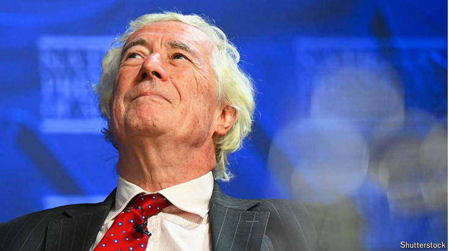

# **Foreign judges are fed up with Hong Kong’s political environment**

**Three have left the city’s highest court this month**

fed up with：受够了；厌倦了；腻了；

原文：

IT IS AN unusual arrangement, to be sure. Since its establishment in 1997,

the Court of Final Appeal in Hong Kong has had both local and foreign

judges on its bench. The set-up was part of the deal that handed the territory

from Britain to China that year. The foreigners, who hold non-permanent

seats, tend to have impressive legal backgrounds and come from other

common-law jurisdictions, such as Britain, Australia and Canada. So they

are accustomed to exercising judicial power “independently and free from

any interference”, as laid out in the territory’s mini-constitution, called the

Basic Law.

诚然，这是一个不寻常的安排。香港终审法院自1997年成立以来，一直由本地和外国法官组成。这一安排是当年香港从英国移交给中国的协议的一部分。拥有非常任席位的外国人往往拥有令人印象深刻的法律背景，并来自其他普通法司法管辖区，如英国、澳大利亚和加拿大。因此，正如香港的小宪法《基本法》所规定的那样，他们习惯于“独立地、不受任何干涉地”行使司法权。

学习：

final appeal：最后上诉；终审

have impressive legal backgrounds：有很好的法律背景

jurisdictions：美 [ˌdʒuərisˈdikʃənz] 司法管辖权

accustomed to：习惯于

exercise judicial power：行使司法权

laid out：安排；规划（lay out的过去式和过去分词）

原文：

The court still operates largely as envisioned. But Hong Kong’s leaders are

growing more oppressive, forcing the foreign judges to make a tough choice.

Since June 7th three out of ten on the Court of Final Appeal have resigned.

Two British judges, Jonathan Sumption (pictured) and Lawrence Collins,

jumped first, noting the deteriorating political situation. Days later a

Canadian judge, Beverley McLachlin, said she would also depart, citing

personal reasons. Lord Sumption, hitherto a defender of the role of foreign

judges on the court, explained his thinking in the *Financial Times*. Most of

Hong Kong’s judges are “honourable people with all the liberal instincts of

the common law”, he wrote. “But they have to operate in an impossible

political environment created by China.”

法院仍然在很大程度上按照设想运作。但香港领导人变得越来越暴虐，迫使外国法官做出艰难的选择。自6月7日以来，终审法院十人中有三人辞职。两位英国法官，乔纳森·萨普廷(如图)和劳伦斯·柯林斯，注意到政治形势的恶化，首先跳了出来。几天后，一位加拿大法官Beverley McLachlin说她也将离开，理由是个人原因。迄今为止，Sumption勋爵一直为外国法官在最高法院的角色辩护，他在英国《金融时报》上解释了自己的想法。他写道，香港的大多数法官都是“具有普通法所有自由本能的可敬的人”。"但他们不得不在中国创造的不可能的政治环境中运作."

学习：

envision：预想

oppressive：美 [əˈpresɪv] 压迫性的；压制性的；高压的；沉重的；令人窒息的；压抑的；

growing more oppressive：变得越来越咄咄逼人

make a tough choice：做出艰难的决定

resign：辞职

deteriorating：美 [dɪˈtɪriəreɪtɪŋ] 恶化；（deteriorate的现在分词）

depart：离开

hitherto：美 [ˌhɪðərˈtuː] 迄今为止；到某时为止

instincts：本能

原文：

The situation in Hong Kong has come under increasing scrutiny of late. Last

month 14 pro-democracy figures were convicted of conspiracy to commit

subversion (two were acquitted and 31 had already pleaded guilty). Their

crime was to have held a primary election in 2020 to improve their chances

of winning control of the local legislature. Lord Sumption described the

judgment as “legally indefensible”. He added, “The rule of law is

profoundly compromised in any area about which the government feels

strongly.” That provoked a response from Hong Kong’s chief executive,

John Lee, who said, “The rule of law in Hong Kong is strong and will not

change.”

香港的情况最近受到越来越多的关注。上个月，14名民运人士被判犯有阴谋颠覆罪(两人被判无罪，31人已经认罪)。他们的罪行是在2020年举行初选，以增加他们赢得地方立法机构控制权的机会。Sumption勋爵称该判决“在法律上站不住脚”。他补充说，“在政府强烈关注的任何领域，法治都受到严重损害。”这引起了香港行政长官约翰·李的回应，他说，“香港的法治是强大的，不会改变。”

学习：

scrutiny：美 [ˈskruːtəni] 仔细审查

convicted： 美 [kənˈvɪktɪd]证明…有罪；（convict的过去分词）

conspiracy：美 [kənˈspɪrəsi] 阴谋；密谋；共谋

subversion：破坏；颠覆；覆灭；颠覆（活动）          

acquitted：美 [ə'kwɪtid] 宣判无罪；（acquit的过去式和过去分词）

plead guilty:认罪

legally indefensible：法律上站不住脚

原文：

The legal system still functions well in most cases. The World Justice

Project, a Washington-based charity, produces an annual Rule of Law Index.

Last year Hong Kong ranked 23rd, three spots above America. But Lord

Sumption believes that China’s imposition of a national-security law on the

territory in 2020, and the revival of a colonial-era sedition law, severely

limits judges’ freedom of action.

在大多数情况下，法律制度仍然运作良好。总部设在华盛顿的慈善机构“世界正义项目”制作了一份年度法治指数。去年，香港排名第23位，比美国高3位。但Sumption勋爵认为，中国将于2020年在香港实施国家安全法，以及恢复殖民时代的煽动法，严重限制了法官的行动自由。

学习：

function well：运作良好

charity：美 [ˈtʃærəti] 慈善；慈善事业；慈善机构；

spot：排名位置

imposition：美 [ˌɪmpəˈzɪʃn] 强加；强迫接受；

sedition：美 [səˈdɪʃ(ə)n] 煽动性言行

## **Define “independent”**

The security law allows courts to dispense with trial by jury and instead use

a panel of national-security judges, who are picked by Mr Lee, to reach

verdicts. In theory the judges are independent, but they are reviewed

annually—and the government often makes its desired outcome of a case

clear. Up until last month it had a 100% conviction rate in national-security

trials. Even when the government loses in court, it has other options, such as

applying for an “interpretation” from the standing committee of the National

People’s Congress, the mainland’s rubber-stamp parliament.

安全法允许法院免除陪审团审判，而是使用由李明博挑选的国家安全法官小组来做出判决。理论上，法官是独立的，但他们每年都要接受审查——而且政府经常明确表示希望案件有什么结果。直到上个月，它在国家安全审判中的定罪率为100%。即使政府在法庭上败诉，它也有其他选择，比如向全国人民代表大会常务委员会(中国大陆的橡皮图章议会)申请“解释”。

学习：

dispense with：免除；省掉；免去          

verdict：裁定

reach verdicts：作出裁决

rubber：美 [ˈrʌbər] 橡胶；合成橡胶；橡皮；橡皮擦；

rubber-stamp：橡皮图章

在这个句子中，"rubber-stamp" 是一个比喻，指的是一个组织或机构只是形式上批准或通过决定，而实际上没有真正的权力或影响。它的作用就像一个橡皮图章，只是机械地盖章确认，而不是真正地审查或质疑。用在这里，意思是说大陆的立法机构只是象征性地批准法律和政策，而没有独立的决策权。

原文：

In the face of all this, foreign judges have faced pressure, sometimes from

their own governments, to resign from the Court of Final Appeal. Some of

the judges argue that it is easier to defend judicial independence from inside

the system. David Neuberger, one of three remaining British judges on the

top court, has vowed to stay to “support the rule of law as long as I can”. But

he and his peers are in a tricky position. “In one sense you’re independent,”

says a barrister in Hong Kong. But if the government “passes totalitarian

laws, you will be applying totalitarian laws”.

面对这一切，外国法官受到压力，有时是来自他们本国政府的压力，要求他们从终审法院辞职。一些法官认为，从系统内部捍卫司法独立更容易。David Neuberger是最高法院三名英国法官之一，他发誓要留下来“尽我所能支持法治”。但他和他的同行们处于一个棘手的位置。“从某种意义上说，你是独立的，”香港的一位律师说。但是，如果政府“通过极权主义法律，你将适用极权主义法律”。

学习：

in the face of：面对；在…面前；尽管；不顾；鉴于          

barrister：美 [ˈbɛrəstər] 出庭律师；大律师；辩护律师（在英国有资格出席上级法庭进行辩护）

totalitarian：美 [toʊˌtæləˈtɛriən] 极权制度的；极权主义的

原文：

Though Hong Kong’s role as a global commercial and financial centre

depends on the rule of law, businesspeople have reacted to the judicial

situation with relative calm. In the past many of them argued that the debate

over national-security matters was separate and that the rest of the legal

system remained independent and effective. But as foreign judges leave,

citing an untenable environment, it is becoming increasingly difficult to

separate one judicial concern from another. ■

尽管香港作为全球商业和金融中心的角色依赖于法治，但商界人士对司法状况的反应相对平静。在过去，他们中的许多人认为，关于国家安全事务的辩论是独立的，法律体系的其余部分仍然是独立和有效的。但随着外国法官以环境不稳定为由离开，将一个司法问题与另一个分开变得越来越困难。■

学习：

untenable：美 [ˌənˈtɛnəb(ə)l] 不能维持的；站不住脚的

## 后记

2024年6月22日15点03分于上海。

