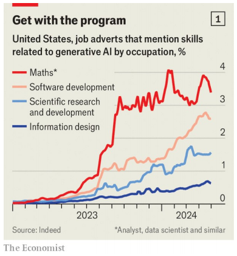
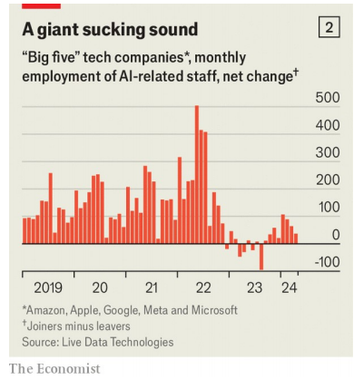

# **The war for AI talent is heating up**

**Big tech firms scramble to fill gaps as brain drain sets in**

争夺人工智能人才的战争正在升温

随着人才流失的到来，大型科技公司争相填补空缺

brain drain：人才流失

scramble：争夺；争取；取得；笨拙地移动；仓促行动；

原文：

Pity OpenAI’s HR department. Since the start of the year the maker of ChatGPT,

the hit artificial-intelligence (AI) chatbot, has lost about a dozen top

researchers. The biggest name was Ilya Sutskever, a co-founder responsible

for many of the startup’s big breakthroughs, who announced his resignation

on May 14th. He did not give a reason, though many suspect that it is linked

to his attempt to oust Sam Altman, the firm’s boss, last December. Whatever

the motivation, the exodus is not unusual at OpenAI. According to one

estimate, of the 100-odd AI experts the firm has hired since 2016, about half

have left.

可怜OpenAI的HR部门。自今年年初以来，热门人工智能聊天机器人ChatGPT的制造商已经失去了大约12名顶级研究人员。最大的名字是伊利亚·苏茨基弗(Ilya Sutskever)，他是该初创公司许多重大突破的联合创始人，于5月14日宣布辞职。他没有给出原因，尽管许多人怀疑这与他去年12月试图驱逐公司老板萨姆·奥尔特曼有关。不管动机是什么，在OpenAI，大批人离开并不罕见。据估计，该公司自2016年以来聘用的100多名人工智能专家中，约有一半已经离开。

学习：

pity：可怜的

announce his resignation：宣布辞职

oust：美 [aʊst]  驱逐；剥夺；撤销

exodus：美 [ˈɛksədəs] 大批离开

is not unusual: 很常见，并不罕见

100-odd AI experts：100多位

原文：

That reflects not Mr Altman’s leadership but a broader trend in the

technology industry, one that OpenAI itself precipitated. Since the launch of

ChatGPT in November 2022, the market for AI labour has been transformed.

Zeki Research, a market-intelligence firm, reckons that around 20,000

companies in the West are hiring AI experts. Rapid advances in machine

learning and the potential for a “platform shift”—tech-speak for the creation

of an all-new layer of technology—has changed the types of skills

employers are demanding and the places where those who possess them are

going. The result is a market where AI talent, previously hoarded at tech

giants, is becoming more distributed

这反映的不是奥特曼的领导能力，而是科技行业的一个更广泛的趋势，一个由OpenAI本身促成的趋势。自ChatGPT于2022年11月推出以来，人工智能劳动力市场已经发生了变化。市场情报公司Zeki Research估计，西方大约有20，000家公司正在雇佣人工智能专家。机器学习的快速发展和“平台转移”的潜力(技术术语，指创造一个全新的技术层)改变了雇主需要的技能类型和拥有这些技能的人去的地方。其结果是，以前囤积在科技巨头手中的人工智能人才变得更加分散

学习：

precipitated：美 [prɪ'sɪpɪteɪtɪd] 使（事件、情况；尤指坏事或讨厌之事）突如其来地发生；促成；使…沉淀

tech-speak：技术术语

hoarded：美 [hɔ:did] 囤积；贮藏；（hoard的过去式）

原文：

Start with the skills. Goliaths such as Microsoft and Google may be laying

off non-engineers but they are seeking out star researchers who can

understand, and build, cutting-edge models. This group consists of perhaps

several hundred people such as Mr Sutskever or Jeff Dean, who runs

Google’s  AI efforts. Companies covet such superstars because they can

produce breakthroughs that, say, dramatically increase the efficiency of an 

AI system or make it less prone to make things up. That makes them incredibly

valuable; many command seven-figure pay packages.

从技能开始。微软和谷歌等巨头可能会解雇非工程师，但他们正在寻找能够理解和构建前沿模型的明星研究人员。这个团队可能由数百人组成，比如负责谷歌人工智能项目的Sutskever先生或Jeff Dean。公司觊觎这样的超级明星，因为他们可以产生突破，比如说，大幅提高人工智能系统的效率，或使其不太容易捏造事实。这使得它们非常有价值。许多人要求七位数的薪酬。

学习：

Goliath：美 [ɡəˈlaɪəθ] 巨人，巨头

lay off：裁员，解雇

covet：美 [ˈkʌvət] 渴望具有；觊觎；垂涎；贪求

seven-figure：七位数

原文：

Some are hired without interviews—or as entire teams. In March Microsoft

recruited most of the staff of Inflection AI, a startup building cutting-edge

models, including its co-founder, Mustafa Suleyman—a move that has

reportedly attracted the attention of trustbusters at the Federal Trade

Commission. (Mr Suleyman sits on the board of *The Economist*’s parent

company.) Mark Zuckerberg, the boss of Meta (Facebook’s parent

company), personally emailed some researchers at DeepMind, Google’s  AI

lab, in an effort to enlist them.

有些人没有面试就被录用了——或者是整个团队。今年3月，微软招聘了构建前沿模型的初创公司Inflection AI的大部分员工，包括其联合创始人穆斯塔法·苏莱曼(Mustafa suleyman)——据报道，这一举动引起了美国联邦贸易委员会反垄断官员的注意。(苏莱曼先生是《经济学人》母公司的董事。）脸书母公司Meta的老板马克·扎克伯格亲自给谷歌人工智能实验室DeepMind的一些研究人员发了电子邮件，试图招募他们。

学习：

trustbuster：美 [ˈtrəs(t)ˌbəstər] 反垄断者

parent company：母公司

enlist：招募

原文：

More intriguing is how generative AI has changed the talent market further

down the ladder. According to data from Indeed, a job-listing website, one in

40 vacancies for software developers in America mentions skills related to

“generative” AI, the sort that makes ChatGPT so humanlike. That is a more than

100-fold increase since the start of 2023 (see chart 1). Amit Bhatia, co-

founder of Datapeople.io, a research firm, says that before ChatGPT a medium-

sized tech firm might employ a handful of AI engineers who built small

models to do things such as analyse the sentiments of customers’ emails.

Today generative models can do a much better job than small, in-house

efforts.

更耐人寻味的是，生成式人工智能是如何进一步改变人才市场的。根据工作列表网站Indeed的数据，美国软件开发人员的40个职位空缺中有一个提到了与“生成性”人工智能相关的技能，这种技能使得ChatGPT如此像人。这是自2023年初以来超过100倍的增长(见图表1)。研究公司Datapeople.io的联合创始人阿米特巴蒂亚(Amit Bhatia)表示，在ChatGPT之前，一家中型科技公司可能会雇佣一些人工智能工程师，他们构建小型模型来做一些事情，例如分析客户电子邮件的情绪。如今，生成模型可以比小型的内部工作做得更好。

学习：

intriguing：有趣的；迷人的；引人入胜的

talent market：人才市场

vacancies：美 [ˈveɪkənsiz] 空位；（vacancy的复数）

原文：

The result is that some AI engineers are now being asked to work out which AI

system to use and how to connect it to a company’s data. Mr Bhatia says that

the share of software-engineering job listings citing such “

MLops” (short for machine-learning operations) has doubled since early 2022.

结果是，一些人工智能工程师现在被要求找出使用哪种人工智能系统，以及如何将其与公司的数据联系起来。巴蒂亚先生说，自2022年初以来，引用这种“MLops”(机器学习操作的缩写)的软件工程工作清单的份额翻了一番。

原文：

Different types of skills are also in demand. Kelsey Szot, a co-founder of

Adept, another AI startup, points to individuals who quickly learn how to use

AI tools and can stitch them together to build something new and impressive.

Unlike the stuffy PhDs, they come up with ideas that are often not

academically elegant. But, says Ms Szot, they will solve a problem on a tight

deadline. In the ultra-competitive world of AI startups, that is invaluable.

也需要不同类型的技能。另一家创业公司Adept的联合创始人凯尔西·索特(Kelsey Szot)指出，一些人很快就学会了如何使用人工智能工具，并能把它们组合在一起，打造出令人印象深刻的新东西。与古板的博士不同，他们提出的想法通常在学术上并不优雅。但是，绍特女士说，他们将在紧迫的期限内解决问题。在人工智能初创公司竞争异常激烈的世界里，这是无价的。

学习：

stitch：美 [stɪtʃ] 缝；缝补；缝纫；

invaluable：无价之宝

come up with ideas：想出idea

ultra-competitive：竞争异常激烈的

原文：

As a result of all this demand, talent flows are shifting. For years engineers

flocked to the big-tech quintet: Alphabet (Google’s corporate parent),

Amazon, Apple, Meta and Microsoft. Live Data Technologies, a research

firm, tracks job moves between companies. Of the AI workers in its database,

the big five’s cumulative net additions (hires minus departures) averaged

168 a month between January 2019 and November 2022, when ChatGPT was

released. Many of those who left one of the big five simply joined another.

由于所有这些需求，人才流动正在发生转变。多年来，工程师们蜂拥至高科技五重奏:Alphabet(谷歌的母公司)、亚马逊、苹果、Meta和微软。研究公司Live Data Technologies追踪公司之间的工作变动。在其数据库中的人工智能工人中，五大公司在2019年1月至2022年11月(ChatGPT发布时)的累计净增加量(雇用量减去离职量)平均为每月168人。许多离开五大巨头之一的人只是加入了另一家。

学习：

talent flow：人才流动

quintet：美 [kwɪnˈtɛt] 五重奏乐团；五重唱组合

原文：

Over the next nine months, though, the net flow of AI workers to the giants

reversed to an average monthly outflow. They are now once again adding to

their AI payrolls, by poaching boffins from less-big tech companies with less

impressive  AI pedigrees, such as IBM and Oracle. But the net inflows have still

not returned to their long-run average (see chart 2).

然而，在接下来的9个月里，人工智能工人向巨头的净流动逆转为平均每月流出。他们现在再次增加了他们的人工智能工资单，从人工智能血统不那么令人印象深刻的小科技公司挖走了研究人员，如IBM和Oracle。但净流入仍未回到长期平均水平(见图表2)。

学习：

payroll：工资单；薪资名册；

poach：美 [poʊtʃ] 偷猎；偷捕；挖走（他人员工）

boffins：美 ['bɒfɪnz] 科学工作者；研究员；（boffin的复数）

pedigree：美 [ˈpɛdəˌɡri] 血统；家谱

原文：

Where is the AI talent going instead? One popular destination is Nvidia, a

chipmaker whose “graphics-processing units” are powering the AI boom and

whose ambitions extend beyond hardware to software and applications. This

month its market value surpassed $3trn, within striking distance of

Microsoft, the world’s most valuable company. Others joined more mature

startups, such as Databricks, a database and AI firm, and OpenAI.

AI人才反而去了哪里？一个受欢迎的目的地是芯片制造商Nvidia，它的“图形处理单元”正在推动人工智能的繁荣，它的雄心超越了硬件，延伸到软件和应用程序。本月，其市值超过3万亿美元，与世界上最有价值的公司微软仅一步之遥。其他人加入了更成熟的初创公司，如数据库和人工智能公司Databricks和OpenAI。

学习：

power the AI boom：推动AI繁荣

market value：市值

原文：

But one in seven of the big-tech leavers went to startups in “stealth” mode,

which have not unveiled products or announced plans. All eight authors of

“Attention is all you need”, a paper published in 2017 that provided the

algorithmic underpinnings of generative AI, have left Google, where they

worked at the time. Seven have founded their own firms (the other joined OpenAI).

但是，七分之一的高科技离职者去了“秘密”模式的初创公司，这些公司还没有推出产品或宣布计划。2017年发表的一篇论文“注意力是你所需要的一切”的八位作者都已经离开了他们当时工作的谷歌，该论文提供了生成式人工智能的算法基础。七人成立了自己的公司(另一人加入了OpenAI)。

学习：

unveil products：推出产品

原文：

One motivation for going to a smaller startup may be financial. For an 

AI wizard the potential rewards from owning a stake in a successful firm could

easily outweigh the salary and stock options offered by a tech juggernaut.

Researchers also increasingly want to work on meaningful problems. Since

2015 the number of them joining the health-care sector each year has

increased 20-fold, according to Zeki (which may explain why Google is

working on Med-PaLM2, an AI doctor). Another motive is autonomy. “There is

just too much brand risk in big companies to ever launch anything fun,”

Noam Shazeer, one of the authors of the attention paper, told a venture-

capital conference last September. He went on to co-found Character.ai,

which allows users to create chatbots with different personalities.

去小型创业公司的一个动机可能是财务上的。对于一个人工智能奇才来说，拥有一家成功公司的股份的潜在回报很容易超过科技巨头提供的工资和股票期权。研究人员也越来越想研究有意义的问题。根据Zeki的说法，自2015年以来，他们加入医疗保健行业的人数每年增加20倍(这可能解释了为什么谷歌正在研究人工智能医生Med-PaLM2)。另一个动机是自主。“大公司的品牌风险太大，以至于不能推出任何有趣的东西，”Attention paper的作者之一诺姆·沙泽尔在去年9月的一次风险投资会议上说。他继续合作创建了Character.ai，允许用户创建具有不同个性的聊天机器人。

学习：

wizard： 美 [ˈwɪzərd] 魔法师；男巫；术士；奇才；专家；能手；行家

juggernaut：美 [ˈdʒəɡərˌnɔt] 重型货车；势不可挡的巨大力量

tech juggernaut：科技巨头

原文：

The good news for big tech and small startups alike is that the supply of 

AI labour is growing. One source is academia. According to a report from

Stanford University, in 2011 about 41% of  AI PhDs took jobs in industry, 

roughly the same share as those taking jobs in academia. By 2022 that figure

stood at 71% for industry, compared with 20% for academia. Universities

are teaching more AI, too. The number of English-language, 

AI-related degree programmes has tripled since 2017. “All computer-science departments are

becoming machine-learning departments,” says Naveen Rao of Databricks.

对大型科技公司和小型创业公司来说，好消息是人工智能劳动力的供应正在增长。一个来源是学术界。根据斯坦福大学的一份报告，2011年，大约41%的人工智能博士在工业界工作，与在学术界工作的比例大致相同。到2022年，工业界的这一数字为71%，而学术界为20%。大学也在教授更多的人工智能。自2017年以来，英语人工智能相关学位课程的数量增加了两倍。“所有的计算机科学部门都在成为机器学习部门，”Databricks的Naveen Rao说。

原文：

For American companies, which dominate the global  AI industry, hiring from 

other countries is another way to alleviate the talent shortage. In October

President Joe Biden signed an executive order to try to loosen immigration

rules to let more AI experts study and work in America. Google and Microsoft

have written to the Department of Labour to show their support for the plan.

Other governments want the same thing. The EU is planning training schemes 

and subsidies. The Chinese government plans to attract talent to its shores

by, among other things, establishing AI academies in Beijing and Shanghai.

On every level, competition for AI workers is heating up. ■

对于主导全球人工智能行业的美国公司来说，从其他国家招聘是缓解人才短缺的另一种方式。10月，乔·拜登总统签署了一项行政命令，试图放宽移民规则，让更多的人工智能专家在美国学习和工作。谷歌和微软已经写信给劳工部，以示对该计划的支持。其他政府也想要同样的东西。欧盟正在计划培训计划和补贴。中国政府计划通过在北京和上海建立人工智能学院等方式吸引人才。在各个层面上，对人工智能人员的竞争都在升温。■

学习：

alleviate the talent shortage：缓解人才短缺

attract talent：吸引人才

## 后记

2024年6月22日16点29分于上海。

