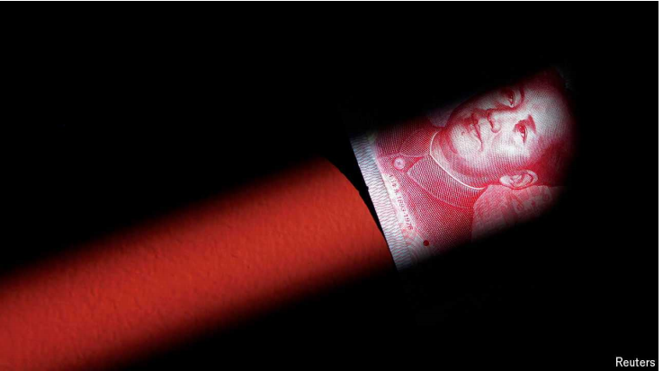
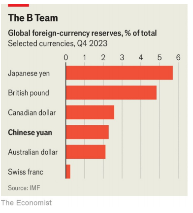

# **China’s currency is not as influential as once imagined**

**Its share of international reserves has stalled**

它在国际储备中的份额停滞不前

stall：美 [stɔːl] 熄火；抛锚；停止发展；

原文：

Chinese officials seem pleased with the yuan’s recent progress as a global

currency. The international monetary system is diversifying at an

accelerating pace, said Pan Gongsheng, the governor of China’s central

bank, in March. The yuan has become the fourth-most active currency in

global payments, he noted. In trade finance, it now ranks third. And

according to the central bank’s data, about half of China’s transactions with

the rest of the world (for financial assets, as well as goods) are now settled in

yuan.

中国官员似乎对人民币最近作为全球货币的进展感到满意。中国央行行长潘今年3月表示，国际货币体系正在加速多元化。他指出，人民币已成为全球支付中第四活跃的货币。在贸易融资方面，它现在排名第三。根据中国央行的数据，中国与世界其他地区的交易(金融资产以及商品)中约有一半是以人民币结算的。

学习：

global currency：全球货币

be pleased with：对xxx很满意

at an accelerating pace：正在加速

原文：

Despite these gains, the yuan’s global position still looks modest compared

with past expectations. In the wake of the financial crisis of 2007-09 it was

easy to imagine a bigger role. In 2008 Fred Hu, then of Goldman Sachs,

predicted the yuan would account for 15-20% of foreign-exchange reserves

by 2020. More memorably, “Super Sad True Love Story”, a novel written by

Gary Shteyngart and published in 2010, imagined a dystopian future in

which a tottering America had pegged the crumpled dollar to the mighty

yuan.

尽管取得了这些成绩，但与过去的预期相比，人民币的全球地位看起来仍然不高。在2007年至2009年的金融危机之后，人们很容易想象出一个更大的角色。2008年，高盛的Fred Hu预测，到2020年，人民币将占外汇储备的15-20%。更令人难忘的是，加里·施泰因加特(Gary Shteyngart)于2010年出版的小说《超级悲伤的真爱故事》(Super Sad True Love Story)想象了一个反乌托邦的未来，在这个未来中，摇摇欲坠的美国将皱巴巴的美元与强大的人民币挂钩。

学习：

Goldman Sachs：高盛

in the wake of：紧随其后；在…之后；

foreign exchange：外汇

memorably：美 ['memərəblɪ] 显著地，难忘地；值得纪念地

dystopian：美 [dɪs'tɒpiən]  反乌托邦的

tottering：美 ['tɒtərɪŋ]蹒跚；踉跄；摇摇欲坠；（totter的现在分词形式）

pegged：用夹子或钉子固定；使固定在某水平；（peg的过去式和过去分词）

crumpled：美 [ˈkrʌmpld] 摺皱的；弄皱的

原文：

Statistical studies from that era also documented the Chinese currency’s

growing significance. In 2012 several researchers at the Peterson Institute

for International Economics, a think-tank in Washington, identified an

emerging “yuan bloc” in East Asia. Thanks to tight trade links within the

region, many of East Asia’s other currencies had begun to shadow the yuan

more closely than they did the dollar. Whether by accident or design, they

behaved as if they were pegged to an implicit currency basket in which the

weight of the yuan averaged about 50%.

那个时代的统计研究也记录了人民币日益增长的重要性。2012年，华盛顿智库彼得森国际经济研究所的几名研究人员发现东亚正在形成一个“人民币集团”。由于区域内紧密的贸易联系，许多东亚其他货币开始比美元更紧密地跟随人民币。不管是偶然还是有意，他们的行为就好像他们盯住了一个隐含的货币篮子，其中人民币的权重平均约为50%。

学习：

bloc：美 [blɑːk] 联盟；集团；阵营；联合体；政治集团；

tight trade links：紧密的贸易联系

shadow：美 [ˈʃædoʊ] 跟踪；尾随；

原文：

There were some subsequent twists in the story, however. China’s currency

peaked against the dollar in 2014. It has since weakened by more than 16%.

A mismanaged devaluation of the currency in 2015 prompted massive

capital outflows. The upheaval made the yuan a less reliable anchor. It also

meant that capital controls were not removed, as Goldman Sachs’s Mr Hu

had assumed, but tightened.

然而，故事后来发生了一些转折。人民币兑美元汇率在2014年见顶。自那以来，该指数已下跌逾16%。2015年人民币贬值管理不当，引发了大规模资本外流。剧变使得人民币不再是一个可靠的锚。这也意味着资本管制并没有像高盛的胡先生假设的那样被取消，而是被收紧了。

学习：

twist in the story：故事发生转折

massive capital outflows：大量资本外流

reliable anchor：可靠的锚点

upheaval：美 [ʌpˈhiːvl] 激变；剧变；动乱；

capital controls：资本管制

        

原文：

Despite this turmoil, the yuan was included in the IMF’s basket of usable

reserve currencies in 2016. But its share of global foreign-currency reserves

remains far short of expectations. Indeed, it “shows signs of stalling out”,

according to a recent update by Serkan Arslanalp and Chima Simpson-Bell

of the IMF, together with Barry Eichengreen of the University of California,

Berkeley. The yuan’s share was just 2.3% at the end of last year, according

to the latest IMF data, down from a peak of 2.8% in the first quarter of 2022.

Thanks to that decline, the yuan has dropped back behind the Canadian

dollar in the pecking order, and now ranks sixth (see chart).

尽管出现了这种动荡，但人民币在2016年被纳入了国际货币基金组织的一篮子可用储备货币。但其在全球外汇储备中的份额仍远低于预期。事实上，根据国际货币基金组织的Serkan Arslanalp和奇马Simpson-Bell以及加州大学伯克利分校的Barry Eichengreen最近的一份报告，它“显示出停滞的迹象”。根据国际货币基金组织的最新数据，截至去年年底，人民币的份额仅为2.3%，低于2022年第一季度2.8%的峰值。由于这一下跌，人民币在排名中已经落后于加拿大元，现在排名第六(见图表)。

学习：

turmoil：动荡

remain far short of expectations：远远低于预期

pecking order: 长幼尊卑制度；权势等级          

原文：

The “yuan bloc” also remains hollow. The Peterson Institute studies were

agnostic about whether East Asian currencies moved in sympathy with the

yuan because they were deliberately tracking it or because China and its

neighbours were all responding to the same shocks. More recent research

suggests the shocks mattered more. For example, a new paper by Kari

Heimonen of the University of Jyvaskyla and Risto Ronkko of Tampere

University, both in Finland, finds “no evidence” that the yuan is an anchor

for other currencies. The two authors recalculate its influence after adjusting

for global financial jitters and movements in commodity prices. With these

controls in place, they find that the yuan’s weight in the determination of

East Asian currencies’ exchange rates averaged just 9% between 2010 and

2018.

“人民币集团”也仍然是空洞的。彼得森研究所的研究不知道东亚货币跟随人民币波动是因为它们有意跟踪人民币，还是因为中国及其邻国都在应对同样的冲击。最近的研究表明，冲击更重要。例如，芬兰伊瓦斯基拉大学的Kari Heimonen和坦佩雷大学的Risto Ronkko的一篇新论文发现“没有证据”表明人民币是其他货币的锚。两位作者在对全球金融动荡和大宗商品价格变动进行调整后，重新计算了人民币的影响力。在这些控制到位的情况下，他们发现2010年至2018年期间，人民币在决定东亚货币汇率中的权重平均仅为9%。

学习：

hollow：美 [ˈhɑːloʊ] 空的；无意义的；空洞的；

agnostic：美 [æɡˈnɑstɪk] 不可知论的；怀疑的；态度不明朗的

jitters：美 [ˈdʒɪtərz]神经过敏；激动；（jitter的复数）

global financial jitters：全球金融动荡

原文：

The yuan may one day live up to the global role once envisaged for it. It

may one day even rival the American dollar. But first it must eclipse the

Canadian one. ■

有朝一日，人民币可能会扮演曾经为其设想的全球角色。有一天，它甚至可能与美元相匹敌。但首先它必须盖过加拿大的dollar。■

学习：

envisage：美 [ɪnˈvɪzɪdʒ] 设想；想象；预见；展望；

## 后记

2024年6月23日14点10分于上海。

