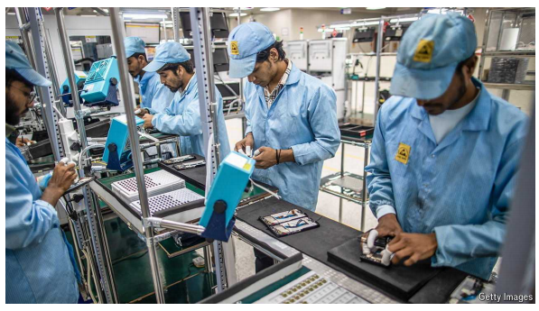
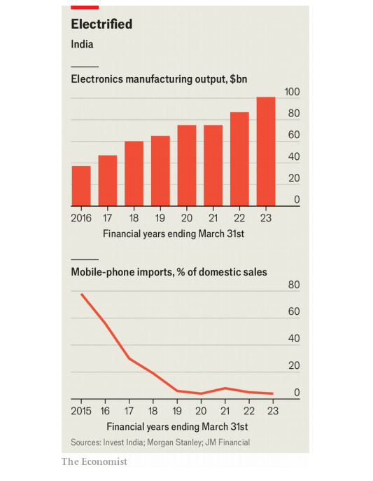

# **India’s electronics industry is surging**

**Foreign and domestic firms are investing in local manufacturing**

surge:激增；急剧上升；

原文：

To witness India’s growing role as a manufacturing hub, dodge Bangalore’s

notorious traffic and head north. Around 45km outside the city, amid the

dust and debris of construction, Foxconn, a Taiwanese contract

manufacturer, is turning 120 hectares of farmland into a factory that will

produce around 20m iPhones a year. Foxconn’s plant will be the third

facility near Bangalore dedicated to churning out phones for Apple, an

American tech giant. The other two are run by Tata, India’s largest

conglomerate

为了见证印度作为制造业中心日益增长的作用，避开班加罗尔臭名昭著的交通，向北走。在距离该市约45公里的地方，在建筑的尘土和废墟中，台湾代工制造商富士康(Foxconn)正在将120公顷的农田改造成一家工厂，每年将生产约2000万部iPhones。富士康的工厂将是班加罗尔附近第三个专门为美国科技巨头苹果生产手机的工厂。另外两家由印度最大的企业集团塔塔经营

学习：

manufacturing hub：制造业中心

dodge：美 [dɑːdʒ] 躲开；局部遮光；闪开；迅速让开；

Bangalore：美 [ˌbæŋɡəˈlɔr] 班加罗尔；

amid：在…之中；在…气氛中；在…背景下

debris：美 [dəˈbriː] 碎片；残骸；废墟 **注意发音**

dust and debris：在尘土和废墟中

churn out：大量生产

churn out phones for Apple：大量生产苹果手机

conglomerate：美 [kənˈɡlɑːmərət] 企业集团；多元化公司

原文：

Bangalore, home to many of India’s IT giants, is better known for its software

than its hardware. However, the new factories suggest that, in one industry at

least, India’s efforts to transform itself into a manufacturing powerhouse are

bearing fruit. Electronics manufacturing—the business of building mobile

phones, televisions and other gadgets—is thriving in India. The value of

electronics it produced rose from \$37bn to $105bn (3% of GDP) between the

fiscal years ending in March 2016 and March 2023 (see chart). The

government wants to triple this again by fiscal 2026. Although India’s

production of electronics accounts for just 3% of the global total, its share is

growing faster than any other country’s.

班加罗尔是许多印度IT巨头的所在地，其软件比硬件更出名。然而，新工厂表明，至少在一个行业，印度转型为制造业强国的努力正在开花结果。电子制造业——制造手机、电视和其他设备的行业——在印度蓬勃发展。在截至2016年3月和2023年3月的财年间，其生产的电子产品价值从370亿美元上升至1050亿美元(占GDP的3%)。政府希望在2026财年前将这一数字再翻三番。尽管印度的电子产品产量仅占全球总量的3%,但其份额的增长速度比其他任何国家都要快。

学习：

powerhouse：美 [ˈpaʊərhaʊs] 精力充沛的人；动力源

manufacturing powerhouse：制造业强国，制造业巨头

bear fruit：开花结果

gadgets： 美 [ˈgædʒɪts]小玩意儿；小配件；（gadget的复数）

原文：

Nowhere is this boom more evident than in the production of phones, which

makes up nearly half of India’s electronics industry. The country is the

world’s second-largest maker of the devices, trailing only China. In fiscal

2015 India imported almost four-fifths of its phones. It now imports barely

any. Apple sources about one in seven of its iPhones from India, double

what it did a year ago. Samsung, a South Korean rival, has its largest phone

making facility in the country.

这种繁荣在手机生产中表现得最为明显，手机生产占了印度电子工业的近一半。中国是全球第二大手机制造商，仅次于中国。2015财年，印度进口了近五分之四的手机。它现在几乎不进口任何东西。苹果约七分之一的iPhones来自印度，是一年前的两倍。韩国竞争对手三星在印度拥有最大的手机制造工厂。

学习:

make up：占据xxx比例

second-largest：第二大的

trailing：（trail的现在分词）尾随；拖着脚走          

trailing only China：仅次于中国

phone making facility：手机制造工厂

原文：

Contract manufacturers, which build products on behalf of other companies,

have been rapidly expanding in India. Foxconn, which assembles nearly

two-thirds of Indian-made iPhones, now has more than 30 Indian factories

and employs 40,000 Indian workers. Although its Indian operations account

for less than 5% of its total revenue, the company is steadily increasing its

investments. It has set aside $2.6bn for its Bangalore factory. Last year Liu

Young, Foxconn’s boss, told investors that the several billion dollars it had

invested in India so far was “only the beginning”. A steady stream of foreign

suppliers to Foxconn and its peers have also set up shop in India. PwC, an

advisory firm, estimates that the share of value India added to phones

produced in the country increased from 2% in 2014 to 15% in 2022.

代其他公司生产产品的合同制造商在印度迅速扩张。富士康组装了近三分之二的印度制造的iPhones，现在拥有30多家印度工厂，雇佣了4万名印度工人。尽管印度业务占其总收入不到5%，但该公司正在稳步增加投资。该公司已为其班加罗尔工厂拨款26亿美元。去年，富士康老板刘告诉投资者，到目前为止，其在印度投资的数十亿美元“仅仅是个开始”。富士康及其同行的源源不断的外国供应商也在印度开店。咨询公司普华永道(PwC)估计，印度在本国生产的手机中所占的份额从2014年的2%增加到2022年的15%。

学习：

build products：生产产品

operations：业务

its Indian operations：它的在印度的业务

set aside：留出；留出…用于；保留供将来使用；拨款

set up shop：开业，开张

原文：

It is not only foreign firms that have piled in. Tata first entered phone

making in 2021 by building parts for older models of the iPhone. After

initial issues with quality control, the company has found its footing. In

November it acquired the Indian operations of Wistron, a Taiwanese firm,

and began assembling iPhones. Tata now plans to expand its factories to nab

a larger share of business with Apple.

涌入的不仅仅是外国公司。塔塔在2021年首次进入手机制造领域，为老款iPhone生产零部件。在最初的质量控制问题之后，公司已经找到了立足之地。11月，它收购了台湾公司纬创的印度业务，并开始组装iPhones。塔塔现在计划扩建工厂，以便从苹果那里获得更大份额的业务。

学习：

pile in：进入，涌入

find its footing：找到立足之地

acquire：收购

assemble iPhones：组装iPhones

expand factories: 扩建工厂

nab：美 [næb] 抓获；夺取；窃取；

原文：

Another Indian company benefiting from the device-making bonanza is

Dixon Technologies, India’s largest domestic electronics manufacturer. The

company, which began making gadgets for the local market three decades

ago, has jumped into producing smartphones for foreign companies. It now

employs 27,000 people, up from 2,000 a decade ago. Over the past year its

share price has risen by 150%.

另一家受益于设备制造热潮的印度公司是Dixon Technologies，它是印度最大的国内电子产品制造商。该公司30年前开始为本地市场生产电子产品，现在已经开始为外国公司生产智能手机。它现在拥有2.7万名员工，而十年前只有2000人。在过去的一年里，它的股价上涨了150%。

学习：

device-making：设备制造

bonanza：美 [bəˈnænzə] 暴富之源；幸运；滚滚而来；产量丰富；热潮

device-making bonanza：设备制造热潮

原文：

India’s electronics boom reflects a combination of the desire of Western tech

firms such as Apple to reduce their reliance on China and the vast appetite of

India’s 1.4bn people for whizzy devices such as smartphones. Generous

handouts from the government have sweetened the deal for companies

mulling production in India. In 2020 the government announced a

programme of “production-linked incentives” for manufacturers in various

industries, including electronics.

印度的电子产品繁荣反映了苹果等西方科技公司减少对中国依赖的愿望，以及印度14亿人口对智能手机等智能设备的巨大需求。政府慷慨的施舍使得考虑在印度生产的公司的交易更加诱人。2020年，政府宣布了一项针对包括电子产品在内的各行业制造商的“生产关联激励”计划。

学习：

reliance on：信赖；依赖；依靠          

whizzy：英 [ˈwɪzi] 技术革新的；技术先进的

whizzy devices：智能设备

mull：英 [mʌl] 仔细考虑；反复思考；

mulling production in India: 考虑在India生产设备

原文：

Sunil Vachani, Dixon’s boss, credits the government for its belief in India’s

manufacturing potential, which he says has brought about “a change in the

mindset” of the country. India’s government has certainly been busy wooing

foreign manufacturers. In January it awarded the Padma Bhushan, the

country’s third-highest civilian award, to Mr Liu of Foxconn. Pranay

Kotasthane of the Takshashila Institution, a think-tank in Bangalore, says the

government has been courting companies such as Foxconn to lure in “anchor

investors” around which supply chains can form.

Dixon的老板Sunil Vachani称赞政府对印度制造业潜力的信任，他说这已经带来了这个国家“思维模式的改变”。印度政府当然一直忙于拉拢外国制造商。今年1月，该组织将该国第三高的平民奖“帕德玛·普珊奖”授予了富士康的刘先生。班加罗尔智库Takshashila Institution的Pranay Kotasthane表示，政府一直在向富士康这样的公司示好，以吸引“锚定投资者”来形成供应链。

学习：

mindset：思维模式

wooing：美 [wu:ɪŋ]  求爱；（woo的现在分词）

wooing foreign manufacturers：拉拢外国制造商

civilian：美 [səˈvɪliən]  平民的；民间的；民用的

courting：美 [kɔːrtɪŋ] 设法获得；向…献殷勤；招致；求爱；（court的现在分词）

lure：美 [lʊr] 引诱；诱骗

supply chains：供应链

原文：

The hope is that India will one day be able to dislodge China as the world’s

electronics factory. Narendra Modi’s electoral setback earlier this month, in

which the prime minister lost his parliamentary majority, does not appear to

have dampened enthusiasm for that goal. His new government has signalled

continuity in its support for manufacturing.

希望印度有一天能够取代中国成为世界电子工厂。纳伦德拉·莫迪(Narendra Modi)在本月早些时候的选举中失利，总理失去了议会多数席位，但这似乎并没有挫伤他对这一目标的热情。他的新政府表示将继续支持制造业。

学习：

dislodge：美 [dɪsˈlɑdʒ] 逐出；驱逐；取出；移动；移除；排除；

electronics factory：电子工厂

dampened：美 [ˈdæmpənd]  抑制；（使）潮湿；（dampen的过去式和过去分词）

dampen enthusiasm for that goal：挫伤他对这一目标的热情

signalled：表示；标志；发信号；用信号传达；（signal的过去式和过去分词）          

continuity：连续性；连贯性；持续性

原文：

India’s progress certainly looks promising. In the 12 months to the end of

March, its electronic exports reached $29bn, up by 24%, year on year. Still,

that is a far cry from the almost $900bn of electronics China exported last

year. There is, then, plenty more to do. Naushad Forbes, an Indian

businessman, argues that unless Indian firms invest in deepening their

technical know-how, they will struggle to compete in more advanced areas

like chipmaking. India’s reluctance to lower trade barriers with its Asian

neighbours is also a hindrance. Import duties for the raw materials and

components needed to produce electronics are typically higher than in other

countries that are vying to steal production away from China, such as

Vietnam.

印度的进步看起来很有希望。截至3月底的12个月中，印度的电子产品出口额达到290亿美元，同比增长24%。不过，这与中国去年近9000亿美元的电子产品出口额相比，仍有很大差距。那么，还有很多事情要做。印度商人Naushad Forbes认为，除非印度公司投资深化他们的技术知识，否则他们将很难在更先进的领域竞争，如芯片制造。印度不愿降低与亚洲邻国的贸易壁垒也是一个障碍。生产电子产品所需的原材料和零部件的进口关税通常高于其他国家，这些国家竞相从中国抢走生产，比如越南。

学习：

year on year：同比

a far cry：相去甚远          

know-how：技能；专业技能；专业知识；

deepening their technical know-how： 深化他们的技术知识

hindrance：美 [ˈhɪndrəns] 妨碍；妨害；阻挠；干扰；阻力；

import duties：进口关税

vying：美 [ˈvaɪɪŋ] 竞争；相争；（vie的现在分词）

原文：

For his part, Mr Vachani of Dixon is bullish. He believes that “this a 

Y2K moment” for India’s electronic manufacturing, a reference to the panic over

a computer bug at the turn of the century that put the wind in the sails of

India’s IT industry. Perhaps, in time, the term “Bangalored” could refer not, as

today, to the draining of white-collar jobs away from America, but of blue

collar ones from China. ■

迪克森的瓦沙尼先生对此很乐观。他认为这是印度电子制造业的“2000年时刻”，指的是世纪之交对一个计算机错误的恐慌，它使印度的IT业扬帆起航。或许，假以时日,“班加罗尔”一词可能不会像今天这样指白领工作从美国流失，而是指蓝领工作从China流失。■

学习：

bullish：行情看涨的；牛市的；预期市场好转的；对未来有信心的；积极向上的          

## 后记

2024年6月29日19点11分于上海。

