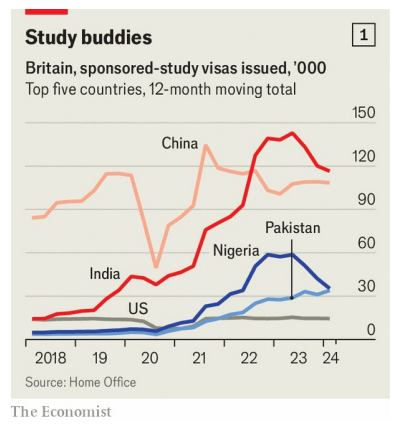
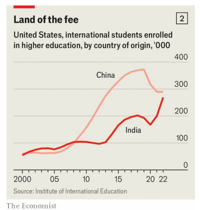

# Brainy Indians are piling into Western universities

**Will rich countries welcome them the way they did Chinese students?**

brainy：美 [ˈbreɪni] 聪明的；有才智的；机智的；有头脑的；智慧的；才华横溢的

pile into：拥入；挤入；

 原文：

OVER THE past two decades the number of people studying in countries

other than their own has tripled, to more than 6m. International students

from China have caused most of that increase. Youngsters flocked to

universities in English-speaking countries to expand both their minds and

their opportunities. In return they brought valuable brainpower and large

piles of foreign cash. Governments have sometimes viewed this bounty as a

reason to put less of their own money into higher education. Institutions in

Australia, Britain and Canada have grown increasingly reliant on foreign

flows to subsidise research and to cover the costs of educating local

scholars.

在过去的20年里，在国外学习的人数增加了两倍，超过600万。来自中国的国际学生是增长的主要原因。年轻人涌入英语国家的大学，拓展他们的思维和机会。作为回报，他们带来了宝贵的人才和大量的外国现金。政府有时将这种慷慨视为减少对高等教育投入的理由。澳大利亚、英国和加拿大的研究机构越来越依赖外资资助研究，并支付教育当地学者的费用。

学习：

youngsters：美 [ˈjʌŋstərz] 年轻人；（youngster的复数）

flocked：美 [flɔkt] 成群而行；群集；（flock的过去分词）

expand minds：拓展思维

valuable：宝贵的

brainpower：智力；脑力；

piles of：成堆的；一大批；一大堆          

bounty：美 [ˈbaʊnti] 奖金；赏金；

higher education：高等教育

grow reliant on：依赖于

cover the costs of：支付费用

原文：

Now the market for international study is about to undergo a huge change.

Chinese school-leavers are growing gradually less keen to travel; in their

place, Indian students are becoming the main engine of growth. In 2022

Britain issued more student visas to Indian citizens than they doled out to

Chinese ones (see chart 1). So did America. In both countries, it was the first

time in years that had occurred.

现在，国际留学市场即将经历一场巨大的变革。中国的离校生越来越不喜欢出国；取而代之的是，印度学生正成为增长的主要引擎。2022年，英国发给印度公民的学生签证比发给中国公民的还要多(见图表1)。美国也是如此。在这两个国家，这是多年来第一次出现这种情况。

学习：
international study：国际留学

become the main engine of growth：增长引擎

dole：按份额发放

原文：

These newcomers have different demands from their East Asian forerunners.

For one thing, Indian students as a group are much more likely to want to

carry on living and working in their host countries even after their courses

end. Economically this could be a boon to labour markets. Politically it

could provoke more heated reactions about foreign students in countries

already riven by immigration debates.

这些新来者与他们的东亚前辈有着不同的需求。一方面，印度学生作为一个群体更有可能希望在他们的留学国家继续生活和工作，即使在他们的课程结束后。从经济上来说，这可能有利于劳动力市场。在政治上，这可能会在已经被移民争论弄得四分五裂的国家激起对外国学生更激烈的反应。

学习：

forerunners：先去的人；前兆；（forerunner的复数）

boon：恩泽；恩赐；益处；福利；

be a boon to xxx : 有利于xxx

rive：美 [raɪv]  劈开；扯裂；撕开；使四分五裂；

riven：美 ['rɪv(ə)n]  撕开 裂开；使沮丧；（rive的过去式和过去分词）

原文：

India’s student exodus is driven by youthful demography and fast-increasing

wealth. Given it is home to 1.4bn citizens, the country has more university-

aged people than anywhere. Every month, a million more Indians turn 18.

Their families are much richer than they used to be: India’s GDP per person

rose from \$469 in 2002 to \$2,410 two decades later, according to the World

Bank. The number of middle- and high-income households in India is

expanding by around 10% each year, reckons Oxford Economics, a British

consultancy.

年轻的人口结构和快速增长的财富推动了印度学生的外流。鉴于中国有14亿公民，印度的大学适龄人口比任何地方都多。每个月都有100多万印度人年满18岁。他们的家庭比过去富裕多了:根据世界银行的数据，印度的人均GDP从2002年的469美元上升到20年后的2410美元。英国咨询公司牛津经济研究院估计，印度中高收入家庭的数量正以每年10%的速度增长。

学习：
exodus：美 [ˈɛksədəs] 大批离开

demography： 美 [dɪˈmɑːɡrəfi] 人口统计；人口统计学；人口学；人口结构； **注意发音**

fast-increasing：快速增长的

middle- and high-income households：中高收入家庭

reckon：认为，估计

consultancy：美 [kənˈsʌltənsi] 咨询公司；顾问机构

原文：

As aspirations rise, enrolment in India’s own universities and colleges is

shooting up. In 2001 some 9m Indians attended higher-education

institutions. Now the student body numbers about 43m, having long ago

passed America to become the second-largest in the world after China. More

growth seems certain: enrolment in tertiary education (the total number of

students as a share of the college-aged population) remains below 30%, less

than half the rate in China. The government wants this to reach 50% by

2035, which would bring total enrolment to near 75m

随着志向的提升，印度本土大学和学院的入学人数也在飙升。2001年，大约900万印度人进入高等教育机构。现在学生总数约为4300万，早已超过美国，成为仅次于中国的世界第二多人上大学的国家。更多的增长似乎是肯定的:高等教育入学率(学生总数占大学适龄人口的比例)仍然低于30%，不到中国的一半。政府希望到2035年达到50%,这将使总入学人数接近7500万

学习：

aspirations： 美 [ˌæspəˈreɪʃənz] 愿望；抱负；渴望；（aspiration的复数）

enrolment：美 [ɪnˈroʊlmənt] 注册；登记；招生；入学；

shooting up：飙升，上升

student body：学生全体

tertiary：美 [ˈtɜːrʃieri]  第三的；高等教育的

tertiary education：高等教育

原文：

Yet swift expansion has done nothing to improve the poor quality of

teaching and research in many Indian institutions. No Indian university

ranks among the world’s top 100, judged by any of the most rigorous league

tables. These take into account things like the quality of research output. The

higher-education system has “islands of excellence”, says N.V. Varghese of

the National University of Educational Planning and Administration in

Delhi. But it also has an “ocean of mediocrity”. Competition for spots at the

best places is furious. Several Indian institutions have rejection rates higher

than America’s Ivy League, including the formidable Indian Institutes of

Technology.

然而，快速扩张并没有改善许多印度机构糟糕的教学和研究质量。从最严格的排名表来看，没有一所印度大学跻身世界前100名。这些考虑了诸如研究成果的质量等因素。德里国立教育规划与管理大学的N.V. Varghese说，高等教育系统有“优秀的孤岛”。但它也有一个“平庸的海洋”。争夺最佳位置的竞争非常激烈。一些印度大学的拒绝率高于美国的常春藤联盟，包括令人生畏的印度理工学院。

学习：

swift expansion：快速扩张

league tables：排行榜

research output：研究成果

mediocrity： 美 [ˌmiːdiˈɑːkrəti] 平庸；平凡；平常；普通；

furious：美 [ˈfjʊriəs] 猛烈的；狂暴的；强烈的；

competition is furious：竞争很激烈

formidable：令人敬畏的；强大的；难以应对的

原文：

Many Indian students see better prospects abroad. They are finding it ever

easier to finance their ambitions. Banks are growing more willing to issue

student loans for foreign study. This is in part because of examples set by a

fast-expanding gaggle of non-bank financial firms, says Aman Singh of

GradRight, which helps students pick between them.

许多印度学生在国外看到了更好的前景。他们发现为自己的野心出钱变得越来越容易。银行越来越愿意发放留学生贷款。GradRight的阿曼辛格(Aman Singh)说，这部分因为快速扩张的非银行金融公司树立了榜样，grad right帮助学生在它们之间进行选择。

学习：
see better prospects：看到了更好的前景

finance：资助；提供资金；筹措资金；财务支持

finance their ambitions：为野心掏钱

issue student loans：发放学生贷款

loans：美 [loʊnz]贷款；借款；（loan的复数）

gaggle：美 [ˈɡæɡəl] 鹅群；无秩序的人群

原文：

These new outfits are less likely to require collateral. Instead they are more

inclined to make lending decisions using data about a student’s chosen

subject and destination, rather than seeking out information about their

family wealth. But plenty of people still end up making big sacrifices.

Farmers sometimes sell fields to fund their children’s travels, says Saif Iqbal

of ApplyBoard, a Canadian edtech firm.

这些新机构不太可能需要抵押品。相反，他们更倾向于利用关于学生所选科目和目的地的数据来做出贷款决定，而不是寻找关于他们家庭财富的信息。但是很多人最终还是做出了巨大的牺牲。加拿大教育技术公司ApplyBoard的Saif Iqbal说，农民有时会卖掉田地来资助他们的孩子的出国。

学习：

outfits：机构；全套装备；（outfit的复数）

collateral：美 [kəˈlætərəl] 担保品；抵押物；抵押品；

seeking out：寻找

sell fields：卖掉田地

原文：

Driven by these factors—and by overhang from the pandemic years, when

many youngsters put their educational dreams on hold—the number of

people leaving India for study has lately surged. In the first ten months of

2023 some 760,000 Indians went abroad for foreign study of some sort,

reckons the government. That is roughly 30% more than in 2019. In total

some 1.5m Indian students reside overseas, it guesses, about 38% higher

than before covid-19. America estimates that the number studying at its

colleges and universities has grown by some 37% in five years, to 270,000

(see chart 2).

在这些因素的推动下，以及疫情时代遗留下来的问题，当时许多年轻人搁置了他们的教育梦想，出国留学的人数最近激增。政府估计，在2023年的前十个月，大约有76万印度人出国进行某种形式的国外学习。这比2019年增加了大约30%。据估计，总共约有150万印度学生居住在海外，比新冠肺炎之前高出约38%。美国估计在学院和大学学习的人数在五年内增长了37%,达到270，000人(见图表2)。

学习：

put xxx on hold：延迟；暂缓；搁置；

reside：美 [rɪˈzaɪd] 居住；定居；居住在；

reside overseas：住在海外

## **Balancing the books**

原文：

The exodus is good news for India and for the countries to which its students

head. In public, Indian politicians are inclined to bemoan the departures. But

behind the rhetoric everyone knows that students who go abroad generally

do well, and “better than they would do at home”, says Mr Varghese. Those

who return bring back valuable skills: India’s best universities are full of

foreign-educated academics. Those who stay away are seen as flag-fliers for

India abroad. The country is proud of former foreign students such as Satya

Nadella and Sundar Pichai, the bosses of the American tech giants Microsoft

and Alphabet, both of whom were born in India.

对印度和其学生前往的国家来说，这种外流是个好消息。在公开场合，印度政治家倾向于哀叹这些离职。但是在话术背后，每个人都知道出国的学生通常表现很好，“比他们在国内的表现更好”，Varghese先生说。那些回国的人带回了宝贵的技能:印度最好的大学充满了受过外国教育的学者。那些远离印度的人被视为印度在海外的旗手。印度以曾经的留学生为荣，比如美国科技巨头微软和Alphabet的老板塞特亚·纳德拉和桑德尔·皮帅，他们都出生在印度。

学习：

bemoan：英 [bɪˈməʊn] 悲叹；哀叹；哀怨

academics：美 [ˌækəˈdemɪks] 大学生；大学教师；学者；（academic的复数）

原文：

Meanwhile, receiving countries—notably America, Australia, Britain and

Canada—see a chance to grab talent, particularly in engineering, computer

science and maths. Such skilled workers can boost research, innovation and

more. According to analysis from 2022 by the National Foundation for

American Policy, a think-tank, a quarter of billion-dollar startups in America

had founders who came to the country as international students.

与此同时，接受国——特别是美国、澳大利亚、英国和加拿大——看到了攫取人才的机会，尤其是在工程、计算机科学和数学领域。这些技术工人可以促进研究、创新等等。根据智库美国国家政策基金会(National Foundation for American Policy)从2022年开始的分析，美国四分之一价值十亿美元的初创公司的创始人是作为国际学生来到美国的。

学习：

grab talent：拉取人才

原文：

Western universities also think Indian students may help to maintain demand

for their expensive degrees even as migrations from China plateau. For years

analysts have warned that a decades-long boom in Chinese arrivals might be

nearing its peak; the pandemic may well have accelerated that. China’s

youth population is shrinking. Its own universities are improving fast. And

as relations with the West grow more tense, Chinese students abroad may no

longer feel as welcome as they once did. There are also related concerns that

Chinese employers will stop seeing Western degrees as an asset.

西方大学还认为，印度学生可能有助于维持对他们昂贵学位的需求，即使来自中国的移民趋于平稳。多年来，分析人士一直警告称，持续数十年的中国留学生数量激增可能正接近顶峰；疫情很可能加速了这一进程。中国的青年人口正在减少。它自己的大学进步很快。随着与西方的关系越来越紧张，中国留学生可能不再像以前那样受欢迎。还有相关的担忧，即中国雇主将不再把西方学位视为一种资产。

学习：

plateau：持平

be nearing its peak：接近峰值

youth population:青年人口

原文：

Yet if the newcomers bring opportunity, they also present new risks. The

single largest threat is that shifts in the countries that send international

students affect how willing voters in receiving countries are to accept them.

Debates about immigration in rich countries are increasingly toxic. As the

numbers of international students rise, the more often they are drawn into

these rows.

然而，如果新来者带来机遇，他们也会带来新的风险。一个最大的威胁是，派遣国际学生的国家的变化会影响接收国选民接受他们的意愿。富裕国家关于移民的争论越来越有害。随着国际学生人数的增加，他们越来越经常地被卷入这些纠纷。

学习：

toxic：美 [ˈtɑːksɪk] 有害的；危险的；恶性的；

rows：吵闹；（row的复数）

原文：

Indeed, Indian students differ from their Chinese counterparts in ways that

seem likely to inflame these fights. The Indians are far less wealthy, for a

start. They usually favour more affordable, lower-tier universities and

incline towards shorter courses. They are much more likely, for example, to

study at postgraduate level than as undergraduates. That is because funding a

one- or two-year master’s is more manageable than funding a full bachelor’s

degree overseas. In Britain, a typical Indian student spends only about half

as much on tuition fees as a Chinese one.

事实上，印度学生与中国学生的不同之处似乎有可能引发这些冲突。首先，印度人远没有那么富有。他们通常更青睐价格更低廉的低层次大学，并倾向于较短的课程。例如，他们更有可能读研究生，而不是本科生。这是因为资助一年或两年的硕士学位比资助海外的学士学位更容易管理。在英国，一个典型的印度学生在学费上的花费只有中国学生的一半。

学习：

inflame：挑起；煽动；激化；

for a start：首先；作为开始；

原文：

Indian students are also much keener than Chinese ones to remain in the

countries where they have studied after graduation. Most big destination

countries operate some kind of “post-study” visa scheme, which permits

youngsters to stay on for a few years after they graduate, often with few

strings attached. The Chinese, who tend to head home quickly, did not make

great use of these. Indians, by contrast, are very keen on them. They look for

these schemes when deciding where in the world to study. Their terms can

affect how willing lenders are to give Indian students the money they need to

pay course fees.

印度学生也比中国学生更希望毕业后留在他们曾经学习过的国家。大多数大的目的地国家都有某种“毕业后”签证计划，允许年轻人毕业后停留几年，通常没有什么附加条件。倾向于快速回家的中国人没有充分利用这些。相比之下，印度人对它们非常感兴趣。他们在决定去哪里学习时会寻找这些计划。他们的条款会影响贷款人给印度学生支付学费的意愿。

学习：
course fees：学费

原文：

All these differences create complications. Postgraduate students are much

more likely than undergraduates to request additional visas for spouses or

children. “Post-study” visa schemes, previously little noticed by the public,

are growing more controversial. Lower spending per student means that

countries have to welcome more newcomers to bank the same amounts of

cash. The low- and middle-tier universities that benefit most from Indian

arrivals do not have a loud voice in forums where these policies are

discussed.

所有这些差异造成了复杂性。研究生比本科生更有可能为配偶或子女申请额外签证。“毕业后”签证计划，以前很少被公众注意，现在变得越来越有争议。学生人均支出的降低意味着国家不得不欢迎更多的新来者来存入相同数量的现金。从印度移民中受益最大的中低层次大学在讨论这些政策的论坛上并没有很大的发言权。

学习：

complication：使复杂化的难题；并发症；复杂状态；

原文：

In recent months governments in Australia, Britain and Canada have all

tightened rules around foreign students. Canada is temporarily capping

foreign enrolment on undergraduate and non-degree courses over worries

about housing and visa abuses. Australia has just cut the amount of time it

will permit international students to remain in the country after they

graduate, and Britain has barred all but a sliver of foreign students from

bringing dependants. America is not tightening for the moment. But its

universities complain that immigration officials are rejecting a high share of

Indian applicants. Last year they turned down 36% of all requests for student

visas, up from 15% in 2014.

最近几个月，澳大利亚、英国和加拿大政府都收紧了对外国学生的规定。出于对住房和签证滥用的担忧，加拿大暂时限制了本科和非学位课程的外国入学人数。澳大利亚刚刚削减了允许国际学生毕业后留在该国的时间，英国也禁止除一小部分外的所有外国学生携带家属。美国目前没有收紧留学政策。但是它的大学抱怨移民官员拒绝了很大一部分印度申请人。去年，他们拒绝了36%的学生签证申请，高于2014年的15%。

学习：

capping foreign enrolment：限制外国入学人数      

a silver of：一小块，一小部分

dependants：附属的；相关的

## **Class action**

原文：

Such measures are not unprecedented as governments frequently blow hot

and cold about international students. Some think the latest round of

tightening is simply another swing in that same old cycle. But Matt Durnin

of Nous, a consultancy with offices in Australia, Britain and elsewhere,

reckons something more fundamental is afoot. For years Western countries

grew accustomed to students who were cash rich, and who headed home the

day after graduation. Now they are realising that “the game is completely

different”.

这些措施并不是前所未有的，因为政府经常对国际学生摇摆不定。一些人认为，最新一轮的紧缩政策只不过是旧周期的又一次摇摆。但是在澳大利亚、英国和其他地方都设有办事处的咨询公司Nous的Matt Durnin认为一些更基本的事情正在发生。多年来，西方国家已经习惯了那些现金充裕、毕业后第二天就回家的学生。现在他们意识到“游戏完全不同了”。

学习：

blow hot and cold：出尔反尔；冷热无常          

afoot：美 [əˈfʊt] 准备地；进行地；发生地；开始发生地；

原文：

The risk is that rich countries will increasingly shun their opportunities to

snaffle bright young things. And, worse, that they do so without revisiting

the funding settlements that have made their universities ever more reliant

on income from overseas. Given the growth-boosting power of big, zingy

universities, that would be a foolish mistake. ■

风险在于，富裕国家将越来越多地回避攫取聪明年轻人的机会。更糟糕的是，他们这样做却没有重新审视让他们的大学更加依赖海外收入的资助协议。考虑到大型、充满活力的大学的增长推动力，这将是一个愚蠢的错误。■

学习：

shun：（故意）避开；回避；避免

snaffle：美 [ˈsnæfəl] 偷取；攫取

zingy：美 [ˈzɪŋi]  极吸引人的；愉快而激动的；非常漂亮的

## 后记

2024年7月4日15点43分于上海。