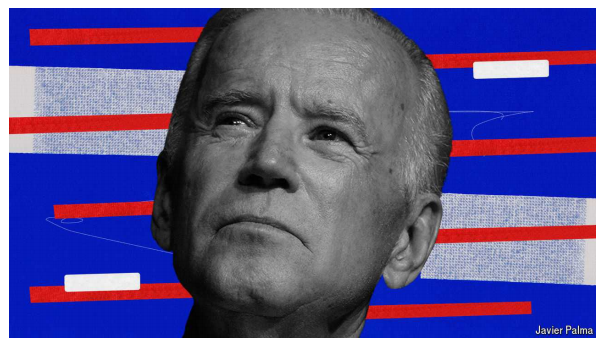

# What to make of Joe Biden’s plans for a second term

His domestic agenda is underwhelming, unrealistic and better than the alternative

他的国内议程乏善可陈，不切实际，也比另一个人更好

agenda：美 [əˈdʒendə] 议程；日程安排；

underwhelming：美 [ˌʌndərˈwelmɪŋ] 令人失望的；没留下好印象的；未激起人们热情的；

原文：

Some politicians are shy about revealing their ideas before elections for fear

of alarming the voters. Others simply do not have very much to say. Which

type is Joe Biden, as he pitches for a second presidential term? His

domestic-policy plans have received much less scrutiny than Donald

Trump’s. Our briefing this week is a first attempt to make up for that. The

most positive thing to say about this president’s platform is that the

alternative is a lot worse.

一些政客羞于在选举前透露他们的想法，因为他们害怕惊动选民。其他人根本没有太多话要说。乔·拜登在竞选第二个总统任期时属于哪种类型？与唐纳德·特朗普相比，他的国内政策计划受到的关注要少得多。我们本周的简报是弥补这一点的第一次尝试。关于这位总统的政纲，最积极的一点是，另一种选择要糟糕得多。

学习：

for fear of：以免；生怕      

alarming：警告；使惊恐；（alarm的现在分词）

alarm the voters：惊动选民

pitch for：为xxx投球，这里是竞选的意思

原文：

Mr Biden came to power in 2021 with a grand vision to remake the

American economy for the middle class. His foreign policy was organised

around this goal, too.  FDR was mentioned. In office he was constrained by the

Senate. Without the votes to overcome the filibuster, Bidenomics had to be

implemented through giant budget bills and regulations. Some of the results

have been beneficial, particularly in spurring investment in green

technology. But overall, Mr Biden has placed far too much faith in

regulation, protection and intervention, rather than animal spirits, to boost

the economy.

2021年，拜登带着为中产阶级重塑美国经济的宏伟愿景上台。他的外交政策也是围绕这个目标制定的。提到了罗斯福。在任时，他受到参议院的限制。没有克服阻挠的投票，拜登经济学不得不通过庞大的预算法案和法规来实施。一些结果是有益的，特别是在刺激绿色技术投资方面。但总的来说，拜登先生过于相信监管、保护和干预，而不是动物精神来提振经济。

学习：

filibuster：美 [ˈfɪləˌbəstər] 阻挠议事的行动；

regulations：法规

spur investment：刺激投资

boost the economy：提振经济

原文：

A second term would be more timid. Team Biden talks of creating universal

pre-school and other big reforms, but will surely achieve far less. On tax,

trade and antitrust its ideas are a mix of promising and retrograde, reflecting

compromises to placate the party’s coalition. What it lacks is a realistic

appraisal of how the economy is doing, or a vision of where America could

be in ten years.

第二个任期将会更加胆怯。拜登团队谈到创建普及学前教育和其他重大改革，但肯定会实现得少得多。在税收、贸易和反垄断方面，它的想法是充满希望和倒退的混合体，反映了安抚party’s coalition的妥协。它缺少的是对经济现状的现实评估，或者对美国十年后的前景的展望。

学习：
timid：美 [ˈtɪmɪd] 胆小的；羞怯的；胆怯的；缺乏自信的；怯懦的

pre-school：学前教育

coalition：联合，联盟

retrograde：美 [ˈretrəɡreɪd]后退的；逆行的；退步的；

placate：美 [ˈpleɪkeɪt]平息；安抚；抚慰

appraisal：美 [əˈpreɪzl]估量；估计；评估；

原文：

On fiscal policy Team Biden would like to restore the top marginal rate of

income tax to 39%, where it was before Trump-era cuts reduced it to 37%.

Given the vast budget deficit, this makes sense. The president’s team would

like to eliminate the “stepped-up basis” loophole for capital-gains tax, which

is a good idea, too. But Mr Biden is also committed to sparing those earning

less than $400,000 a year from any new taxes, a sop to the left-populists who

think that the super-rich can fund all their spending plans.

在财政政策团队中，拜登希望将所得税的最高边际税率恢复到39%，这是特朗普时代削减措施将其降至37%之前的水平。鉴于庞大的预算赤字，这是有道理的。总统团队希望消除资本收益税的“累进基础”漏洞，这也是一个好主意。但拜登先生也承诺免除年收入低于40万美元的人的任何新税，这是对left-populists的安抚，他们认为超级富豪可以资助他们所有的支出计划。

学习：

fiscal policy：财政政策

restore：恢复；修复（古迹、艺术品等）；使复原；

>这里的“marginal rate of income tax”指的是**边际所得税率**。边际所得税率是对超过某一特定收入水平的部分征收的税率。在这种税率结构下，纳税人的收入分成多个部分，每个部分按不同的税率征税。具体到文中提到的情况，拜登团队希望将最高边际所得税率恢复到39%，即将收入超过某个高收入门槛（例如40万美元）的部分按39%的税率征税，这一税率在特朗普时代被降低到了37%。

stepped-up basis介绍：

>“Stepped-up basis” 是指在资产继承时，对资产的原始购入价格（基础）进行重新估值，以反映其在继承时的市场价值。这种做法通常用于计算资本利得税。
>
>具体来说，当一个人去世并将资产（如股票、房地产等）传给继承人时，这些资产的基础价格会被调整为其在继承时的市场价值，而不是最初的购入价格。这样，继承人在出售这些资产时，只需为继承之后的增值部分支付资本利得税，而不必为原始购入价和市场价之间的增值部分支付税款。
>
>例如，如果某人在多年前以10万美元的价格购买了一处房产，该房产在去世时的市场价值是50万美元，那么继承人接收到这处房产时，其基础价格就会被调整为50万美元。如果继承人在未来以55万美元的价格出售这处房产，那么他们只需为5万美元的增值部分（55万减去50万）支付资本利得税，而不必为最初的40万美元增值部分（50万减去10万）支付税款。
>
>拜登团队希望消除这个“stepped-up basis”漏洞，以确保资产的全部增值部分在转手时都能被征税，从而增加政府税收收入。

loophole: 美 [ˈluːphoʊl]漏洞；空子；机会；

left-populists: 左翼民粹主义者

原文：

On antitrust, the administration has pursued useful cases against health-care

and credit-card firms. But the head of the Federal Trade Commission, Lina

Khan, has wasted energy on a quixotic mission to restrain big tech firms,

despite evidence that competition between them is fierce. On trade, the

Biden administration has been marginally better than its predecessor. The

president has lowered barriers to European and Japanese steel and

aluminium. A trade initiative in Asia, IPEF, makes the right noises, but has not

amounted to much. When it comes to trade with China, alas, Bidenomics has

often just been a more competent version of Trumpism.

在反垄断方面，政府已经对医疗保健和信用卡公司提起了诉讼。尽管有证据表明大型科技公司之间的竞争非常激烈，但美国联邦贸易委员会的负责人莉娜·汗(Lina Khan)却把精力浪费在了限制大型科技公司的不切实际的任务上。在贸易方面，拜登政府比其前任略胜一筹。总统降低了对欧洲和日本钢铁和铝的壁垒。亚洲的IPEF贸易倡议发出了正确的声音，但收效甚微。唉，当涉及到与China的贸易时，拜登经济学往往只是特朗普主义的一个更有竞争力的版本。

学习：

quixotic：美 [kwɪkˈsɑdɪk]过于空想的；不切实际的

fierce：美 [fɪrs] 竞争激烈的 **注意发音**

原文：

The Biden policy algorithm is: do not get outflanked by Donald Trump on

China or trade. Do not raise taxes on anyone without a yacht. Do not do

anything to annoy unions or to worsen racial disparities. The result is a

defensive crouch. For example, Team Biden wants to decarbonise the

economy but not look soft on China or unfriendly to unions. So it places

tariffs on imports of Chinese electric vehicles and solar panels, slowing

decarbonisation without doing much to create union jobs.

拜登的政策算法是:不要在China或贸易问题上被唐纳德·特朗普(Donald Trump)击败。不要对没有游艇的人增税。不要做任何惹恼工会或加剧种族差异的事情。结果是防御性蹲伏。例如，拜登团队希望经济去碳化，但不会对China手软或对工会不友好。因此，它对进口的Chinese电动汽车和太阳能电池板加征关税，减缓了脱碳速度，却没有为工会创造多少就业机会。

学习：

outflanked：美 [autˈflæŋkt]迂回；挫败；智胜；（outflank的过去式和过去分词）

yacht：美 [jɑːt]游艇；帆船；快艇；**注意发音**

crouch： 美 [kraʊtʃ] 蹲着的姿势；蹲伏姿势；蜷伏姿态

decarbonise ：去碳化

原文：

This defensive crouch is odd, given the strength of America’s economy. Real

wages for the bottom fifth of workers have risen by nearly a tenth in four

years, thanks to low unemployment, falling inflation and copious deficit

spending. The black-white employment gap has almost vanished. Yet

progressives are convinced that the economy must be remade.

考虑到美国经济的实力，这种防御性的蹲伏很奇怪。得益于低失业率、下降的通货膨胀率和大量的赤字支出，底层五分之一工人的实际工资在四年内上涨了近十分之一。黑人和白人的就业差距几乎消失了。然而，进步人士确信，经济必须重塑。

学习：

copious：美 [ˈkoʊpiəs]丰富的；充裕的；

原文：

Mr Trump also thinks the economy is broken, and proposes to fix it by

funding the government largely through tariffs, which is both impossible and

dangerous. His tax plan would worsen the deficit and could stoke inflation.

Compared with that, four more years of low-ambition Bidenomics sounds

appealing. But so does a cold shower. ■

特朗普还认为经济已经崩溃，并提议通过主要通过关税为政府提供资金来修复经济，这既不可能又危险。他的税收计划将恶化赤字，并可能引发通货膨胀。相比之下，四年的低雄心拜登经济学听起来很有吸引力。但是冷水澡也一样。■

学习：

appealing：有吸引力的

stoke：美 [stoʊk]   给（火；炉子；锅炉）加煤；激起；煽起；

stoke inflation：引发通胀

## 后记

2024年6月30日19点02分于上海。

