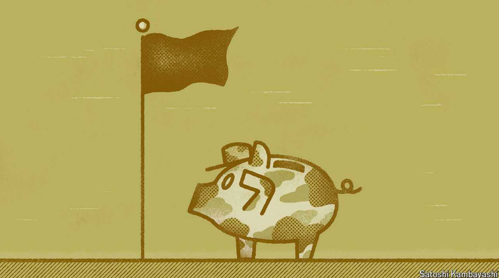

# The dangerous rise of pension nationalism

Pursuing domestic investment at the expense of returns is reckless

以牺牲回报为代价追求国内投资是鲁莽的

At the expense of:  以…为代价；牺牲…的利益；以牺牲…的利益为代价

reckless：鲁莽的；轻率的；不顾后果的；

原文：

Rachel Reeves, Britain’s new chancellor, says that she has inherited the

worst fiscal circumstances since the second world war. An exaggeration,

perhaps, but only a small one. To address the squeeze, Ms Reeves will seek

the help of Britain’s retirement savings. On July 8th she said that she wants

the country’s pension funds “to drive investment in homegrown businesses

and deliver greater returns to pension savers”.

英国新任财政大臣雷切尔·里夫斯表示，她接手的是二战以来最糟糕的财政状况。也许有点夸张，但只是一点点。为了解决这一困境，里维斯女士将寻求英国退休储蓄的帮助。7月8日，她说她希望国家的养老基金“推动对本土企业的投资，给养老金储蓄者带来更大的回报”。

学习：

exaggeration：夸张；夸大；夸张的手法；

squeeze：困境；削减；经济拮据；金融紧缩；

原文：

Details of Ms Reeves’s plans are still to emerge. Her predecessor, Jeremy

Hunt, set the ball rolling by mandating that defined-contribution pension

funds will have to disclose the scale of domestic investments by 2027. Other

countries are joining in. Stephen Poloz, a former governor of the Bank of

Canada, is looking at how to increase pension-fund investment in domestic

assets on behalf of the Canadian government. Enrico Letta, a former Italian

prime minister, recently argued in favour of an EU-wide auto-enrolment

pension scheme that could be funnelled into green transport and energy

infrastructure

里维斯计划的细节仍有待披露。她的前任杰里米·亨特(Jeremy Hunt)开了个头，要求固定缴款养老基金必须在2027年前披露国内投资规模。其他国家也加入进来。加拿大银行前行长Stephen Poloz正代表加拿大政府研究如何增加养老基金对国内资产的投资。意大利前总理恩里克·莱塔最近表示支持全EU-范围内的自动登记养老金计划，该计划可用于绿色交通和能源基础设施

学习：

mandating：强制执行；托管；（mandate的现在分词）

funnelled：英 ['fʌneld] 使经过漏斗；（funnel的过去式）

原文：

What explains the rise of pension-fund nationalism? Many Western

countries, other than America, face similar problems. Politicians fret about

low levels of business investment. The most promising high-tech firms flee

for Silicon Valley when seeking venture-capital funding or Wall Street when

requiring a stockmarket on which to list. High interest rates and mighty

government debts mean that cash is scarce. Time, then, to shake down

pension funds

如何解释养老基金民族主义的兴起？除了美国，许多西方国家也面临着类似的问题。政客们对商业投资的低水平忧心忡忡。最有前途的高科技公司在寻求风险投资资金时会逃往硅谷，在需要上市的股票市场时会逃往华尔街。高利率和庞大的政府债务意味着现金短缺。那么，是时候整顿养老基金了

学习：

fret：烦躁；焦虑；苦恼；忧虑；

flee：逃走

scarce：稀缺；短缺

shake down：适应新地方；适应新环境；安顿

原文：

There may be some measures that pension-fund nationalists are able to

employ without dampening returns. Removing barriers that prevent funds

from investing in domestic assets is a laudable enough goal. In Britain small

private-pension plans could be consolidated, which would allow for

economies of scale and make investing in private markets more

straightforward.

养老基金民族主义者可能会采取一些措施而不降低回报。消除阻止基金投资国内资产的障碍是一个值得称赞的目标。在英国，小规模的私人养老金计划可以合并，这将考虑到规模经济，并使得投资私人市场更加直接。

学习：

dampening：抑制；使…沮丧；（dampen的现在分词形式）

laudable：美 [ˈlɔdəb(ə)l] 值得称赞的

原文：

Research by Keith Ambachtsheer, Sebastien Betermier and Chris Flynn, a

trio of economists, shows that Canadian funds invest a disproportionate

amount at home when it comes to bonds, property and stocks. But they

invest relatively little in domestic infrastructure as the government chooses

not to make such assets available to them. The authors propose that the

Canadian government follows the example of countries including Australia

and India, which have made their infrastructure an asset class in which

pension funds at home and abroad can invest.

三位经济学家Keith Ambachtsheer、Sebastien Betermier和Chris Flynn的研究表明，加拿大基金在国内投资了过多的债券、房地产和股票。但它们对国内基础设施的投资相对较少，因为政府选择不向它们提供此类资产。作者建议加拿大政府效仿包括澳大利亚和印度在内的国家，将基础设施作为国内外养老基金可以投资的资产类别。

原文：

Yet savers have reason to be sceptical that extra domestic investment will

produce higher returns. Pension funds already exhibit home bias, deploying

more cash to local markets than would be best. Over the past decade, the 

MSCI Canada and Britain indices have returned 4% and 3% a year in dollar terms,

while American stocks have returned 13%. Any Briton or Canadian who

wishes their pension allocation was more domestic is a truly selfless patriot.

And the two markets have not underperformed because they are capital

constrained. They have underperformed because they are stuffed with

companies in industries such as banking, energy and mining, which have

lagged behind America’s soaring tech stocks.

然而，储户有理由怀疑额外的国内投资会产生更高的回报。养老基金已经表现出本土偏好，将更多的资金配置到当地市场。在过去的十年里，MSCI加拿大和英国指数以美元计算的年回报率分别为4%和3%，而美国股市的回报率为13%。任何希望自己的养老金分配更加国内化的英国人或加拿大人都是真正无私的爱国者。这两个市场的表现并不差，因为它们受到资本约束。它们表现不佳是因为充斥着银行、能源和采矿等行业的公司，这些行业落后于美国飙升的科技股。

学习：

stuffed：塞满；填塞；让吃饱；（stuff的过去式和过去分词）

stuffed with：充满

原文：

Enormous East Asian retirement piles provide a valuable lesson in the merits

of pension globalism. The governments of Japan and South Korea once

deployed state pension funds in pursuit of national goals, as Western

politicians are now discussing. But in recent years they have changed

approach, prompted to do so by worries about ageing populations and low

returns. As recently as 2010 more than two-thirds of assets held by both the

Korean National Pension Service and Japan’s Government Pension

Investment Fund were domestic bonds. Today the share has fallen to 30%

and 27%, respectively. Both countries are investing more overseas and in

riskier assets. As a consequence, returns have surged.

东亚庞大的退休储备为养老金全球化的优点提供了宝贵的一课。正如西方政治家现在所讨论的那样，日本和韩国政府曾经为了追求国家目标而部署国家养老基金。但近年来，出于对人口老龄化和低回报的担忧，他们改变了策略。就在2010年，韩国国家养老金服务机构和日本政府养老金投资基金持有的资产中，超过三分之二是国内债券。如今，这一比例分别降至30%和27%。两国都在加大海外投资和风险更高的资产。因此，回报率大幅上升。

学习：

valuable lesson：有价值的一课

retirement piles：退休储备

原文：

Few Western politicians would like to go as far as the Japanese and South

Korean governments once did, but the direction of travel is nonetheless

worrying. Giving pension funds more options is one thing. Limiting their

options in order to encourage domestic investment is quite another. That is

especially true given that governments already face a formidable challenge

when it comes to providing for baby-boomers during their increasingly

lengthy retirements. National obligations that lower returns will inevitably

leave governments holding the bag for any shortfall in the decades to come.

When that happens, they will rue the decision to have focused on anything

but making money. ■

很少有西方政治家愿意走日本和韩国政府曾经走过的路，但前进的方向仍然令人担忧。给养老基金更多选择是一回事。为了鼓励国内投资而限制他们的选择是另一回事。考虑到政府已经面临一个艰巨的挑战，即在婴儿潮一代越来越长的退休期间为他们提供保障，这一点尤其正确。降低回报的国家债务将不可避免地让政府为未来几十年的任何短缺买单。当这种情况发生时，他们会后悔当初没有把注意力放在赚钱上。■

学习：

formidable：美 [ˈfɔːrmɪdəbl] 难以应对的；

formidable challenge：艰巨的挑战

rue：后悔；懊悔；悔恨；

rue the decision：后悔这个决定

anything but：一点也不；绝不；决不

## 后记

2024年7月20日于上海。