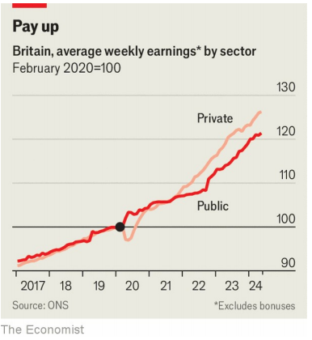

# How deep is Britain’s fiscal “black hole”?

Rachel Reeves sets out her first big decisions as chancellor

set out: 陈述，阐明

>"**Set out**" 的意思是陈述、阐明或展示。在这个上下文中，指的是Rachel Reeves作为财政大臣阐明了她的第一个重要决策。
>
>**例子：**
>
>- The new CEO set out her vision for the company in a detailed presentation. (新任CEO在详细的演讲中阐述了她对公司的愿景。)
>- The teacher set out the rules for the classroom at the beginning of the school year. (老师在学年开始时阐明了课堂规则。)

chancellor：财政大臣

exchequer：美 [ɪksˈtʃɛkər]  （英国）财政部；财政；**注意发音**

>在英国，**Chancellor** 是财政大臣，全称为 "Chancellor of the Exchequer"。财政大臣是英国政府中负责管理财政和经济事务的高级官员，相当于其他国家的财政部长。
>
>**例子：**
>
>- The Chancellor announced a new budget aimed at boosting economic growth. (财政大臣宣布了一项旨在促进经济增长的新预算。)
>- As Chancellor, she will be responsible for setting out the government's fiscal policies. (作为财政大臣，她将负责制定政府的财政政策。)

原文：

THE FIRST months of a new British government are precious. Problems can

be blamed on ministers’ predecessors, who will struggle for a hearing.

Capitalising on that honeymoon can neutralise the political costs of tough

choices: George Osborne, a former Conservative chancellor, moved quickly

in 2010 to pin swingeing spending cuts on Labour’s profligacy. Britain’s

new Labour chancellor is following the same playbook. On July 29th Rachel

Reeves presented the results of an audit into the public finances, which she

had commissioned straight after the election.

英国新政府的最初几个月是宝贵的。问题可以归咎于部长们的前任们，他们会努力争取一个听证会。利用这段蜜月期可以抵消艰难选择的政治成本:前保守党财政大臣乔治·奥斯本在2010年迅速将大幅削减开支归咎于工党的挥霍。英国新任工党财政大臣也在遵循同样的策略。7月29日，雷切尔·里夫斯提交了一份公共财政审计结果，这是她在大选后立即委托进行的。

学习：

honeymoon：蜜月

neutralise：中和

swingeing：剧烈的；极度的；重击；敲打；（swinge的现在分词）

pin：把…归咎于

profligacy：美 ['prɒflɪɡəsɪ] 浪费；不检点；肆意挥霍

playbook：战术手册（尤指体育队伍使用的）；策略指南；程序指南

follow the same playbook：遵循同样的策略

commissioned：委任；授予；使服役；（commission的过去式和过去分词）

>**Commission** 在这里的意思是委托或指派。在这段话中，Rachel Reeves 委托了一项关于公共财政的审计。
>
>**例子：**
>
>- The artist was commissioned to create a sculpture for the new park. (这位艺术家被委托为新公园创作一件雕塑。)
>- The company commissioned a study to investigate the effects of their product on the environment. (公司委托了一项研究，调查他们的产品对环境的影响。)
>
>
>
>**Commission straight** 在这里的意思是立即委托或直接指派。在这段话中，Rachel Reeves 在选举后立即委托了一项审计。
>
>**例子：**
>
>- After taking office, the new mayor commissioned a survey straight away to assess public opinion on city services. (上任后，新市长立即委托了一项调查，以评估公众对城市服务的看法。)
>- The CEO commissioned a review straight after the merger to identify potential cost savings. (合并后，首席执行官立即委托了一项审查，以确定潜在的成本节约。)
>

原文：

With the stern look of a disappointed head teacher, Ms Reeves decried an

“unforgivable” inheritance. Her focus was on immediate pressures in this

financial year. Even after accounting for the Treasury’s rainy-day fund and

assumptions that some programmes would come in under budget, she told

Parliament that a £21.9bn ($28.2bn; 0.8% of GDP) overspend had been

uncovered. About half came from inflation-busting pay rises for public-

sector workers. Most of the rest came from £6.4bn in higher-than-expected

costs associated with the asylum system, with smaller contributions from aid

for Ukraine, support for the railways and more.

里夫斯带着失望的校长的严厉表情，谴责了这种“不可原谅的”遗产。她关注的是本财政年度的紧迫压力。即使考虑到财政部的应急基金和一些项目会低于预算的假设，她告诉议会发现了219亿英镑(282亿美元；GDP的0.8%)的超支。大约一半来自抑制通货膨胀的公共部门员工加薪。其余大部分来自高于预期的64亿欧元庇护系统相关费用，一小部分来自对乌克兰的援助、对铁路的支持等。

学习：

stern：苛刻的；严肃的；坚定的

head teacher: 校长

>**Head Teacher** 在这里指的是学校的校长。描述 Rachel Reeves 有着一位失望校长的严肃表情，意思是她对继承的财政状况感到不满和失望，并且以一种严厉和认真的态度在处理这个问题。
>
>**例子：**
>
>- The head teacher addressed the assembly with a stern look, emphasizing the importance of discipline and hard work. (校长带着严肃的表情在集会上讲话，强调纪律和努力工作的重要性。)
>- When the students misbehaved, the head teacher's disappointed look was enough to silence the room. (当学生们行为不端时，校长失望的表情足以让房间安静下来。)

decried：谴责；诽谤；责难；（decry的过去式）

unforgivable： 英 [ʌnfəˈɡɪvəb(ə)l] 不可饶恕的；不可宽恕的；不可原谅的；

rainy-day：穷困时期的；急需的；雨天的          

uncovered：揭露；发现；暴露；揭开；

>**Uncover** 在这里的意思是揭露或发现某些隐藏的东西。Rachel Reeves 报告中提到的“uncovered”表示她和她的团队发现了原本隐藏或不明显的财政问题。
>
>**例子：**
>
>- The audit uncovered several instances of financial mismanagement. (审计揭露了几起财务管理不善的情况。)
>- Investigations have uncovered new evidence in the case. (调查揭露了该案件中的新证据。)
>
>中文解释
>
>在这段话中，“uncovered” 的意思是揭露或发现。Rachel Reeves 在向议会报告时提到，他们发现了一个219亿英镑（占GDP的0.8%）的超支情况。这个超支问题是通过他们的审计过程发现的。

inflation busting：抑制通货膨胀

higher-than-expected：高于预期的；超出预期的；

asylum：美 [əˈsaɪləm] （政治）避难所；庇护 **注意发音**

aid for xxx：援助xxx

原文：

Ms Reeves expects to fill a quarter of that hole with immediate spending

cuts. The single biggest saving will come from means-testing winter-fuel

payments for pensioners. That saves £1.5bn in the next fiscal year and the

group affected—the better-off elderly—is hardly a core Labour constituency.

Further savings will come from axing chunks of Rishi Sunak’s policy legacy.

She is ending schemes to send asylum-seekers to Rwanda (worth £1.4bn), to

revamp the secondary-school curriculum (£185m) and to sell discounted

shares in NatWest to the public (£100m-450m).

里维斯女士希望通过立即削减开支来填补四分之一的缺口。最大的一笔节省将来自对养老金领取者冬季燃料支出的调查。这将在下一财年节省15亿英镑，而受影响的群体——境况较好的老年人——很难说是核心的工党选民。进一步的节省将来自削减希·苏纳克的政策遗产。她正在终止将寻求庇护者送往卢旺达的计划(价值14亿英镑)，修改中学课程的计划(1 . 85亿英镑)，以及向公众出售NatWest的折价股票的计划(1亿英镑至4 . 5亿英镑)。

学习：

a quarter of：四分之一；四分之一的

spending cut：削减开支

means-testing：经济状况调查

>**Means-testing** 是一种经济评估方法，用于确定一个人或家庭是否有资格获得某些类型的福利或援助。具体来说，means-testing 是根据个人或家庭的收入和资产状况来决定他们是否符合领取福利的条件。
>
>**例子：**
>
>- The government introduced means-testing for housing benefits to ensure that only those in genuine need receive assistance. (政府引入了住房福利的经济评估，以确保只有真正需要帮助的人才能获得援助。)
>- By means-testing winter-fuel payments, the government saves money by only providing them to pensioners with lower incomes. (通过对冬季燃料补贴进行经济评估，政府通过仅向收入较低的养老金领取者提供补贴来节省资金。)

pensioners：美 [ˈpenʃənəz] 领退休金者；（pensioner的复数）

constituency：选区，选民

axing： 美 [æksɪŋ] 用斧砍；解雇；（axe的现在分词形式）

axe chunks: 大幅削减，取消某些部分

>**Axing chunks** 指的是大幅度削减或取消政策、计划或预算中的某些部分。
>
>**例子：**
>
>- The company is axing chunks of its research and development budget to cut costs. (公司正在削减其研发预算的很大一部分以节省成本。)
>- The new administration is axing chunks of the previous government's healthcare reforms. (新政府正在大幅削减前政府的医疗改革计划。)

revamp：翻新；改进外观；重新设计；翻修

原文：

More consequential were her cuts on social care (worth £1.1bn) and

transport (£785m). The transport cuts are mostly focused on second-tier road

and rail projects. Nonetheless, they represent a continuation of previous

governments’ tendency to endlessly tinker with infrastructure projects. Ms

Reeves condemned “the stop-go cycle of capital investment” in a lecture in

March. Back then she called it “the new British disease”. Strikingly, the cuts

did not extend to the government’s new flagship initiatives to spend billions

in public money on green infrastructure.

更重要的是她削减了社会保障(11亿英镑)和交通(7 . 85亿英镑)。交通削减主要集中在二线公路和铁路项目上。尽管如此，它们代表了前任政府不断修补基础设施项目的趋势的延续。里维斯女士在三月份的一次演讲中谴责了“资本投资的停顿复始的循环”。当时她称之为“新英国病”。引人注目的是，削减并没有延伸到政府新的旗舰计划，即花费数十亿公共资金建设绿色基础设施。

学习：

consequential： 重大的，重要的

>**Consequential** 意思是重大的、重要的，通常指会产生显著影响的事情。
>
>**Consequential** 在这里是指这些削减措施是重大的、重要的，因为它们会产生显著影响。文中提到的社会护理和交通运输方面的削减措施就是具有重大影响的决策。
>
>**例子：**
>
>- The court's ruling was consequential, setting a precedent for future cases. (法院的判决是重大的，为未来的案件树立了先例。)
>- The company's decision to expand into new markets proved to be highly consequential for its growth. (公司决定拓展新市场，这对其增长产生了重大影响。)

social care：社会保障

tinker with：修补；胡乱地修补；小幅修改；

>**Tinker with** 意思是小修、小改，通常指对某事进行细微的、反复的调整或修改。文中提到的交通运输削减措施延续了前政府不断对基础设施项目进行小修小改的趋势。
>
>**例子：**
>
>- He likes to tinker with old cars in his garage. (他喜欢在车库里修理旧车。)
>- The policy has been tinkered with several times, but it still has many flaws. (政策已经被多次修改，但仍然存在很多缺陷。)

stop-go：前进中停顿与复始的交替；政府对经济需求实行紧缩与刺激相交替的做法          

strikingly：引人注目地；突出地；显著地          

>**Strikingly** 意思是显著地、引人注目地，用来强调某事特别突出或与众不同。**Strikingly** 在这里是强调引人注目的是，这些削减措施没有涉及到政府在绿色基础设施上花费数十亿公共资金的新旗舰计划。
>
>**例子：**
>
>- The two sisters are strikingly different in appearance. (这两姐妹在外貌上显著不同。)
>- Strikingly, the new design received unanimous praise from all the critics. (显著的是，新的设计得到了所有评论家的一致赞誉。)

原文：

If Ms Reeves’s goal was to re-emphasise Labour’s sorry inheritance, she was

partly successful. Labour and the Conservatives have been shadowboxing

over the state of the public finances since before the election. The

Conservatives argue that forecasts from the Office for Budget Responsibility

(OBR), a fiscal watchdog, mean the books are now fully open.

如果里夫斯女士的目标是重新强调工党令人遗憾的遗产，她已经部分成功了。自选举前起，工党和保守党就一直在公共财政状况上打太极拳。保守党认为，财政监督机构预算责任办公室(OBR)的预测意味着账本现在已经完全公开。

学习：

shadowboxing：太极拳；练打

public finances：公共财政

sorry：糟糕的，令人失望的

>**Sorry** 在这里的意思是糟糕的、不幸的，用来形容令人失望或不满意的情况。
>
>**例子：**
>
>- After seeing the sorry state of the garden, they decided it needed a complete makeover. (在看到花园的糟糕状态后，他们决定需要彻底改造。)
>- The company's sorry performance this quarter has disappointed investors. (公司本季度糟糕的表现让投资者失望。)
>
>中文解释
>
>**Sorry** 在这里是指劳工党继承了一个糟糕的财政状况。文中提到的是，如果瑞夫斯女士的目标是重新强调劳工党继承的糟糕状况，她部分成功了。这句话的意思是，劳工党继承了一个令人失望的财政状况。

原文：

But the OBR’s medium-term forecasts, last released in March, did not account

for in-year overspends. A row is now brewing over whether it was

misleading for the Treasury not to share details of the areas at risk; Richard

Hughes, the OBR chief, has announced an investigation. Jeremy Hunt, the last

chancellor, parried with a letter querying why top civil servants had just

signed off on this year’s spending if the overruns were so unusual. Ms

Reeves has set out reforms that should make future cases of this sort much

easier to spot.

但是OBR的中期预测，上一次是在3月份发布的，没有考虑年内超支。一场争论正在酝酿中，争论的焦点是财政部不分享风险领域的细节是否具有误导性；OBR负责人理查德·休斯宣布了一项调查。上一任财政大臣杰里米·亨特(Jeremy Hunt)写了一封信，质疑如果超支如此不寻常，为什么高级公务员刚刚签署了今年的支出。Reeves女士已经提出了改革方案，这将使未来的此类案件更容易被发现。

学习：

medium-term：中期的

brewing：酿造；酝酿；（brew的现在分词）          

row：争吵；争论；吵闹

>**A row is now brewing** 在这里的意思是争论或争吵正在酝酿中。
>
>**例子：**
>
>- A row is now brewing between the neighbors over the property boundary. (邻居之间关于财产边界的争论正在酝酿中。)
>
>**中文解释：**
>
>**A row is now brewing** 在这里指的是关于是否误导财政部没有分享面临风险领域的细节的争论正在酝酿中。

civil servants：公务员

parried：巧妙地回避

>**Parried** 在这里的意思是巧妙地回应或回避（问题、批评等）。**Parried** 在这里指的是杰里米·亨特（Jeremy Hunt）用一封信巧妙地回应或回避了为什么如果超支如此不寻常，高级公务员们还在今年批准了支出的问题。
>
>**例子：**
>
>- When asked about the scandal, the politician parried by changing the subject. (当被问及丑闻时，那位政治家巧妙地转移了话题。)

sign off：正式签署，正式批准

>
>
>**Sign off** 在这里的意思是正式批准或签署某个决定或文件。
>
>**例子：**
>
>- The manager signed off on the new project proposal. (经理正式批准了新项目提案。)

overruns：**Overruns** 在这里的意思是超支或超出预算。

原文：

Focusing on the overall fiscal inheritance also helps Labour to divert

attention from the policy choices embedded in Ms Reeves’s statement, such

as accepting the recommendations of pay-review boards to raise public-

sector wages by more than expected. Doing so is understandable: pay has

lagged the private sector since inflation started rising in 2022 (see chart).

But it was still a choice. Also consequential is confirmation that Labour will

axe Conservative plans to cap civil-service headcount.

关注整体财政遗产也有助于工党将注意力从里维斯女士声明中的政策选择上转移开来，例如接受薪酬审查委员会的建议，将公共部门的工资提高到超出预期的水平。这样做是可以理解的:自2022年通胀开始上升以来，薪酬一直落后于私营部门(见图表)。但这仍然是一个选择。同样重要的是，工党将取消限制公务员人数的保守计划。

学习：

divert attention from：转移注意力

axe：美 [æks] 削减（预算或开支）；精简（员工）；降低（成本）；删减（不必要的部分）；取消；终止

headcount：人数

原文：

Her statement set the stage for the next budget, which will take place on

October 30th. Labour was evasive on tax throughout the election, saying it

would not raise taxes on “working people” and ruling out increases to the

biggest levies. Ms Reeves has since confirmed the inevitable: that some tax

rises are coming. But she will be hoping that her show of fiscal sternness

will be enough to reduce their political impact—for Labour, at least. ■

她的声明为将于10月30日出台的下一份预算做了铺垫。工党在整个选举中对税收避而不谈，称不会增加“劳动人民”的税收，并排除了增加最大税收的可能性。里夫斯女士后来证实了不可避免的事实:一些增税即将到来。但是她希望她在财政上的严厉表现足以减少他们的政治影响——至少对工党来说。■

学习：

set the stage for：为…做好准备；为…铺平道路；为…创造条件；为…打好基础          

evasive：回避的；逃避的；躲闪的；

sternness：严厉

## 后记

2024年8月4日19点27分于上海。

