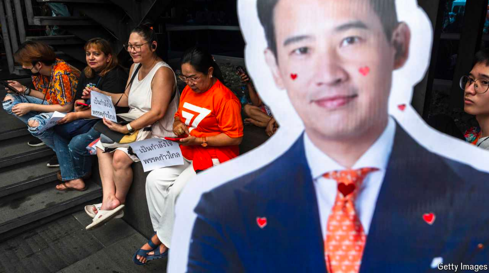

# Banning the opposition won’t save Thailand’s unpopular regime

Once again, the army pretends its critics are anti-royal

原文：

Thailand’s law against insulting the monarchy is arguably the world’s

strictest. Each insult is punishable by three to 15 years in prison, and what

counts as rude is broadly defined. People have been charged for such things

as wearing a crop top similar to the king’s, throwing dog food at the police

(implying they are the king’s attack dogs) and questioning whether an

exclusive contract to manufacture covid-19 vaccines should have been

awarded to a royal-owned firm.

泰国禁止侮辱君主的法律可以说是世界上最严格的。每一次侮辱都将被处以3到15年的监禁，而什么样的行为算是粗鲁无礼则有着广泛的定义。人们被指控的罪名包括穿着与国王相似的露脐短装，向警察扔狗食(暗示他们是国王的攻击犬)，以及质疑是否应该将生产新冠肺炎疫苗的独家合同授予一家皇家公司。

学习：

monarchy： 美 [ˈmɑːnərki] 君主制；君主政体；王权；皇室；王室

insulting：侮辱；（insult的现在分词）

arguably：按理说；据称

strictest：最严格的；（strict的最高级）

punishable：可罚的；该罚的

crop top：无袖露脐短衫

dog food：狗食品；狗食物；狗粮

原文：

Anyone can file a *lèse-majesté* complaint against anyone else, and the police

are obliged to investigate. The law is therefore often used to harass members

of the opposition. It is crying out for reform. But when the most popular

political party in Thailand suggested reforming the law, it was accused of

wanting to overthrow the monarchy—Catch-22 for the opposition*.*

任何人都可以对任何其他人提起冒犯君主罪诉讼，警察有义务进行调查。因此，这项法律经常被用来骚扰反对派成员。它迫切需要改革。但是，当泰国最受欢迎的政党建议改革法律时，它被指责想推翻君主制——这对反对派来说是一个两难的选择。

学习：

be obliged to：有义务…；

harass：美 [həˈræs] 骚扰；侵扰；困扰；烦扰

crying out for：迫切需要

overthrow：推翻；颠覆；打倒；

Catch-22: 第22条军规；悖论性困境；无解难题

原文：

The results were predictable. On August 7th a Thai court ordered the

dissolution of Move Forward (MFP), a liberal party that won more votes than

any other at the most recent election, in 2023. It also banned senior members

of MFP from politics for ten years.

结果是可以预料的。8月7日，泰国法院下令解散前进党(MFP)，这是一个自由党，在2023年的最近一次选举中赢得了比其他任何政党都多的选票。它还禁止MFP的高级成员十年内从政。

学习：

dissolution：解散；终止；消散；分解

原文：

This is an extension of tactics long used by the army-backed establishment

that rules Thailand. After the election in 2023, an appointed Senate

prevented MFP—which has pesky ideas about curbing cronyism and military

influence—from forming a government. That ruse may not be possible in

future, owing to constitutional changes, so the regime seems to be doubling

down on “lawfare”—a method of using the legal system to hobble the

opposition. As Pita Limjaroenrat, MFP’s charismatic former leader, argued in

an online essay for *The Economist* on August 1st, the courts are now “the

weapon of choice to muzzle those who seek to challenge the status quo”.

这是统治泰国的军方支持的机构长期使用的战术的延伸。2023年大选后，一个指定的参议院阻止了MFP组建政府——该国对遏制任人唯亲和军事影响有着令人讨厌的想法。由于宪法的改变，这种策略在未来可能行不通了，所以政权似乎在加倍使用“法律手段”——一种利用法律体系来阻碍反对派的方法。正如富有魅力的MFP前领导人Pita Limjaroenrat在8月1日为《经济学人》撰写的在线文章中所言，法院现在是“压制那些试图挑战现状的人的首选武器”。

学习：

pesky：令人烦恼的；令人讨厌的

ruze：策略；花招；伎俩

be doubling down：加倍下注

hobble：阻止；阻碍；束缚；

hobble the opposition：阻碍反对党

charismatic：美 [ˌkærɪzˈmætɪk] 有魅力的；有吸引力的；领袖气质的

muzzle：禁言；压制发言；钳制（言论）；使缄默

status quo：现状；原状；现有状态

原文：

This fits into a dismal global pattern. Most authoritarian regimes are not

openly despotic. To seem legitimate, they adopt at least some of the outer

forms of a rules-based democracy. Weaponising the courts is a favourite

tactic. A regime can claim it is merely upholding the law, and that the

opposition are common criminals. All it takes is a few tame judges. Thus,

the most popular politician in Pakistan has been jailed for “corruption”; a

Zimbabwean dissident has been jailed for breaking a law that was abolished

a decade ago; and Venezuela’s opposition leaders are accused of treason for

saying they won an election last month, which they did.

这符合令人沮丧的全球模式。大多数独裁政权并不公开专制。为了显得合法，他们至少采用了一些基于规则的民主的外在形式。将法庭武器化是一种受欢迎的策略。一个政权可以宣称它只是在维护法律，反对派是普通的罪犯。只需要几个温顺的法官。因此，巴基斯坦最受欢迎的政治家因“腐败”入狱；一名津巴布韦持不同政见者因违反一项十年前废除的法律而被监禁；委内瑞拉反对派领导人被指控叛国罪，因为他们声称上个月赢得了选举，事实也的确如此。

学习：

despotic：专横的；暴虐的

authoritarian：美 [əˌθɔːrəˈteriən] 独裁的；专制的；

upholding：支持；支撑；赞成；维持；（uphold的现在分词）

uphold the law：维护法律

tame：驯服的；温顺的；经驯化的；

dissident：美 [ˈdɪsədənt] 持不同政见者；异议人士；反对者

treason：美 [ˈtriːzn] 叛国；叛国罪

原文：

In Thailand, however, it is far from clear that the government’s latest attempt

to suppress the people will work. Authoritarian regimes often look

impregnable until they are suddenly swept away, as the former prime

minister who fled from Bangladesh in a plane this week discovered.

然而，在泰国，政府镇压人民的最新尝试能否奏效还远未明朗。正如本周乘坐飞机逃离孟加拉国的前总理所发现的那样，独裁政权通常看起来坚不可摧，直到突然被一扫而空。

学习：
impregnable：美 [ɪmˈprɛɡnəb(ə)l] 坚不可摧的；攻不破的；不可战胜的

原文：

Thailand is ripe for democratic renewal: it is an upper-middle-income

country with a large, sophisticated middle class and an electorate that is

clamouring for change. The government is unpopular, and a fiscally reckless

plan to hand out cash later this year does not seem to have made a great deal

of difference. Many Thai voters see through the regime’s increasingly

desperate attempts to hide behind the monarchy. And the monarchy itself is

not as revered as the regime pretends. The previous king was beloved; his

playboy successor, Maha Vajiralongkorn, much less so.

泰国民主复兴的时机已经成熟:它是一个中上收入国家，拥有庞大而成熟的中产阶级，选民也在呼吁变革。政府不得人心，今年晚些时候发放现金的财政鲁莽计划似乎也没有产生很大的影响。许多泰国选民看穿了该政权越来越绝望地试图躲在君主制背后。君主政体本身并不像该政权假装的那样受人尊敬。前任国王受人爱戴；他的花花公子继任者玛哈·安德鲁·哇集拉隆功就没那么好了。

学习：

ripe for： 时机成熟；为什么做好准备；准备好...

renewal：更新；更换；重建

upper-middle-income：中上收入

electorate：美 [əˈlɛkt(ə)rət] 选民；选区；选民团

clamouring：大声的要求或抗议；叫嚷；（clamour的现在分词形式）

Thai：美 [taɪ] 泰国的；泰国人的

revered：尊崇；崇敬；（revere的过去式和过去分词）

beloved：受喜爱的；深受喜爱的

## **Less majesty**

majesty：美 [ˈmædʒəsti] 庄严；威严；雄伟；王权；君权；

原文：

There is only so much outsiders can do. Thailand’s South-East Asian

neighbours are always loth to interfere in each other’s politics. America will

be muted in its criticism, for fear of pushing Thailand into China’s willing

arms. So it is up to Thais to keep pressing for a government that truly

represents them. The omens are not all bad. The opposition has plenty of

plausible new leaders. It will regroup under another name, as it has before,

and try again. Wish it luck. ■

局外人只能做这么多。泰国的东南亚邻国总是不愿意干涉彼此的政治。美国将会保持沉默，以免将泰国推向中国心甘情愿的怀抱。因此，泰国人应该继续敦促建立一个真正代表他们的政府。预兆并不都是坏的。反对派有很多可信的新领导人。它会像以前一样，以另一个名字重新组合，然后再试一次。祝它好运。■

学习：

loth：不愿意的；不乐意的

for fear of：以免；免得；唯恐；担心

## 后记

2024年8月12日晚于上海。

