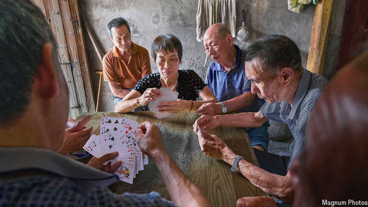

# Millions of Chinese people play guandan. Is that good or bad?

The Communist Party is torn on the merits of the popular card game

merit：优点；价值；

原文：

In America businessmen learn to play golf in order to fit in and foster

relationships. In China they learn *guandan*, a card game that has become a

staple of business meetings and banquets. Millions of Chinese people enjoy

it. “Eating without playing doesn’t count as a meal,” says one executive.

*Guandan*, which translates as “egg tossing” or “bomb tossing”, involves four

people in teams of two. Players try to shed their cards by forming various

combinations. The game can last for hours and usually involves a lot of chit-

chat.

在美国，商人学习打高尔夫球是为了适应和培养关系。在中国，他们学习“Guandan”，这是一种纸牌游戏，已经成为商务会议和宴会的主要内容。数百万中国人喜欢它。“吃饭不玩不算一顿饭，”一位高管表示。“Guandan”翻译过来就是“扔鸡蛋”或“扔炸弹”，四个人两人一组。玩家试图通过形成各种组合来出他们的牌。这个游戏会持续几个小时，通常会有很多闲聊。

学习：

card game：纸牌游戏

staple：主要产品；支柱产品；主要内容

business meeting：商务会议

banquets： 美 [ˈbæŋkwəts] 宴会；（banquet的复数）

tossing：投掷；抛向

egg tossing：guandan

shed：摆脱；丢弃；

chit-chat：闲谈；闲聊；聊天

原文：

*Guandan* is seen by some as a healthy and intellectual form of

entertainment. Business dinners and after-work activities tend to be less

boozy when the game is involved. Last year the national sports authority

organised the first nationwide *guandan* tournament. Officials talk of the

game’s potential to boost the economy (how is unclear) and become a

cultural export. Rumours abound that Communist Party leaders are fans.

一些人认为“Guandan”是一种健康和智力的娱乐形式。当涉及到游戏时，商务晚宴和下班后的活动往往不那么醉醺醺的。去年，国家体育局组织了第一届全国Guandan锦标赛。官员们谈到了这款游戏促进经济发展(具体方式尚不清楚)和成为文化输出的潜力。谣言四起，说共产党领导人是粉丝。

学习：

boozy：英 [ˈbuːzi] 嗜酒的；醉酒的

原文：

But not every party member likes *guandan*. Earlier this month the *Beijing*

*Youth Daily*, a mouthpiece of the city’s Communist Youth League, ran three

opinion pieces over three days criticising the “poisonous” game. One piece

implied that shady businessmen were using it to establish connections and

make corrupt deals. Another blasted the game for promoting a “lying-flat

culture”, slang for laziness. “The *guandan* addiction has become a social

phenomenon worthy of attention and vigilance,” said the paper.

但并不是每个党员都喜欢Guandan。本月早些时候，北京共青团的喉舌《北京青年报》在三天内发表了三篇评论文章，批评这种“有毒”的游戏。一篇文章暗示可疑的商人利用它来建立联系和进行腐败交易。另一个人抨击这款游戏提倡“平躺文化”，这是懒惰的俚语。该报称:“Guandan成瘾已经成为一种值得关注和警惕的社会现象。”。

学习：

party member：党员

mouthpiece：代言人；发言人；喉舌；

Communist Youth League：共青团

shady：英 [ˈʃeɪdi] 可疑的；非法的；不正当的；

establish connections：建立关系

make corrupt deals：进行腐败交易

blasted：猛烈抨击；猛攻；严厉批评；（blast的过去式和过去分词）

lying-flat culture：躺平

vigilance：英 [ˈvɪdʒɪləns] 警惕；警觉；机警；

原文：

The controversy appears to have rattled some in the public sector. Making

the rounds online are reports of civil servants being banned from hosting

*guandan* games and receiving notices to confess their playing history.

这场争论似乎让公共部门的一些人感到不安。网上流传的是公务员被禁止主持Guandan游戏并收到通知坦白他们的游戏历史的报道。

学习：

rattle：使窘迫不安；使惊慌失措；使恼火；激怒

civil servants：公务员

原文：

That has led supporters of the pastime to push back. A party newspaper in

Jiangsu, where *guandan* originated, has defended its benefits and

condemned the moral posturing of critics. Other papers have since chimed in

with similar commentaries. If corruption and laziness are problems, then

target the root causes, not *guandan*, say some. Or, as one headline put it:

“Oppose the game of throwing eggs? Stop talking nonsense!”■

这导致这项娱乐活动的支持者开始反击。Guandan发源地江苏的一份党报为其利益辩护，并谴责批评者的道德姿态。此后，其他报纸也附和了类似的评论。一些人说，如果腐败和懒惰是问题，那么就要针对根源，而不是Guandan。或者，正如一个标题所说:“反对Guandan游戏？别瞎说了！”■

学习：

pastime：娱乐活动；消遣；消遣方式

chime：美 [tʃaɪm]    鸣响；报时；（钟、乐器等）发出悦耳的声音；

## 后记

2024年8月27日16点26分于上海。

