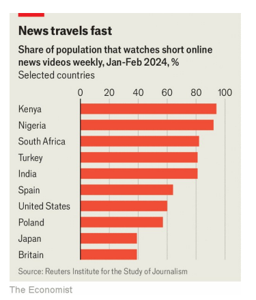

# YouTube in Africa offers a new kind of news

Demographics and the weakness of traditional media explain the rise of video news

原文：

Salam madior fall has been a pioneer more than once. In 1999, while

studying in America, he and a friend founded Seneweb, one of the first

websites devoted to news from Senegal, his home. By 2002 Seneweb was

the most visited news site in Francophone Africa. In the late 2000s, media

firms there still focused on satellite television. Mr Fall thought that setting

up “a fully-fledged TV channel would be going backwards”. So in 2012 he

started putting news videos on YouTube. Today, Seneweb’s headquarters in

Dakar has more than 100 employees, plans to expand across West Africa,

and has correspondents as far afield as Europe and America.

Salam madior fall不止一次成为先锋。1999年，当他在美国学习时，他和一个朋友创建了Seneweb，这是第一批致力于来自他的家乡塞内加尔的新闻的网站之一。到2002年，Seneweb是非洲法语区访问量最大的新闻网站。2000年代末，那里的媒体公司仍然专注于卫星电视。法尔先生认为建立“一个成熟的电视频道将会是一种倒退”。因此，2012年，他开始在YouTube上发布新闻视频。如今，Seneweb在达喀尔的总部拥有100多名员工，并计划扩展到整个西非，其记者远至欧洲和美洲。

学习：

Francophone：美 [ˈfræŋkəˌfoʊn] 讲法语的；法语区的；使用法语的

fully-fledged：成熟的

afield：在远处地；在野外；在田野；在远处

原文：

Growing numbers of people get their news via videos on social networks

such as TikTok, Instagram and—above all—YouTube. That is particularly

true in the global south—and especially in Africa (see chart), according to

research by the Reuters Institute for the Study of Journalism, a research

centre and think-tank at Oxford University. More people in Kenya get their

news from YouTube than those in any other country surveyed by the

institute. “The trends in media consumption which people say are coming to

the West are already well under way in the global south,” notes Nic Newman

of the Reuters Institute.

越来越多的人通过TikTok、Instagram，尤其是YouTube等社交网络上的视频获取新闻。根据牛津大学的研究中心和智囊团——路透社新闻研究所的研究，这在南半球尤其如此，尤其是在非洲(见图表)。在该研究所的调查中，肯尼亚从YouTube上获取新闻的人比任何其他国家的人都多。“人们所说的西方媒体消费趋势已经在全球南部展开，”路透社研究所的尼克·纽曼指出。

原文：

YouTube’s appeal makes sense in a youthful continent with relatively low

literacy rates. The rapid spread of smartphones and cheap mobile-internet

access across Africa in recent years has also helped. Between 2014 and 2021

the share of Africans getting their news from social media or the internet at

least a few times a week almost doubled, according to Afrobarometer, a

pollster. When the Oromia Media Network, an influential news outlet run by

diaspora Ethiopians, was launched a decade ago, “satellite broadcasting was

number one”, recalls its founder, Jawar Mohammed. Once people would

gather around one television to watch together. Now everyone can watch the

news alone on their phones, notes Mor Talla Gaye, a prominent journalist

formerly of TFM, a Senegalese TV network with 2.7m YouTube subscribers.

That is liberating for viewers who can seek out a variety of perspectives.

在这个识字率相对较低的年轻大陆，YouTube的吸引力是有道理的。近年来智能手机和廉价移动互联网接入在非洲的迅速普及也起到了帮助作用。根据民意调查机构Afrobarometer的数据，2014年至2021年间，每周至少几次从社交媒体或互联网上获取新闻的非洲人比例几乎翻了一番。十年前，由散居在外的埃塞俄比亚人经营的颇具影响力的新闻媒体Oromia Media Network成立时，其创始人贾瓦尔·穆罕默德(Jawar Mohammed)回忆道，“卫星广播是第一名”。从前，人们会围坐在一台电视机前一起看电视。“现在每个人都可以单独在手机上看新闻,”Mor Talla Gaye说道，他是一名杰出的记者，曾在TFM工作，这是一家拥有270万YouTube用户的塞内加尔电视网络。这对于可以寻求各种视角的观众来说是一种解放。

学习：

literacy rate：识字率

原文：

People like and trust news on YouTube in places where traditional media

outlets are either unreliable or weak. Kenya, unlike several of its neighbours,

has many feisty independent broadcasters. But even there, “there is a

perception that things the government doesn’t want you to know, you can

find on YouTube”, says Catherine Gicheru, director of the Africa Women

Journalism Project in Kenya. Officials leant on part of the Kenyan

Broadcasting Corporation to try to prevent live footage of anti-government

protests being shown on television. At least one station capitulated. But

footage of the demonstrations was freely available on YouTube.

在传统媒体渠道不可靠或薄弱的地方，人们喜欢并信任YouTube上的新闻。肯尼亚不像它的几个邻国，有许多活跃的独立广播公司。但即使在那里，“也有一种感觉，政府不想让你知道的事情，你可以在YouTube上找到”，肯尼亚非洲妇女新闻项目主任凯瑟琳·吉切鲁说。官员们向肯尼亚广播公司施压，试图阻止反政府抗议的直播画面在电视上播放。至少有一家电视台投降了。但是示威游行的录像可以在YouTube上免费获得。

学习：

feisty： 英 [ˈfʌɪsti] 有闯劲的；活跃的

perception：美 [pərˈsepʃn] 感知；认识；感觉

capitulate：英 [kəˈpɪtjʊleɪt]  投降；屈服；让步；

demonstrations：游行示威；（demonstration的复数）

原文：

In countries where most people would struggle to afford a paid subscription,

and where rich advertisers are scarce, YouTube offers media startups a path

to financial viability. Setting up a TV channel is expensive and takes an age;

establishing one on YouTube is cheap and almost instant. Once they get a

certain number of viewers, the platform gives content-producers a cut of

future advertising revenues. Yayesaw Shimelis started Ethio Forum, a

YouTube channel, in 2019; he says he was making money within weeks.

Today it is among the most widely watched Ethiopian news channels on the

platform, generating tens of thousands of dollars a month. Crucially, because

many of its viewers are Ethiopians living in the West, it attracts advertising

from big American firms, says Yayesaw.

在大多数人难以负担付费订阅、富有广告商稀缺的国家，YouTube为媒体初创公司提供了一条财务可行性之路。建立一个电视频道费用昂贵，需要一个时代；在YouTube上建立一个网站既便宜又快捷。一旦他们获得了一定数量的观众，该平台会给内容制作者未来广告收入的分成。Yayesaw Shimelis于2019年创办了YouTube频道Ethio Forum他说他在几周内就开始赚钱了。如今，它是该平台上最受关注的埃塞俄比亚新闻频道之一，每月创收数万美元。重要的是，因为它的许多观众是生活在西方的埃塞俄比亚人，它吸引了美国大公司的广告，Yayesaw说。

学习：

financial viability：财务上可行

原文：

There are snags. One is that YouTube does not allow producers in many

African countries to receive advertising revenue through its “partner

programme”. Another is that its algorithm, which determines how much one

can earn on any given day, is “a game with many moving parts”, says Eric

Latiff, a Kenyan journalist. Making real money means keeping up a regular

stream of videos, often to the detriment of quality. Even then, revenue can be

volatile. Sajid Nadeem is a freelance Pakistani journalist who uses open

source intelligence to cover global conflicts. When he covered Ethiopia’s

civil war in 2021 viewership of his show was so high at its peak he earned

$10,000 per month. After the war ended that fell by more than half.

有障碍。一是YouTube不允许许多非洲国家的制作人通过其“合作伙伴计划”获得广告收入。另一个原因是它的算法决定了一个人在任何一天能挣多少钱，肯尼亚记者Eric Latiff说，这是一个“有许多移动部分的游戏”。赚真金白银意味着保持定期的视频流，通常会损害质量。即便如此，收入也可能不稳定。赛义德·纳迪姆是一名巴基斯坦自由记者，他利用公开来源的情报报道全球冲突。当他在2021年报道埃塞俄比亚内战时，他的节目的收视率如此之高，以至于他每个月能挣1万美元。战争结束后下降了一大半。

学习：

snag：障碍；（尤指潜在的、意外的、不严重的）问题；困难

detriment：美 [ˈdetrɪmənt] 损害；伤害；损失

detriment of quality：损害质量

volatile：英 [ˈvɒlətaɪl] 不稳定的

revenue is volatile：收入不稳定

freelance：自由职业的；独立的；非正式雇佣的；

viewership：（电视节目或频道的）观众人数；观众类型；收视率

原文：

Despite the successes, few African journalists will get rich on YouTube.

Like reporters in India, another place where YouTube is booming, they

struggle to reach audiences on the scale of traditional news channels. Yet on

a continent where press freedom has declined of late, YouTube’s growth is a

“game-changer”, says Yayesaw of Ethio Forum. “Africa’s most brutal

regimes cannot control it.” ■

尽管取得了成功，但很少有非洲记者会在YouTube上发财。就像YouTube蓬勃发展的另一个地方印度的记者一样，他们很难接触到传统新闻频道规模的观众。然而，埃塞俄比亚论坛的Yayesaw说，在一个近来新闻自由下降的非洲大陆，YouTube的增长是一个“游戏规则改变者”。■

## 后记

2024年8月28日13点44分于上海。

