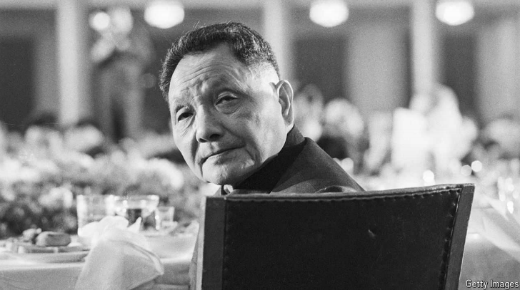

# Deng Xiaoping envy

Xi Jinping tries to claim the mantle of his predecessor

mantle：责任；使命；衣钵

claim the mantle：继承衣钵

原文：

DENG XIAOPING was barely five feet tall, but China’s late ruler was a

political giant. He was a leading figure in the Communist revolution and a

hard-nosed Leninist. Yet, as ruler, he launched market-oriented reforms and

opened China up to the world. On August 22nd, the 120th anniversary of

Deng’s birth, China’s current leader, Xi Jinping, lauded his “extraordinary

life”.

邓小平只有五英尺高，但中国已故的统治者是一个政治巨人。他是共产主义革命的主要人物，也是一个顽强的列宁主义者。然而，作为统治者，他启动了以市场为导向的改革，让中国向世界开放。8月22日，邓诞辰120周年，中国现任领导人称赞他“非凡的一生”。

学习：

hard-nosed：顽强的；不屈不挠的；实际的；

lauded：赞美；称赞；（laud的过去式）          

原文：

As if grabbing Deng’s mantle, Mr Xi also said that China should deepen its

commitment to the reform-and-opening agenda. That has led to grumbling

from many observers. Much of what Mr Xi has done during his 12 years in

power flies in the face of Deng’s legacy

仿佛是在继承邓小平的衣钵，Xi还表示，中国应该深化改革开放。这引起了许多观察家的抱怨。Xi执政12年期间所做的许多事情都与邓小平的遗产背道而驰

学习：

grab xxx mantle：继承衣钵

grumbling：牢骚；抱怨

in the face of：在…面前；尽管；不顾；

原文：

Deng’s most important reform was to reduce the role of the state in the

economy and encourage private enterprise. The party should allow “some

people to get rich first”, he said. Compare that with Mr Xi, who has reined in

market forces and reinstituted a state-dominated growth model. His

“common prosperity” campaign aims to chasten billionaires and reduce

inequality.

邓小平最重要的改革是减少国家在经济中的作用，鼓励私营企业。他说，党应该允许“一部分人先富起来”。相比之下，Xi遏制了市场力量，重新建立了国家主导的增长模式。他的“共同繁荣”运动旨在抑制亿万富翁，减少不平等。

学习：

common prosperity：共同富裕

chasten：美 [ˈtʃeɪs(ə)n] 惩戒；抑制

原文：

Differences between the two leaders can also be seen in the political realm.

Deng called for separation in the functions of the Communist Party and the

government. He also extolled the notion of “collective leadership”, with big

decisions made by consensus. Mr Xi, in contrast, has reimposed one-man

rule. The party, meanwhile, is an ever-growing presence in everyday life.

两位领导人之间的分歧也可以在政治领域看到。邓呼吁将共产党和政府的职能分开。他还赞扬了“集体领导”的理念，即重大决策要通过协商一致做出。相比之下，Xi重新实施了一人统治。与此同时，party在日常生活中的存在越来越多。

学习：

extolled：美 [ɪkˈstəʊld] 赞颂；（extol的过去式和过去分词）

原文：

When Deng was in charge, China was still poor and relatively weak. So, in

foreign affairs, he argued for keeping a low profile. Now China is more

powerful—and Mr Xi more assertive. Deng’s eldest son, Deng Pufang, made

headlines in 2018 with a speech that was widely seen as an attack on Mr

Xi’s increasingly ambitious foreign policy. China should “know its place” in

the world and not be “overbearing”, he said.

当邓掌权时，中国仍然贫穷且相对弱小。因此，在外交事务上，他主张保持低调。现在中国更加强大，Xi先生也更加自信。2018年，邓小平的长子Deng Pufang因一篇演讲登上头条，这篇演讲被广泛视为对Xi日益雄心勃勃的外交政策的攻击。他说，中国应该“知道自己在世界上的位置”，不要“专横”。

学习：

assertive：自信的；坚定的；坚定自信的

原文：

In one area, at least, Mr Xi is aligned with Deng. The late ruler reportedly

thought Mikhail Gorbachev was an “idiot” for allowing the Soviet

Communist Party to lose its grip on power. In 1989, when confronted with

big pro-democracy protests in Tiananmen Square, Deng ordered troops to

crush the demonstrations, at the cost of hundreds if not thousands of lives.

原文：

Chinese leaders seldom talk about that episode. But Mr Xi made an

exception in his remarks on August 22nd. “At the critical juncture, Comrade

Deng Xiaoping led the party and the people to stand firmly against turmoil

and resolutely defend the power of the socialist state.” Few doubt that Mr

Xi, if faced with a similar challenge to the party’s rule, would act as

forcefully. ■

中国领导人很少谈论那段插曲。但是Xi先生在8月22日的讲话中破例了。“在危急关头，邓小平同志带领党和人民坚决反对动乱，坚决捍卫社会主义国家的政权。”很少有人怀疑，如果Xi面临对该党统治的类似挑战，他会采取同样强有力的行动。■

学习：

juncture：关键时刻；时机；危急关头

## 后记

2024年8月30日17点51分于上海。本文仅用于学习英文，不涉及政治立场。