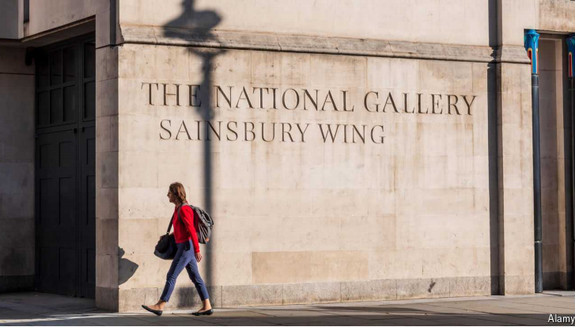
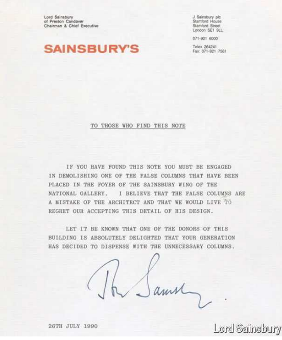

# John Sainsbury, a donor to the National Gallery, had the last laugh

A hidden letter offers an insight into disputes between artists and patrons

patron：赞助人

The National Gallery： （英国）国家美术馆

原文：

THE TIME-CAPSULE letter from 1990 was written in passionate all-caps.

Unearthed during a renovation of the Sainsbury Wing of the National

Gallery in London, it denounced the ornamental column within which it was

hidden as “A MISTAKE”. The author was “ABSOLUTELY DELIGHTED”

that, since his letter had been discovered, the column and its twin must have

been demolished.

这封来自1990年的时间胶囊信是用充满激情的全大写字母写的。在伦敦国家美术馆的Sainsbury Wing的一次翻修中出土，它谴责藏在里面的装饰性柱子是“一个错误”。作者“非常高兴”,因为他的信被发现了，柱子和它的孪生兄弟一定被拆除了。

学习：

capsule：美 [ˈkæpsl] 胶囊；太空舱；航天舱

time capsule：时间胶囊

all caps：全大写

unearthed：采掘出的；发掘；破获；（unearth的过去分词）          

denounced：谴责；告发；揭发；通告废除；（denounce的过去分词）          

ornamental：装饰性的；点缀的；美化的；

column：柱子

demolished：推翻；拆毁；吃光；破坏；（demolish的过去分词）          

原文：

The writer was John Sainsbury of the supermarket Sainsbury’s—who, with

his brothers, paid for the construction of the new wing, with its high-concept

design. It opened in 1991; he died in 2022. His newly publicised note is an

elegant solution to an age-old problem: what to do when artists’ visions

clash with their patrons’ tastes?

作者是超市Sainsbury's的约翰·塞恩斯伯里(John Sainsbury)——他和他的兄弟们出资建造了新侧楼，采用了高概念设计。它于1991年开业；他于2022年去世。他最新公开的笔记是对一个古老问题的优雅解决方案:当艺术家的视觉和他们赞助人的品味发生冲突时该怎么办？

学习：

wing：侧厅

publicised：宣传；公布；宣扬；推广；（publicise的过去式和过去分词）

age-old：古老的；古代的；陈旧的

## Getting the last laugh

原文：

Some well-off sponsors indulge the avant-garde urges of creative types. But

others want a version of something they have seen before. Because so much

cash is involved, in architecture they generally get it. Even Frank Lloyd

Wright humoured clients who wanted fuddy-duddy features such as closets.

The stakes can be higher than a paycheck. Legend has it that, offered two

designs for the Hotel Moskva near the Kremlin, Stalin approved both. No

one was keen to point out his mistake, so it was built with an asymmetric

façade.

一些富裕的赞助商顺应创意类型的前卫冲动。但是其他人想要他们以前见过的东西的一个版本。因为涉及到大量的现金，所以在建筑领域，他们通常都能得到。就连弗兰克·劳埃德·赖特也迎合了那些想要衣橱等过时功能的客户。赌注可能比薪水更高。传说，斯大林为克里姆林宫附近的莫斯科夫酒店提供了两个设计方案，两个都通过了。没有人热衷于指出他的错误，所以它建了一个不对称的外墙。

学习：

indulge：迎合；顺应（某人的愿望、习惯等）；

avant-garde：美 [ˌævɑntˈɡɑrd] 先锋派；前卫派；先锋艺术；前卫艺术；

urges：推动力；冲动；强烈的欲望；（urge的复数）

humour：纵容；迁就；迎合；

fuddy-duddy：守旧的人；老古板；老顽固；保守的人；

closet：壁橱；厕所；

paycheck：薪水；付薪水的支票          

facade：门面

原文：

Portraiture is a combustible art form, for reasons of vanity more than

technique. For centuries portrait artists to monarchs and Medicis strove to

draw a tricky line between flattery and verisimilitude. Charles V, a Holy

Roman Emperor, leant on Titian to tweak the nose in a picture of his

deceased empress. More recently the power has swung to celebrity painters:

Lucian Freud added the head of a male assistant to his portrait of Jerry Hall,

a model and actor, complaining she had missed sittings.

肖像画是一种易燃的艺术形式，更多的是出于虚荣心而不是技巧。几个世纪以来，君主和美第奇家族的肖像艺术家努力在奉承和逼真之间划出一条微妙的界限。神圣罗马帝国的皇帝查理五世要求提香修改他已故皇后的鼻子。最近，权力转向了名人画家:吕西安·弗洛伊德在自己为模特兼演员杰瑞·霍尔画的肖像上加了一个男助手的头像，抱怨她错过了坐下作画。

学习：

portraiture：美 [ˈpɔrtrɪtʃɛr] 肖像；画像；照片；肖像画艺术

combustible：英 [kəmˈbʌstɪb(ə)l] 易燃的；可燃的；易着火的

vanity：虚荣；空虚

monarchs：英 [ˈmɒnəks] 君主；帝王；（monarch的复数）

strove：努力；奋斗；尽力；力求；（strive的过去式）          

flattery：奉承；阿谀；恭维；

verisimilitude：英 [ˌvɛrɪsɪˈmɪlɪtjuːd] 逼真；貌似真实；逼真性；真实性；似真

deceased：已故的；去世的；死去的；

empress：美 [ˈemprəs] 女皇；皇后；帝后；

Titian：提香（意大利文艺复兴时期画家）

sittings:  模特坐下来让艺术家为其画像的过程或时段

>在这段话中，**"tweak the nose"** 指的是对肖像中的某些细节进行微调或修饰，以达到理想的效果。在这句话中，查理五世要求提香修改他已故皇后的鼻子，目的是为了更符合他的期望或更讨人喜欢。**"sittings"** 则是指模特坐下来让艺术家为其画像的过程或时段。
>
>**例子:**
>
>1. **Tweak the nose:**
>   - **英文:** The artist was asked to tweak the nose in the portrait to make it slightly more delicate.
>   - **中文:** 艺术家被要求稍微调整一下肖像中的鼻子，使其看起来更为精致。
>
>2. **Sittings:**
>   - **英文:** The portrait required multiple sittings to capture every detail of the subject's face.
>   - **中文:** 这幅肖像需要多次坐下作画，以捕捉对象面部的每一个细节。

原文：

Artists and customers often row prosaically over late deliveries or payments.

But some disputes are political. Asked to paint a mural in Rockefeller Centre

in New York, Diego Rivera sneaked in an image of Lenin. The painting was

destroyed, but Rivera had his revenge: in a replica he included a likeness of

John Rockefeller junior, a teetotaller, boozing in a nightclub. Michelangelo

immortalised Vatican bigwigs he disliked in the Sistine Chapel. The face of

an official appears in hell; a cherub makes an obscene gesture at a pope.

艺术家和顾客经常平淡无奇地为延迟交货或付款而争吵。但有些争议是政治性的。迭戈·里维拉被要求在洛克斐勒中心画一幅壁画，他偷偷画了一幅列宁像。这幅画被毁了，但里维拉报了仇:在一幅复制品中，他画了一幅约翰·洛克菲勒二世的肖像，他是一个滴酒不沾的人，正在一家夜总会里狂饮。米开朗基罗让他不喜欢的梵蒂冈要人在西斯廷教堂永垂不朽。一个官员的脸出现在地狱；一个小天使向教皇做了一个不雅的手势。

学习：

row：争吵

prosaically：美 [prə'zeɪɪklɪ] 散文式地；平凡地

mural：壁画；墙画

sneaked：偷偷摸摸地做；（sneak的过去式）

likeness：肖像；画像；

teetotaller：美 [ˌtiˈtoʊtlər] 禁酒者；滴酒不沾的人；

boozing：豪饮；痛饮；（booze的现在分词形式）

cherub：美 [ˈtʃɛrəb] 小天使（常被绘为有翅膀的胖男孩）；可爱的儿童

obscene：美 [əbˈsiːn] 淫秽的；下流的；猥亵的；不雅的；

原文：

A famous instance of a maestro’s taste outstripping his master’s came at the

premiere of “The Abduction from the Seraglio”, an opera. Emperor Joseph

II is said to have commented that there were “too many notes, dear Mozart”.

(“Just as many as necessary,” the composer replied.) Poets have overdone it

sometimes, too. Ovid toadied up to the emperor Augustus, but still wound

up in exile on the Black Sea, probably because of his erotic verse.

“Corporeal friends are spiritual enemies,” griped William Blake, forced to

subordinate his genius to his patron’s pet projects.

一个著名的艺术家品味超过客人的例子出现在歌剧《从宫殿被绑架》的首演上。据说约瑟夫二世皇帝评论说“音符太多了，亲爱的莫札特”。(“需要多少就有多少，”作曲家回答。)诗人有时也做得过火了。奥维德向奥古斯都皇帝献媚，但仍然被流放到黑海，可能是因为他的色情诗。“肉体上的朋友是精神上的敌人，”威廉·布莱克抱怨道，他被迫将自己的天才置于他赞助人的宠爱的项目之下。

学习：

maestro：美 [ˈmaɪstroʊ] 大师；音乐大师；艺术家；指挥家

outstripping：超过；跑过；比…跑得快；（outstrip的现在分词）          

premiere：美 [prɪˈmɪr] 首映式；首次公演；首演

abduction： 英 [əbˈdʌkʃn] 绑架；劫持

seraglio：英 [sɛˈrɑːlɪəʊ] 后宫；闺房；宫殿；伊斯兰教宫廷；

toadied：谄媚；（toady的过去式）          

wound up：以…告终 （wind up的过去式和过去分词）          

exile：美 [ˈeksaɪl] 流放，流亡

erotic：美 [əˈrɑdɪk] 色情的；

verse：诗；诗歌；韵文；诗句

corporeal：美 [kɔrˈpɔriəl] 肉体的；身体的；

griped：抱怨；发牢骚；（gripe的过去式和过去分词）          

原文：

Like Blake, some innovative artists are vindicated by posterity. But in their

lifetimes many have felt thwarted by their paymasters’ demands, venting

their frustrations in grumpy letters or small gestures of rebellion. The

defunct columns in the National Gallery are a heartening example of the

reverse. The architects got their way—but Sainsbury had the witty last word.■

像布莱克一样，一些创新的艺术家被后人证明是正确的。但在他们的一生中，许多人感到被他们的雇主的要求所阻挠，通过暴躁的信件或小小的反抗姿态来发泄他们的沮丧。国家美术馆中废弃的圆柱是一个令人振奋的反面例子。建筑师们如愿以偿——但塞恩斯伯里笑到了最后。■

学习：

vindicate：美 [ˈvɪndəˌkeɪt]  证明…是清白的；证明…是正确的

posterity：美 [pɑːˈsterəti] 后代；子孙；后世

thwarted：挫败；阻碍；反对；横过；（thwart的过去式和过去分词）

paymaster：支付人；付款人；资助者

venting：表达；（vent的现在分词形式）

grumpy：闹脾气的；爱发牢骚的；抱怨的；

defunct：过时的；不再存在的；已废止的；

heartening example：令人振奋的例子

## 后记

2024年8月31日16点35分于上海。

