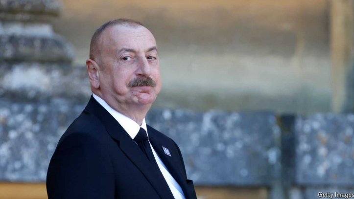

# Azerbaijan’s government turns on its critics at home

The war with Armenia has ended in victory, so the regime needs another target

turn on: 转而对付，攻击

>这里的“turn on”意思是“转而对付”或“攻击”，表示阿塞拜疆政府在战争胜利后把注意力转向了国内的批评者。可以理解为“开始敌对”或“采取行动打击”他们。
>
>举例：  
>- After the war ended, the government **turned on** its own people, silencing any dissent.  
>战争结束后，政府转而对付自己的人民，压制任何反对声音。

原文：

Bahruz Samadov, a young Azerbaijani academic and writer, was arrested on

August 21st. He has since been charged with treason, reportedly because he

had written critical pieces about the country’s conflict with Armenia. His

arrest was quickly followed by that of another peace activist, Samad Shikhi.

These are the latest markers in a harsh and growing crackdown on the few

remaining independent voices in the country.

Bahruz Samadov，一位年轻的阿塞拜疆学者和作家，于8月21日被捕。此后，他被指控犯有叛国罪，据说是因为他写了关于该国与亚美尼亚冲突的批评文章。他被捕后，另一名和平活动家Samad Shikhi很快被捕。这些都是对该国仅存的少数独立声音进行严厉和不断加强的镇压的最新标志。

学习：

academic：学者

treason：美 [ˈtriːzn] 叛国；叛国罪；

原文：

The arrests took place in the run-up to a general election on September 1st,

which the ruling party, led by Azerbaijan’s autocratic president, Ilham

Aliyev, will again dominate. No one expects the balloting to be free. The

main opposition party is boycotting it, saying it will be a charade.

逮捕发生在9月1日大选的准备阶段，由阿塞拜疆独裁总统伊尔哈姆·阿利耶夫领导的执政党将再次占据主导地位。没有人期望投票是免费的。主要的反对党正在抵制它，称它将是一场骗局。

学习：

charade： 美 [ʃəˈreɪd] 骗局；做戏；伪装；戏剧性的模仿

原文：

Azerbaijan’s opposition had long hoped that the country would open up after

its war with Armenia ended. Optimistic reformers argued that the

authoritarian system was the result of the war footing the government had

been forced to adopt in the 1990s after losing a big chunk of territory,

including the enclave of Nagorno-Karabakh, to the Armenians. In a series of

offensives between 2020 and 2023, Azerbaijan managed to take back all of

the land it had previously lost. But if anything this has empowered Mr

Aliyev to go after his enemies at home even more vigorously.

阿塞拜疆反对派早就希望该国在与亚美尼亚的战争结束后能够开放。乐观的改革者认为，威权体制是政府在20世纪90年代被迫采取的战争立场的结果，当时政府将包括纳戈尔诺-卡拉巴赫飞地在内的大片领土拱手让给了亚美尼亚人。在2020年至2023年的一系列攻势中，阿塞拜疆设法夺回了它以前失去的所有土地。但是，如果说有什么不同的话，那就是这让阿利耶夫先生能够更加积极地打击国内的敌人。

学习：

enclave：美 [ˈɛnˌkleɪv] 飞地；

go after enemies: 追击敌人，打击敌人

原文：

Others bet that outside pressure would persuade Azerbaijan to put on a

friendly face. After Russia’s full-scale invasion of Ukraine, Azerbaijan

signed an agreement to provide much-needed natural gas to the European

Union—a club that, in theory, puts human rights at the heart of its foreign

policy. And in November, Baku, Azerbaijan’s capital, will host the COP29

climate summit.

其他人打赌外部压力会说服阿塞拜疆摆出友好的面孔。在俄罗斯全面入侵乌克兰后，阿塞拜疆签署了一项协议，向欧盟提供急需的天然气——从理论上讲，这个俱乐部将人权置于其外交政策的核心。11月，阿塞拜疆首都巴库将主办COP29气候峰会。

学习：

outside pressure：外部压力

full-scale：全幅的；全范围的          

原文：

Yet the repression keeps on getting worse. Late last year several journalists

from Abzas Media, an investigative news website, were arrested and hit with

trumped-up charges of financial crimes; they are still behind bars. Another

prominent political activist, Anar Mammadli, was arrested in April and

charged with similarly spurious offences. Now it is the turn of Mr Samadov

and Mr Shikhi.

然而，压制越来越严重。去年年底，调查性新闻网站Abzas Media的几名记者被逮捕，并受到捏造的金融犯罪指控的打击；他们仍在狱中。另一位著名的政治活动家Anar Mammadli于4月被捕，并被指控犯有类似的虚假罪行。现在轮到萨马多夫先生和希基先生了。

学习：

trumped-up：捏造的；伪造的          

behind bars：在监狱中；坐牢；被关押；被囚禁          

spurious：虚假的；假冒的；伪造的；

offences：犯罪；违法行为；（offence的复数）

原文：

Whatever leverage the outside world may once have had for influencing

Azerbaijan has disappeared, as the country has become deeply involved in

the sharpening conflict between Russia and the West. “[Mr Aliyev] thinks

that he can push red lines further and further because everybody now needs

him,” says Altay Goyushov, head of the Baku Research Institute, a think

tank. “They don’t want to spoil relations with him.” Mr Goyushov himself

recently left the country. “I knew that my turn could be coming,” he says.

随着阿塞拜疆深深卷入俄罗斯和西方之间日益加剧的冲突，外部世界曾经对阿塞拜疆施加影响的任何影响力都已经消失。智囊团巴库研究院的负责人Altay Goyushov说:“(阿利耶夫先生)认为他可以将红线越拉越远，因为现在每个人都需要他。”。"他们不想破坏与他的关系。"Goyushov先生本人最近离开了该国。“我知道可能会轮到我，”他说。

学习：

spoil：破坏；损害；毁坏

spoil relations with：破坏关系

原文：

Defeating Armenia militarily means Mr Aliyev needs a new enemy. Few

know this better than Mr Samadov, a doctoral student researching

“authoritarianism and the logic of exclusion in Azerbaijan”. In a 2021 essay

he described how the state demonises Armenians and domestic critics in

parallel fashion: “The enemy, internal or external, must be eliminated.” ■

军事上击败亚美尼亚意味着阿利耶夫需要一个新的敌人。很少有人比Samadov先生更了解这一点，他是一名博士生，研究“阿塞拜疆的独裁主义和排斥逻辑”。在2021年的一篇文章中，他描述了国家如何同时妖魔化亚美尼亚人和国内批评人士:“无论是内部还是外部的敌人，都必须消灭。”■

学习：

doctoral：博士的；博士学位的；博士研究的          

## 后记

2024年9月5日19点36分于上海。

