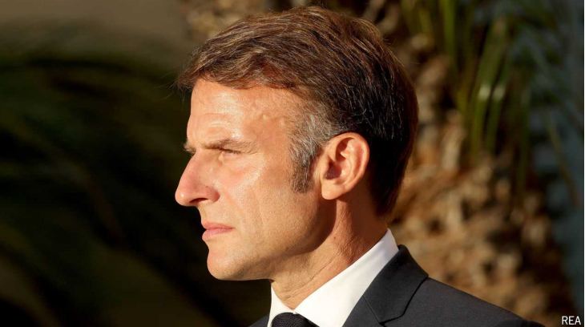

# France seeks a new government

Emmanuel Macron’s long-running recruitment drive

recruitment：美 [rɪˈkruːtmənt] 招聘；招募；招收；

原文：

Almost eight weeks after an inconclusive legislative vote, France is still

struggling to put together a new government. In other European countries,

used to stitching together painstaking coalition deals between rivalrous

political parties, this would be unremarkable. In 2017-18 it took Germany

nearly six months, and even longer in the Netherlands earlier this year. But

for France, which cherishes the stability that its Fifth Republic has brought

since it was established in 1958, this hiatus is unprecedented. It reflects a

failure to treat compromise as anything other than capitulation, and will

render the new prime minister’s task unusually challenging.

在无结果的立法投票近八周后，法国仍在努力组建新政府。在其他欧洲国家，习惯于在相互竞争的政党之间拼凑艰苦的联盟协议，这将是不足为奇的。在2017-18年，德国花了近6个月的时间，今年早些时候，荷兰甚至花了更长时间。但对于珍视第五共和国自1958年成立以来所带来的稳定的法国来说，这种间断是前所未有的。这反映出除了投降之外，没有将妥协视为其他任何事情，这将使新总理的任务异常具有挑战性。

学习：

painstaking：费尽心思的；

rivalrous： 美 [ˈraɪvəlrəs] 竞争的；对抗的；有竞争性的；

hiatus：美 [haɪˈeɪdəs] 间隙；裂缝；断层；空白期；

capitulation：英 [kəpɪtjʊˈleɪʃ(ə)n] 投降；屈服；降服

render：使

原文：

France has been run by a caretaker government since July 16th, when the

outgoing prime minister, Gabriel Attal, formally resigned, staying on to

oversee the hugely successful Paris Olympic games. As *The Economist* went

to press on August 29th, President Emmanuel Macron had yet to name a

new prime minister, a decision that the constitution puts in his hands. No

single parliamentary bloc—including the left-wing New Popular Front (NFP),

Mr Macron’s centrists and Marine Le Pen’s hard right—won anything close

to a majority in the 577-seat National Assembly. In July, therefore, Mr

Macron called on political parties to try to forge a compromise that might

lead to a cross-party government.

7月16日，即将离任的总理加布里埃尔·阿塔尔正式辞职，留下来监督取得巨大成功的巴黎奥运会，此后法国一直由看守政府管理。8月29日《经济学人》付印时，埃马纽埃尔·马克龙总统尚未任命新总理，这是宪法赋予他的决定权。没有一个议会集团——包括左翼的新人民阵线(NFP)、马克龙的中间派和马林·勒·庞的极右翼——在577个席位的国民议会中赢得任何接近多数的席位。因此，马克龙在7月份呼吁各政党努力达成妥协，这可能会导致一个跨党派政府。

学习：

outgoing：即将离职的；即将离任的

原文：

Nothing of the sort has taken place. Instead the NFP has dug in its heels. With

193 seats, it is the biggest bloc in the lower house, though still 96 seats short

of a majority. An alliance that reaches from Jean-Luc Mélenchon’s radical

Unsubmissive France (LFI) to moderate pro-European Socialists, it did

manage to agree on a joint candidate for prime minister: Lucie Castets, a

senior civil servant at the Paris town hall. All summer the NFP has insisted that

it won the elections, that it can govern alone, and that it has no intention of

compromising on its tax-and-spend manifesto pledges. This was the message

it conveyed to Mr Macron, who met its leaders, along with Ms Castets, on

August 23rd.

这种事情没有发生。相反，NFP坚持己见。它拥有193个席位，是下议院中最大的集团，尽管离多数席位还差96个席位。从让-吕克·梅伦琼的激进的不屈服的法兰西(LFI)到温和的亲欧洲的社会主义者的联盟，它确实设法就总理的联合候选人达成一致:露西·卡斯特，巴黎市政厅的高级公务员。整个夏天，NFP都坚称自己赢得了选举，可以独立执政，并且无意在税收和支出宣言承诺上妥协。这是它传达给马克龙先生的信息，马克龙先生在8月23日会见了它的领导人以及卡斯特女士。

学习：
civil servant：公务员

dig in its heels：“坚持立场”或“顽固不妥协”

>这里的“dig in its heels”意思是“坚持立场”或“顽固不妥协”。表示NFP坚决不改变他们的立场或策略，即便面对压力或批评。
>
>举例：  
>- The company **dug in its heels** during negotiations and refused to lower its prices.  
>在谈判中，公司坚持立场，拒绝降价。

原文：

The president could have decided to offer Ms Castets the job anyway,

knowing that she would probably be swiftly toppled by a vote of no

confidence in parliament. That would at least have had the merit of

demonstrating the NFP’s relative weakness, and the lack of parliamentary

support for its programme. Instead, Mr Macron decided to take that putative

defeat as given. Three days after meeting its leaders he ruled out naming an

NFP government. His aides argue that he is acting according to his

constitutional duty to ensure “institutional stability”. The NFP instantly accused

Mr Macron of undermining democracy and abusing his presidential powers.

The LFI is organising a protest march on September 7th. Mr Mélenchon has

called for the president to be impeached.

总统本可以决定给卡斯特女士这份工作，因为他知道她可能会被议会的不信任投票迅速推翻。这至少有助于展示NFP的相对弱势，以及其计划缺乏议会支持。相反，马克龙决定接受这场假定的失败。会见其领导人三天后，他排除了任命NFP政府的可能性。他的助手辩称，他是根据宪法职责行事，以确保“机构稳定”。NFP立即指责马克龙破坏民主，滥用总统权力。LFI正在组织9月7日的抗议游行。梅伦雄先生呼吁弹劾总统。

学习：

toppled：使倒塌；推翻；（topple的过去式）

putative：公认的；认定的；推定的

aide：助手

原文：

Mr Macron has now embarked on fresh talks, in search of a figure who

could command enough respect. Among new leaders being summoned to the

Elysée palace are Carole Delga, the moderate Socialist leader of the

Occitanie region in the south of France, and David Lisnard, the centre-right

mayor of Cannes. Speculation in Paris swirls around other senior figures too.

Those on the left include Bernard Cazeneuve (a former Socialist prime

minister), Didier Migaud (a former Socialist MP, now head of a public

transparency watchdog) and Pierre Moscovici (a former Socialist finance

minister, now head of the national audit body). Others hail from the right,

including Michel Barnier (a former European commissioner), Xavier

Bertrand (head of the Hauts-de-France region) and Christine Lagarde (head

of the European Central Bank). The French seem simply baffled. A poll in

August suggested that the most popular choice for a new prime minister was

the caretaker incumbent, Mr Attal.

马克龙现在已经开始新的谈判，寻找一个能够赢得足够尊重的人物。被召唤到爱丽舍宫的新领导人包括法国南部奥西塔尼地区的温和社会党领袖卡罗尔·德尔加和戛纳中右翼市长大卫·利斯纳德。巴黎的猜测也围绕着其他高层人物。左派人士包括伯纳德·卡泽纳夫(前社会党总理)、迪迪埃·米高德(前社会党议员，现公共透明度监察机构负责人)和皮埃尔·莫斯科维奇(前社会党财政部长，现国家审计机构负责人)。其他人来自右翼，包括米歇尔·巴尼耶(前欧盟专员)、泽维尔·贝特朗(上法兰西大区主席)和克里斯蒂娜·拉加德(欧洲中央银行行长)。法国人似乎很困惑。八月份的一项民意调查显示，现任看守政府总理阿塔尔是最受欢迎的新总理人选。

学习：

embark on：开启

summoned：传唤；召唤；（summon的过去式和过去分词）          

swirl：盘绕；眩晕；打旋；（swirl的第三人称单数）

hail from：来自…；出生于…；原籍是…          

baffled：困惑的

原文：

The nomination of a new prime minister, when it happens, is likely to mark

the beginning of a new chapter of political upheaval, not the end of it. The

left now feels that Mr Macron has stolen its election victory; Mr Mélenchon

is taking his anger to the streets. The right is chronically divided. The centre

is weakened and dismayed by the whole affair, brought on by Mr Macron’s

unexpected decision to call a snap election. And the leader most likely to

benefit from all this discord in the longer run is Ms Le Pen. It will take

unusually deft handling by a new French prime minister to bring about

anything like the sort of stability and clarity that Mr Macron thought he

would achieve by dissolving parliament in the first place. ■

新总理的提名，当它发生时，可能标志着政治动荡新篇章的开始，而不是它的结束。左派现在认为马克龙窃取了他们的选举胜利；梅伦雄先生正走上街头表达他的愤怒。右翼长期分裂。中间派对整个事件感到削弱和沮丧，这是由马克龙出人意料地决定召集一次临时选举引起的。从长远来看，最有可能从所有这些不和谐中获益的领导人是勒庞。新任法国总理需要异常娴熟的处理能力，才能带来马克龙认为他首先会通过解散议会实现的那种稳定和清晰。■

学习：

political upheaval：政治动荡

snap election：临时选举

deft：灵巧的；灵活的；熟练的；敏捷的；

## 后记

2024年9月5日19点59分于上海。

