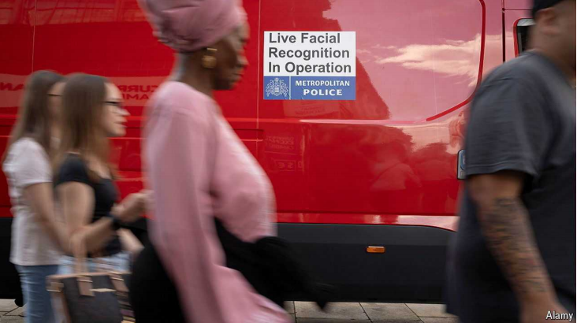

# Police use of facial recognition in Britain is spreading

The riots have given the technology a boost. Regulation is not keeping up

原文：

Britons spend large chunks of their lives on camera. The country has up to

6m closed-circuit television (CCTV) cameras—one for every 11 people in the

country, the third-highest penetration rate in the world after America and

China. To help identify rioters in the wake of violent protests that swept

parts of the country in early August, police officers are collecting footage

from mosques and shops that were vandalised. Some are releasing CCTV

footage to the public to identify suspects. Others are using another

technology to get the job done—facial recognition.

英国人生活中的大部分时间都在镜头前度过。该国拥有多达600万个闭路电视摄像头——每11个人就有一个，是仅次于美国和中国的世界第三高普及率。在8月初席卷全国部分地区的暴 力抗议之后，为了帮助识别暴 徒，警察正在收集被破坏的清真寺和商店的镜头。一些人正在向公众发布闭路电视录像，以确认嫌疑人。其他人正在使用另一种技术来完成这项工作——面部识别。

学习：

penetration：美 [ˌpenəˈtreɪʃn] 渗透；穿透

penetration rate：普及率；渗透率

rioter：暴 徒

in the wake of：紧随其后；在…之后；

footage：镜头；影片片段；录像材料

mosques： 美 ['mɒsks] 清真寺；（mosque的复数） **注意发音**

vandalize：美 [ˈvændlˌaɪz]  故意破坏；肆意破坏

facial recognition：人脸识别

原文：

Facial-recognition systems use artificial intelligence (AI) to match images to

identities. Retrospective facial recognition of the sort being used to pursue

rioters compares CCTV footage with suspects; real-time use involves live

images being compared with the faces of people who have been placed on

“watch lists”. The technology was used during King Charles’s coronation in 2023.

Last year the South Wales Police scanned the faces of more than

819,000 people. In Haringey in north London, around 133 facial scans are

performed every minute.

面部识别系统使用人工智能(AI)将图像与身份进行匹配。用于追捕暴徒的追溯性面部识别技术将闭路电视录像与嫌疑人进行对比；实时使用包括将实时图像与被列入“观察名单”的人的面部进行比较。这项技术在2023年查尔斯国王加冕时被使用。去年，南威尔士警方扫描了超过819，000人的面部。在伦敦北部的哈林盖，每分钟大约进行133次面部扫描。

学习：

retrospective：回顾的；追溯的；涉及以往的

pursue rioters：追捕暴徒

coronation： 美 [ˌkɔːrəˈneɪʃn] 加冕；加冕礼；加冕典礼；

原文：

Surveys suggest that Britons accept the arguments for facial recognition. A

poll taken in March by the Centre for Emerging Technology and Security

and the Alan Turing Institute found that 60% of Britons are comfortable

with the police’s use of the technology in real time to identify criminals in a

crowd. That share is likely to have risen as a result of the riots. Scouring

images to find troublemakers takes a lot longer if only humans are involved.

The South Wales police force identifies 200 suspects every month using the

technology; without facial recognition it takes 14 days on average to find a

suspect. Sir Keir Starmer, the prime minister, has pledged to increase use of

the technology in response to the disorder this summer.

调查显示，英国人接受面部识别的观点。新兴技术与安全中心和艾伦·图灵研究所在3月份进行的一项民意调查发现，60%的英国人对警方实时使用这项技术来识别人群中的罪犯感到满意。由于骚乱，这一比例可能会上升。如果只有人类参与，搜索图像以找到麻烦制造者需要更长的时间。南威尔士警察部队使用该技术每月识别200名嫌疑人；如果没有面部识别，找到一个嫌疑犯平均需要14天。今年夏天，凯尔·斯塔莫爵士总理承诺将增加这项技术的使用，以应对这种紊乱。

学习：

scouring：仔细搜索；浏览；（scour的现在分词）          

troublemakers：惹是生非者；捣乱者；（troublemaker的复数）

原文：

That adds urgency to questions about how it is regulated. The Investigatory

Powers Act, which regulates some forms of surveillance, was recently

amended to allow government agencies to use AI to process data sets when

there is “no expectation of privacy”. But Karen Yeung, a professor of law at

Birmingham University, points out that there is no legislation specifically

covering facial recognition. “Police forces are guided by a complex

patchwork of regulation, which in effect means there is little oversight on the

use of the technology.”

这增加了监管问题的紧迫性。监管某些监控形式的《调查权力法》(Investigatory Powers Act)最近进行了修订，允许政府机构在“不存在隐私预期”的情况下使用人工智能处理数据集。但是伯明翰大学的法学教授Karen Yeung指出，目前还没有专门针对面部识别的立法。“警察部队受到复杂的监管措施的指导，这实际上意味着对该技术的使用几乎没有监督。”

学习：

patchwork：拼接物；混合物；杂烩

oversight：监管；监督

原文:

There is, for example, no clear criterion determining when facial recognition

can be deployed; instead decisions are left to the discretion of each police

force. The College of Policing, a professional body, offers guidance on who

can be placed on watch lists before deploying live facial recognition, but the

categories can be very broad. The Justice and Home Affairs Committee

called in January for watch lists to be subject to uniform standards across

police forces. Other jurisdictions have much more stringent rules. Under the

EU’s AI Act, for example, the use of real-time facial recognition is allowed only

when it is approved by a judge.

例如，没有明确的标准来确定面部识别何时可以部署；取而代之的是由各警察部队自行决定。警察学院(College of Policing)是一个专业机构，在部署实时面部识别之前，它提供了关于谁可以被列入观察名单的指导，但类别可能非常广泛。司法和内政事务委员会在1月份呼吁，观察名单应遵循整个警察部队的统一标准。其他司法管辖区有更严格的规则。例如，根据欧盟的人工智能法案，只有在得到法官批准的情况下，才允许使用实时面部识别。

学习：

discretion：酌情权；自主决定权；自由裁量权

police force：警察部队

professional body：专业机构

stringent：美 [ˈstrɪndʒənt] 规定、法律）严格执行的；严格的；

stringent rules：严格的规则

原文：

There is no central register of AI technologies in Britain, either. Public bodies

and all 43 police forces in England and Wales are free to employ any AI tools

they like, making it impossible to know where and how they are being used.

Critics argue that this lack of transparency could lead, among other things, to

discrimination—some systems are better at recognising white faces, which

may mean more false identifications of non-white individuals.

英国也没有人工智能技术的中央登记处。英格兰和威尔士的公共机构和所有43支警察部队可以自由使用任何他们喜欢的人工智能工具，因此不可能知道它们在哪里以及如何被使用。批评者认为，这种缺乏透明度的情况可能会导致歧视——一些系统更擅长识别白人面孔，这可能意味着更多非白人个体的错误识别。

原文：

Use of the technology will almost certainly spread further. Sir Mark Rowley,

the Met’s commissioner, believes that facial recognition will transform

policing “in the way that DNA transformed investigative work 30 years ago”.

But Fraser Sampson, the last surveillance-camera commissioner (the post

has now been abolished and some of its responsibilities shared out among

various government departments), argues that the lack of regulation could

lead to a backlash against the technology. The survey in March also found

that only 19% of Britons trust police forces to use biometric tools

“responsibly”. A clearer regulatory framework would probably help build

confidence. ■

这项技术的应用几乎肯定会进一步普及。伦敦警察局局长马克·罗利爵士认为，面部识别将“像30年前DNA改变调查工作一样”改变警务工作。但是最后一位监控摄像专员Fraser Sampson(该职位现已被取消，其部分职责已由多个政府部门分担)认为，缺乏监管可能会导致对该技术的强烈反对。三月份的调查还发现，只有19%的英国人相信警察会“负责任地”使用生物识别工具。更清晰的监管框架可能有助于建立信心。■

学习：

Met：伦敦警察厅（the Metropolitan Police的缩写）

commissioner： 美 [kəˈmɪʃənər] 警察局长

backlash：反对，抵制

biometric：美 [ˌbaɪoʊˈmetrɪk] 生物特征识别的

## 后记

2024年9月11日18点59分于上海。

