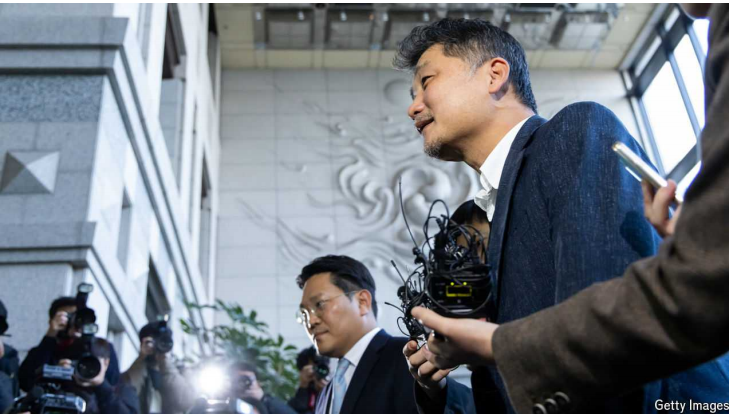

# Kim Beom-su, the billionaire founder of Kakao, faces trial

trial：美 [ˈtraɪəl] （法院的）审讯

But will the tech entrepreneur be seen as “too big to jail”?

原文：

KIM BEOM-SU sat expressionless as he faced the prosecutors in court. The

58-year-old founder and chairman of Kakao, a tech company, once reigned

as the richest man in South Korea. His downfall began last year with a spat

with HYBE, an entertainment giant that manages the boyband BTS, over a

potential acquisition of SM Entertainment, another K-pop firm. In July,

prosecutors accused Mr Kim and his executives of stock manipulation,

claiming they had inflated SM Entertainment’s stock price by purchasing

240bn won ($180m at the time) in shares over 553 transactions to block HYBE’s

takeover. On the first day of his trial on September 11th, Mr Kim’s lawyer

reiterated that the purchases were “legitimate”. Kakao has said Mr Kim did

not order or tolerate any illegal activity.

面对法庭上的检察官，金百洙面无表情地坐着。这位58岁的科技公司Kakao的创始人兼董事长曾一度是韩国首富。他的垮台始于去年与管理男孩乐队BTS的娱乐巨头HYBE就潜在收购另一家韩国流行音乐公司SM Entertainment发生的口角。今年7月，检方指控Kim及其高管操纵股票，称他们通过在553笔交易中购买2400亿韩元(当时合1.8亿美元)的股票，以阻止HYBE的收购，从而抬高了SM Entertainment的股价。在9月11日审判的第一天，金先生的律师重申这些购买是“合法的”。Kakao表示，Kim没有下令或容忍任何非法活动。

学习：

expressionless：无表情的；没有表情的；呆板的

reigned：美 [reɪnd] 支配；统治；当政；君临；（reign的过去式）

downfall：垮台；衰败；灭亡；衰落（或衰败、垮台）的原因

spat：争吵；口角；小争执

won：韩元

takeover：收购

原文：

Kakao is one of the most recognisable names in Asia’s fourth-largest

economy. Since its founding in 2010, it has evolved into a conglomerate

with over 120 affiliates. KakaoTalk, its messaging app, is used by the

majority of South Koreans. As a super-app, its services range from music

streaming to online banking and taxi-hailing. Yet in recent years, the

company has come under fire. The arrest of its founder shows how Korea’s

tech titans are becoming indistinguishable from the *chaebol*, or family-

owned conglomerates.

Kakao是亚洲第四大经济体中最知名的名字之一。自2010年成立以来，它已发展成为一家拥有120多家子公司的企业集团。大多数韩国人都在使用其即时通讯应用卡考说说。作为一个超级应用，它的服务范围从音乐流媒体到网上银行和打车。然而，近年来，该公司受到了抨击。其创始人被捕表明，韩国的科技巨头正变得与财阀(即家族企业集团)难以区分。

学习：

recognisable：美 [ˈrekəgˌnaɪzəbl] 可辨认的；可认识的；

conglomerate：大集团，大企业

affiliates：美 [əˈfɪliət] 隶属成员；子公司；会员；分支机构；（affiliate的复数）

taxi-hailing：打车

原文：

Mr Kim, also known as Brian, was born into poverty. His family of eight

slept in one bedroom. His rags-to-riches story stood out in a country

dominated by *chaebol* heirs. As the leader of Kakao, Mr Kim pledged to

donate half his wealth, estimated at $9bn in 2021, to charitable causes. To

promote “horizontal” work culture, he asked all employees to use English

nicknames. He also embraced remote working.

金先生，又名布莱恩，出生于贫困家庭。他一家八口睡在一间卧室里。在一个由财阀继承人主导的国家，他白手起家的故事引人注目。作为Kakao的领导人，金先生承诺将他一半的财富(估计2021年为90亿美元)捐赠给慈善事业。为了推广“横向”工作文化，他要求所有员工使用英文昵称。他也喜欢远程工作。

学习：

was born into poverty：出身贫困

rags-to-riches：白手起家的          

heirs：英 ['eəz] 继承人；后嗣；承袭者；（heir的复数）

charitable causes：慈善事业

原文：

Even so, local media shared anecdotes from Kakao employees, revealing the

company’s surprisingly top-down culture. At Kakao’s de facto holding

company, Mr Kim at one point hired his wife, brother and two children as

executives and employees. Critics accused him of appointing those close to

him as CEOs, thereby strengthening control over his sprawling web of affiliates

—a governance structure in which many find parallels with the *chaebol* way

of ruling. “It’s like a feudal system,” says Kim Yong-jin of Sogang

University in Seoul.

即便如此，当地媒体分享了Kakao员工的轶事，揭示了该公司令人惊讶的自上而下的文化。在Kakao事实上的控股公司，金先生曾一度雇用他的妻子、兄弟和两个孩子担任高管和雇员。批评者指责他任命亲近的人担任首席执行官，从而加强了对他庞大的附属机构网络的控制——许多人在这种治理结构中找到了与财阀统治方式的相似之处。“这就像一个封建制度，”首尔Sogang大学的Kim Yong-jin说。

学习：

de facto：实际上；事实上

holding company：控股公司；持股公司；控股集团；

at one point：一度；曾经；在某一时刻

feudal：美 [ˈfjuːdl] 封建制度的；封建时代的；

原文:

This is not the first scandal for Kakao. In 2021 executives of Kakao Pay, an

affiliate, engaged in mass-selling of company stock just after it was listed,

potentially amplifying losses for minority shareholders. Mr Kim was

accused of failing to report properly on his shareholdings.

这不是Kakao的第一次丑闻。2021年，附属公司Kakao Pay的高管在公司股票上市后就进行了大规模抛售，这可能会放大少数股东的损失。金先生被指控没有正确报告他的股份持有情况。

原文：

Many now wonder: will Kakao be treated like the *chaebol*? In 2022 Lee Jae

yong, of Samsung, was acquitted after being charged with stock

manipulation (he denied any wrongdoing). Presidential pardons of convicted

*chaebol* leaders are common, because of their contribution to the nation.

Whether startups are treated similarly will become clear next month, when

Mr Kim faces his next trial. ■

许多人现在想知道:Kakao会像财阀一样被对待吗？2022年，三星的李在镕在被指控操纵股票后被无罪释放(他否认有任何不当行为)。总统赦免被定罪的财阀领导人很常见，因为他们对国家做出了贡献。下个月，当金先生面临下一次审判时，初创公司是否会受到同样的待遇将变得明朗。■

学习：

wrongdoing：不法行为；违法行为；不正当行为；

pardons：赦免；宽恕；

## 后记

2024年9月14日17点27分于上海。

