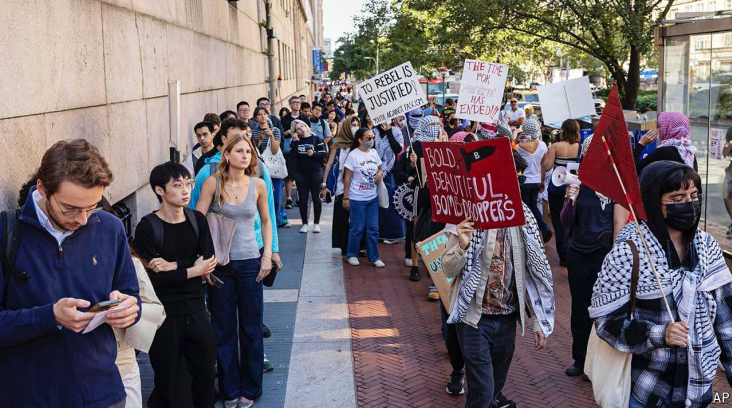

# America’s college heads revise rules for handling campus protests

University leaders have learnt some lessons, but face a tough test this autumn

原文：

AS SOME STUDENTS shopped for Columbia hoodies and Taylor Swift

crochet sets in the university bookshop, and others bought apple-cider

doughnuts at a farmers’ market, it almost felt like a normal back-to-school

September. But as classes resumed last week at Columbia University, the

heart of last spring’s campus unrest over the war in Gaza, it was impossible

to avoid renewed pro-Palestinian protests or the changes they have brought.

当一些学生在大学书店购买哥伦比亚帽衫和泰勒斯威夫特钩针套装，其他人在农贸市场购买苹果酒甜甜圈时，这几乎感觉像是一个正常的返校九月。但随着哥伦比亚大学(Columbia University)上周复课，这是去年春天因加沙战争引发的校园骚乱的中心，亲巴勒斯坦的抗议活动及其带来的变化不可避免。

学习：

hoodies：帽衫

crochet：美 [kroʊˈʃeɪ] 钩针；钩针编织工艺； **注意发音**

crochet sets：钩针套装      

bookshop：书店

apple cider：苹果西打，常被称为甜西打、软西打、西打，是由苹果制成的未经过滤而且不加糖的非酒精饮料。

farmers' market: 菜市场

doughnuts：美 ['doʊnʌts] 甜甜圈；（doughnut的复数） **注意发音**

unrest：骚动；动荡

campus unrest：校园骚乱

原文：

Access to the campus is restricted to those with university ID. Near the main

entrances, a conservative outfit set up two digital billboards that flashed the

names and faces of people they considered to be “Columbia’s Leading

Antisemites”. Long queues blocked the gates periodically. On the first day

back, a few dozen protesters shouted pro-Palestinian slogans and two were

arrested. Inside the gates someone threw red paint on Alma Mater, a statue

outside Low Library.

只有持有大学证件的人才能进入校园。在主要入口附近，一个保守团体设立了两个数字广告牌，上面闪现着他们认为是“哥伦比亚主要反犹分子”的名字和面孔。长队周期性地堵塞大门。回来的第一天，几十名抗议者高呼支持巴勒斯坦的口号，两人被捕。在大门内，有人向Low Library外的一座雕像——母校——上泼了红漆。

学习：

billboards：广告牌；（billboard的复数）

antisemites：反犹太

shout：喊叫

alma mater：母校；（大学的）校歌；（尤指）赞美之歌；创办者；赞助者          

原文：

College leaders used the summer to develop plans that might prevent

disruptions, tackle antisemitism and minimise resort to police forces. The

difficulty of that balancing act can be measured by the number of college

presidents who have resigned while attempting to carry it out, including

Minouche Shafik at Columbia, who stepped down in August. Despite much

reflection and preparation, the autumn may offer her successor and other

university leaders little respite. The anniversary on October 7th of the attack

on Israel by Hamas is one likely flashpoint.

大学领导利用这个夏天制定计划，以防止混乱，解决反犹太主义，并尽量减少诉诸警察。这种平衡的难度可以通过在试图实现这一目标时辞职的大学校长人数来衡量，其中包括哥伦比亚大学的米诺什·沙菲克，他于8月辞职。尽管做了大量的思考和准备，这个秋天可能不会给她的继任者和其他大学领导提供喘息的机会。10月7日哈马斯袭击以色列的周年纪念日是一个可能的爆发点。

学习：

disruption：分裂

antisemitism：反犹太主义

resort to：诉诸

respite：美 [ˈrespɪt] 暂缓；缓解；暂停；短暂的延缓；喘息	

flashpoint：闪点；爆发点；导火线

原文：

The problem remains how to combine a commitment to free speech with

effective policies to prevent antisemitism, while also enabling all students to

learn free of disruption. The First Amendment’s speech protections apply

only to state action, notes Lee Bollinger, a former president of Columbia and

a free-speech scholar. So whereas public universities funded by the state

must allow unfettered speech, private ones are under no specific obligation.

问题仍然是如何将言论自由的承诺与防止反犹太主义的有效政策结合起来，同时让所有学生都能不受干扰地学习。哥伦比亚前校长、言论自由学者Lee Bollinger指出，第一修正案的言论保护仅适用于州政府行为。因此，尽管由国家资助的公立大学必须允许言论自由，但私立大学没有特定的义务。

学习：

unfettered：无拘无束的；不受约束的

原文：

Fully adopting a First Amendment standard on private campuses would

mean protecting “hate speech or speech that advocates illegal action, or

speech that advocates deeply offensive ideas”, Mr Bollinger says. Many

universities believe that would be inconsistent with their mission.

博林格先生说，在私立学校完全采用第一修正案标准将意味着保护“仇恨言论或鼓吹非法行为的言论，或鼓吹极度冒犯性思想的言论”。许多大学认为这与他们的使命不符。

学习：

hate speech：仇恨言论

原文：

Tom Stritikus, the president of Occidental College, a liberal-arts college in

Los Angeles, has implemented restrictions on the permissible “time, place

and manner” of demonstrations. Protests can take place only between 6am

and midnight. Demonstrations cannot be mounted in buildings or block

access, and no permanent or semi-permanent structures such as tents are

allowed. Amplified speech (from bullhorns, for example) is also forbidden.

Many other colleges have applied similar restrictions.

洛杉矶的一所文科大学西方学院的校长汤姆·斯特里提库斯对示威游行的“时间、地点和方式”进行了限制。抗议只能在早上6点到午夜之间进行。示威活动不能安装在建筑物内或堵塞通道，也不允许使用帐篷等永久性或半永久性结构。放大的声音(例如扩音器)也是被禁止的。许多其他大学也实施了类似的限制。

学习：

occidental：美 [ˌɑksəˈdɛn(t)l] 西方的；西洋的；欧美的

liberal-arts college：文科学院；人文学院；文科大学          

demonstration:示威游行

bullhorns：扩音器；（bullhorn的复数）

原文：

In an effort to limit the resort to police, Columbia University has hired more

security guards and trained them in de-escalation techniques. In a written

statement Katrina Armstrong, Columbia’s interim president, said that she

supports “the right to free expression…but those rights cannot come at the

expense of the rights of others to live, work, and learn here, free from

discrimination and harassment”. Last month the university’s task-force on

antisemitism concluded after conducting interviews with hundreds of Jewish

and Israeli students that the university “had not treated them with the

standards of civility, respect and fairness it promises to all its students”.

为了限制诉诸警察，哥伦比亚大学雇佣了更多的保安人员，并对他们进行了防止事态升级技巧的培训。哥伦比亚临时校长卡特里娜·阿姆斯特朗(Katrina Armstrong)在一份书面声明中表示，她支持“自由表达的权利……但这些权利不能以牺牲其他人在这里生活、工作和学习、免受歧视和骚扰的权利为代价”。上个月，该大学的反犹太主义工作组在采访了数百名犹太和以色列学生后得出结论，该大学“没有按照它对所有学生承诺的文明、尊重和公平的标准对待他们”。

学习：

interim：美 [ˈɪntərɪm] 暂时的；临时的；过渡期的；

civility：礼貌；彬彬有礼；文明；礼仪

原文：

College leaders have realised that they must prevent harassment and

discrimination while also teaching students to handle some speech they do

not like—another tricky balancing act. How they do this varies. Occidental

College is requiring incoming students to attend sessions on antisemitism

and anti-Arab bias. Macalester College, a liberal-arts institution in Saint

Paul, Minnesota, is joining the University of Northwestern, a private

Christian college nearby, to provide students with opportunities to mix

respectfully. Discussions can get heated and people can disagree,” says Ravi

Rajan, the president of the California Institute of the Arts, which specialises

in arts education. “But ostensibly one of the things that we’re doing as

educational institutions is teaching students how to have those arguments.”

大学领导已经意识到，他们必须防止骚扰和歧视，同时还要教会学生处理一些他们不喜欢的言论——这是另一个棘手的平衡行为。他们如何做到这一点各不相同。西方学院要求新生参加反犹太主义和反阿拉伯偏见的会议。明尼苏达州圣保罗的文科学院麦卡莱斯特学院(Macalester College)加入了附近的私立基督教学院西北大学(University of Northwestern ),为学生提供有礼貌地交往的机会。专门从事艺术教育的加州艺术学院院长拉维·拉詹说:“讨论可能会很激烈，人们可能会有不同意见。但表面上，作为教育机构，我们正在做的事情之一是教学生如何进行这些辩论。"

学习：

harassment：美 [həˈræsmənt] 骚扰；烦恼

balancing act：平衡行为；权衡之举

ostensibly：表面上；表面看来

原文：

Some university leaders have also learned another lesson: keep quiet. “A

very curious phenomenon” developed whereby college presidents were

expected to speak up about world events, ranging from George Floyd’s

murder to the war in Gaza, says Suzanne Rivera, the president of Macalester

College. This was not expected of leaders in other sectors, she says, and it

got some chiefs into trouble.

一些大学领导也学到了另一课:保持安静。麦卡莱斯特学院院长苏珊·里维拉说，一种“非常奇怪的现象”出现了，人们期望大学校长就世界大事发表意见，从乔治·弗洛伊德的谋杀案到加沙战争。她说，这不是其他部门领导人所期望的，这让一些主管陷入了困境。

## **Occidentalism**

原文：

Dr Rivera encourages college leaders to issue public statements only for

events that directly affect their community and are aligned with the

university’s mission. She points to the recent Supreme Court decisions on

abortion, which had an impact on health services on campus, and affirmative

action, which influenced admissions, as appropriate times to speak up.

里维拉博士鼓励大学领导只对直接影响他们社区的事件发表公开声明，并与大学的使命保持一致。她指出，最近最高法院关于堕胎的裁决对校园卫生服务产生了影响，而平等权利行动影响了招生，这是发表意见的适当时机。

学习：

issue public statements：发表公开声明

原文：

For those students brought up in a culture that still cancels people for views

that run counter to left-wing orthodoxy, learning on a campus with a free

speech philosophy can be difficult. Combine that with a contentious war and

a presidential election, and university presidents can expect plenty of hard

days. “I expect there’ll be protests on a number of issues this year,” says Dr

Stritikus, citing Occidental’s history of civil disobedience. “I have no

illusion that it won’t be complicated.” ■

对于那些在仍然因为与左翼正统观念背道而驰的观点而排斥他人的文化中长大的学生来说，在一个拥有言论自由理念的校园里学习可能会很困难。再加上一场激烈的战争和一场总统选举，大学校长们会有很多艰难的日子。“我预计今年会有很多问题上的抗议，”斯特里提库斯博士引用西方学院的非暴力反抗历史说。“我没有幻想这不会很复杂。”■

学习：

run counter to：违背；与…相矛盾；与…相反

cancel： 被公众强烈批评、抵制

>这里的“**cancel**”指的是“取消文化”（cancel culture），即当某人表达的观点与某些群体的主流观点相左，尤其是与左翼正统观念不符时，可能会被公众强烈批评、抵制，甚至剥夺他们的平台或工作机会。这种现象在今天的社交媒体和公众讨论中非常常见。
>
>- **英文例子**: The actor was canceled on social media after making controversial comments about the election.
>- **中文例子**: 这位演员因为对选举发表了有争议的言论而在社交媒体上被“取消”。

contentious：好争论的；好辩的；有争议的；引起争论的；

disobedience：美 [ˌdɪsəˈbiːdiəns] 不服从；违抗；抗命

civil disobedience：非暴力反抗；非暴力抗议；

## 后记

2024年9月17日16点13分于上海。

