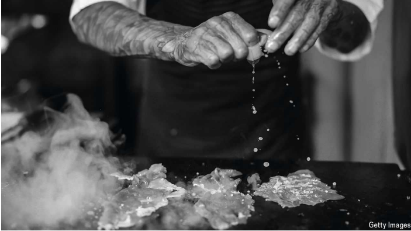

# The curse of the Michelin star

Restaurants awarded the honour are more likely to close, research finds

原文：

The twelve new restaurants added to the New York Michelin Guide this

month, serving up cuisine ranging from “haute French” to “eco-chic”, will

be toasting their success. Being featured in the handbook of the tyre-maker-

turned-restaurant-critic is the first step towards receiving a Michelin star, the

most coveted award in fine dining. Yet according to research recently

published in the *Strategic Management Journal*, an improbable source of

culinary intelligence, restaurants might be better off remaining starless.

本月纽约米其林指南新增了12家餐厅，提供从“高级法式”到“生态时尚”的美食，他们将庆祝自己的成功。被收录在这本由轮胎制造商转型为餐馆评论家的手册中，是获得米其林星级的第一步，米其林星级是美食领域最令人垂涎的奖项。然而，根据最近发表在《战略管理杂志》上的一项研究，这是一个不太可能的烹饪智慧来源，餐馆最好还是没有星级评价。

学习：

handbook：手册；指南

tyre：美 [ˈtaɪər] 轮胎；车胎；

coveted：美 [ˈkʌvətɪd] 垂涎的；梦寐以求的

culinary：美 [ˈkʌlɪneri] 烹饪的；适于烹调的

improbable：美 [ɪmˈprɑbəb(ə)l] 不大可能的；难以置信的；

原文：

Daniel Sands of University College London’s school of management tracked

the fortunes of restaurants that opened in New York in 2000-14 and received

a starred review in the *New York Times*. He found that, of this promising

group, establishments which went on to get a Michelin star were more likely

to close down in the years that followed than those which did not. The

relationship remained even when factors such as location, price and type of

cuisine were taken into account. All told, 40% of restaurants awarded

Michelin stars in 2005-14 had closed by the end of 2019.

伦敦大学学院管理学院的丹尼尔·桑兹追踪了2000-2014年间在纽约开业，并在《纽约时报》上获得了星级评价的餐馆的命运。他发现，在这一有前途的群体中，获得米其林星级的企业比没有获得米其林星级的企业更有可能在接下来的几年中倒闭。即使考虑到地点、价格和菜肴类型等因素，这种关系依然存在。总的来说，2005-14年获得米其林星级的餐厅中有40%在2019年底关闭。

原文：

A Michelin star boosts publicity: the study found that Google search

intensity rose by over a third for newly starred restaurants. But that fame

comes at a price. First, Mr Sands argues, the restaurants’ customers change.

Being in the limelight raises diners’ expectations and brings in tourists from

farther away. Meeting guests’ greater demands piles on new costs. Second,

the award puts a star-shaped target on the restaurants’ back. Businesses they

deal with, such as ingredient suppliers and landlords, use the opportunity to

charge more. Chefs, too, want their salaries to reflect the accolade and are

more likely to be poached by competitors.

米其林星级餐厅提升知名度:研究发现，谷歌搜索新星级餐厅的强度增加了三分之一以上。但是这种名声是有代价的。首先，冼博德认为，餐馆的顾客发生了变化。成为众人瞩目的焦点会提高食客的期望值，并从更远的地方吸引游客。满足客人更高的要求会增加新的成本。第二，该奖项在餐馆背后设立了一个星形目标。他们打交道的企业，如原料供应商和房东，利用这个机会收取更多的费用。厨师也希望他们的薪水能反映出荣誉，更有可能被竞争对手挖走。

学习：

limelight： 美 [ˈlaɪmlaɪt] 公众注意的中心；舞台上的聚光灯

accolade： 美 [ˈækəˌleɪd] 荣誉；赞扬；奖励

poach：挖走（他人员工）

原文：

Food is not the only industry where awards are a mixed blessing. Several

studies have shown that companies run by award-winning bosses

underachieve relative both to their previous performance and to non-

garlanded rivals. Like Michelin-starred chefs, superstar CEOs demand fatter

pay packets and are more easily distracted, spending more time writing

books and joining boards. In publishing, too, awards bring peril.

Prizewinning books are reviewed more harshly than before their success,

and worse than runners-up.

食品不是唯一一个奖项喜忧参半的行业。几项研究表明，由屡获殊荣的老板经营的公司，相对于他们以前的业绩和非显赫的竞争对手，都表现不佳。像米其林星级厨师一样，超级明星首席执行官要求更高的薪酬，也更容易分心，花更多时间写书和加入董事会。在出版业，奖项也会带来危险。获奖书籍的评论比它们成功之前更加苛刻，比亚军更糟糕。

学习：

mixed blessing：喜忧参半；利弊并存之事；好坏参半的东西

garland： 给…戴上花冠；用花环装饰；给…荣誉

runners-up：第二名；

原文：

For restaurateurs who are in it for the glory, Michelin’s top award will

probably remain too enticing not to pursue. But for those who simply want

to stay in business, it may be safer to not quite cut the mustard. ■

对于为了荣誉而奋斗的餐馆老板来说，米其林的最高奖项可能仍然太诱人而无法不去追求。但是，对于那些只想继续做生意的人来说，不去做可能更安全。■

学习：

mustard：美 [ˈmʌstərd] 芥末

cut the mustard：达到标准；符合要求；胜任；表现出色          

## 后记

2024年10月1日10点34分于上海。

