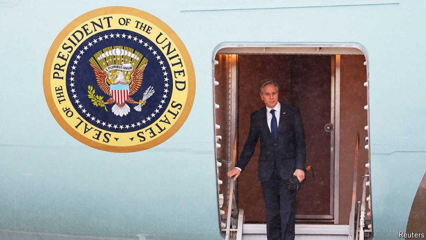

# America is losing South-East Asia to China

President Joe Biden will not attend this year’s East Asia Summit

原文：

Eight years ago Barack Obama spent several days in the twilight of his

presidency in Laos. He bought a coconut from a roadside stall, visited holy

sites, then sat through two days of stultifying summitry. But when Asian

leaders once again convene in Laos on October 11th, President Joe Biden

will not be there. He is skipping the East Asia Summit, an annual meeting of

18 countries, for the second year in a row. Antony Blinken (pictured), his

secretary of state, will represent America instead.

八年前，巴拉克·奥巴马在他总统任期的最后几天在老挝度过。他从路边摊上买了一个椰子，参观了圣地，然后坐着参加了两天无聊的峰会。但是当亚洲领导人10月11日在老挝再次聚会时，乔·拜登总统将不会出席。他连续第二年不参加东亚峰会，这是一个有18个国家参加的年度会议。他的国务卿安东尼·布林肯(如图)将代表美国。

学习：

twilight： 美 [ˈtwaɪlaɪt] 黄昏；暮光；暮色；晚期；

roadside：路边；路旁

stall：货摊，小摊

stultify：使显得愚蠢；使无效；使无价值；使呆滞；使失去活力

stultifying：美 [ˈstʌltɪfaɪɪŋ] 使人失去创造性的；使人失去干劲的；单调乏味的

summitry： 美 [ˈsʌmɪtrɪ] 最高级会议的举行

convene：美 [kənˈviːn] 集合；聚集；开会

secretary of state：国务卿

原文：

A big part of Mr Obama’s “pivot to Asia” was a promise to join the East

Asia Summit every year. Chaired and hosted by a rotating cast of South-East

Asian leaders, the summit gives the region’s politicians an opportunity to set

the agenda and tell the American president what they think of his policies. It

sent a signal that America would listen to small countries, and drew a

contrast with China, which has a habit of hectoring its neighbours at the

meeting. The year that America joined the East Asia Summit, Hillary

Clinton, Mr Obama’s secretary of state, joked that “half of diplomacy is

showing up.”

奥巴马“转向亚洲”的一大部分是承诺每年参加东亚峰会。由东南亚领导人轮流担任主席和东道主的这次峰会给了该地区的政治家们一个机会来制定议程，并告诉美国总统他们对他的政策的看法。这发出了一个信号，即美国会听取小国的意见，并与中国形成对比，中国习惯于在会议上威吓其邻国。美国加入东亚峰会的那一年，奥巴马的国务卿希拉里·克林顿开玩笑说“外交的一半正在显现。”

学习：

hectoring：美 [ˈhektərɪŋ] 威吓；恐吓；（hector的现在分词形式）

原文：

America’s disengagement from Asia’s top multilateral institution is partly

the result of conflicts in Europe and the Middle East that have diverted its

attention. But it is also deliberate. The Biden administration has mostly

stopped trying to persuade the region of its position on China in talking-

shops like the East Asia Summit. Instead it is focused on working with

countries that already share its perspective, such as Australia, India and

Japan, which along with America make up the Quad, a security grouping.

Mr Biden hosted their leaders at his home last month.

美国退出亚洲最高多边机构，部分原因是欧洲和中东的冲突转移了美国的注意力。但也是故意的。拜登政府基本上已经不再试图在东亚峰会这样的清谈俱乐部中说服该地区对中国的立场。取而代之的是，它专注于与已经认同其观点的国家合作，如澳大利亚、印度和日本，它们与美国一起组成了四方安全集团。上个月，拜登先生在他的家里接待了他们的领导人。

学习：

disengagement ：撤离；撤出；退出；解除联结；

原文：

But South-East Asia remains at the geographic and economic heart of the

competition between America and China, so ignoring it carries risks. For the

first time this year an annual survey of politicians, civil servants and

business leaders by the ISEAS-Yusof Ishak Institute, a think-tank in Singapore,

found that if forced to align with either America or China, South-East Asian

elites would choose China.

但是东南亚仍然处于中美竞争的地理和经济中心，所以忽视它是有风险的。新加坡智库ISEAS-Yusof Ishak Institute今年首次对政治家、公务员和商界领袖进行年度调查，发现如果被迫与美国或中国结盟，东南亚精英会选择中国。

学习：

原文：

Besides diplomacy, there are three reasons for this. First, American

protectionism and industrial policy are alienating South-East Asia. America

offers no new access to its market in free-trade agreements. Tariffs are

upending established trade patterns. “Derisking” measures are driving up

costs as supply chains split into two.

除了外交，还有三个原因。首先，美国的保护主义和产业政策正在疏远东南亚。美国在自由贸易协定中没有提供新的市场准入。关税正在颠覆既定的贸易模式。随着供应链一分为二，“去风险化”措施正在推高成本。

原文：

Second, South-East Asians have begun to question whether American policy

on Taiwan is driving up the risk of conflict. America has always struck a

careful balance on the self-governing island. It works to deter Chinese plans

to retake it by leaving open the possibility of an American military response,

while discouraging Taiwanese leaders from moving towards independence

and thus provoking China.

第二，东南亚人已经开始质疑美国的台湾政策是否正在增加冲突的风险。在这个自治的岛屿上，美国总是小心翼翼地保持平衡。它通过留下美国军事回应的可能性来阻止中国夺回台湾的计划，同时阻止台湾领导人走向独立从而挑衅中国。

学习：

provoke：激怒；驱使；煽动；激起

provoke China：挑衅中国，激怒中国

原文：

But South-East Asians fear that America might be departing from this line.

A visit to Taiwan in 2022 by Nancy Pelosi, the former speaker of the House,

raised tensions in ways that South-East Asian states found dangerous. Mike

Pompeo, who was secretary of state under Donald Trump, has said that

America should support Taiwanese independence. If Mr Trump returns to

government, Asian officials will worry more.

但是东南亚人担心美国可能会偏离这条路线。前众议院议长南希佩洛西(Nancy Pelosi)2022年对台湾的访问，加剧了紧张局势，令东南亚国家感到危险。如果特朗普重返政府，亚洲官员会更加担心。

原文：

Third, America’s backing of Israel in its conflict with Hamas has cost it

support among Muslims and young people in the region. Many see a double

standard between America’s condemnation of China’s persecution of

Uyghurs and its support for Israel’s bombing campaign in Gaza. So

unpopular has Mr Biden become among Malaysians that its leader, Anwar

Ibrahim, is said to be relieved that the American president is skipping the

summit in Laos. ■

第三，美国在以色列与哈马斯的冲突中支持以色列，这让美国失去了该地区穆斯林和年轻人的支持。许多人在美国谴责迫害维吾尔人和支持以色列轰炸加沙之间看到了双重标准。拜登先生在马来西亚人当中变得如此不受欢迎，以至于据说其领导人易卜拉欣对美国总统不去老挝参加峰会松了一口气。■

学习：

double standard：双标

persecution：迫害；

## 后记

2024年10月9日14点23分于上海。

