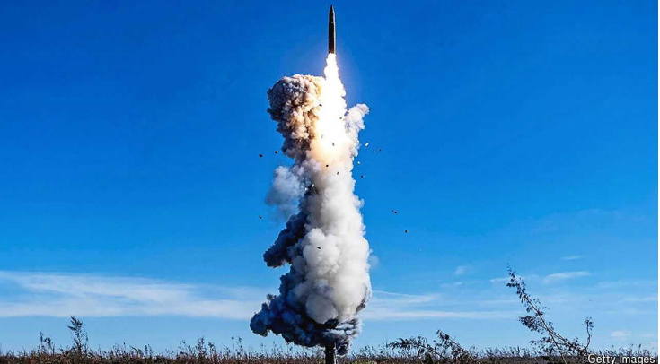

# A missile test by China marks its growing nuclear ambitions

America worries that it is looking to surpass its own capabilities one day

原文：

THE LAST time China fired an intercontinental ballistic missile (ICBM) out

over the Pacific, Xi Jinping was 27 years old, China’s GDP per head was less

than $200 and America had just lifted an arms embargo on the country. So

the missile that rose from Hainan island on September 25th—carrying a

dummy warhead and plunging into the waters around French Polynesia,

some 12,000km to the east—was a mark of China’s soaring nuclear

ambitions.

上一次中国在太平洋上空发射洲际弹道导弹(ICBM)时，Xi 27岁，中国人均GDP不到200美元，美国刚刚解除对中国的武器禁运。因此，9月25日从海南岛发射的导弹——携带假弹头，坠入法属波利尼西亚的水域，距离中国12000km——标志着中国日益高涨的核野心。

学习：

ballistic missile：弹道导弹；弹道飞弹        美 [bəˈlɪstɪk]

embargo：贸易禁令

lift embargo：解除禁运禁令

dummy：美 [ˈdʌmi] 仿制品；样品；仿造物；

warhead：（导弹、火箭等的）弹头；核弹头

原文：

The test comes at a time of heightened tensions in the region. On the same

day as the launch, a Japanese warship sailed through the Taiwan Strait for

the first time—a move that irked China, which claims both Taiwan and the

strait. The two events are unlikely to be related, with the missile test

probably planned well in advance. The warship was on its way to military

exercises in the South China Sea, where Malaysia, Vietnam and the

Philippines (an American treaty ally) are challenging China’s territorial

claims. With its aggressive behaviour, China is “testing us all across the

region”, President Joe Biden told the leaders of Australia, India and Japan on

September 21st, in what he thought were private remarks.

这次试验正值该地区紧张局势加剧之际。在发射的同一天，一艘日本军舰第一次通过台湾海峡——此举激怒了声称对台湾和台湾海峡拥有主权的中国。这两件事不太可能有关联，因为导弹试验可能是提前计划好的。这艘军舰当时正在前往南海参加军事演习的途中，在那里，马来西亚、越南和菲律宾(美国的条约盟友)正在挑战中国的领土主张。9月21日，美国总统乔·拜登(Joe Biden)对澳大利亚、印度和日本领导人表示，中国咄咄逼人的行为“正在考验我们整个地区”，他认为这是私下的言论。

学习：

strait：美 [streɪt] 海峡

irked：使烦恼；（irk的过去式）          

原文：

Mr Biden’s intelligence analysts are busy studying the nature and timing of

China’s missile test. It probably involved the DF-31AG, a nuclear-capable ICBM

that is carried and fired from large lorries that can go off-road—the better to

hide from American satellites. (If fired from China’s new silos, it could

strike anywhere in the continental United States.) For the past 44 years every

Chinese ICBM test has been conducted inland, usually in the Gobi desert. But

the range for such tests is less than 3,000km. In order for China to test the

missiles at their full range, without them flying over other countries, it must

fire them into the Pacific. Such tests ensure that the warhead’s re-entry

vehicle works as it should.

拜登先生的情报分析员正忙于研究中国导弹试验的性质和时机。它很可能涉及DF-31AG，一种可携带核弹头的洲际弹道导弹，由大型卡车运载并发射，可以越野行驶，更好地躲避美国卫星。(如果从中国的新发射井中发射，它可以打击美国大陆的任何地方。)在过去的44年里，中国每次洲际弹道导弹测试都是在内陆进行的，通常是在戈壁沙漠。但这种测试的范围不到3000公里。为了让中国在不飞越其他国家的情况下测试导弹的全部射程，它必须将导弹发射到太平洋。这种测试确保弹头的重返大气层运载工具正常工作。

学习：

nuclear-capable：可携带核武器的          

lorries：卡车；（lorry的复数）          

off-road：越野的；非公路的；适用于崎岖地形的；

silos：美 ['saɪloʊs] 发射井；筒仓；（silo的复数）

原文：

China may also have hoped to re-establish the credibility of the Rocket

Force of the People’s Liberation Army (PLA). Five current or former

commanders of the force were removed from their political roles in

December amid reports that corruption had resulted in missiles loaded with

water instead of fuel. But more embarrassing news came a day after the

missile test when the *Wall Street Journal* reported that China’s most

advanced nuclear attack submarine sank in May while sitting at a pier in the

city of Wuhan. The sub, which was not yet in service, is likely to be

salvaged and repaired. The cause is unknown.

中国可能也曾希望重建中国人民解放军(PLA)火箭部队的可信度。该部队的五名现任或前任指挥官在12月被解除政治职务，因为有报道称腐败导致导弹装载的是水而不是燃料。但更令人尴尬的消息是，导弹试验一天后,《华尔街日报》报道称，中国最先进的核攻击潜艇于5月在武汉的一个码头沉没。这艘尚未服役的潜艇可能会被打捞和修理。原因不明。

学习：

Rocket Force：火箭军

salvaged：美 [ˈsælvɪdʒd] 抢救；救助；（salvage的过去式和过去分词）

原文：

Sunken vessels aside, American intelligence analysts are worried. In a report

published last year, the Pentagon said that China was implementing a

“launch on warning” policy, meaning it would fire its own nuclear missiles

at the first sign of a nuclear strike—not after incoming nukes had landed, as

would be the case under China’s declared policy of “no first use”. During the

recent test, China may have hoped to assess how a missile crew would fare

using a mobile launcher in an unfamiliar coastal location, says Decker

Eveleth of CNA, an American think-tank. Working under such conditions

might be expected in a “launch on warning” scenario.

抛开沉船不谈，美国情报分析人员很担心。在去年发表的一份报告中，五角大楼表示，中国正在实施“预警发射”政策，这意味着它将在核打击的第一个迹象出现时发射自己的核导弹——而不是在来袭的核武器着陆后，就像中国宣布的“不首先使用”政策那样。美国智库CNA的Decker Eveleth说，在最近的测试中，中国可能希望评估导弹人员在不熟悉的沿海地区使用移动发射装置的情况。在这种条件下工作可能会出现在“收到警告后发射”的场景中。

学习：

fare：进展；进行；表现

原文：

The Pentagon report also said that China had 500 “operational” nuclear

warheads (though many of these are thought to be at storage locations some

distance from missiles). That is around twice the number it was thought to

have had three years earlier. American officials estimate that China will have

1,000 warheads by 2030 and 1,500 by 2035. America has around 1,770

deployed warheads, and several thousand in reserve. “I see a lot of

intelligence, but I’ve never seen anything that says they intend to stop at

parity,” said Lieutenant General Andrew Gebara, the US Air Force’s deputy

chief of staff for strategic deterrence, in September, referring to the

deployed-warhead numbers. “Why would they?”

五角大楼的报告还称，中国拥有500枚“可操作”核弹头(尽管其中许多被认为储存在离导弹有一段距离的地方)。这大约是三年前的两倍。美国官员估计，中国到2030年将拥有1000枚核弹头，到2035年将拥有1500枚。美国部署了大约1770枚核弹头，还有几千枚备用。美国空军负责战略威慑的副参谋长中将·安德鲁·格巴拉在9月提到部署的弹头数量时说，“我看到了很多情报，但我从未看到任何表明他们打算止步于对等的东西。”。“他们为什么会呢？”

原文：

Nuclear doves retort that these assessments are overheated and uncertain. At

present, America far outmatches China in overall warhead numbers. China,

meanwhile, faces constraints on getting the fissile material needed to build

new warheads. “It is far from certain that the future pace of China’s arsenal

growth will be constant,” says Fiona Cunningham of the University of

Pennsylvania.

核鸽派反驳说，这些评估过热且不确定。目前，美国在核弹头总数上远远超过中国。与此同时，中国在获得制造新核弹头所需的裂变材料方面面临限制。宾夕法尼亚大学的菲奥娜·坎宁安说:“还远不能确定中国武器库的未来增长速度会保持不变。”。

学习：

retort：反驳

fissile：可裂变的；易分裂的

arsenal：美 [ˈɑːrsənl] 军火库；武器库；

原文：

America’s defence department tends to see things differently. It admits to

having underestimated the pace of China’s advances. When crafting

America’s nuclear modernisation programme over a decade ago, the growth

and diversification of China’s arsenal were “something we neither

anticipated nor accounted for”, said Vipin Narang, then the department’s top

nuclear official, in August. But in this new nuclear age, he said, China’s

progress would be the “defining feature”. ■

美国国防部倾向于以不同的方式看待事情。它承认低估了中国进步的速度。八月，当时的美国能源部高级核官员Vipin Narang说，十多年前制定美国核现代化计划时，中国核武库的增长和多样化是“我们既没有预料到也没有考虑到的”。但是在这个新的核时代，他说，中国的进步将是“决定性的特征”。■

## 后记

2024年10月9日14点52分于上海。

