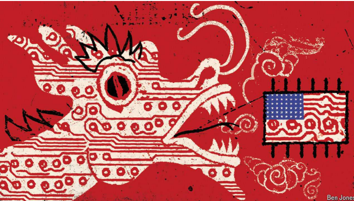

# The front line of the tech war is in Asia

The two superpowers are vying for influence. China will not necessarily win

vying：（激烈）竞争；争夺；相争；较劲，原形为vie

not necessarily：不一定

原文：

A  TECHNOLOGY tussle between the two superpowers is never far away. This week

the *Wall Street Journal* reported a breach of American telecoms networks by

a Chinese hacking group known as “Salt Typhoon”, which was seemingly

intended to glean knowledge about American wiretapping activities. In both

countries, deep mistrust has led to a policy of shunning the other’s digital

infrastructure. Uncle Sam bars Huawei, a Chinese firm, from installing its

telecoms kit in America; China discourages the sale of Silicon Valley’s

servers and cloud-computing products within its borders.

两个超级大国之间的一场技术角力从未远离。《华尔街日报》本周报道了一个名为“盐台风”的中国黑客组织对美国电信网络的入侵，该黑客组织似乎意在收集有关美国窃听活动的信息。在这两个国家，深深的不信任导致了回避对方数字基础设施的政策。山姆大叔禁止中国公司华为在美国安装其电信设备；中国不鼓励在其境内销售硅谷的服务器和云计算产品。

学习：

tussle：英 [ˈtʌs(ə)l] 扭打；争斗

glean：搜集（信息或材料）

wiretapping：窃听；（用秘密连线方法）窃听电话；（wiretap的现在分词）

bar：禁止

kit：设备

telecoms kit：电信设备

原文：

Yet in much of the world American and Chinese infrastructure—the data

centres, undersea cables and wires that underpin the internet—sit side by

side, as the two countries compete for market share, profits and geopolitical

clout. The fiercest contest is in Asia. There the presence of Chinese digital

infrastructure firms is already substantial. Some 18% of all new subsea

cables worldwide in the past four years have been built by a single mainland

firm, many criss-crossing Asia. Alibaba’s cloud operation is active in nine

Asian countries and Huawei has built many mobile networks.

然而，在世界大部分地区，美国和中国的基础设施——支撑互联网的数据中心、海底电缆和电线——并肩而立，两国争夺市场份额、利润和地缘政治影响力。最激烈的竞争在亚洲。在那里，中国数字基础设施公司的存在已经相当可观。在过去的四年里，全球所有新海底电缆的18%是由一家大陆公司建造的，其中许多横跨亚洲。阿里巴巴的云业务活跃在九个亚洲国家，华为建立了许多移动网络。

学习：

clout：影响力；势力；权势

criss-crossing：交叉杂交；横跨

原文：

China’s success partly reflects a government plan. Its Digital Silk Road

strategy, a branch of President Xi Jinping’s Belt and Road initiative, aims to

dominate the region’s internet plumbing. It helps, too, that Chinese firms are

innovative and cheaper than American ones, though some are aided by

hidden subsidies from the government. By one estimate Chinese cloud

services cost 40% less than American-run ones.

中国的成功部分反映了政府的计划。其数字丝绸之路战略是主席一带一路倡议的一个分支，旨在主导该地区的互联网管道。这也有助于中国公司的创新和比美国公司更便宜，尽管一些公司得到了政府的隐性补贴。据估计，中国的云服务比美国运营的便宜40%。

学习：

plumbing：管道设施；水暖工程

原文：

If China came to dominate Asia’s digital infrastructure, the consequences

would be profound. Its ruling Communist Party wants to set the norms that

govern data and the internet. China’s pull within the world’s technical

standard-setting bodies has grown and it has promoted a vision of “data

sovereignty”, under which governments control information and make sure

it is stored locally, so nothing can escape the state’s grasp.

如果中国开始主导亚洲的数字基础设施，后果将是深远的。中国执政的共产党希望制定管理数据和互联网的规范。中国在全球技术标准制定机构中的影响力有所增强，它推动了“数据主权”的愿景，即政府控制信息，并确保信息存储在本地，因此任何东西都逃不过政府的掌控。

## **Digital dilemma**

原文：

Worse, Chinese-run digital infrastructure could expose Asian countries to

the risks of snooping and sabotage. Some governments are complacent about

this. They should not be. Chinese hackers have stolen intelligence on the

South China Sea from the Philippines, and have targeted Malaysia’s

Kasawari gasfield, which is in waters that China claims.

更糟糕的是，中国运营的数字基础设施可能会让亚洲国家面临被窥探和破坏的风险。一些政府对此沾沾自喜。他们不应该。中国黑客从菲律宾窃取了南海的情报，并将目标对准了马来西亚的卡萨瓦里气田，该气田位于中国声称拥有主权的水域。

学习：

snooping：窥探；（snoop的现在分词形式）

sabotage：破坏；蓄意破坏（以防止敌方利用或表示抗议）

complacent：自鸣得意的；沾沾自喜的          

原文：

When mobile-telecoms networks were being built in the 2000s, two Chinese

firms, Huawei and ZTE, soundly defeated their American and European rivals

in Asia. But that does not mean Chinese firms will necessarily win the battle

to supply the next generation of digital infrastructure. The investment cycle

has barely started. Tech firms will be investing tens of billions of dollars

annually in data centres in Asia for years to come. And the picture is far

from uniform. One study finds that China dominates cloud-computing hubs

in five of 12 Asian countries, America leads in five and they are neck and

neck in two. Some countries, including India, have recently grown warier of

the security risk posed by Chinese firms.

当移动电信网络在21世纪初建立时，两家中国公司，华为和中兴，在亚洲完胜他们的美国和欧洲对手。但这并不意味着中国公司一定会赢得供应下一代数字基础设施的战斗。投资周期才刚刚开始。未来几年，科技公司将每年向亚洲的数据中心投资数百亿美元。而且情况远非一致。一项研究发现，在12个亚洲国家中，中国在5个国家的云计算中心占据主导地位，美国在5个国家领先，两个国家并驾齐驱。包括印度在内的一些国家最近对中国公司带来的安全风险更加警惕。

原文：

To prevail, America should focus on three priorities. The first is to get

tougher with its treaty allies which have become wholly reliant on China, in

particular Thailand and the Philippines. The latter is intensifying its military

links with America even as its digital infrastructure is vulnerable, which

makes little sense. Some countries, such as Pakistan and Cambodia, have

ceded digital sovereignty to China and are lost causes.

为了获胜，美国应该专注于三个优先事项。首先是对其完全依赖中国的条约盟友更加强硬，特别是泰国和菲律宾。后者正在加强与美国的军事联系，尽管其数字基础设施很脆弱，这没有什么意义。一些国家，如巴基斯坦和柬埔寨，已经把数字主权让给了中国，而且注定要失败。

学习：

prevail：（在比赛、竞赛或争辩中）击败；获胜；占优势

Cambodia：柬埔寨

ceded：割让；放弃；（cede的过去式）          

原文：

Second, America should aim to develop an Asian alliance for cyber-security

and artificial intelligence. In 2017 Donald Trump abandoned an ambitious

regional trade deal, the Trans-Pacific Partnership, that would have governed

digital commerce among many other things. Reviving that will be

impossible, due to America’s protectionist turn, but a narrower agreement

could plausibly be struck with some countries, giving them access to

American technology in return for assurances of heightened caution over

Chinese security risks.

其次，美国应该致力于发展亚洲网络安全和人工智能联盟。2017年，唐纳德·特朗普(Donald Trump)放弃了一项雄心勃勃的区域贸易协定《跨太平洋伙伴关系协定》(Trans-Pacific Partnership)，该协定将管理数字商务和其他许多事务。由于美国的保护主义转向，恢复这一点是不可能的，但可能会与一些国家达成一项更窄的协议，让它们获得美国技术，以换取对中国安全风险提高警惕的保证。

原文：

Last, America’s intelligence agencies could shed more light on Chinese

cyber-shenanigans. Public knowledge about the scale of Chinese snooping

and hacking is limited. It is time to raise awareness that cheap Chinese

digital infrastructure has a sting in its tail. ■

最后，美国情报机构可以揭露更多中国的网络诡计。公众对中国窥探和黑客行为的了解是有限的。现在是时候让人们意识到廉价的中国数字基础设施的尾巴上有一根刺了。■

学习：

shenanigans：美 [ʃəˈnænəɡənz] 恶作剧；诡计；欺诈行为；不诚实的行为

## 后记

2024年10月11日19点14分于上海。

