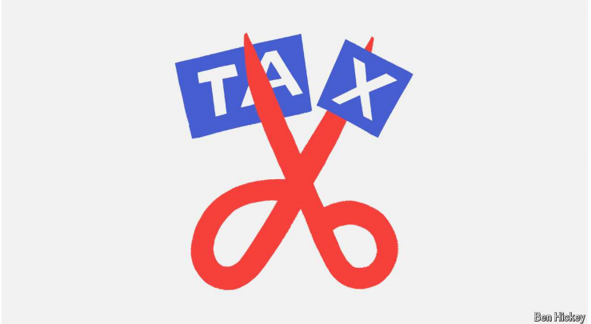
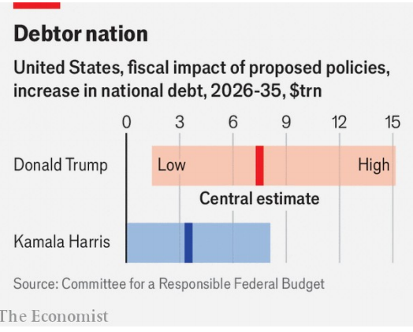

# The US tax code will change next year; the presidential election will determine how

Donald Trump promises cuts galore, while Kamala Harris would target the middle-class

galore： 美 [ɡəˈlɔr] 丰富的；大量的

原文：

NOT ONLY are taxes one of the only certainties in life, they are also one of

the only certainties in this presidential election. That is because of the

looming expiration of tax provisions passed in 2017, the main legislative

accomplishment of Donald Trump’s term in the White House. This presents

a fiscal cliff. By the end of 2025 whoever is president must sign new rules

into law, or most Americans will see sharply higher income taxes.

税收不仅是生活中唯一确定的事情之一，也是这次总统选举中唯一确定的事情之一。这是因为2017年通过的税收条款即将到期，这是唐纳德·特朗普在白宫任期内的主要立法成就。这就出现了财政悬崖。到2025年底，无论谁是总统，都必须签署新的法规，否则大多数美国人将会面临更高的所得税。

学习：

provision：条款

原文：

Tax negotiations are thus guaranteed to occupy much of Kamala Harris’s or

Donald Trump’s first year in office, giving them a chance to put their stamp

on America’s tax code. Mr Trump favours broad, sweeping cuts that he

believes would energise investment and innovation, whereas Ms Harris

hopes to use tax changes to reduce inequality.

因此，税收谈判肯定会占据卡玛拉·哈里斯或唐纳德·特朗普执政第一年的大部分时间，让他们有机会在美国的税法上打上自己的印记。特朗普支持广泛、彻底的减税，他认为这将激励投资和创新，而哈里斯希望利用税收改革来减少不平等。

学习：

tax code：税法；税务代码；税收法规

原文：

Mr Trump, unsurprisingly, hopes to keep many of his original cuts in place.

These include: reductions to most individual income-tax rates; a doubling of

the exemption on estate taxes, paid after death; and rules that make it easier

for businesses to expense more investments. Simply enacting these

extensions would cost the federal government about $4.6trn in lost revenue

over the next decade, according to the Congressional Budget Office, a

nonpartisan scorekeeper.

不出所料，特朗普希望维持他最初的许多削减。这些措施包括:降低大多数个人所得税税率；死后缴纳的遗产税免税额增加一倍；以及让企业更容易花费更多投资的规则。根据无党派记分员国会预算办公室(Congressional Budget Office)的数据，在未来十年内，仅仅实施这些延长措施就会让联邦政府损失约4.6万亿美元的收入。

学习：

scorekeeper：记分员；计分员；记录员

原文：

This would just be the starting point for Mr Trump. As the election has

turned more competitive, the former president has pledged more tax cuts. In

2017 he slashed the corporate tax rate from 35% to 21%. Now he wants to

take it even lower, perhaps to 15%. Another promise is to exempt employees

such as waiters from taxes on tips. Mr Trump has also said that he would

make Social Security benefits tax-free in order to help retirees. And he has

promised to reverse one measure from his 2017 law: he would let residents

of high-tax states resume deducting more of their local taxes from their

federal tax bills.

这对特朗普来说只是一个起点。随着选举变得更加激烈，这位前总统承诺进一步减税。2017年，他将公司税率从35%大幅削减至21%。现在他想把它降得更低，也许降到15%。另一项承诺是免除服务员等雇员的小费税。特朗普还表示，他将让社会保障福利免税，以帮助退休人员。他还承诺逆转2017年法律中的一项措施:他将让高税收州的居民恢复从联邦税单中扣除更多的地方税。

学习：

slash：降低

exempt：免除

deducting：扣除；（deduct的现在分词）

>
>最后一句话的意思是：**特朗普承诺恢复一项被他自己2017年税法废除的规定**——允许高税州居民**在联邦税申报中扣除更多的地方税款**。如果这个政策恢复，高税州居民的**整体税负会减少**，因为他们可以从应纳的联邦税中扣除更多的地方税。  
>
>### 背景：
>- 在2017年的税改中，**州和地方税的扣除上限被设定为10,000美元**，这对高税州（如纽约、加利福尼亚）的居民影响很大，增加了他们的联邦税负。
>- 恢复这项扣除将使高税州居民在联邦税上享受更多减免，因此他们的**税负会减少**。
>
>### 例子：
>- **English**: If residents of California can deduct more state taxes from their federal taxes, they will end up paying less in total taxes.
>- **中文**：如果加州居民可以从联邦税中扣除更多的州税，他们的总体税负会减少。

原文：

Added together Mr Trump’s tax platform is eye-wateringly expensive,

running to as high as $10trn over the next decade, according to Andrew

Lautz of the Bipartisan Policy Centre, a think-tank based in Washington, DC.

Mr Trump has proposed some offsets, including higher tariffs (see trade

policy brief) and scrapping the Biden administration’s green-energy tax

credits. These would be insufficient to plug the fiscal holes, however, which

means the federal deficit—already expected to reach 6% of GDP—may expand

to 8% or so under Mr Trump. His plans could add $7.5trn to America’s debts

over a decade, says the Committee for a Responsible Federal Budget (CRFB), a

non-profit group.

DC智库两党政策中心(Bipartisan Policy Centre)的安德鲁劳茨(Andrew Lautz)表示，特朗普的税收纲领加在一起非常昂贵，未来十年将高达10万亿美元。特朗普提出了一些抵消措施，包括提高关税(见贸易政策简报)和取消拜登政府的绿色能源税收抵免。然而，这些不足以填补财政漏洞，这意味着在特朗普执政期间，联邦赤字——预计将达到GDP的6%——可能会扩大到8%左右。非营利组织负责任联邦预算委员会(CRFB)表示，他的计划可能会在十年内增加7.5万亿美元的债务。

学习：

eye-wateringly：热烈盈眶地，非常地

tax credits：税收抵免

plug：堵塞；封堵

plug the fiscal holes：填补财政漏洞

原文：

Ms Harris’s tax plans draw heavily on Joe Biden’s budgets. She has vowed

to extend Mr Trump’s expiring tax cuts for individuals earning less than

$400,000 per year. For those above that line, the tax rate would revert to its

pre-2018 level of 39.6%. She also wants to partially undo Mr Trump’s

corporate-tax cuts, taking the rate on companies up to 28%. Most

controversially, she wants to tax unrealised capital gains for the wealthiest

Americans—a useful revenue source but hard to administer and possibly

detrimental to growth.

哈里斯女士的税收计划严重依赖乔·拜登的预算。她发誓要延长特朗普即将到期的针对年收入低于40万美元的个人的减税政策。对于高于该线的人，税率将恢复到2018年前的39.6%。她还希望部分取消特朗普的公司税削减，将公司税率提高至28%。最具争议的是，她想对最富有的美国人征收未实现的资本利得税——这是一个有用的收入来源，但难以管理，而且可能不利于经济增长。

学习：

draw on：依赖于

vowed：誓言；誓约；许愿；发誓；起誓；（vow的过去式）          

原文：

At the same time Ms Harris has proposed a range of tax cuts, largely in the

form of targeted credits. She wants to nearly double the tax credit for

families with children to $3,600 per year, in addition to giving a $6,000 tax

credit to families with newborns. For lower-income Americans, she would

like to expand the earned-income tax credit (EITC), a kind of reverse income

tax. She has proposed downpayment assistance of $25,000 for first-time

homebuyers and a deduction of up to $50,000 for business startups. And like

Mr Trump, she has pledged to exempt taxes on tips (indeed, Mr Trump has

mocked her for copying this idea).

与此同时，哈里斯女士提出了一系列减税措施，主要是以定向信贷的形式。她希望将有孩子的家庭的税收抵免增加近一倍，达到每年3600美元，此外还为有新生儿的家庭提供6000美元的税收抵免。对于低收入美国人，她希望扩大收入所得税抵免(EITC)，这是一种反向所得税。她提议为首次购房者提供25，000美元的首付补助，为创业公司提供高达50，000美元的扣除。和特朗普一样，她也承诺对小费免税(事实上，特朗普曾嘲笑她抄袭这一想法)。

学习：

newborns：婴儿；（newborn的复数）          

downpayment：首期付款      

原文：

Totted up, Ms Harris’s proposals would generate nearly $2trn in federal

revenue over the next decade. But the higher taxes—especially the increased

corporate levy—would weigh on growth. The Tax Foundation, another

Washington think-tank, estimates that her plans would reduce GDP by about

2% over the next decade. The result would be a continued increase in the

deficit, but probably not as great as under Mr Trump. Her plans may add

$3.5trn to the national debt, according to the CRFB. Ms Harris would at least

succeed in her aim of making the tax system a little better at redistributing

income from the wealthy to the poor.

合计起来，哈里斯女士的提议将在未来十年产生近2万亿美元的联邦收入。但是更高的税收——尤其是增加的公司税——会拖累经济增长。华盛顿的另一个智囊团——税收基金会估计，她的计划将会使未来十年的GDP下降2%。结果将是赤字继续增加，但可能没有特朗普执政时期那么大。据CRFB称，她的计划可能会增加3.5万亿美元的国债。哈里斯女士至少会成功实现她的目标，使税收制度在从富人到穷人的收入再分配方面做得更好一点。

学习：

totted：合计；（tot的过去式和过去分词）

weigh on：打压          

原文：

So long as Congress is divided, neither Mr Trump nor Ms Harris will be able

to deliver on their full plans. But this is why the expiration of the 2017 tax

provisions is so important. Both the House and the Senate will be highly

motivated to find a way to extend the cuts, at least in part. That will give the

president leverage to push for a new bill along the lines of what he or she

pledged while campaigning. Voters therefore have a real choice between

different visions of who should pay taxes, and how much they should pay. ■

只要国会存在分歧，特朗普和哈里斯都无法实现他们的全部计划。但这就是2017年税收条款到期如此重要的原因。众议院和参议院都将非常积极地寻找一种方法来延长削减，至少是部分延长。这将使总统能够根据他或她在竞选时的承诺推动一项新的法案。因此，对于谁应该纳税以及他们应该付多少税的不同观点，选民们有真正的选择。■

学习：

divided：有分歧的；分离的

deliver on：履行；实行；实现承诺

full plans：全部计划

## 后记

2024年10月12日14点43分于上海。

