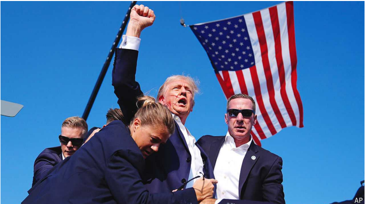
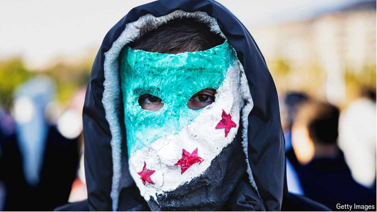
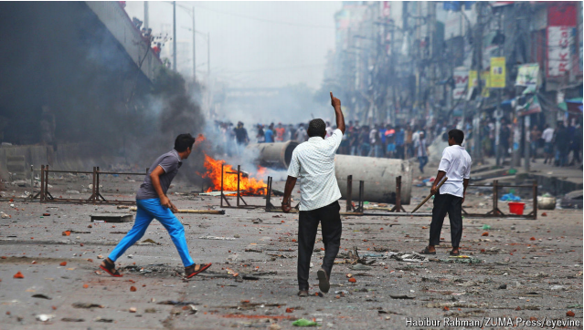
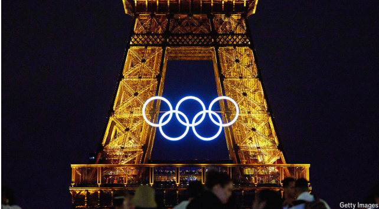
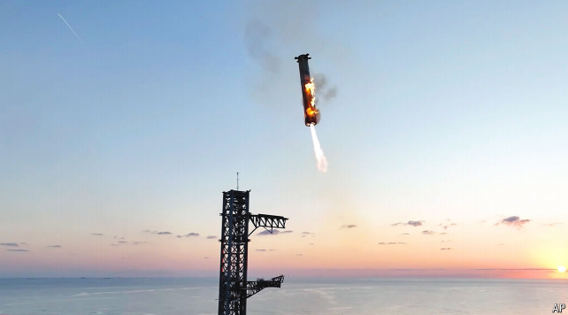

# The world this year 2024

原文：

In a remarkable comeback **Donald Trump** was elected as America’s

president for a second time. Six months before the vote Mr Trump was

found guilty of falsifying business records in a hush-money case, the first

criminal conviction handed to anyone who has sat in the Oval Office. In July

a gunman tried to assassinate the Republican at a campaign event, slightly

wounding him; Mr Trump’s rallying cry of “Fight, fight, fight!” energised

his base. Kamala Harris’s “brat summer” turned out to be a damp squib for

the Democrats, who also lost control of the Senate at the election. Ms Harris

became the Democratic candidate when Joe Biden pulled out of the race

after a disastrous debate for him.

唐纳德·特朗普(Donald Trump)出人意料地再次当选美国总统。在投票前6个月，	特朗普被判在一桩封口费案件中伪造商业记录，这是入主椭圆形办公室的人首次被判有罪。7月，一名持枪者试图在一次竞选活动中刺杀这位共和党人，使他受了轻伤；特朗普的战斗口号“战斗，战斗，战斗！”激发了他的选民团体。卡玛拉·哈里斯的“brat summer”对民主党来说是一记哑炮，他们也在选举中失去了对参议院的控制。乔·拜登在一场灾难性的辩论后退出竞选，哈里斯女士成为民主党候选人

学习：

falsify：伪造

falsifying business records 

hush-money：封口费

Oval Office： 美 [ˈoʊvl]

rallying cry：战斗口号；团结口号；集会口号          

squib： 美 [skwɪb] 短评；短新闻；讽刺短文；小爆竹；小鞭炮

a damp squib：哑炮；令人失望的事；令人扫兴的事          

## **I could never be president**

原文：

**Elon Musk** aligned himself with Mr Trump and spent $277m backing the

Republicans. His wealth has risen by $170bn since the election, thanks

mostly to the increase in the value of his Tesla stock

埃隆·马斯克(Elon Musk)与特朗普结盟，并斥资2.77亿美元支持共和党。自大选以来，他的财富增加了1700亿美元，这主要归功于他所持特斯拉股票的增值

学习：

align：使结盟

原文：

**Israel** invaded **Lebanon**, after Hizbullah intensified its rocket attacks. In

preparation for its offensive Israel injured or killed thousands of Hizbullah

operatives by tapping and exploding their pagers and Israeli forces went

about eliminating the Iranian-backed militia’s leadership, including Hassan

Nasrallah, its long-serving head. The leadership of **Hamas** was also all but

wiped out. Yahya Sinwar, the mastermind of the terror attacks on October

7th 2023, was killed sitting in a chair. In April Iran launched its first direct

missile attack on Israel. America, Britain, France, Jordan and other Arab

states contributed to Israel’s defence.

在真主党加强火箭袭击后，以色列入侵了黎巴嫩。为了准备进攻，以色列通过窃听和引爆他们的传呼机伤害或杀死了数千名真主党特工，以色列军队着手清除伊朗支持的民兵组织的领导层，包括其长期任职的领导人哈桑·纳斯鲁拉。哈马斯的领导层也几乎被消灭。2023年10月7日恐怖袭击的主谋叶海亚·辛瓦尔坐在椅子上被杀。4月，伊朗对以色列发动了首次直接导弹袭击。美国、英国、法国、约旦和其他阿拉伯国家为以色列的防务做出了贡献。

学习：

Hizbullah：真主党；希兹布拉；

intensified：变强；加强；加剧；（intensify的过去式和过去分词）

offensive：攻势；进攻；攻击；

operatives： 美 [ˈɑpərətɪvz] 技工；侦探；工作人员；（尤指政府的）特工人员；（operative的复数）

tap：（在电话上）安装窃听器

pager： 美 [ˈpeɪdʒər]   寻呼机；传呼机；呼叫器

militia：美 [məˈlɪʃə] 民兵组织；国民卫队；非正规军队

all but：几乎；差不多

mastermind：策划者；主谋；策略家；创意者；幕后操纵者

原文：

The war in **Gaza** ground on, even though Hamas found itself increasingly

isolated and boxed in. There was no let-up in the misery for ordinary Gazans

caught up in the fighting, and aid agencies warned of possible famine. In

December Israel and Hamas seemed to be moving closer to a ceasefire.

加沙的战争仍在继续，尽管哈马斯发现自己越来越孤立无援。陷入战争的普通加沙人的痛苦丝毫没有减轻，援助机构警告说可能会发生饥荒。12月，以色列和哈马斯似乎更接近停火。

学习：

ground on：持续，延续

>**"Ground on"** 是一个短语，意味着**持续或延续**，通常指某事持续进行，虽然可能变得乏力或进展缓慢。在这里，"the war in Gaza ground on" 表示战争**持续进行**，即便进展缓慢且形势严峻。
>
>- 例句：
>  - **English**: "The negotiations ground on for weeks without any clear resolution."
>    **中文**: “谈判持续了几周，始终没有明确的解决方案。”
>  - **English**: "The debate ground on despite the mounting frustration of the participants."
>    **中文**: “辩论持续进行，尽管参与者的沮丧情绪不断增加。”

boxed in：被困住

>**"Boxed in"** 表示**被困住或限制行动空间**，通常指一个人或团体被困在某个地方，或者由于某种原因无法自由行动或逃脱。在这个上下文中，"Hamas found itself increasingly isolated and boxed in" 说明哈马斯逐渐变得**孤立且受限**，无法自由行动或逃脱困境。
>
>- 例句：
>  - **English**: "The army found themselves boxed in by enemy forces and unable to advance."
>    **中文**: “军队发现自己被敌军包围，无法前进。”
>  - **English**: "The team was boxed in by their opponents’ strong defense, unable to score any points."
>    **中文**: “球队被对手的强大防守压制，无法得分。”

let-up：减弱；缓和；停止；

caught up：卷入；缠住；被动地参与进去          

famine： 美 [ˈfæmɪn] 饥荒；

原文：

**Iran’s** president, Ebrahim Raisi, was killed in a helicopter crash. The new

president, Masoud Pezeshkian, brought a change of tone to the government,

suggesting he would like to restart negotiations with the West. At the start of

the year Islamic State bombed an event commemorating an Iranian general

assassinated by America in 2020, killing 95 people.

伊朗总统易卜拉欣·赖西在一次直升机坠毁事故中丧生。新总统Masoud Pezeshkian改变了政府的语气，暗示他希望重启与西方的谈判。今年年初，伊斯兰国轰炸了一场纪念2020年被美国暗杀的伊朗将军的活动，造成95人死亡。

学习：

 Islamic State：伊斯兰国

commemorating：美 [kəˈmeməreitɪŋ] 纪念；成为…的纪念；庆祝；（commemorate的现在分词）

原文：

**Syrian** rebels rolled into Damascus, bringing an end to the 53-year rule of

the Assad regime. The speed of the advance took everyone by surprise, not

least Bashar al-Assad, who fled to Moscow. The rebels are led by an Islamist

group, which has appointed an interim prime minister until March 2025.

叙利亚叛军涌入大马士革，结束了阿萨德政权53年的统治。推进的速度出乎所有人的意料，尤其是逃到莫斯科的巴沙尔·阿萨德。叛军由一个伊斯兰组织领导，该组织任命了一名临时总理，任期至2025年3月。

学习：

rebels：反叛者；造反者；叛逆者；反政府的人；反对派；（rebel的复数）

Damascus： 大马士革

interim：美 [ˈɪntərɪm] 暂时的；临时的；过渡期的；

## **Election day**

2024年12月30日23点18分开始学习

原文：

Labour won **Britain’s** election with a stonking majority, ending 14

years of Conservative rule. But things quickly turned sour for Sir

Keir Starmer’s new government. Anti-migrant riots soon broke out

and a decision to end winter-fuel aid for pensioners was widely

criticised. Businesses took fright at a tax-raising budget. The Tories

chose Kemi Badenoch as their new leader, the first black person to

head one of Britain’s big parties. In February Michelle O’Neill

became the first Irish-nationalist to lead Northern Ireland’s

executive

工党以压倒性的多数赢得了英国大选，结束了长达14年的保守党统治。但基尔·斯塔默爵士的新政府很快就陷入困境。反移民骚乱随之爆发，终止老年人冬季燃料补贴的决定遭到广泛批评。企业对增税预算感到恐慌。保守党选择凯米·巴德诺赫为新任党魁，她是首位领导英国主要政党的黑人。2月，米歇尔·奥尼尔成为首位领导北爱尔兰行政部门的爱尔兰民族主义者。

学习：

stonking：美 [ˈstɑŋkɪŋ] 极大的

stonking majority：压倒性优势

take fright at：对...感到害怕      

>这里的 **"executive"** 指的是**行政机关或政府行政部门**，尤其是指一个地区或国家的最高执行管理机构。在这段话中，它特指**北爱尔兰的行政机构**，即北爱尔兰政府的领导层。
>
>在北爱尔兰，**行政部门**由一位**首席部长 (First Minister)** 和一位**副首席部长 (Deputy First Minister)** 共同领导。这种安排源自《贝尔法斯特协议》(Good Friday Agreement)，旨在确保权力共享。
>
>------
>
>**例句：**
>
>- **English**: "The executive passed a new law to regulate housing prices."
>  **中文**: “行政部门通过了一项新法律来规范房价。”
>- **English**: "The local executive is responsible for implementing policies approved by the legislature."
>  **中文**: “地方行政部门负责执行立法机关批准的政策。”

原文：

**Ukraine** lost ground in its fight against Russia. In a bold move,

Ukrainian troops took the fight across the border into Russia’s

Kursk province. But Russia turned to North Korea for soldiers to

replenish its forces, the first time in a century it has invited a

foreign force into the country. **NATO** allies sent F-16 fighter jets to

Ukraine for the first time and America allowed it to use long-range

ATACMS missiles. Meanwhile, Sweden at last joined NATO. Mark

Rutte became the military alliance’s new secretary-general.

乌克兰在与俄罗斯的战斗中节节败退。在一次大胆的行动中，乌克兰军队越过边境进入了俄罗斯的库尔斯克省。但俄罗斯向朝鲜寻求士兵以补充其军队，这是一个世纪以来俄罗斯首次邀请外国军队进入该国。北约盟国首次向乌克兰派出F-16战斗机，美国允许其使用远程反坦克导弹。与此同时，瑞典终于加入了北约。马克·吕特成为军事联盟的新秘书长。

学习：
replenish：美 [rɪˈplenɪʃ] 补充；再装满；重新填充

## **My vote don’t count**

原文：

In **Russia** Alexei Navalny, the country’s leading opposition figure,

died mysteriously in the Arctic prison where he was being held. No

serious opponents to Vladimir Putin were allowed to stand in a

sham presidential election. Soon after the poll an affiliate of

Islamic State in Central Asia attacked a venue holding a rock

concert in Moscow’s suburbs, killing 145 people.

俄罗斯反对派领袖阿列克谢·纳瓦尔尼在关押他的北极监狱神秘死亡。不允许弗拉基米尔·普京的真正反对者参加虚假的总统选举。投票后不久，中亚伊斯兰国的一个分支袭击了莫斯科郊区举行摇滚音乐会的场地，造成145人死亡。

学习：

prison where he was being held：被关押用held

sham：虚假的；假装的；伪造的；假的；表面的

affiliate： 美 [əˈfɪlieɪt , əˈfɪliət] 分支机构；附属机构；附属单位

原文：

With inflation easing, the big central banks started to cut **interest**

**rates** for the first time in years. The European Central Bank set the

ball rolling, followed by the Bank of England and the Federal

Reserve. The Bank of Japan went in the other direction, raising its

main rate in March for the first time in 17 years. At the end of the

year, the Fed cut again, taking its main rate to a range of between

4.25% and 4.5%, but it also signalled that it would drastically slow

the pace of reductions in 2025.

随着通货膨胀的缓解，大型中央银行多年来首次开始降息。欧洲中央银行开始行动，接着是英国银行和美联储。日本银行反其道而行之，17年来首次在3月提高了主要利率。年底，美联储再次降息，将其主要利率降至4.25%至4.5%之间，但它也表示，将在2025年大幅放缓降息步伐。

原文：

**Stockmarkets** shuddered at the Fed’s forecast of a slower pace of

easing, though it was generally a good year for equities, with

markets hitting many record highs. The S&P 500 broke its first of

the year in January, two years after the previous record was set. It

has risen by 23% in 2024. Japanese markets broke highs set 34

years ago, but they plunged in early August in an unwinding of the

carry trade. The Nikkei 225 is up by 17%. **Nvidia**, which saw its

stock increase by 170%, vied with Apple and Microsoft for the title

of world’s most valuable company.

尽管今年对股票来说是个好年景，市场创下了许多历史新高，但股票市场对美联储放缓宽松步伐的预测感到不寒而栗。标准普尔500指数在一月份打破了今年的第一个记录，上一个记录在两年前。2024年已经上涨了23%。日本市场突破了34年前创下的高点，但在8月初套利交易平仓时暴跌。日经225指数上涨了17%。Nvidia的股票上涨了170%，与苹果和微软争夺世界最有价值公司的头衔。

学习：

shuddered：发抖；战栗；（shudder的过去式和过去分词）

unwinding：平仓

carry trade：利差交易；套利交易          

vied：美 [vaɪd] 竞争；（vie的过去式和过去分词）

原文：

**Japan’s** new prime minister, Ishiba Shigeru, called a snap election

and in a shock result his Liberal Democratic Party lost its majority.

He now depends on a minority coalition to govern, just as the

country faces some stiff economic challenges.

日本新任首相石破茂宣布提前举行大选，令人震惊的是，他领导的自民党失去了多数席位。他现在依靠少数党联盟来执政，就像这个国家面临一些严峻的经济挑战一样。

学习：

snap election：仓促的选举

原文：

In **Bangladesh** Sheikh Hasina won re-election in January, but huge

demonstrations in July and a violent crackdown on the protests

caused her to flee the country, ending 15 years of autocratic rule.

Elsewhere in South Asia **India’s** BJP lost its majority in India’s

election, forcing Narendra Modi to turn to allied parties for

support. **Sri Lanka’s** presidential election was won by Anura

Kumara Dissanayake, a former Marxist. Candidates linked to

Imran Khan claimed that **Pakistan’s** election was rigged; parties

aligned with the army formed the government.

在孟加拉国，谢赫·哈西娜(Sheikh Hasina)在1月份赢得了连任，但7月份的大规模示威和对抗议的暴力镇压导致她逃离了该国，结束了15年的专制统治。在南亚其他地区，印度的BJP失去了在印度选择党中的多数席位，迫使纳伦德拉·莫迪转向盟友政党寻求支持。前马克思主义者阿努拉·鸠摩罗王·迪萨纳亚克赢得了斯里兰卡总统选举。与伊姆兰·汗有关联的候选人声称巴基斯坦的选举被操纵；与军队结盟的政党组成了政府。

学习：

demonstrations ：示威

crackdown：镇压

autocratic：美 [ˌɔːtəˈkrætɪk] 独裁的；专制的

rigged： 美 [rɪgd] 操纵（rig的过去式）

## **Vote, baby, vote**

原文：

More than 70 elections were held in 2024 in countries covering

more than half of the world’s population. In **South Africa** the

African National Congress lost its majority for the first time since

the end of apartheid. Claudia Sheinbaum was elected as **Mexico’s**

first female president. Prabowo Subianto, **Indonesia’s** defence

minister, declared victory in a presidential election. After a

constitutional crisis **Senegal’s** presidential ballot was won by

Bassirou Diomaye Faye, an anti-corruption crusader who was freed

from prison less than two weeks before the vote. **Georgia’s** Russia

friendly governing party was returned to power, despite widespread

protests against a law curtailing the media and NGOS.

2024年在覆盖世界一半以上人口的国家举行了70多次选举。在南非，非洲国民大会自种族隔离结束以来首次失去了多数席位。克劳迪娅·申鲍姆当选为墨西哥第一位女总统。印度尼西亚国防部长普拉博沃·苏比安托宣布在总统选举中获胜。在一场宪法危机之后，Bassirou Diomaye Faye赢得了塞内加尔总统选举，他是一名反腐败斗士，在投票前不到两周被释放。尽管针对限制媒体和非政府组织的法律的广泛抗议，格鲁吉亚亲俄罗斯的执政党重新掌权。

学习：

apartheid： 美 [əˈpɑːrtaɪt] 种族隔离（前南非政府推行的政策） **注意发音**

crusader： 美 [kruˈsedɚ] 改革者

原文：

**Thailand** was thrown into political turmoil when the Constitutional

Court dismissed Srettha Thavisin as prime minister. Paetongtarn

Shinawatra was sworn in as Thailand’s new leader. She is the

daughter of Thaksin Shinawatra, an influential former prime

minister and de facto chief of the ruling Pheu Thai party

当宪法法院解除Srettha Thavisin的总理职务时，泰国陷入了政治动荡。Paetongtarn Shinawatra宣誓就任泰国新领导人。她是他信·西那瓦的女儿，他信是一位有影响力的前总理，也是执政党为泰党事实上的领袖

学习：

de facto：（未被正式认可但）实际上存在的；实际的；事实上的；

## **People have the power**

原文：

**South Korea’s** president, Yoon Suk Yeol, was impeached by

parliament after he briefly imposed martial law. Mr Yoon’s order

prompted huge protests in Seoul, calling on him to resign. The

constitutional court now has six months to decide whether he

should indeed leave office.

韩国总统尹锡悦在短暂实施戒严令后被国会弹劾。尹先生的命令在首尔引发了大规模抗议，要求他辞职。宪法法院现在有六个月的时间来决定他是否真的应该离职。

学习：

martial：战争的；战斗的；军事的

martial law：戒严；戒严令；戒严状态；军事管制；

原文：

In **France** Emmanuel Macron’s centrists lost heavily to hard-right

and left-wing parties in a snap parliamentary election. The

president appointed a moderate prime minister, who lasted just

three months before losing a vote of confidence, the first time the

National Assembly has turfed out a government since 1962. Mr

Macron appointed another centrist, François Bayrou, to the job. It

wasn’t all gloom for Mr Macron. The Paris **Olympics** were a

success and a restored **Notre Dame** reopened just five years after a

fire gutted the cathedral.

在法国的议会选举中，埃马纽埃尔·马克龙的中间派严重输给了极右和左翼政党。总统任命了一位温和的总理，他只任职了三个月就失去了信任投票，这是自1962年以来国民议会第一次驱逐政府。马克龙任命另一位中间派人士弗朗索瓦·贝鲁担任这一职务。对马克龙来说，这并不完全是悲观的。巴黎奥运会取得了成功，修复后的巴黎圣母院在大火烧毁大教堂仅仅五年后重新开放。

学习：

turf：赶走；驱逐

gut：毁坏（建筑物的）内部

原文：

The beleaguered **German** government led by Olaf Scholz also lost

a vote of confidence in parliament, triggering early elections for

February 2025.

由Olaf Scholz领导的陷入困境的德国政府也失去了议会的信任投票，引发了2025年2月的提前选举。

学习：

beleaguered：围困的；饱受批评的；处于困境的

原文：

Hurricane Helene, which hit Florida and the south-eastern United

States, was among the worst **storms** of 2024, killing over 200

people there. Valencia was deluged by flooding from heavy rains;

at least 220 people died. In December Mayotte, in the Indian

Ocean, was devastated by a cyclone. Thousands of islanders are

missing.

袭击佛罗里达州和美国东南部的飓风海伦是2024年最严重的风暴之一，造成200多人死亡。瓦伦西亚被暴雨引发的洪水淹没；至少220人死亡。12月，印度洋上的马约特岛被飓风摧毁。成千上万的岛民失踪了。

学习：

deluged：美 ['dɛljʊdʒd] 使泛滥；泛滥；（deluge的过去式）

devastated：美 [ˈdevəsteɪtɪd] 毁坏；毁灭；蹂躏；（devastate的过去式）

cyclone：美 [ˈsaɪkloʊn] 旋风；气旋；旋转风暴；热带风暴

## **Ballot or the bullet**

原文：

**Venezuela’s** opposition candidate for president, Edmundo

González, was recognised by America and the EU as the winner of

an election, though Nicolás Maduro’s regime thought otherwise

and the autocrat stayed in office. America slapped new sanctions on

Venezuelan officials after the inevitable post-election crackdown

on the opposition.

委内瑞拉反对派总统候选人Edmundo González被美国和欧盟认为是选举的获胜者，尽管尼古拉斯·马杜罗政权不这么认为，独裁者仍然在位。在选举后对反对派不可避免的镇压之后，美国对委内瑞拉官员实施了新的制裁。

学习：

slap：惩罚；

slapped new sanctions：实施制裁

原文：

A new transitional council took charge in **Haiti**, though it could do

little to stop the violence and chaos caused by roaming gang lords.

A peacekeeping force led by Kenyan troops eventually made its

way to the country but had little effect. In November the council

sacked the prime minister it had approved in May. The worst

atrocity was the murder of 180 mostly elderly people by a gang

leader who believed they were using witchcraft.

一个新的过渡委员会接管了海地，尽管它在阻止流窜的黑帮老大引起的暴力和混乱方面无能为力。由肯尼亚军队领导的维和部队最终抵达该国，但收效甚微。11月，委员会解除了5月份批准的总理职务。最严重的暴行是一个帮派头目杀害了180名老人，其中大多数是老年人，他认为这些人在使用巫术。

学习：

roaming

gang lords：黑帮老大

>
>
>**"Roaming"**
>
>- 这里的 **"roaming"** 是动词 **"roam"** 的现在分词形式，意思是**到处游荡或漫游**，通常指没有固定方向地四处移动。
>- 在本句中，**"roaming gang lords"** 描述的是**四处游荡的帮派头目**，暗示这些头目控制着流动性很强的犯罪团伙，在海地各地肆虐制造暴力和混乱。
>
>**"Gang lords"**
>
>- **"Gang lords"** 指的是**帮派头目或犯罪团伙的领导人**，通常掌控着非法活动如贩毒、绑架和暴力犯罪。在这里，他们是引发海地暴力和混乱的主要势力。

sack：解雇

atrocity：美 [əˈtrɑːsəti] 暴行；残暴行为；暴虐行径

witchcraft： 美 [ˈwɪtʃkræft] 巫术；（尤指）妖术；

原文：

It was a bad year for the **car industry**. The slowdown in demand

for electric vehicles hurt Tesla, which reported its first year-on-year

decline in deliveries since 2020. Quarterly revenue at BYD, a

Chinese maker of EVs, overtook revenue at Tesla for the first time.

Tesla’s stock was languishing until the “Trump trade” boosted

shares in companies that markets think will do well under the new

administration. In Europe workers at Volkswagen went on strike

after the firm announced a painful restructuring. Carlos Tavares

abruptly resigned as chief executive of Stellantis. Honda and

Nissan talked about merging.

对汽车业来说，这是糟糕的一年。电动汽车需求的放缓伤害了特斯拉，该公司报告称，自2020年以来，交付量首次出现同比下降。中国电动汽车制造商比亚迪的季度收入首次超过了特斯拉。特斯拉的股票一直萎靡不振，直到“特朗普交易”提振了市场认为将在新政府下表现良好的公司的股票。在欧洲，大众汽车公司宣布痛苦的重组后，工人们举行罢工。唐唯实突然辞去了Stellantis首席执行官的职务。本田和日产谈论合并。

学习：

languishing：失去活力；变得衰弱；被迫处于逆境；没有进展没有成功；

Honda：本田

Nissan：日产

原文：

The industry was also rocked by Joe Biden imposing **tariffs** of

100% on Chinese-made EVs (though America imports few EVs

from China). The EU, a much bigger market for Chinese EVs,

followed suit by levying its own duties. China responded by

imposing trade penalties on certain European products. Tariffs will

be a big issue under Mr Trump, who has vowed to impose more of

them to protect American industry.

乔·拜登对中国制造的电动汽车征收100%的关税(尽管美国从中国进口的电动汽车很少)，也震动了汽车行业。对中国电动汽车来说，欧盟是一个更大的市场，它也紧随其后，征收了自己的关税。中国的回应是对某些欧洲产品实施贸易惩罚。在特朗普治下，关税将是一个大问题，他誓言要征收更多关税来保护美国工业。

原文：

Every company seemed to push out a strategy in 2024 for using

**artificial intelligence**, though Alphabet, Google’s parent company,

lost $80bn in market value in a day amid controversy over Gemini,

its AI model. In overcompensating for diversity Gemini depicted

erroneous images of historical figures, including black Vikings and

a female pope. Google also lost a landmark antitrust case over its

search engine. In 2025 a judge will decide whether to break up

Google.

似乎每家公司都推出了在2024年使用人工智能的战略，尽管谷歌母公司Alphabet因其人工智能模型Gemini引发争议而在一天内损失了800亿美元的市值。为了过度补偿多样性，Gemini描绘了错误的历史人物形象，包括黑人维京人和一位女教皇。谷歌还输掉了一场具有里程碑意义的反垄断诉讼。2025年，法官将决定是否拆分谷歌。

原文：

**Boeing** had a terrible year. In January a panel fell off one of its

planes after take-off, leaving a gaping hole in the side of the

aircraft. The incident turned up more safety mishaps in Boeing’s

manufacturing process, leading to the resignation of Dave Calhoun

as CEO. To top it all Boeing workers went on strike, causing more

delays to production.

波音经历了糟糕的一年。1月份，一架飞机在起飞后有一个面板脱落，导致机身侧面出现一个大洞。这一事件暴露出波音制造过程中的更多安全失误，最终导致首席执行官戴夫·卡尔霍恩辞职。更糟糕的是，波音工人随后罢工，进一步导致生产延误。

学习：

gaping：（洞）豁开的；

gaping hole：裂开的洞      

mishap：英 [ˈmɪshæp]  不幸；意外；小事故；不测；

>
>
>**"Mishap"** 指的是**不幸的事故、意外或小灾难**，通常描述一些**轻微但令人困扰的问题或失误**，有时也可指较严重的事故，具体含义取决于上下文。在这段话中，它指的是波音制造过程中出现的**安全事故和失误**，反映出公司存在的质量和安全隐患。
>
>**例句：**
>
>1. **轻微事故：**
>   - **English**: "She had a minor mishap in the kitchen and spilled soup all over the floor."
>     **中文**: “她在厨房发生了一个小意外，把汤洒得满地都是。”
>2. **严重失误：**
>   - **English**: "The mishap during the rocket launch caused a delay in the mission."
>     **中文**: “火箭发射中的事故导致任务延期。”
>3. **工作事故：**
>   - **English**: "A mishap in the assembly line resulted in several defective products."
>     **中文**: “生产线上的一次失误导致了几件次品。”

safety mishaps：安全事故

原文：

Boeing was also humbled by the breakdown of its Starliner

spacecraft, stranding two astronauts at the International Space

Station. But there were **successes in space** elsewhere. SpaceX’s

Starship took one giant leap forward when the rocket’s booster

returned directly to its launch pad. NASA went back to the Moon

for the first time since 1972 with its *Odysseus* lander. Japan became

the fifth country to land a spacecraft on the lunar surface. And a

private crew of four astronauts flew 1,400km (870 miles) above

Earth’s surface, the farthest humans have travelled in space apart

from missions to the Moon. The crew was led by Jared Isaacman,

whom Mr Trump wants to lead NASA. Mr Isaacman has vowed to

“usher in an era where humanity becomes a true spacefaring

civilisation”.

波音公司还因其 Starliner 宇宙飞船的故障而感到受挫，这次故障导致两名宇航员被困在国际空间站。但在其他航天领域却取得了一些成功。SpaceX 的“星舰”火箭取得了重大突破，其助推器直接返回发射台。美国国家航空航天局 (NASA) 通过“奥德修斯”着陆器，自 1972 年以来首次重返月球。日本成为第五个在月球表面着陆航天器的国家。一支由四名宇航员组成的私人团队飞到了距地球表面 1,400 公里（870 英里）的高度，这是除登月任务之外人类在太空中旅行的最远距离。该团队由贾里德·艾萨克曼 (Jared Isaacman) 领导，特朗普希望他领导 NASA。艾萨克曼誓言要“开启一个人类真正成为太空文明的时代”。

学习：

humble

>
>
>这里的 **"humble"** 是动词，意思是 **“使感到羞愧、挫败或谦逊”**，通常用来描述因失败、错误或困难而受到打击，从而降低骄傲或自负情绪。在文中，它指的是波音公司因 **Starliner 宇宙飞船故障** 而感到**受挫和尴尬**，与之前的成功和声誉形成鲜明对比。
>
>------
>
>**例句：**
>
>1. **挫败或打击骄傲：**
>   - **English**: "The unexpected defeat humbled the once-undefeated team."
>     **中文**: “这场意想不到的失败让曾经不败的队伍感到羞愧。”
>2. **让人谦逊：**
>   - **English**: "The experience of volunteering in disaster areas humbled her, making her appreciate her own life more."
>     **中文**: “在灾区做志愿者的经历让她变得谦逊，更加珍惜自己的生活。”
>3. **丢脸或尴尬：**
>   - **English**: "Being rejected for the job humbled him, but also motivated him to work harder."
>     **中文**: “求职被拒让他感到挫败，但也激励他更加努力。”

stranding: 滞留，使搁浅；使陷于困境；（strand的现在分词形式）

launch pad：发射台

spacecraft：航天器；太空船；宇宙船；宇宙飞船

lunar： 美 [ˈluːnər] 月球的

spacefaring： 美 [ˈspeɪsˌfɛrɪŋ] 太空航行；宇宙航行；航天活动；太空探索；宇宙探险

spacefaring civilisation：太空文明

## 后记

2025年1月2日23点11分于上海，完成这篇文章的学习。

