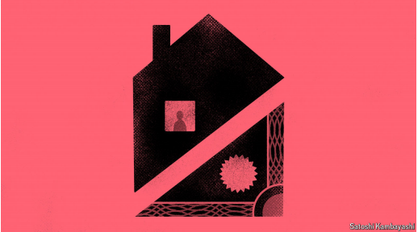

# Why you should repay your mortgage early

*For the first time in decades, the arithmetic suggests settling housing loans*

原文：

**T**HE HOLIDAY from reality, for the happy few enjoying it, has

been delightful. Three years ago it was still possible to fix a

mortgage rate in Britain and much of the euro area at somewhere

near 1%. American housing loans were dearer by just a percentage

point or two. Even as interest rates have risen and borrowing costs

for new mortgages have doubled or tripled, homeowners who

locked in the enviable rates of the early 2020s have been living

blissfully in the past. Moreover, the inflation that prompted rates to

rise has bitten chunks out of the real value of their debt.

**对于那些少数仍在享受它的人来说，这场远离现实的“假期”无疑是愉快的。**
 **三年前，在英国和欧元区的大部分地区，人们仍然可以以接近 1% 的利率固定抵押贷款。美国的住房贷款利率虽然更高，但也仅仅高出一到两个百分点。**
 **即使利率上升，新抵押贷款的借贷成本翻倍甚至翻了三倍，那些在 2020 年初锁定低利率的房主们仍然沉浸在过去的美好时光中，无忧无虑地享受生活。**
 **此外，正是促使利率上升的通胀，也在不断侵蚀他们债务的实际价值。**

学习：

blissfully：幸福地；充满喜悦地

原文：

Alas, the holiday is now over for many. Although American fixed

rates often last for decades, most in Britain and swathes of

continental Europe expire after five years or less. It was in early

2022 that the last of the dirt-cheap loans disappeared, after which

borrowing costs began climbing fast. A large number of mortgage

holders, in other words, have either seen their interest bills rocket

recently or will do soon. For those with spare cash to hand, a

question that seemed remote a few years ago is suddenly a great

deal more pressing. Should they repay the debt early?

唉，对许多人来说，假期已经结束了。尽管美国的固定利率通常持续几十年，但英国和欧洲大陆的大部分固定利率在五年或更短时间后到期。2022年初，最后一批极廉价贷款消失，此后借贷成本开始快速攀升。换句话说，大量的抵押贷款持有人要么已经看到他们的利息账单最近飙升，要么即将飙升。对于那些手头有闲钱的人来说，一个几年前看似遥远的问题突然变得紧迫得多。他们是否应该提前偿还债务？

学习：

swathes of：大片的

dirt-cheap：贱如粪土的；毫无价值的；非常便宜地          

原文：

To many who owed money during the 1980s, when interest rates

soared into the double digits, the answer is an obvious “yes”. At the

time, borrowing costs became so elevated that merely meeting

them, let alone repaying any capital in addition, was a constant

struggle. The risk of that being repeated is simply not worth taking.

Better, then, to pay all debt off at the earliest opportunity, while

doing so is still possible. Even if rates stay where they are at

present, that will save money on future interest bills.

对于许多在上世纪80年代利率飙升至两位数时欠下债务的人来说，答案显然是“是”。当时，借贷成本变得如此之高，以至于仅仅满足它们，更不用说额外偿还任何资本，都是一场持续的斗争。这种重复的风险根本不值得冒。那么，最好是在可能的时候，尽早还清所有债务。即使利率保持在目前水平，也能为未来的利息账单省钱。

学习：

elevated：（价格或数量）上升的；升高的；偏高的；

原文：

Those whose experience was shaped by more recent decades might

feel rather differently. Interest rates have spent most of that time on

a downward trend, culminating in the ultra-loose monetary policy

seen during the covid-19 pandemic. Next to that, it is the hikes of

the past few years that look like an aberration.

那些经历受最近几十年影响的人可能会有相当不同的感受。利率大部分时间都处于下降趋势，在新冠肺炎疫情时期的超宽松货币政策中达到顶峰。除此之外，过去几年的上涨看起来有些反常。

学习：

aberration：偏差；偏离正常；异常行为；

downward trend：下跌趋势；向下趋势；下行趋势          

原文：

More important, the opportunity cost of repaying a mortgage has

outweighed the potential savings for years. This is especially

obvious to those who fixed near 1% before 2022, then watched as

the rates on simple bank accounts rose to several multiples of that.

Under such circumstances, overpaying a mortgage, rather than

depositing the cash and pocketing much more interest than

repaying would have saved, would have been nonsensical.

更重要的是，多年来，偿还抵押贷款的机会成本已经超过了潜在的储蓄。这对于那些在2022年前固定在1%的人来说尤其明显，他们眼看着简单银行账户的利率上升到这个数字的几倍。在这种情况下，超额支付抵押贷款，而不是把现金存起来，赚取比还款更多的利息，将是荒谬的。

原文：

The opportunity cost over the longer term, and considering the

alternative of investing in shares, has been greater still. Twenty

years ago mortgage rates in Britain were not much higher than they

are now, at around 5%. Even with a once-in-a-century financial

crisis looming, buying stocks rather than making early mortgage

repayments would have paid off handsomely. Since the start of

2005, measured in pounds sterling, the MSCI World share index

has generated annualised nominal returns of above 10%. Had your

mortgage rate stayed the same for the next two decades (though in

reality it would have fallen), paying off £1,000 ($1,250) in 2005

would have saved a respectable £1,800 in interest. Investing it in a

global share-tracker fund would have made a profit of £6,500,

however.

从长期来看，考虑到投资股票的替代方案，机会成本更高。20年前，英国的抵押贷款利率并不比现在高多少，大约在5%左右。即使百年一遇的金融危机迫在眉睫，购买股票而不是提前偿还抵押贷款也会带来丰厚的回报。自2005年初以来，以英镑计算，摩根士丹利资本国际世界股票指数产生了超过10%的年名义回报率。如果你的抵押贷款利率在接下来的20年里保持不变(尽管实际上可能会下降)，在2005年偿还1000英镑(1250美元)可以节省可观的1800英镑利息。然而，将这笔钱投资于一只全球股票跟踪基金本可以获利6500英镑。

原文：

Today’s mortgage-holders must ask whether such stellar

stockmarket returns are still on offer. Those enjoyed by Britons

have been flattered by a steep fall in the value of the pound, which

has boosted the gains from foreign shares as measured in local

currency. For investors around the world, a hefty proportion of

recent decades’ high returns has come from ballooning stock

valuations. Twenty years ago, for example, the price of the MSCI

World index was 22 times as high as its companies’ long-run

average earnings. Now that multiple has risen to 30. Put another

way, a big share of the gains came from sentiment rather than

earnings. Unless investors continue to assign more and more value

to each dollar of corporate profit, such a multiple limits the scope

for future outsize returns.

今天的抵押贷款持有人一定会问，这样出色的股市回报是否仍然存在。英国人所享受的好处因英镑的大幅贬值而得到了提升，英镑贬值提高了以当地货币计算的外国股票的收益。对世界各地的投资者来说，近几十年的高回报很大一部分来自不断膨胀的股票估值。例如，20年前，摩根士丹利资本国际世界指数的价格是其公司长期平均收益的22倍。现在这个倍数已经上升到30倍。换句话说，很大一部分收益来自市场的情绪，而非收益。除非投资者继续赋予每一美元的公司利润越来越多的价值，否则这样的倍数限制了未来超额回报的范围。

学习：

stellar：杰出的；优秀的

原文：

As a consequence, repaying your mortgage early looks more

attractive now than it has in a very long time, even including those

periods when interest rates were at today’s levels or higher. That is

an odd thought for central bankers, so long after they started

tightening monetary policy to quell inflation, and with many of

them having spent recent months loosening it instead. Borrowers

who were sufficiently shrewd, or lucky, to secure ultra-low rates for

decades rather than years will be enjoying their holiday for some

time to come. For plenty of others, reality beckons. ■

因此，现在提前偿还抵押贷款看起来比很长一段时间以来都更有吸引力，甚至包括利率处于今天或更高水平的时期。对于央行行长来说，这是一个奇怪的想法，在他们开始收紧货币政策以抑制通胀很久之后，他们中的许多人在最近几个月反而放松了货币政策。那些足够精明或幸运、能够获得几十年而非几年超低利率的借款人，将在未来一段时间享受他们的假期。对许多其他人来说，现实在召唤他们。■

学习：

quell：美 [kwel] 平息；镇压；消除；缓解；减轻；

shrewd：精明的

## 后记

2025年2月17日22点17分于上海。