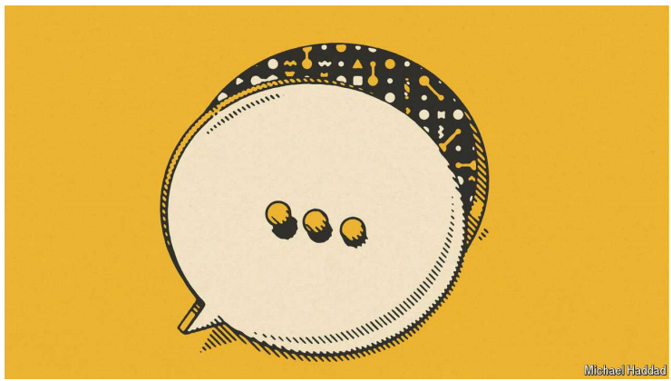
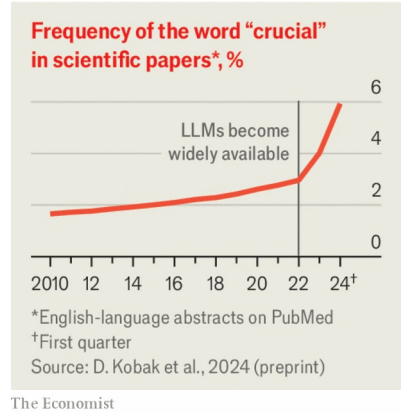

# LLMs now write lots of science. Good

Easier and more lucid writing will make science faster and better

lucid：美 [ˈluːsɪd]  明晰的；易懂的

原文：

MANY PEople are busily experimenting with chatbots in the hope that

generative artificial intelligence (AI) can improve their daily lives. Scientists,

brainy as they are, are several steps ahead. As we report, 10% or more of

abstracts for papers in scientific journals now appear to be written at least in

part by large language models. In fields such as computer science that figure

rises to 20%. Among Chinese computer scientists, it is a third.

许多人正忙于试验聊天机器人，希望生成型人工智能(AI)能够改善他们的日常生活。尽管科学家们很聪明，但他们还是领先了几步。正如我们所报道的，现在科学期刊中10%或更多的论文摘要至少有一部分是由大型语言模型撰写的。在计算机科学等领域，这个数字上升到20%。在中国计算机科学家中，这一比例为三分之一。

学习：

brainy：聪明的

原文：

Some see this enthusiastic adoption as a mistake. They fear that vast

quantities of poor-quality papers will introduce biases, boost plagiarism and

jam the machinery of scientific publication. Some journals, including the

*Science* family, are imposing onerous disclosure requirements on the use of

LLMs. Such attempts are futile and misguided. LLMs cannot easily be policed.

Even if they could be, many scientists find that their use brings real benefits.

一些人认为这种热情的采用是一个错误。他们担心大量低质量的论文会引入偏见，助长剽窃，堵塞科学出版的机制。包括《科学》系列在内的一些期刊对LLM的使用提出了苛刻的披露要求。这种尝试是徒劳的，也是错误的。LLM不容易被监管。即使它们可能是，许多科学家发现它们的使用带来了真正的好处。

学习：

plagiarism：美 [ˈpleɪdʒərɪzəm] 剽窃；抄袭；**注意发音**

boost plagiarism：助长剽窃

jam：阻碍，妨碍；阻塞

“machinery”指的是系统或过程的运作机制

jam the machinery:  扰乱或妨碍科学出版过程中各个环节的顺利运作

在这个上下文中，“jam”指的是造成堵塞或干扰。当文本说“jam the machinery of scientific publication”时，它的意思是大量低质量的论文可能会扰乱或妨碍科学出版过程中各个环节的顺利运作。这可能包括使同行评审系统超负荷运行，使得高质量和低质量的研究难以区分，整体上减慢出版过程。因此，“jam the machinery”是一个比喻，表示在科学出版系统的高效运作中造成显著的干扰或阻碍。

onerous：美 [ˈoʊnərəs]繁重的；费力的；困难的；

futile：美 [ˈfjuːtl] 徒劳的；无益的；无意义的；无用的

misguided：错误的；（因理解或判断失误）搞错的；误导的；

policed：管制；监督；维持治安；（police的过去式和过去分词）          

原文：

Research scientists are not just devoted to laboratory work or thinking big

thoughts. They face great demands on their time, from writing papers and

teaching to filling out endless grant applications. LLMs help by speeding up the

writing of papers, thereby freeing up time for scientists to develop new

ideas, collaborate or check for mistakes in their work.

研究科学家不仅仅致力于实验室工作或思考大问题。他们面临着大量的时间需求，从写论文、教学到填写无止境的资助申请。LLM有助于加快论文的写作速度，从而为科学家开发新想法、合作或检查工作中的错误腾出时间。

学习：

devoted to：全心全意的；致力于；奉献给；

free up time：腾出时间

原文：

The technology can also help level a playing-field that is tilted towards

native English speakers, because many of the prestigious journals are in their

tongue. LLMs can help those who do not speak the language well to translate

and edit their text. Thanks to LLMs, scientists everywhere should be able to

disseminate their findings more easily, and be judged by the brilliance of

their ideas and ingeniousness of their research, rather than their skill in

avoiding dangling modifiers.

这项技术也有助于平衡向英语母语者倾斜的竞争环境，因为许多著名的期刊都是用他们的语言出版的。LLMs可以帮助那些语言说得不好的人翻译和编辑他们的文本。多亏了LLMs，各地的科学家应该能够更容易地传播他们的发现，并根据他们的想法和研究的独创性来评判，而不是他们避免摇摆不定的修饰语的技能。

学习：

level：使持平；使相等；使平等

playing-field：竞技场

tilted：美 [tɪltɪd] 使倾斜；（tilt的过去式）

in their tougue：用他们的说法方式

disseminate：美 [dɪˈsemɪneɪt] 传播；普及；宣传；

ingeniousness：美 [ɪn'dʒɪnjəsnɪs] 精致；机敏；精巧；有创造才能

ingeniousness of research：研究的独创性

brilliance： 美 [ˈbrɪljəns] 才华横溢；卓越的才智；明亮

brilliance of ideas：很好的想法

dangling：美 [ˈdæŋɡlɪŋ] 摇摆的；悬挂的

modifiers： 美 ['mɑdɪˌfaɪəz] 修饰语；（modifier的复数）

原文：

As with any technology, there are worries. Because LLMs make it easier to

produce professional-sounding text, they will make it easier to generate

bogus scientific papers. *Science* received 10,444 submissions last year, of

which 83% were rejected before peer review. Some of these are bound to

have been AI-generated fantasies.

和任何技术一样，也有令人担忧的地方。因为LLM更容易产生听起来专业的文本，所以它们也更容易产生伪造的科学论文。《科学》去年收到了10，444份投稿，其中83%在同行评审前被拒绝。其中一些肯定是人工智能产生的虚构作品。

学习：

professional-sounding：听起来很专业

bogus： 美 [ˈboʊɡəs] 假的；假冒的；伪造的

bound to：必然；必定；注定；一定会；

fantasy：美 [ˈfæntəsi]  幻想；想象；虚构作品

原文：

LLMs could also export, through their words, the cultural environment in

which they were trained. Their lack of imagination may spur inadvertent

plagiarism, in which they directly copy past work by humans.

“Hallucinations” that are obviously wrong to experts, but very believable to

everyone else, could also make their way into the text. And most worrying

of all, writing can be an integral part of the research process, by helping

researchers clarify and formulate their own ideas. An excessive reliance on

LLMs could therefore make science poorer.

LLM也可以通过他们的语言输出他们接受培训的文化环境。他们缺乏想象力可能会刺激无意中的剽窃，即他们直接复制人类过去的作品。“幻觉”对专家来说显然是错误的，但对其他人来说却非常可信，也可能出现在文本中。最令人担忧的是，写作可以成为研究过程中不可或缺的一部分，帮助研究人员澄清和阐述他们自己的想法。因此，过度依赖LLM可能会让科学变得更加贫乏。

学习：

inadvertent：美 [ˌɪnədˈvərtnt] 无意的；非故意的；疏忽的；粗心的；

believable：美 [bɪˈliːvəbl] 可信的；可信任的；符合现实的

integral：美 [ˈɪntɪɡrəl] 必不可少的；完整的；完备的；整体的；

excessive： 美 [ɪkˈsesɪv] 过度的；极度的；过分的

reliance on：依赖，依靠

原文：

Trying to restrict the use of LLMs is not the way to deal with these problems. In

the future they are rapidly going to become more prevalent and more

powerful. They are already embedded in word processors and other

software, and will soon be as common as spell-checkers. Researchers tell

surveys that they see the benefits of generative AI not just for writing papers

but for coding and doing administrative tasks. And crucially, their use

cannot easily be detected. Although journals can impose all the burdensome

disclosure requirements they like, it would not help, because they cannot tell

when their rules have been broken. Journals such as *Science* should abandon

detailed disclosures for the use of LLMs as a writing tool, beyond a simple

acknowledgment.

试图限制LLM的使用不是解决这些问题的方法。在未来，它们将迅速变得更加普遍和强大。它们已经嵌入到文字处理器和其他软件中，很快就会像拼写检查器一样普遍。研究人员告诉调查，他们看到生成式人工智能的好处不仅在于写论文，还在于编码和做行政工作。更重要的是，他们的使用不容易被发现。尽管期刊可以强加所有它们喜欢的繁琐的披露要求，但这并无济于事，因为它们无法判断自己的规则何时被打破。《科学》等期刊应该放弃使用LLMs作为写作工具的详细披露，而不仅仅是简单的确认。

学习：

burdensome：累赘的；繁重的

原文：

Science already has many defences against fabrication and plagiarism. In a

world where the cost of producing words falls to nothing, these must

become stronger still. Peer review, for instance, will become even more

important in a gen-AI world. It must be beefed up accordingly, perhaps by

paying reviewers for the time they sacrifice to scrutinise papers. There

should also be more incentives for researchers to replicate experiments.

Hiring and promotion committees at universities should ensure that

scientists are rewarded based on the quality of their work and the quantity of

new insights they generate. Curb the potential for misuse, and scientists have

plenty to gain from their LLM amanuenses. ■

科学已经对捏造和剽窃有了许多防御措施。在一个生产文字的成本降到零的世界里，这些必须变得更加强大。例如，在人工智能时代，同行评议将变得更加重要。它必须相应地得到加强，也许可以通过向那些牺牲时间来审阅论文的审稿人支付报酬。还应该有更多的激励措施来鼓励研究人员重复实验。大学的招聘和晋升委员会应该确保科学家的奖励基于他们的工作质量和他们产生的新见解的数量。抑制滥用的可能性，科学家们可以从他们的LLM助手中获益良多。■

学习：

fabrication：捏造

scrutinize papers：审阅论文

beef up：加强；增强；

replicate experiments：重复实验，复现实验

promotion：晋升

curb：遏制

amanuensis：美 [əˌmænjəˈwɛnsəs]  文书助手；amanuenses：复数

## 后记

2024年7月3日14点06分于上海。