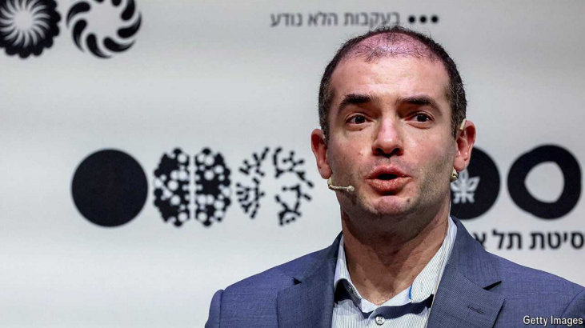

# A new lab and a new paper reignite an old AI debate

Two duelling visions of the technological future 对技术未来的两个对立的愿景

reignite：美 [ˌriɪɡˈnaɪt]   重新点燃；重新激起

duel：美 [ˈduːəl] 决斗；对决；较量；斗争；

原文：

AFTER SAM ALTMAN was sacked from OpenAI in November of 2023, a

meme went viral among artificial-intelligence (AI) types on social media.

“What did Ilya see?” it asked, referring to Ilya Sutskever, a co-founder of the

startup who triggered the coup. Some believed a rumoured new

breakthrough at the company that gave the world ChatGPT had spooked Mr

Sutskever.

2023年11月，山姆·奥特曼被OpenAI解雇后，一个表情包在社交媒体上的人工智能(AI)类型中传播开来。“伊利亚看到了什么？”它问道，指的是引发政 变的初创公司联合创始人伊利亚·苏茨基弗(Ilya Sutskever)。一些人认为，向世界发布ChatGPT的公司传闻的新突破吓坏了Sutskever先生。

学习：

sacked： 美 [sækd] 解雇；劫掠；（sack的过去式和过去分词）

meme：表情包

go viral：火了；走红

coup：美 [kuː] 政 变；意外而成功的行动；出乎意料的成功策略 **注意发音**

spooked：美 [spuːkt] 鬼怪般地出没；惊吓；吓唬；（spook的过去式）

原文：

Although Mr Altman was back in charge within days, and Mr Sutskever said

he regretted his move, whatever Ilya saw appears to have stuck in his craw.

In May he left OpenAI. And on June 19th he launched Safe Superintelligence

(SSI), a new startup dedicated to building a superhuman AI. The outfit, whose

other co-founders are Daniel Gross, a venture capitalist, and Daniel Levy, a

former OpenAI researcher, does not plan to offer any actual products. It has

not divulged the names of its investors.

虽然奥尔特曼先生在几天内就重新掌权，而且苏茨基弗先生说他对自己的举动感到后悔，但伊利亚看到的一切似乎都让他难以接受。五月份他离开了OpenAI。6月19日，他推出了Safe Superintelligence (SSI)，这是一家致力于构建超人人工智能的初创公司。该组织的其他联合创始人是风险投资家丹尼尔·格罗斯(Daniel Gross)和前OpenAI研究员丹尼尔·利维(Daniel Levy)，他们不打算提供任何实际产品。它没有透露其投资者的名字。

学习：

stuck in his craw：难以接受

>
>
>“Stuck in his craw” 是一个英语习语，意思是某件事情让某人非常不快或难以接受。具体到这段文字中，它表示Ilya Sutskever对他在OpenAI所看到或经历的事情感到非常不满，以至于这些不满持续困扰着他，最终导致他离开OpenAI，并在之后创办了新的公司Safe Superintelligence (SSI)。

outfit：组织

divulged： 美 [dɪ'vʌldʒd] 泄露；（divulge的过去式和过去分词）

原文：

You might wonder why anyone would invest, given the project’s apparent

lack of interest in making money. Perhaps backers hope SSI will in time create

a for-profit arm, as happened at OpenAI, which began as a non-profit before

realising that training its models required lots of expensive computing

power. Maybe they think Mr Sutskever will eventually convert SSI into a

regular business, which is something Mr Altman recently hinted at to

investors in OpenAI. Or they may have concluded that Mr Sutskever’s team

and the intellectual property it creates are likely to be valuable even if 

SSI’s goal is never reached.

你可能想知道为什么有人会投资，因为这个项目显然对赚钱不感兴趣。或许支持者希望SSI能够及时创建一个盈利机构，就像OpenAI一样，openai最初是一个非营利机构，后来意识到训练其模型需要大量昂贵的计算能力。也许他们认为Sutskever先生最终会将SSI转化为常规业务，这是Altman先生最近向OpenAI的投资者暗示的事情。或者，他们可能已经得出结论，即使SSI的目标从未实现，苏茨基弗先生的团队及其创造的知识产权也可能是有价值的。

学习：
for-profit：为了赢利的；盈利性的；

原文：

A more intriguing hypothesis is that SSI’s financial supporters believe in what

is known in AI circles as the “fast take-off” scenario. In it, there comes a point

at which AIs become clever enough to themselves devise new and better AIs.

Those new and better AIs then rapidly improve upon themselves—and so on,

in an “intelligence explosion”. Even if such a superintelligence is the only

product SSI ever sells, the rewards would be so enormous as to be worth a

flutter.

一个更有趣的假设是，SSI的财务支持者相信人工智能界所谓的“快速起飞”情景。在这一点上，人工智能变得足够聪明，可以自己设计新的更好的人工智能。这些新的、更好的人工智能随后在“智能爆炸”中迅速自我完善，如此循环。即使这种超级智能是SSI销售的唯一产品，回报也是如此巨大，值得一搏。

学习：

flutter： 美 [ˈflʌtər] 飘动；飘落；小赌注；

原文：

The idea of a fast take-off has lurked in Silicon Valley for over a decade. It

resurfaced in a widely shared 165-page paper published in June by a former

OpenAI employee. Entitled “Situational Awareness” and dedicated to Mr

Sutskever, it predicts that an AI as good as humans at all intellectual tasks will

arrive by 2027. One such human intellectual task is designing AI models. And

presto, fast take-off.

快速起飞的想法已经在硅谷潜伏了十多年。一位前OpenAI员工在6月份发表的一篇165页的论文中再次提到了这个问题。这本书名为《情境意识》,是献给Sutskever先生的，它预测在所有智力任务上和人类一样好的人工智能将在2027年到来。人类的一项智力任务就是设计人工智能模型。很快，快速起飞。

学习：

lurked： 美 [lɝkt] 潜伏；埋伏；潜藏；（lurk的过去式）

resurfaced：美 [ˌriː'sɜːrfɪst] 重新露面；（resurface的过去式和过去分词）

presto：美 [ˈprɛstoʊ] 急板的；急板；

原文：

The paper’s author argues that before long America’s government will need 

to “lock down” AI labs and move the research to an AI-equivalent of the Manhattan project. 

Most AI researchers seem more circumspect. Half a dozen who work at leading 

AI labs tell The Economist that the prevailing view is that AI progress is more likely 

to continue in gradual fashion than with a sudden explosion.

该论文的作者认为，用不了多久，美国政府将需要“封锁”人工智能实验室，并将研究转移到类似曼哈顿计划的人工智能领域。大多数人工智能研究人员似乎更加谨慎。在领先的人工智能实验室工作的六个人告诉《经济学人》，普遍的观点是，人工智能的进步更有可能以渐进的方式继续，而不是突然爆发。

学习：

circumspect： 美 [ˈsərkəmˌspɛkt] 谨慎的；小心翼翼的；慎重的；

原文：

OpenAI, once among the most bullish about AI progress, has moved closer to

the gradualist camp. Mr Altman has repeatedly said that he believes in a

“slow take-off” and a more “gradual transition”. His company’s efforts are

increasingly focused on commercialising its products rather than on the

fundamental research needed for big breakthroughs (which may explain

several recent high-profile departures). Yann LeCun of Meta and François

Chollet of Google, two star AI researchers, have even said that current AI

systems hardly merit being called “intelligence”.

OpenAI曾经是最看好人工智能进步的公司之一，现在已经向渐进主义阵营靠拢。奥尔特曼先生一再表示，他相信“缓慢的起飞”和更“渐进的过渡”。他的公司的努力越来越集中于产品的商业化，而不是重大突破所需的基础研究(这可能解释了最近几次高调的离职)。Meta的Yann LeCun和Google的Franç ois Chollet这两位明星人工智能研究人员甚至表示，当前的人工智能系统很难称得上“智能”。

学习：

high-profile：高知名度；高调的；高姿态的；备受瞩目的；知名度高的          

merit：值得；应得；赢得（赞扬、注意等）；有资格获得

原文：

An updated model released on June 20th by Anthropic, another AI lab, is

impressive but offers only modest improvements over existing models.

OpenAI’s new offering could be ready next year. Google DeepMind, the

search giant’s main AI lab, is working on its own supercharged model. With

luck these will be more deserving of the I in AI. Whether they are deserving

enough to convert gradualists to the explosive creed is another matter. ■

另一个人工智能实验室Anthropic在6月20日发布的更新模型令人印象深刻，但与现有模型相比仅提供了适度的改进。OpenAI的新产品可能会在明年推出。搜索巨头谷歌的主要人工智能实验室Google DeepMind正在开发自己的超级模型。幸运的话，这些将更值得人工智能中的I。他们是否值得将渐进主义者转变为爆炸性的信条是另一回事。■

学习：

creed：美 [kriːd]  教义；信条；信经

## 后记

2024年7月9日12点03分于上海。

