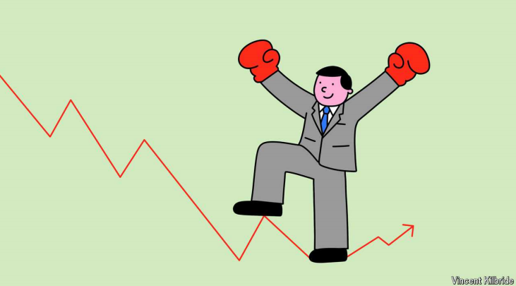

# Central banks are winning the battle against inflation. But the war is just getting started

Politics and protectionism will make life difficult

原文：

The trajectory of inflation has not given central bankers much cause for

celebration in recent years. But at the European Central Bank’s annual

jamboree in Sintra, Portugal, this week, a touch of self-congratulation has

been in the air. “I know it sounds a little bit arrogant,” confessed Christine

Lagarde, the ECB’s president, on July 1st, but the unwinding of high inflation

“is remarkable”. “We’ve made a lot of progress,” said Jerome Powell, the

chairman of America’s Federal Reserve, the next day. Others agree. “Central

banks have risen to the challenge” of high inflation, commends the Bank for

International Settlements.

近年来，通胀的轨迹并没有给央行行长们太多值得庆祝的理由。但在本周于葡萄牙辛特拉举行的欧洲央行年度大会上，空气中弥漫着一丝沾沾自喜的味道。“我知道这听起来有点自大，”欧洲央行行长克里斯蒂娜·拉加德在7月1日坦承道，但是高通胀的缓解“意义非凡”。“我们已经取得了很大进展，”第二天，美国美联储主席杰罗姆·鲍威尔说。其他人同意。国际清算银行称赞道,“各国央行已奋起应对高通胀的挑战”。

学习：

cause for：...的理由          

jamboree： 美 [ˌdʒæmbəˈri] 喧闹的盛大庆典；童子军的大会

annual jamboree：年度大会

a touch of：一点点；少许；略带；

self-congratulation：自我庆幸；沾沾自喜          

confessed：承认；供认；（confess的过去式和过去分词）

unwinding：松开；解开；放松；（unwind的现在分词形式）；

原文：

The data do indeed merit some satisfaction. After cumulative price increases

between 2021 and 2023 of 15% in America and 18% in the euro zone,

annual inflation rates now stand at just 2.6% and 2.5% respectively. Yet the

time for mutual back-patting may be brief. Lower inflation, though

welcome, does not mean a return to the relatively stable economy that

prevailed before the pandemic. Several perils loom on the supply side,

which could constrain growth and boost inflation, just as a return to

populism in America and Europe threatens fiscal blowouts and more price

pressure still. Central bankers may be winning the battle against inflation.

The war is just beginning.

这些数据确实值得满意。在2021年至2023年间，美国和欧元区的累计价格涨幅分别为15%和18%之后，年通胀率目前分别仅为2.6%和2.5%。然而，相互吹捧的时间可能很短暂。较低的通货膨胀虽然受欢迎，但并不意味着回到疫情之前相对稳定的经济。供应方面有几个危险隐现，这可能会抑制增长并推高通胀，正如美国和欧洲民粹主义的回归可能会导致财政崩溃和更多的价格压力。央行行长们可能正在赢得对抗通胀的战斗。战争才刚刚开始。

学习：

merit：美 [ˈmerɪt] 值得；应得；赢得（赞扬、注意等）

patting：轻拍；（pat的现在分词形式）；

perils：美 [ˈperəlz] 冒险；危险；（peril的复数）

loom：美 [luːm]隐隐显现；

populism：民粹主义

blowouts：爆胎；争吵；保险丝烧断；（blowout的复数）

原文：

Consider the dangers to supply. Donald Trump has promised a 10% across-

the-board tariff if he returns to the White House, and, after Joe Biden’s

catastrophic performance in a presidential debate in Georgia on June 27th,

investors and prediction markets think that a second Trump term looks more

likely. The levy, and any retaliation by China, will push up the cost of

imports. Climate change and surging investment in green infrastructure are

helping keep commodity prices high even with global growth weak,

according to the World Bank. And the risk of an escalation in the war in the

Middle East hangs over the world economy.

考虑供应的危险。唐纳德·特朗普(Donald Trump)承诺，如果他重返白宫，将征收10%的全面关税，而在乔·拜登(Joe Biden月27日在佐治亚州的总统辩论中的灾难性表现之后，投资者和预测市场认为特朗普的第二个任期看起来更有可能。这项关税以及中国的任何报复都将推高进口成本。世界银行(World Bank)表示，即使全球经济增长疲软，气候变化和绿色基础设施投资的飙升也在帮助维持大宗商品价格的高位。中东战争升级的风险笼罩着世界经济。

学习：

across-the-board：全面的；（加薪，减税等）全盘的；全面地          

presidential debate：总统辩论

catastrophic performance：灾难性的表现

levy：美 [ˈlevi] 征收；征兵；征得的税；征收款；

retaliation： 美 [rɪˌtælɪˈeʃən] 报复，反击

push up the cost of imports：推高进口的成本

escalation：美 [ˌeskəˈleɪʃn] 增加；扩大

hang over：笼罩着      

原文：

What these potential shocks have in common is that, like the pandemic, they

threaten to send growth and inflation in opposite directions. According to

Goldman Sachs, Mr Trump’s 10% tariff would, if it provoked retaliation by

America’s trading partners, add 1.1 percentage points to American inflation

while marginally reducing growth. Euro-area output could fall by 1%. And

that is without factoring in the additional damage caused by a 60% tariff on

Chinese goods, which Mr Trump might also decide to impose.

这些潜在冲击的共同点是，像疫情一样，它们有可能使增长和通胀走向相反的方向。根据高盛(Goldman Sachs)的数据，特朗普10%的关税如果引发美国贸易伙伴的报复，将使美国通胀率上升1.1个百分点，同时略微降低增长。欧元区产出可能下降1%。这还不包括对中国商品征收60%的关税所造成的额外损害，特朗普也可能决定征收这一关税。

学习：

in opposite directions：走向相反的方向

marginally：微小地，略微

原文：

In theory, central bankers should ignore supply shocks, which exert only a

passing direct effect on inflation. In practice, with repeated bursts of

inflation—let alone a surge as big as that which followed the pandemic—

their inflation targets could come to seem merely theoretical. Yet their other

option, of raising interest rates to squeeze inflation out of the economy

quickly, would be painful. Were Mr Powell, Ms Lagarde or their successors

to raise rates with every escalation in a trade war, say, the world economy

would become far more volatile.

理论上，央行应该忽略供给冲击，供给冲击只会对通胀产生短暂的直接影响。实际上，随着通货膨胀的反复爆发——更不用说像疫情事件后那样大的膨胀了——他们的通货膨胀目标可能看起来只是理论上的。然而，他们的另一个选择，即提高利率以快速挤出经济中的通货膨胀，将是痛苦的。比方说，如果鲍威尔、拉加德或他们的继任者在贸易战每次升级时都加息，世界经济将变得更加不稳定。

学习：

exert：运用；施加；

passing：短暂的；暂时的；瞬间的；

passing direct effect：短暂的直接影响

burst：爆炸；爆裂；爆发；

squeeze inflation out of the economy：挤出通胀

原文：

Layered on top of this is politicians’ renewed fondness for running up big

debts. As the world has discovered, wars, pandemics and commodity crises

are costly. Though tariffs raise government revenue, supply shocks tend to

harm growth, making debts harder to repay.

除此之外，政客们对累积巨额债务的重新喜爱。世界已经发现，战争、流行病和商品危机代价高昂。尽管关税增加了政府收入，但供应冲击往往会损害增长，让债务更难偿还。

学习：

fondness：喜爱

原文：

Bond markets are already alert to lavish fiscal policy; investors took fright at

the prospect of a victory for the populist right in France’s parliamentary poll,

only to calm a little as a hung parliament appeared more likely after the first

round of voting. Yields on ten-year Treasuries have risen as investors

contemplate a Republican sweep in America’s elections in November, which

would make deficit-financed tax cuts more likely. Such policies will only

push up inflation, forcing central banks to raise interest rates—and putting

them on a collision course with Mr Trump and other populist politicians.

债券市场已经对过度的财政政策保持警惕；投资者对民粹主义右翼在法国议会选举中获胜的前景感到恐慌，但随着第一轮投票后无多数议会似乎更有可能出现，投资者稍稍平静了下来。随着投资者考虑共和党在11月的美国大选中大获全胜，十年期国债收益率上升，这将使赤字融资减税更有可能实现。此类政策只会推高通胀，迫使各国央行加息——并让它们走上与特朗普和其他民粹主义政客发生冲突的道路。

学习：

alert：警觉的；机敏的；警惕的；

lavish：奢华的；奢侈的；无节制的；挥霍的；耗资巨大的；

take fright at：对xxx感到害怕

ten-year Treasuries：十年期国债

contemplate：美 [ˈkɑːntəmpleɪt] 打算；冥想；深思熟虑；预想

collision： 美 [kəˈlɪʒn] 碰撞；冲突

## **A rocky road**

rocky road：崎岖的道路

原文：

The risk of a more inflationary world is still under-appreciated. At times the

mood in Sintra did become sombre, but—notwithstanding their recent jitters

—financial markets are for the most part priced giddily, as though the recent

episode of inflation was an aberration, and stability will now prevail. More

probably, the pandemic marked the start of a dangerous new time—one in

which victories for central banks will be rarer and harder-fought. ■

全球通胀加剧的风险仍被低估。有时辛特拉的情绪确实变得阴郁，但是——尽管他们最近神经过敏——金融市场的大部分价格令人眩晕，好像最近的通货膨胀是一个异常现象，现在稳定将占上风。更有可能的是，疫情标志着一个危险的新时代的开始——在这个时代里，央行的胜利将会更加罕见和艰难。■

学习：

sombre：英 [ˈsɒmbə] 暗淡的；低沉的；阴沉的； **注意发音**

notwithstanding：尽管如此；然而；虽然

jitters：美 [ˈdʒɪtərz] 神经过敏；激动；（jitter的复数）

giddily：美 [gɪdɪli] 头晕地; 轻率地; 眼花缭乱地

aberration：美 [ˌæbəˈreɪʃn] 偏差；偏离正常；异常行为；

hard-fought：激烈的；努力争取来的；艰苦奋斗的

## 后记

2024年7月5日18点55分于上海。

