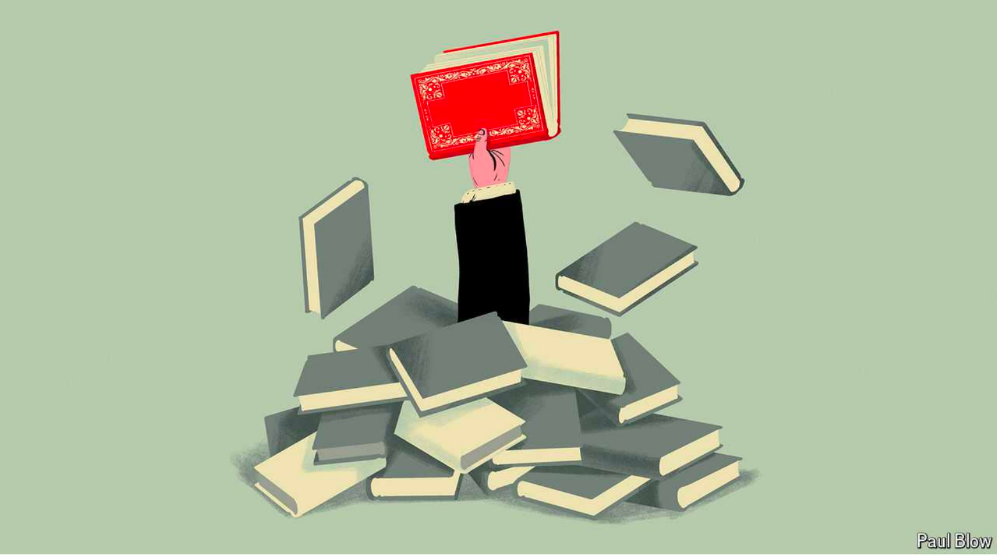

# The CEO’s alternative summer reading list

Some genre-bending management books

> "Genre-bending"（类型融合）指的是融合或超越传统类型或类别的作品，通过结合不同类型的元素，创造出独特或创新的作品。在“类型融合的管理书籍”的语境中，这意味着这些书籍将管理、自助、心理学、叙事故事甚至小说等不同类型的元素结合起来，以提供一种新颖且非传统的管理话题探讨方式。它们并不严格遵循传统管理书籍的格式或风格。

原文：

“HE INSPIRED NEITHER love nor fear, nor even respect…He originated

nothing, he could keep the routine going—that’s all.” As a description of

your typical middle manager, it is hard to surpass Marlow’s view of the boss

at a river port in Joseph Conrad’s “Heart of Darkness”. The novella is a

critique of colonialism in Africa, and an exploration of power and morality.

It is also a guide to dealing with corporate bureaucracy. Marlow’s steamboat

is in tatters and the manager is useless—Marlow must solve the problem

himself. It sounds like an ordinary day at a *Fortune* 500 company.

“他既没有激发出爱，也没有激发出恐惧，甚至也没有激发出尊重……他什么也没有创造，他只是让日常生活继续下去——仅此而已。”作为对你典型中层管理者的描述，很难超越约瑟夫·康拉德《黑暗之心》中马洛对一个河港老板的看法。这部中篇小说是对非洲殖民主义的批判，也是对权力和道德的探索。这也是应对企业官僚主义的指南。马洛的汽船破烂不堪，经理也毫无用处——马洛必须自己解决问题。这听起来像是财富500强公司普通的一天。

学习：

novella：美 [nəˈvɛlə] 中篇小说；短篇小说

colonialism：美 [kəˈloʊniəˌlɪzəm] 殖民主义；殖民政策；殖民统治

in tatters：破烂的

原文：

Bookshops are stuffed with management tomes on how to be a good leader,

inspire others, survive office politics, navigate cultural differences and win

negotiations. But executives would do well to ignore the corporate self-help

shelves and head instead for the classics section. Great works of literature,

with their piercing examination of the human condition, have much to teach

the aspiring chief executive about business—values of honesty, empathy and

commercial acumen, as well as insights into vanity, pettiness, greed and

ruthless ambition, all of which punctuate the journey from cubicle to corner

office.

书店里堆满了管理类书籍，讲述如何成为一名优秀的领导者、激励他人、在办公室政治中生存、应对文化差异以及赢得谈判。但高管们最好忽略企业自助书架，转而去经典书籍区。伟大的文学作品对人类状况进行了敏锐的审视，可以教给这位有抱负的首席执行官很多商业知识——诚实、同理心和商业敏锐的价值观，以及对虚荣、小气、贪婪和无情野心的洞察，所有这些都贯穿了他从小隔间到角落办公室的旅程。

学习：

tome：卷

navigate：（有效地）处理；

navigate cultural differences：处理文化差异

piercing：美 [ˈpɪrsɪŋ] 深切的；穿透性强的；穿透；穿过；刺破（pierce的现在分词）

piercing examination：敏锐的审视

acumen：美 [əˈkjumən] 敏锐；聪明；机敏；智慧；

vanity: 自负；虚荣；空虚；

pettiness：美 ['petɪnəs] 琐碎；小气；卑鄙；

cubicle：小隔间；办公隔间；小卧室；

原文：

Ditching corporate prose for fabulous stories is itself the subject of at least

one business book. In “Questions of Character: Illuminating the Heart of

Leadership Through Literature”, Joseph Badaracco, a professor of business

ethics at Harvard Business School, considers eight works that provide

lessons on what good leadership is—and isn’t. If Mr Badaracco had to

recommend one book executives should read this summer, it would be

“Things Fall Apart” by Chinua Achebe. “Serious literature tends to be tragic

literature,” he says. “The struggles of the main character, Okonkwo, reveal

the profound challenges leaders confront when they face evolving social

norms, novel economic challenges, shifting power dynamics and the

challenge of communicating across cultural divides.” Your guest Bartleby

has other literary recommendations, on a range of management topics.

抛弃企业散文，转而讲述传奇故事，这本身就是至少一本商业书籍的主题。在《品格问题:通过文学照亮领导力的核心》一书中，哈佛商学院商业伦理教授约瑟夫·巴达拉科认为八部作品提供了关于什么是好的领导力，什么不是好的领导力的教训。如果巴达拉科必须推荐一本书，让高管们在今年夏天读一读，那就是奇努阿·阿切比(Chinua Achebe)的《分崩离析》(Things collapse)。“严肃文学往往是悲剧文学，”他说。“主角奥康科沃的斗争揭示了领导人在面对不断演变的社会规范、新的经济挑战、不断变化的权力动态以及跨文化沟通的挑战时所面临的深刻挑战。”你的客人巴特比有其他文学推荐，关于一系列管理主题。

学习：

ditch：挖沟；挖掘排水沟；抛弃；摆脱；丢弃；

prose：散文；平铺直叙的文体；白话文；

fabulous：极好的；非凡的；绝妙的

main character：主角

原文：

Great leaders need good mentors. Is there any better than Virgil in Dante’s

“Inferno”? He guides the main character through Hell and Purgatory,

pointing out dangers, giving advice, rebuking on occasion and finally

withdrawing when his charge is ready to ascend to the innermost circles of

the immortal world. Just as mentors motivate their wards, so must managers.

Few books are better on motivation than Mark Twain’s “Tom Sawyer”.

Forced to paint a fence white rather than play with his friends, the titular

ragamuffin comes up with a way to make it seem so appealing that the local

kids want to do it—and end up paying Tom for the privilege. Business

school professors call it “psychic rewards”.

伟大的领导者需要好的导师。但丁的《炼狱》里还有比维吉尔更好的吗？他引导主角穿过地狱和炼狱，指出危险，给出建议，有时进行指责，最后当他的责任准备好提升到不朽世界的最深处时退出。正如导师激励被监护人一样，管理者也必须如此。在动机方面，很少有书比马克·吐温的《汤姆·索亚》更好。这位有名无实的乞丐被迫把栅栏漆成白色，而不是和他的朋友一起玩，他想出了一个办法，让它看起来如此吸引人，以至于当地的孩子都想这么做——并最终向汤姆支付了这一特权。商学院教授称之为“精神奖励”。

学习：

Purgatory：美 [ˈpərɡəˌtɔri] 炼狱；苦难；折磨

rebuke：指责；非难；谴责

titular：美 [ˈtɪtʃələr] 名义上的；有名无实的；徒具虚名的；

ragamuffin：美 [ˈræɡəˌməfən] 衣衫褴褛肮脏的人；

原文：

For navigating HR or the finance department, pick up Joseph Heller’s “Catch-

22” or Franz Kafka’s “The Trial” (the characters’ bureaucratic travails will

make yours seem trivial). For holding meetings, crack open William

Golding’s “Lord of the Flies” (arguments descend into savagery). As for 

IT support, enjoy Samuel Beckett’s “Waiting for Godot” (pure nothingness).

For lessons on digital transformation, dump Clay Christensen’s “The

Innovator’s Dilemma” and read Mary Shelley’s “Frankenstein”.

要浏览人力资源或财务部门，拿起约瑟夫·海勒的《第二十二条军规》或弗兰茨·卡夫卡的《审判》(书中人物的官僚主义痛苦会让你的看起来微不足道)。为了举行会议，打开威廉·戈尔丁的《蝇王》(争论陷入野蛮状态)。至于IT支持，请欣赏塞缪尔·贝克特的《等待戈多》(纯粹的虚无)。关于数字化转型的课程，请丢掉克莱·克里斯腾森的《创新者的困境》，去读玛丽·雪莱的《弗兰肯斯坦》。

学习：

travails：美 [trəˈveɪlz] 分娩的痛苦；辛劳；阵痛；（travail的复数）

savagery：美 [ˈsævɪdʒri] 野性；野蛮人；原始状态

dump：急忙放下；摆脱（不想要的东西）；

原文：

The frenzy of business, when it is not a comedy, is a tragedy. That makes

Shakespeare a font of wisdom—if mainly on what to avoid. Richard III and

Macbeth are terrible leaders: the former hubristic, the latter overly

ambitious. King Lear stresses the importance of succession planning.

Othello reminds executives to choose their personal assistants carefully.

(Though Lady Macbeth is a case study in how to work the system as a non-

executive director and Iago, Othello’s duplicitous aide, is instructive on how

to deceive and get rid of the boss.)

商业的狂热，如果不是喜剧，就是悲剧。这使得莎士比亚成为智慧的象征——如果主要是关于应该避免什么的话。理查德三世和麦克白是糟糕的领导人:前者傲慢自大，后者过于雄心勃勃。李尔王强调继承计划的重要性。奥赛罗提醒高管谨慎选择私人助理。(尽管《麦克白夫人》是一个如何作为非执行董事运作该体系的案例，而《奥赛罗》中奸诈的助手伊阿古(Iago)对于如何欺骗和摆脱老板具有指导意义。)

学习：

freezy：狂乱；狂热；极度激动

hubristic：傲慢的

duplicitous：英 [djuːˈplɪsɪtəs] 奸诈的；骗人的

aide：美 [eɪd] 助理；（尤指从政者的）助手；

原文：

The worst CEO in literature, believes John McCallum, a retired professor at the

University of Manitoba’s Asper School of Business who used novels in his

teaching, has to be Captain Ahab in Herman Melville’s “Moby-Dick”.

“Selfish, reckless, arrogant, ignorant—he hits every marker of the bad boss,”

Mr McCallum says. The best has to be Fezziwig from Charles Dickens’s “A

Christmas Carol”: caring and generous, but also a good businessman.

Beware, though, for generosity has its limits. In Melville’s short story

“Bartleby, the Scrivener”, this column’s namesake, a surly employee,

preferred not to work. The lenient boss kept him around. Productivity fell.

The horror. ■

曼尼托巴大学阿斯佩商学院的退休教授约翰·麦卡勒姆认为，文学史上最差的CEO应该是赫尔曼·梅尔维尔的《白鲸》中的亚哈船长。“自私、鲁莽、傲慢、无知——他符合坏老板的所有特征，”麦卡勒姆先生说。查尔斯·狄更斯《圣诞颂歌》中的费兹威格是最佳人选:关心他人，慷慨大方，同时也是一个好商人。不过，要小心，慷慨是有限度的。在梅尔维尔的短篇小说《书记员巴特比》中，与本专栏同名的一名脾气暴躁的雇员宁愿不工作。宽容的老板把他留在身边。生产力下降。恐怖。■

学习：

namesake：同名的人（或物）；以某人命名的人（或物）

surly：脾气暴躁的；脾气坏的；

lenient：美 [ˈliːniənt] 宽容的；仁慈的；宽大的；

## 后记

2024年7月17日于山东日照。

