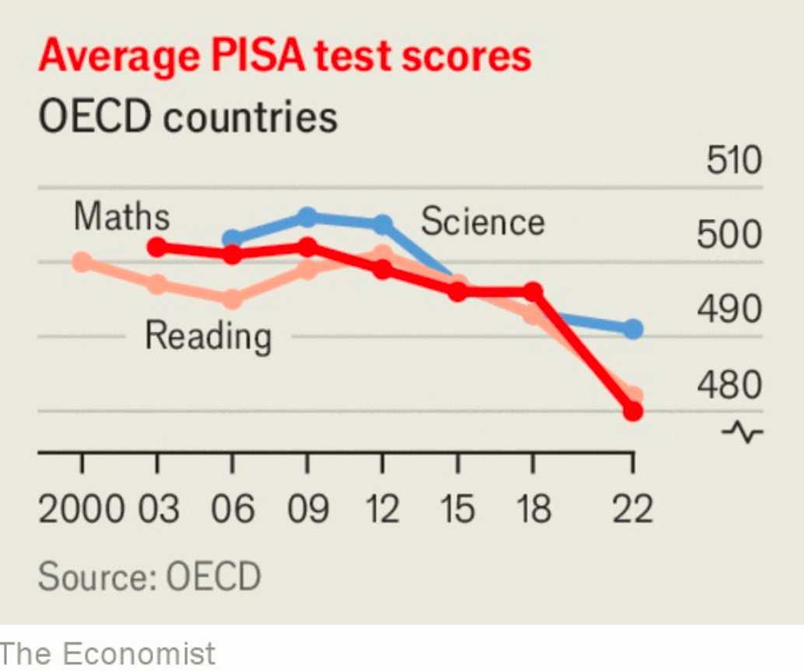

# Faddish thinking is hobbling education in the rich world

Test scores have been stagnant or worse for more than a decade

流行的思维阻碍了富裕国家的教育

Faddish: 美 ['fædɪʃ] 风行的；流行一时的；时尚的

Hobbling: 美 ['hɑblɪŋ] （hobble的现在分词） 阻碍

>"Faddish thinking is hobbling education in the rich world" 的意思是说，流行一时的教育思潮正在阻碍富裕国家的教育发展。
>
>具体解释：
>
>- **Faddish thinking**：指那些一时流行的教育理念或方法，它们可能没有经过充分的验证，但因为一时受欢迎或看起来新颖而被广泛采用。
>- **Hobbling**：这个词的意思是阻碍或妨碍，就像在某人或某物上装上绊脚的东西，使其行动受限。
>- **Education in the rich world**：指的是富裕国家的教育系统和实践。

原文：

That the pandemic messed up schooling is well known. Between 2018 and

2022 an average teenager in a rich country fell some six months behind their

expected progress in reading and nine months behind in maths, according to

the OECD. What is less widely understood is that the trouble began long before

covid-19 struck. A typical pupil in an OECD country was no more literate or

numerate when the coronavirus first ran amok than children tested 15 years

earlier. As our special report argues, education in the rich world is

stagnating. This should worry parents and policymakers alike.

众所周知，疫情搞乱了学校教育。根据经合组织的数据，2018年至2022年间，富裕国家的普通青少年在阅读方面落后于预期进度约6个月，在数学方面落后9个月。不太为人所知的是，麻烦早在新冠肺炎袭击之前就开始了。当冠状病毒第一次肆虐时，一个经合组织国家的典型学生的读写和计算能力并不比15年前接受测试的儿童高。正如我们的特别报道所言，富裕国家的教育停滞不前。这应该让父母和政策制定者都感到担忧。

学习：

messed up：搞砸；弄乱；一团糟

OECD：

>
>
>OECD 是经济合作与发展组织 (Organisation for Economic Co-operation and Development) 的缩写。OECD 是一个国际组织，由36个成员国组成，主要目的是促进成员国之间的经济合作与发展。该组织成立于1961年，总部设在法国巴黎。OECD 通过收集数据、分析政策和提供建议，帮助成员国改善经济、社会和环境状况。成员国主要是发达国家，但也包括一些新兴经济体。

literate：读写能力的；识字的

numerate：有基本演算知识的；有计算能力的

amok：失去理智地；胡作非为地

run amok：失去控制

>
>“Run amok” 是一个短语，意思是失去控制、胡作非为或疯狂行事。在这里，“when the coronavirus first ran amok” 意味着当新冠病毒第一次肆虐时，强调疫情的迅速蔓延和严重影响。
>
>例子：
>- During the festival, the excited crowd ran amok, causing chaos in the streets. (在节日期间，兴奋的人群失去控制，在街上造成混乱。)
>- When the news broke, rumors ran amok, spreading misinformation quickly. (消息传开后，谣言四起，错误信息迅速传播。)

原文：

In America long-running tests of maths and reading find that attainment

peaked in the early 2010s. Since then, average performance there has gone

sideways or backwards. In Finland, France, Germany and the Netherlands,

among other places, scores in some international tests have been falling for

years. What has gone wrong?

在美国，长期的数学和阅读测试发现，成绩在2010年代初达到顶峰。自那以后，平均表现要不停滞不前，要么倒退。在芬兰、法国、德国和荷兰等地，一些国际考试的分数多年来一直在下降。出了什么问题？

学习：

long-running：长时间持续的

attainment：造诣；学问；成绩

sideways：侧着；往（或向、从）一侧；

go sideaways: 没有进步，停滞不前

>这里的 "gone sideways" 意思是没有进步或停滞不前。在这个上下文中，它指的是美国学生的数学和阅读成绩在2010年代初达到了顶峰，但从那时起，平均表现要么停滞不前，要么倒退。
>
>例子：
>- Despite the new training program, the company's productivity has gone sideways, with no significant improvements over the past year. (尽管有新的培训计划，公司的生产力在过去一年里没有显著提高。)
>- His career has gone sideways since he left his last job, with no major advancements or setbacks. (自从他离开上一份工作以来，他的职业生涯没有明显进步或挫折。)

原文：

External shocks have played a part. Migration has brought many newcomers

who do not speak the language of instruction. Mobile phones distract pupils

and keep their heads out of books at home. The pandemic was hugely

disruptive. Many governments closed schools for too long, encouraged by

teachers’ unions, and children lost the habit of studying. Attendance in many

places is lower than before covid. Classrooms have become rowdier.

外部冲击起到了一定作用。移民带来了许多不会说教学语言的新来者。手机会分散学生的注意力，让他们在家里不去看书。疫情极具破坏性。许多政府在教师工会的鼓励下关闭学校太久，孩子们失去了学习的习惯。许多地方的上座率比冠状病毒肺炎之前要低。教室变得更加吵闹。

学习：

attendance：出勤率

rowdier：吵闹的；（rowdy的比较级）

原文：

Yet education policymakers also bear much of the blame for stagnant

standards. In America, for example, fixing schools was once a bipartisan

issue. Today the right obsesses over culture-war trivia, while many on the

left practise what George W. Bush called “the soft bigotry of low

expectations”, and argue that classrooms are so biased against minorities that

it is impossible and immoral to hold all pupils to high standards. Others want

homework and exams to be lightened or scrapped for the sake of pupils’

mental health.

然而，教育政策制定者也对停滞不前的标准负有很大责任。比如，在美国，修复学校曾经是两党的问题。今天，右翼纠结于文化战争的琐事，而许多左翼实践乔治·w·布什所说的“低期望的软偏执”，并认为课堂对少数民族如此偏见，以至于不可能也不道德地让所有学生都达到高标准。为了学生的心理健康，其他人希望减轻或取消家庭作业和考试。

学习：

trivia：琐事；细枝末节；琐碎的事物；不重要的信息；

bigotry：美 [ˈbɪɡətri] 偏执；顽固；不宽容；偏见；歧视

lightened：减轻；（lighten的过去式和过去分词）

scrapped：废弃；（scrap的过去式）

homework and exams be lightened or scrapped：减轻或者取消作业或者考试

原文：

Faddish thinking is the enemy of rigour. One theory holds that technology

such as AI will make traditional learning less useful, so schools should

nurture “problem-solvers”, “critical thinkers” and students who work well in

teams. Inspired by such talk, countries have adopted curriculums that focus

on vaguely defined “skills” and play down the learning of facts as fuddy-

duddy. Several, such as Scotland, have seen pupils grow less numerate and

literate as a result. Those that have resisted, such as England, have done

better.

赶时髦的思维是严谨的敌人。一种理论认为，人工智能等技术将使传统学习变得不那么有用，因此学校应该培养“问题解决者”、“批判性思考者”和善于团队合作的学生。受此类言论的启发，各国采用了专注于模糊定义的“技能”的课程，将事实的学习淡化为老古董。结果，苏格兰等几个国家的学生算术和识字能力下降。那些抵制的国家，如英格兰，做得更好。

学习：

faddish：赶时髦的

rigour：严格；严谨；谨慎；严肃；严厉

curriculums：美 [kəˈrikjuləmz] 课程；总课程；（curriculum的复数）

play down：贬低；淡化

fuddy-duddy：守旧的人；老古板

原文：

Policymakers should focus on the fundamentals. They must defend rigorous

testing, suppress grade inflation and make room for schools, such as

charters, that offer parents choice. They should pay competitive wages to

hire the best teachers and defy unions to sack underperformers. This need

not bust budgets, since small classes matter less than parents imagine.

Fewer, better teachers can produce stronger results than lots of mediocre

ones. Japanese pupils thrash their American peers in tests, even though their

average secondary classroom contains an extra ten desks.

政策制定者应该关注基本面。他们必须捍卫严格的考试，抑制分数膨胀，为学校腾出空间，比如特许学校，为家长提供选择。他们应该支付有竞争力的工资来雇佣最好的教师，并抵制工会解雇表现不佳的教师。这不需要削减预算，因为小班教学没有家长想象的那么重要。更少更好的老师比许多平庸的老师能产生更好的结果。日本学生在考试中击败了他们的美国同学，尽管他们的普通中学教室里多了十张桌子。

学习：

Sack:解雇

mediocre：美 [ˌmiːdiˈoʊkər] 中等的；普通的；一般的；平庸的

thrash：美 [θræʃ] 彻底击败；重创（对手）

>**成绩膨胀**（grade inflation）是指学术成绩在一段时间内逐渐上升，但学习或成就并没有相应增加的现象。这意味着学生为了相同水平的工作获得的成绩变高了，这导致成绩的贬值，使得难以区分学生的实际能力和成就。
>
>**例子**：在1990年代，一份“优”成绩可能代表着非常优秀的工作，并且只授予少数学生。而在2010年代，由于成绩膨胀，相同水平的工作可能也会获得“优”，甚至更多的学生会获得“优”成绩，尽管工作的质量没有提升。
>

>**特许学校**（charter schools）是指由政府资助但独立于传统公立学校系统运作的学校。这些学校通常根据特许合同或章程运作，该合同详细规定了它们的使命、课程、服务的学生、绩效目标和评估方法。特许学校通常是为了提供替代教育选项，在运营上有更大的灵活性，但也必须承担更大的绩效责任。
>
>**例子**：一所特许学校可能专注于某种特定的教育方法，例如蒙台梭利教育或STEM（科学、技术、工程和数学）教育，并且可以自行设置课程和教学方法，而不必遵循学区的指导。如果特许学校未能达到其绩效目标，它将面临失去特许合同并被关闭的风险。

原文：

Another task is to gather and share more information about what kinds of

lessons work best—a task many governments neglect. Unions may prefer it

when good teaching is seen as too mysterious to measure, but children

suffer. World-class school systems, such as Singapore’s, experiment

endlessly, fail quickly and move on. Others keep on doing what does not

work.

另一项任务是收集和分享更多关于什么样的课程最有效的信息——这是许多政府忽视的任务。当好的教学被认为太神秘而无法衡量时，工会可能会更喜欢它，但孩子们却深受其害。世界一流的学校系统，比如新加坡的，不断试验，很快失败，然后继续前进。其他人继续做没有用的事情。

学习：

world-class：世界级的；世界上一流的；国际顶尖的；

原文：

The stakes are high. In rich countries the workforce will shrink as the

population ages. Productivity will have to rise to maintain living standards.

Well-trained minds will be needed to tackle complex challenges, from

inequality to climate change. H.G. Wells, a novelist and futurist, wrote that

human history is a “race between education and catastrophe”. It is a race

societies cannot afford to lose. ■

赌注很高。随着人口老龄化，富裕国家的劳动力将会减少。生产率必须提高才能维持生活水平。从不平等到气候变化，应对复杂的挑战需要训练有素的头脑。小说家和未来学家赫伯特·乔治·威尔斯写道，人类历史是“教育和灾难之间的赛跑”。这是一场社会输不起的比赛。■

## 后记

2024年8月3日于上海。

