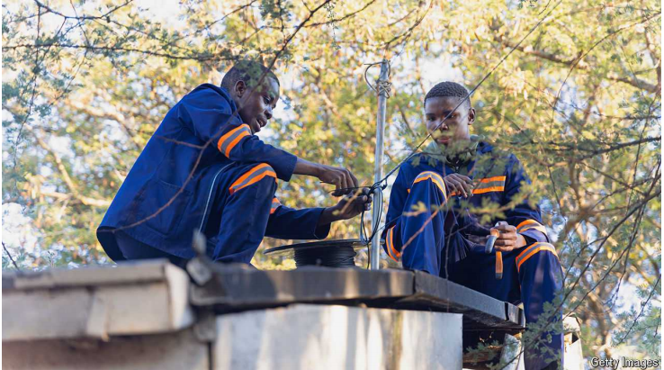

# How to ensure Africa is not left behind by the AI revolution

Weak digital infrastructure is holding the continent back

薄弱的数字基础设施阻碍了非洲大陆的发展

hold back: 阻碍

>"Hold back" 的意思是阻碍或拖延。在上下文中，指的是薄弱的数字基础设施阻碍了非洲大陆的发展或进步。
>
>**例句**：
>- The lack of funding is holding back the development of new technologies in the region.
>  - 中文翻译：资金不足阻碍了该地区新技术的发展。

原文：

More than two decades ago *The Economist* calculated that all of Africa had

less international bandwidth than Brazil. Alas, until 2023 that was still true.

Africa’s lack of connectivity is one reason its people could miss out on the

benefits promised by artificial intelligence (AI).

二十多年前,《经济学人》计算出整个非洲的国际带宽比巴西还少。唉，直到2023年还是如此。非洲缺乏连通性是其人民可能错过人工智能(AI)承诺的好处的一个原因。

学习：

alas：美 [əˈlæs] 唉；悲哀地；遗憾地

miss out on：将…遗漏；错过；错失          

原文：

For decades, experts have called for better broadband across Africa, citing

the gains in productivity and employment. But the economic potential of 

AI, and its insatiable computing appetite, have renewed the case for urgent

investment in the physical sinews needed to sustain a new digital revolution.

几十年来，专家们一直呼吁在整个非洲建设更好的宽带，理由是生产率和就业率的提高。但人工智能的经济潜力及其永不满足的计算需求，重新引发了对维持新的数字革命所需的基础设施进行紧急投资的理由。

学习：

broadband：宽带；宽频带；高速互联网接入服务；宽带连接；

insatiable：美 [ɪnˈseɪʃəbl] 贪得无厌的；不知足的；无法满足的；欲壑难填的；

sinews：美 ['sɪnjuːs] 体力；原动力；（sinew的复数）

>- **Citing** 的意思是引用或提及。专家们引用了生产力和就业方面的收益，呼吁在非洲改善宽带设施。
>  - **例句**：
>    - The report cited several studies that showed the benefits of early childhood education.
>    - 中文翻译：该报告引用了几项研究，显示了幼儿教育的好处。
>

physical sinews: 基础设施

>- **Physical sinews** 的意思是指实际的、必要的基础设施。在这里，指的是支持新数字革命所需的物理基础设施，例如宽带网络和计算设备。
>  - **例句**：
>    - The construction of new roads and bridges is essential for strengthening the physical sinews of the country's infrastructure.
>    - 中文翻译：新道路和桥梁的建设对于加强国家基础设施的物理筋骨至关重要。

原文：

Fortunately, Africa has a home-grown model it can emulate. Its embrace of

mobile phones in the early 2000s was a stunning feat of economic

liberalisation. In most parts of Africa, businesses and consumers used to

have to wait years to get a fixed-line phone. Nigeria, which has Africa’s

biggest population (now more than 220m-strong), had just 450,000 phone

lines in 1999, of which perhaps a third were on the blink. But when

governments allowed privately owned mobile-phone companies to offer

their services, they rapidly displaced the lethargic state-owned telcos.

幸运的是，非洲有一个可以效仿的本土模式。它在21世纪初对手机的接纳是经济自由化的惊人壮举。在非洲的大部分地区，企业和消费者过去必须等待数年才能获得一部固定电话。尼日利亚拥有非洲最多的人口(现在超过2 . 2亿), 1999年仅有45万条电话线，其中三分之一可能处于瘫痪状态。但是当政府允许私有移动电话公司提供服务时，他们迅速取代了无精打采的国有电信公司。

学习:

home-grown：自产的；本国产的；土生土长的

emulate：美 [ˈemjuleɪt] 模仿；仿效；

stunning：美 [ˈstʌnɪŋ] 极好的；令人惊叹的；极吸引人的；极有魅力的

stunning feat of xxx：是xxx的惊人壮举

fixed-line：固网的；固定线路的          

Nigeria：美 [naɪˈdʒɪriə] 尼日利亚

on the blink：失灵, 出毛病          

lethargic：美 [ləˈθɑrdʒɪk] 无精打采的；懒散乏力的

telcos： telephone companies 电话公司

-strong：强调人口数量的庞大

>这里的“220m-strong”表示的是尼日利亚人口超过2.2亿。具体地说，“m”是“million”（百万）的缩写，“-strong”用来强调人口数量的庞大。因此，“220m-strong” 意思是“超过2.2亿的庞大人口”。
>
>- **例句**：
>  - India, with its 1.3 billion-strong population, faces significant challenges in providing adequate healthcare services.
>  - 中文翻译：印度拥有13亿庞大人口，在提供充足的医疗服务方面面临巨大挑战。

原文：

It was a lesson in development done effectively, but frugally. Now sub-

Saharan Africa has around 500m mobile subscriptions, roughly half of them

associated with internet-capable smartphones. Mobile-phone services

directly contribute $170bn to Africa’s GDP. More important, they make almost

everyone from small farmers to market traders more productive, boosting

growth and incomes throughout the economy.

这是发展过程中有效但节俭的一课。现在，撒哈拉以南非洲有大约5亿手机用户，其中大约一半与能上网的智能手机有关。移动电话服务直接贡献了非洲1700亿美元的GDP。更重要的是，它们让从小农到市场交易者的几乎所有人都变得更有生产力，提振了整个经济的增长和收入。

学习：

frugally：美 [ˈfruɡlɪ] 节约地；节省地

sub-Saharan：撒哈拉以南的

subscriptions：移动电话的用户数

>这里的“subscriptions”指的是移动电话的订阅数量或用户数。具体地说，移动订阅是指已经注册并活跃使用移动电话服务的用户或账户。
>
>- **例句**：
>  - The telecommunications company reported a significant increase in mobile subscriptions over the past year, reaching a total of 10 million users.
>  - 中文翻译：这家电信公司报告过去一年中移动电话订阅量显著增加，总用户数达到1000万。

原文：

Alas, this spectacular leapfrogging has downsides. The focus on mobile is

one reason behind Africa’s underinvestment in fast fibre-optic connections.

Although mobile phones have enabled mobile money and government

services, such as digital ID, they can take economies only so far, especially

when most parts of Africa have relatively slow 2G or 3G networks.

唉，这种惊人的跨越也有不利的一面。对移动的关注是非洲对快速光纤连接投资不足的原因之一。虽然移动电话已经实现了移动货币和政府服务，如数字身份证，但它们只能在一定程度上节约成本，尤其是当非洲大部分地区的2G或3G网络相对较慢时。

学习：

leapfrogging：跳蛙游戏；跳背游戏；跃过；（leapfrog的现在分词）

fibre-optic：纤维光学（光导纤维）的          

mobile money：移动货币

原文：

Fibre can carry more traffic, and faster. This allows seamless video calls,

reduces dizzying lags in augmented-reality apps for, say, training surgeons

and lets people interact with AI chatbots and other online services. Yet Africa

is poorly served by subsea internet cables. Moreover, much of the internet

bandwidth that lands on the coasts is wasted because of a lack of high-

capacity overland cables to carry it to the interior. Worse, the continent does

not have enough data centres—the brick-and-mortar sites where cloud

computing happens. The Netherlands, population 18m, has more of these

than all of Africa and its 1.5bn people. As a result, data must cross half the

world and back, leading to painful delays. If Africans are to do movie

animation, run sophisticated weather forecasts or train large language

models with local content, they will need more computing capacity closer to

home

光纤可以承载更多的流量，而且速度更快。这可以实现无缝视频通话，减少增强现实应用程序中令人眼花缭乱的延迟，例如，培训外科医生，并让人们与人工智能聊天机器人和其他在线服务进行互动。然而，非洲的海底互联网电缆服务很差。此外，由于缺乏高容量的陆上电缆将互联网带宽传输到内陆，沿海地区的大部分互联网带宽都被浪费了。更糟糕的是，非洲大陆没有足够的数据中心——云计算发生的实体网站。拥有1800万人口的荷兰，其手机数量超过了整个非洲及其15亿人口。因此，数据必须穿越半个世界再返回，导致痛苦的延迟。如果非洲人要制作电影动画、运行复杂的天气预报或用本地内容训练大型语言模型，他们将需要离家更近的更大计算能力

学习：

fibre：美 [ˈfaɪbər] （光纤等的）纤维线缆

carry more traffic：承载更多流量

dizzying：令人昏乱的；

lags：延迟

subsea：海底的

internet cables：网络电缆

overland：陆路运输；经由陆地旅行；

interior：美 [ɪnˈtɪriər] 内地；内陆；腹地； **注意发音**

brick-and-mortar：实体的      

animation：动画；动画片

原文：

To fix this, governments should learn from the mobile boom and cut red

tape. Starlink, a satellite-internet firm, could be a stopgap, but regulators

have blocked it in at least seven countries including South Africa. Heavy

taxes on data access drive up costs for consumers, discouraging them from

using it and firms from investing in providing it. Governments could do

much to help simply by getting out of the way.

为了解决这个问题，政府应该从手机热潮中吸取教训，减少繁文缛节。卫星互联网公司Starlink可能是一个权宜之计，但是监管者已经在包括南非在内的至少七个国家阻止了它。对数据访问的重税推高了消费者的成本，阻碍了他们使用数据，也阻碍了公司投资提供数据。政府可以通过简单的让位来提供更多的帮助。

学习：

cut red tape：减少繁文缛节

stopgap：权宜之计；临时替代品；应急措施；暂时解决办法

drive up：哄抬；上涨驱使；抬高；使上升；

原文：

Development institutions, for their part, should be doing more to help

finance this vital infrastructure because of its widespread benefits for growth

and employment. The new digital revolution will create opportunities for

Africa to catch up with rich countries. But if the continent lacks the right

infrastructure, it will instead fall further behind. ■

就发展机构而言，它们应该做更多的工作来帮助为这一至关重要的基础设施提供资金，因为它对增长和就业有着广泛的好处。新的数字革命将为非洲创造赶上富裕国家的机会。但如果非洲大陆缺乏合适的基础设施，它反而会更加落后。■

## 后记

2024年7月28日16点16分于上海。

