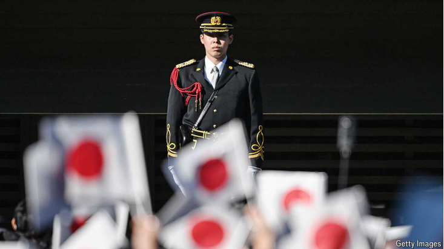
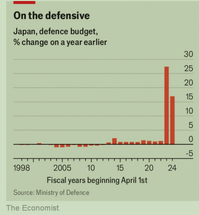

# Is this a new age of warrior Japan?

The country is spending more on its armed forces. But not everyone is on board

on board：支持的；赞同的          

原文：

IMAGINE a weekend outing for a Japanese family, and a tour of a warship

may not come to mind. Yet thousands came to see the *Ise*, a light aircraft-

carrier, when it moored off Sendai, on Japan’s north-east coast, earlier this

month. Children scrambled around a helicopter on the deck. Enthusiasts

snapped photos of anti-aircraft turrets. Many expressed gratitude for the

Self-Defence Forces (SDF), as Japan’s armed forces are called. “The SDF 

protects us. It’s a wonderful thing,” gushed Yamazaki Saori, who took her

daughter. “Japan is facing so many threats.”

想象一个日本家庭的周末出游，可能不会想到军舰之旅。然而，本月早些时候，当轻型航空母舰“伊势号”停泊在日本东北海岸的仙台时，数千人前来参观。孩子们围着甲板上的一架直升机爬来爬去。爱好者抓拍了防空炮塔的照片。许多人表达了对日本自卫队的感激之情。“自卫队保护我们。带着女儿的山崎纱织赞叹道。“日本正面临如此多的威胁。”

学习：

weekend outing：周末外出；在周末外出          

warship：战舰；军舰；

aircraft-carrier：航空母舰      

moored：美 [mʊrd] 系住；使停泊；（moor的过去式）

snapped：拍摄...照；（snap的过去式和过去分词）

snap photos：抓拍照片

turrets：美 [ˈtɜrɪts] 炮塔；小塔；（turret的复数）

anti-aircraft：防空的

Self-Defence Forces（SDF）：日本自卫队

gushed：迸出；涌出；（gush的过去式和过去分词）赞不绝口

>这里的"gush"指的是极其热情或夸张地表达某种情感或意见。在这个句子中，Yamazaki Saori 对日本自卫队的保护表示了极大的赞赏和感激。这种表达方式带有强烈的情感色彩。
>
>例子
>
>1. **英译中例子**：
>   - "She gushed about her new job, saying it was the best thing that ever happened to her."
>   - "她对新工作赞不绝口，说这是她经历过的最好的事情。"
>
>2. **中译英例子**：
>   - "他对他的新车赞不绝口，称它是他开过的最好的车。"
>   - "He gushed about his new car, saying it was the best car he had ever driven."

原文：

Such events reflect how much has changed in Japan, which has had a fraught

relationship with military power since its defeat in the second world war.

Through much of the post-war period Japan preferred to focus on economic

development and leave security to America, its main ally. In recent decades

China’s rise, North Korea’s acquisition of nuclear weapons and America’s

unreliability changed that calculus; Russia’s invasion of Ukraine in 2022

dispelled any remaining illusions that peace can be taken for granted. As

Ishiyama Shuichi, an SDF veteran who visited the *Ise*, put it, “People no longer

have *heiwa bokeh*,” a phrase meaning “the peace blur” (or, if used derisively,

“peace senility”)

此类事件反映出日本发生了多大的变化。自二战战败以来，日本与军事力量的关系一直令人担忧。在战后的大部分时间里，日本更愿意专注于经济发展，将安全事务留给其主要盟友美国。近几十年来，中国的崛起、朝鲜获得核武器以及美国的不可靠改变了这种考量；2022年，俄罗斯入侵乌克兰，打消了一切认为和平是理所当然的幻想。正如参观过伊势的自卫队老兵石山修一所说，“人们不再有黑瓦薄凯”，这个短语的意思是“和平模糊”(或者，如果被嘲笑的话，“和平衰老”)

学习：

defeat：失败

fraught：充满紧张的；充满风险的；

>“Fraught” 在这个语境中指的是“充满紧张和焦虑的”。在谈到日本与军事力量的关系时，这个词用来形容日本战后与军事力量之间复杂且紧张的关系。
>
>英文: The negotiations were fraught with tension and disagreements.
>
>中文: 谈判充满了紧张和分歧。

fraught relationship：紧张的关系

military power：军事力量

post-war：战后

acquisition：（知识、技能等的）获得；习得；学得；

acquisition of nuclear weapons：获得核武器

dispelled：美 [dɪ'speld] 驱散；驱逐；消除；（dispel的过去式和过去分词）

illusions：幻想；假象；幻觉；错觉；（illusion的复数）

dispel illusions：驱散xxx的幻想

derisively： 美 [dɪ'raɪsɪvlɪ] 嘲笑地；嘲弄地

senility：美 [sə'nɪlətɪ] 老迈；高龄；老态龙钟;痴呆

>**peace blur**（和平模糊）：这是指由于长时间生活在和平环境中，人们对战争和军事威胁的感知变得模糊或不清晰。人们可能因为长期的和平而对潜在的威胁掉以轻心。
>
>- 英文: After decades of peace, the citizens had developed a peace blur, making them unaware of the growing threats around them.
>- 中文: 在经历了几十年的和平之后，市民们对周围日益增长的威胁变得不敏感，这就是所谓的和平模糊。
>
>**peace senility**（和平痴呆）：这个词带有贬义，形容人们由于长期的和平生活而变得麻木、迟钝，甚至对现实的安全威胁失去警觉。
>
>- 英文: Critics argue that the country's leaders are suffering from peace senility, ignoring the obvious signs of danger.
>- 中文: 批评者认为国家领导人因和平痴呆而忽视了明显的危险信号。

原文：

That clarity has helped shape Japan’s security policy. In late 2022 Kishida

Fumio, Japan’s prime minister, unveiled reforms that build on the efforts of

his predecessors, Abe Shinzo and Suga Yoshihide, to strengthen Japan’s

defences and build more credible deterrence. Though lacking a handy

catchphrase like Germany’s *Zeitenwende*, the Japanese plans are no less

historic. The government pledged to raise spending on national security to

2% of GDP by 2027, an increase of more than 60% from 2022; to acquire long-

range missiles that allow the SDF to strike beyond its borders; and to make the

SDF combat-ready.

这种清晰有助于日本安全政策的形成。2022年末，日本首相岸田文雄公布了以其前任安倍晋三(Abe Shinzo)和菅义伟(Suga Yoshihide)的努力为基础的改革，以加强日本的防御并建立更可信的威慑。尽管缺少像德国的Zeitenwende这样的流行语，日本的计划仍然具有历史意义。政府承诺到2027年将国家安全支出提高到GDP的2%，比2022年增加60%以上；获得远程导弹，使自卫队能够打击境外；让自卫队做好战斗准备。

学习：

unveil reform：推出改革

deterrence：美 [dɪˈtɚrəns] 威慑

catchphrase：美 [ˈkætʃˌfreɪz] 流行语；名言；常用语；

原文：

A stronger Japan would have big implications for the balance of power in

the Indo-Pacific. If it follows through on its stated plans, it could become the

world’s third-largest defence spender, up from tenth in 2022. No wonder,

then, that America is thrilled. When the two countries’ defence and foreign

affairs ministers meet in Tokyo for a “2+2” meeting later this month, Japan’s

security surge will be front of mind.

一个更强大的日本将对印度-太平洋地区的力量平衡产生重大影响。如果它坚持其既定计划，它可能会从2022年的第十位上升到世界第三大国防支出国。难怪美国会如此激动。本月晚些时候，当两国的国防和外交部长在东京举行“2+2”会议时，日本的安全激增将成为人们关注的焦点。

学习：

implications：影响

Indo-Pacific：印度洋－太平洋地区的

thrilled：激动的；极为激动的；使紧张；（thrill的过去式）

>“Thrilled” 在这个语境中意为“非常兴奋”或“极为高兴”。这里指美国对日本加强军事力量感到非常高兴和期待。
>
>英文: She was thrilled to hear that she had won the competition.
>
>中文: 她听到自己赢得比赛时非常兴奋

be front of mind: 最优先考虑的

>“Be front of mind” 意思是“最优先考虑的”或“最关注的”。在这段话中，指的是在即将举行的“2+2”会议上，日本的安全加强计划将是最优先讨论的话题之一。
>
>英文: As the company plans its next steps, sustainability will be front of mind for the leadership team.
>
>中文: 在公司规划下一步时，可持续发展将是领导团队最优先考虑的问题。

原文：

But how ready is Japan to become a warrior nation? The defence budget

grew by 27% in 2023 and will rise by another 17% in 2024, reaching ¥8trn

($51bn) in current prices, the largest in the history of the SDF; between 2013

and 2022 it grew by an average of 1% annually, after accounting for

inflation (see chart). Hundreds of missiles are due to be delivered next year;

the SDF’s command-and-control structures are being updated. Yet constraints

remain. Japan’s defence industry is stunted; its currency is weak; its

youngsters have little interest in joining the SDF; and public support for hard

power still has limits.

但是日本准备好成为一个战士国家了吗？国防预算在2023年增长了27%，并将在2024年再增长17%，按当前价格计算达到8万亿日元(510亿美元)，是自卫队历史上最大的一次；在2013年至2022年间，扣除通货膨胀因素，年均增长率为1%(见图表)。数百枚导弹将于明年交付；自卫队的指挥和控制结构正在更新。然而制约因素依然存在。日本的国防工业发展迟缓；其货币疲软；日本年轻人对加入自卫队兴趣不大；公众对硬实力的支持仍然是有限的。

学习：

stunted：美 [ˈstʌntɪd] 成长受妨碍的；矮小的；发育不良的

youngsters：年轻人

hard power：硬实力

原文：

To understand where Japan’s armed forces are heading, consider first where

the SDF began. The country’s post-war constitution, drafted under American

occupation, was designed to demilitarise Japan. When the Korean war broke

out in 1950 the Japanese government, with America’s backing, set up an

armed police that eventually became the SDF. For decades politicians kept the

SDF’s growth to a minimum. An informal cap on defence spending of around

1% of GNP went into effect in 1976. As the memory of the war receded and

new threats emerged, the SDF’s public image evolved. Disaster-relief efforts

after big earthquakes in 1995 and 2011 helped make the SDF one of Japan’s

most trusted institutions: more than 90% of Japanese have a positive

impression of it.

要理解日本武装力量的走向，首先要考虑自卫队的起源。该国在美国占领下起草的战后宪法旨在实现日本的非军事化。1950年朝鲜战争爆发时，日本政府在美国的支持下，建立了一支武装警察部队，最终成为自卫队。几十年来，政治家们将自卫队的增长保持在最低水平。约占国民生产总值1%的国防开支非正式上限于1976年生效。随着战争记忆的消退和新威胁的出现，自卫队的公众形象也发生了变化。1995年和2011年大地震后的救灾努力帮助自卫队成为日本最值得信赖的机构之一:超过90%的日本人对其印象良好。

学习：

demilitarise： 美 [ˌdimilitəraiz] 去除军事化

receded：后退；减弱；（recede的过去式）

public image：公共形象

disaster relief：救灾

## **Bulking up**

原文：

Yet a more muscular Japan remained a tricky proposition until recently. In

2015, when Abe pushed to reinterpret the constitution to allow Japan to

defend allies beyond its own borders, tens of thousands gathered for raucous

protests. (Abe’s policies still passed.) Since the war in Ukraine, opposition

has faded. The public has got used to the idea of stronger armed forces,

reckons Ushida Yoshimasa, who helped lead the protests a decade ago.

When Mr Kishida unveiled his defence policies, protests were muted.

然而，直到最近，一个更加强大的日本仍然是一个棘手的问题。2015年，当安倍推动重新解释宪法以允许日本保护其境外的盟友时，数万人聚集在一起进行喧闹的抗议。(安倍的政策还是通过了。)自乌克兰战争以来，反对声已经消退。十年前参与领导抗议活动的牛田义正认为，公众已经习惯了加强武装力量的想法。当岸田文雄公布他的国防政策时，抗议是无声的。

学习：
muscular：美 [ˈmʌskjələr] 肌肉发达的；强壮的；强健的；

tricky：棘手的；

proposition：提议；建议；任务；挑战；

tricky proposition：棘手的挑战，棘手的问题

>下面是GPT4o对proposition的解释：
>
>“Proposition” 在这个语境中指的是一个计划、建议或观点。这里指的是一个更加强大的日本作为一个提议或想法，直到最近仍然是一个棘手的问题。
>
>英文: The proposition to increase taxes was met with considerable resistance from the public.
>
>中文: 增加税收的提议遭到了公众的强烈反对。

raucous：美 [ˈrɔkəs] 喧闹的，嘈杂的

>“Raucous” 意味着喧闹的或嘈杂的。在这里指的是2015年反对安倍晋三重解释宪法允许日本在其边界外保卫盟友的政策时，抗议活动非常喧闹和嘈杂。
>
>英文: The raucous crowd at the concert made it difficult to hear the music.
>
>中文: 演唱会上喧闹的观众使得很难听清音乐。

原文：

Bigger budgets and a more supportive public have made it possible for the 

SDF to undertake long-discussed reforms. The command structure is being

reorganised in order to create smoother co-ordination between different

services and America. In the past the SDF chief had to act as both a military

adviser to political leaders and an operational commander, and to liaise with

multiple counterparts in America, explains Kawano Katsutoshi, who held

the job from 2014 to 2019. A joint-operations command will be launched by

early next year and will take on the operational responsibilities of war

planning and conducting exercises. The move has also prompted America to

revise its own outdated command-and-control architecture.

更大的预算和更支持的公众使自卫队有可能进行讨论已久的改革。指挥结构正在重组，以便在不同军种和美国之间建立更顺畅的协调。从2014年到2019年担任这一职务的Kawano Katsutoshi解释说，在过去，自卫队指挥官必须既是政治领导人的军事顾问，又是行动指挥官，还要与美国的多个同行联络。一个联合作战司令部将于明年初成立，并将承担战争规划和演习的作战责任。此举也促使美国修改其过时的指挥控制架构。

学习：

long-discussed：讨论已久的      

co-ordination：协调；配合          

liaise：美 [liˈeɪz] （与某人）联络；建立联系；保持沟通； **注意发音**

joint-operations command：联合作战司令部

conduct exercises：举行演习

原文：

Long-range missiles were taboo under Japan’s doctrine of *senshu boei*, or

exclusive defence, which held that the SDF should possess only the minimal

force necessary to repel an invasion of Japan. These days the SDF is rushing to

acquire 400 Tomahawk missiles from America, which have a range of some

1,600km. At a recent training session on an American base in Yokosuka,

south of Tokyo, Japanese officers inquired about setting missile flight-paths

in a contested environment, of the sort they might face in a conflict with

China

根据日本的专守防卫原则，远程导弹是禁忌，该原则认为自卫队只应拥有击退日本入侵所需的最低限度的武力。这些天，自卫队正急于从美国获得400枚射程约为1600公里的战斧导弹。最近在东京南部横须贺的一个美国基地举行的训练会议上，日本军官询问了在一个有争议的环境中设定导弹飞行路线的问题，这是他们在与中国的冲突中可能面临的情况

学习：

taboo：禁忌；忌讳

doctrine：教义；主义；教条

repel an invasion：击退入侵

tomahawk：美 [ˈtɑməˌhɔk] 印第安战斧（美洲土著的一种工具）；短柄小斧；手斧

Tomahawk missiles：战斧导弹

原文：

Areas that have suffered from chronic underinvestment, but which would be

essential for sustaining combat, are also getting overdue attention. The

maintenance budget has doubled since 2022, allowing the SDF to utilise its

existing ships and planes better (only around half of its assets were estimated

to be operational in 2022). Outlays on ammunition have tripled. Contracts

have been signed to repair more than 20,000 facilities across the country.

Living quarters are getting long-neglected upgrades: barracks will finally be

equipped with Wi-Fi and old squat toilets will be replaced with the

electronic bidet-toilets that are standard across most of Japan.

长期投资不足、但对维持战斗至关重要的地区也受到了早就应该得到的关注。自2022年以来，维护预算增加了一倍，使自卫队能够更好地利用现有的船只和飞机(预计到2022年，只有大约一半的资产可以使用)。弹药支出增加了两倍。已经签署了修复全国20，000多个设施的合同。生活区正在进行长期被忽视的升级:军营将最终配备Wi-Fi，旧的蹲式厕所将被电子坐浴盆取代，这是日本大部分地区的标准厕所。

学习：

outlays：美 [ˈaʊtˌleɪz] 花费；费用；（outlay的复数）

ammunition：美 [ˌæmjuˈnɪʃn] 弹药；子弹；军火；

living quarters：生活区；宿舍；生活小区          

barracks：美 [ˈbɛrəks] 兵营；营房

squat： 美 [skwɑːt] 蹲；蹲坐

bidet：美 [bəˈdeɪ] 坐洗盆 **注意发音**

原文：

While such steps are welcome, they also indicate how far Japan has to go.

And major obstacles remain on the road ahead. One set is financial. In 2022

planners assumed an exchange rate of ¥108 to the dollar; it is now around

¥160. Even domestically produced systems rely on imported components,

meaning that the new budget will not go as far as hoped. The government

has also dawdled on planned rises in income, corporate and cigarette taxes,

posing questions about the sustainability of the higher defence budgets.

Although most Japanese support spending more on security, they are less

keen to pay for it through taxes.

尽管这些举措值得欢迎，但它们也表明日本还有很长的路要走。前进的道路上仍然存在重大障碍。一套是金融。2022年，规划者假设汇率为108:1美元；现在是160左右。即使是国产系统也依赖进口组件，这意味着新预算不会像希望的那样发展。政府还拖延了提高所得税、公司税和卷烟税的计划，这就对更高的国防预算的可持续性提出了质疑。尽管大多数日本人支持在安全上投入更多，但他们并不热衷于通过税收来支付。

学习：

major obstacles remain on the road ahead：前进的道路上仍然存在重大障碍

dawdled：美 [ˈdɔ:dld] 磨蹭；（dawdle的过去式和过去分词）

原文：

Building and operating new kit poses another challenge. Japan’s defence

industry has been stunted by long-standing restrictions on arms exports. The

government has begun to loosen these, and is pushing for greater

collaboration with allies. But ramping up production will take time. The

government has made no guarantees that the spending levels will be

sustained beyond 2027, leaving executives uncertain about investing in

expanded production lines. In an ageing, shrinking Japan, manpower is also

in short supply

构建和操作新套件是另一个挑战。日本的国防工业受到长期武器出口限制的阻碍。政府已经开始放松这些限制，并推动与盟友的更大合作。但是提高产量需要时间。政府没有保证支出水平将持续到2027年以后，这让高管们对投资扩建生产线不确定。在老龄化、萎缩的日本，劳动力也供不应求

学习：

pose：形成；构成

pose another challenge：构成另一个挑战

manpower：劳动力；劳动人口

ramp up：增加（规模，数量，速度）

ramp up production：提高产量

>“Ramp up” 指的是增加或提升某事物的速度、规模或数量。在这个语境中，指的是提高日本国防生产的速度和规模。
>
>例子
>
>1. **英文**: The company decided to ramp up production to meet the increasing demand for their products.
>   - **中文**: 公司决定增加生产以满足日益增长的产品需求。
>
>2. **英文**: To ramp up security during the event, additional personnel were deployed.
>   - **中文**: 为了在活动期间加强安保，部署了更多的人员。

原文：

The SDF is also short of people. “There have been improvements in terms of

hardware, but I’m more worried about the software, the fighting posture,”

says Mr Kawano. Though many respect the SDF, relatively few people are

ready to join. In global surveys Japan ranks last in terms of the share of the

population willing to fight for their country, with just 9% answering in the

affirmative. Last year the SDF missed its recruiting target by half.

自卫队也缺人。“硬件方面有所改进，但我更担心软件，也就是战斗姿态，”川野先生说。尽管许多人尊重自卫队，但准备加入的人相对较少。在全球调查中，日本在愿意为国家而战的人口比例方面排名最后，只有9%的人做出肯定的回答。去年，自卫队的招募目标少了一半。

原文：

Nor does widespread respect for the SDF or concern about aggressive

neighbours translate into eagerness to completely abandon Japan’s post-war

peace-loving identity. Even those who came to see the *Ise* have reservations.

“I think the SDF is a safety net—it’s the last resort,” says Ms Yamazaki’s

daughter, Kurumi. Many in Japan still remember where an excess of warrior

spirit can lead. ■

对自卫队的普遍尊重或对咄咄逼人的邻国的担忧，也没有转化为彻底放弃日本战后爱好和平身份的渴望。甚至那些来看伊势的人也有所保留。“我认为自卫队是一个安全网——它是最后的手段，”山崎女士的女儿Kurumi说。许多日本人仍然记得过度的武士精神会导致什么样的结果。■

学习：

resort：美 [rɪˈzɔːrt] 求助；依靠；诉诸；手段；

last resort：最后的手段

warrior spirit：武士道精神

## 后记

2024年7月31日13点04分于上海。

