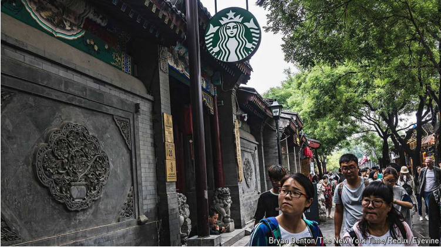
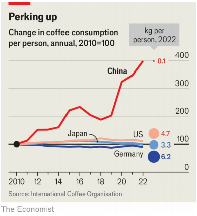

# China is now the world leader in coffee shops

But the average Chinese person still guzzles much less than a typical American

guzzle：英 [ˈɡʌz(ə)l]  狂饮；滥吃

原文：

The historic city of Suzhou, about an hour’s drive from Shanghai, is criss-

crossed with canals. Old whitewashed buildings line the banks. A century

ago some of these would have been *chaguans*, or traditional teahouses,

where locals gathered to discuss the news or conduct business. Today a

visitor is more likely to find shops serving a different kind of beverage.

There are dozens of Starbucks outlets in Suzhou, as well as other coffee

sellers. Some even look like old *chaguans*—from the outside at least.

距上海约一小时车程的历史名城苏州，运河纵横交错。古老的粉刷过的建筑排列在河岸上。一个世纪前，其中一些可能是茶馆，或传统茶馆，当地人聚集在一起讨论新闻或开展业务。如今，游客更有可能找到供应不同种类饮料的商店。苏州有几十家星巴克门店，还有其他咖啡销售商。有些甚至看起来像老茶馆——至少从外面看是这样。

学习：

historic city： 历史文化名城；历史名城          

criss-crossed：穿过；交叉；

canals：美 [kəˈnælz] 运河；水道；气管；沟渠；（canal的复数） **注意发音**

whitewashed：粉饰；（whitewash的过去式和过去分词）

teahouse：茶馆

conduct business：开展业务

beverage：饮品；（除水以外的）饮料

原文：

Between 2010 and 2022 coffee consumption per person in China rose

fourfold (see chart), according to the International Coffee Organisation, a

group of producer and user countries. (China’s GDP per person doubled over

the same period.) The average Chinese person still drinks a fraction of the

amount of coffee guzzled by the typical American: 0.1kg per year compared

with 4.7kg. But last year China surpassed America, becoming the country

with the most branded coffee shops (places like Starbucks) in the world, as

the World Coffee Portal, a research firm, reported. China is home to nearly

50,000 such outlets.

根据由生产国和消费国组成的国际咖啡组织的数据，2010年至2022年间，中国人均咖啡消费量增长了四倍(见图表)。(同期，中国的人均GDP翻了一番。)普通中国人每年喝掉的咖啡量仍然只是普通美国人的一小部分:0.1公斤，而美国人是4.7公斤。但是根据研究公司世界咖啡门户的报告，去年中国超过了美国，成为世界上拥有最多品牌咖啡店(像星巴克这样的地方)的国家。中国有近5万家这样的商店。

学习：

rose fourfold：增长了四倍

原文：

The early history of coffee in China is fuzzy. By some accounts it was Danes

who opened the first coffee shop in the country in the 1830s. The drink

didn’t catch on, in part because the Qing dynasty took a dim view of

foreigners and sought to curb their influence. A record from that period

described coffee as a “black liquor, which the foreign devils drank after

meals, saying it can help with digestion”. A century later Lu Xun, a

celebrated author, wrote that he didn’t drink the stuff: “I always thought it

was for the foreign excellencies.” He and most other Chinese people

preferred tea.

中国咖啡的早期历史不是很清楚。根据某些说法，是Danes在19世纪30年代在这个国家开了第一家咖啡店。这种饮料没有流行起来，部分原因是清朝不喜欢外国人，试图抑制他们的影响。那个时期的一份记录将咖啡描述为“一种黑液，洋鬼子饭后喝，说它可以帮助消化”。一个世纪后，著名作家鲁迅写道，他不喝这种东西:“我一直以为是给外国使节喝的。”他和大多数其他中国人喜欢喝茶。

学习：

fuzzy：不清楚的；模糊的；不清晰的；

by some accounts：根据某些说法

Danes：美 [deɪnz] 丹麦人；戴恩；（Dane的复数）

coffee shop： 咖啡店；咖啡厅

catch on：流行；开始流行；变得受欢迎

take a dim view of：持悲观看法

foreign devils：洋鬼子

celebrated author：著名作家

excellency：美 [ˈɛksələnsi]  阁下（对高级外交官员、大使等的尊称）

原文：

But after China introduced market reforms and opened up to the world in the

1980s, foreign firms such as Maxwell House and Nestlé brought instant

coffee to the country. They catered to local tastes, making their mixes

sweeter and less bitter than what they sold elsewhere. Western-style coffee

shops arrived years later—chief among them Starbucks in 1999. The

company’s freshly brewed coffee was new to China. Having a laptop in one

hand and a (relatively expensive) cup of Starbucks in the other became a

way for young middle-class people to indicate their status.

但是在20世纪80年代中国引入市场改革并向世界开放后，像麦斯威尔和雀巢这样的外国公司将速溶咖啡带到了中国。他们迎合当地的口味，使他们的混合比他们在其他地方卖的更甜，更少苦味。几年后，西式咖啡店出现了——其中最主要的是1999年的星巴克。该公司的现煮咖啡对中国来说还是新鲜事物。一手拿着笔记本电脑，一手拿着一杯(相对昂贵的)星巴克咖啡，成为年轻的中产阶级表明自己地位的一种方式。

学习：

instant coffee：速溶咖啡

freshly brewed coffee：现煮咖啡

indicate their status：表明地位

原文：

The biggest coffee-drinking demographic is still “white-collar workers in

first-tier cities aged between 20 and 40”, according to Deloitte, a consulting

firm. China’s experience mirrors that of Japan some 50 years ago, when

rising incomes led to more coffee consumption. A surge in office jobs—and

long working hours—in China has also fuelled demand.

咨询公司德勤称，最大的咖啡饮用人群仍然是“一线城市年龄在20至40岁之间的白领”。中国的经历与大约50年前的日本如出一辙，当时收入的增加导致了更多的咖啡消费。中国办公室工作的激增——以及长时间工作——也刺激了需求。

学习：

demographic：美 [ˌdeməˈɡræfɪk] 人口特征；（具有某种特征的）群体

white-collar：白领

原文：

Today, though, a wider range of the population is partaking thanks to the rise

of domestic coffee chains selling affordable brews. The leader is Luckin

Coffee, with over 20,000 outlets. Starbucks, by comparison, has 7,300

shops. A cup of basic Luckin coffee is about a third of the price of an

equivalent Starbucks offering. Luckin’s sales in China exceeded Starbucks’

for the first time in 2023. Both chains are expanding into smaller cities.

然而今天，由于出售平价咖啡的国内咖啡连锁店的兴起，更广泛的人群正在参与其中。领导者是Luckin Coffee，拥有超过20，000家分店。相比之下，星巴克有7300家店铺。一杯普通的Luckin咖啡大约是星巴克同等产品价格的三分之一。Luckin在中国的销售额在2023年首次超过星巴克。两家连锁店都在向小城市扩张。

学习：

partaking：美 [pɑr'tekɪŋ] 参与；（partake的现在分词）

sell affordable brews：卖平价咖啡

outlet：门店

原文：

Coffee companies in China are also still trying to cater to local tastes. One

innovation has been the “tea-coffee”, a concoction that blends the two

drinks. Luckin serves such fare as Oolong Latte and Jasmine Sea Salt Latte.

Qing-dynasty officials are surely rolling in their graves. ■

中国的咖啡公司也仍在努力迎合当地口味。一项创新是“茶-咖啡”，一种混合两种饮料的混合物。Luckin供应乌龙茶拿铁和茉莉海盐拿铁等食物。

学习：

concoction：美 [kənˈkɑkʃ(ə)n] 混合物；调配物；调制品；

fare：食物；菜肴

Oolong：美 [ˈulɔːŋ] 乌龙茶（一种半发酵茶，中国茶的一种）

jasmine：美 [ˈdʒæzmɪn] 茉莉花；

## 后记

2024年8月11日15点50分于上海。

