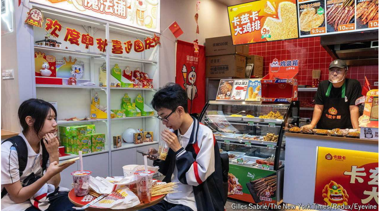

# How Chinese shoppers downgraded their ambition

The trend will dismay the country’s policymakers

原文：

“Even those born poor fear the heat.” This slogan, printed on a lemonade

from Mixue, a drinks-and-ice-cream chain, says a lot about Chinese

consumption. The beverage has been a wild success during a heatwave

sweeping the country, less for its tart, refreshing properties than for its price.

A cup sells for as little as 3.6 yuan ($0.50), compared with 15 yuan for milk

tea. Its popularity, bloggers speculate, reflects darkening consumer

sentiment and growing stinginess. Consumers are rapidly trading down,

from higher-cost goods to cheap substitutes, and many want to squeeze out

every last drop of their spending power.

"甚至那些出身贫寒的人也害怕炎热。"这句印在饮料和冰淇淋连锁店蜜雪冰城的柠檬水上的口号，很好地说明了中国人的消费。在席卷全国的热浪中，这种饮料获得了巨大成功，与其说是因为它酸涩清爽，不如说是因为它的价格。一杯售价仅为3.6元(0.50美元)，而奶茶的售价为15元。博客作者推测，它的流行反映了消费者情绪的低落和日益增长的吝啬。消费者正迅速降低消费，从较高成本的商品转向廉价替代品，许多人希望榨干他们的最后一滴购买力。

学习：

lemonade：美 [ˌleməˈneɪd] 柠檬水；柠檬味汽水；柠檬味饮料

drinks-and-ice-cream：饮料和冰淇淋

tart：酸味的，酸涩的

>"Tart" 在这里指的是酸味的。
>
>例子：这杯柠檬水有一种清爽的酸味。(This cup of lemonade has a refreshing tartness.)

tart and refreshing：酸涩和清爽

milk tea：奶茶

stinginess：美 ['stɪndʒɪnəs] 吝啬；小气

>
>
>"Stinginess" 在这里指的是小气或吝啬。
>
>例子：由于收入减少，他变得越来越小气。(Due to reduced income, he has become increasingly stingy.)

higher-cost：高成本

trade down:从较高成本的商品换成廉价替代品。

>"Trade down" 在这里指的是从较高成本的商品换成廉价替代品。
>
>例子：在经济不景气的情况下，许多家庭不得不从高档品牌换成便宜的替代品。(During the economic downturn, many families had to trade down from premium brands to cheaper substitutes.)

原文：

The bitter truth is that consumer confidence has continued to weaken this

year, instead of recovering from the covid-19 pandemic. Even Shanghai,

China’s consumption capital, witnessed retail spending fall by 2.3% year on

year in the first half of 2024. Much of this is linked to the moribund housing

market, by far the biggest destination for household investment. Youth

unemployment is high, too. And economy-watchers were let down in July,

when a grand political meeting failed to produce a proper rescue plan.

Although household consumption makes up just 39% of GDP, compared with

54% across the OECD, a club of mostly rich countries, that share is continuing

to slide.

严酷的事实是，消费者信心今年继续减弱，而不是从新冠肺炎疫情中恢复过来。即使是中国的消费之都上海，2024年上半年的零售支出也同比下降了2.3%。这在很大程度上与停滞不前的房地产市场有关，而房地产市场是家庭投资的最大目的地。年轻人失业率也很高。7月，当一次大型政治会议未能产生一个合适的拯救计划时，经济观察家们失望了。尽管家庭消费仅占GDP的39%,相比之下，经合组织(一个主要由富裕国家组成的俱乐部)的家庭消费占GDP的54%,但这一比例仍在持续下滑。

学习：

bitter：苦的；痛苦的；悲伤的；

moribund：美 [ˈmɔrəˌbənd] 濒临死亡的；垂死的；停滞不前的；

原文：

Hence why downgrading is becoming a fact of life, as documented by

writers across China. One food-industry author has tracked high-end eateries

going out of business in Beijing. These include a Michelin-starred restaurant

from Umberto Bombana, an Italian chef. Others have noted the rise of

bargains. A blogger counted over 5,000 new restaurants that offer buffet-

style deals. Such restaurants, writes another blogger, show “involution”—

intense, self-harming competition—taking hold.

因此，正如中国各地的作家所记录的那样，降级正在成为生活中的一个事实。一位食品行业的作者追踪了北京倒闭的高端餐馆。其中包括意大利厨师翁贝托·邦巴纳(Umberto Bombana)的米其林星级餐厅。其他人注意到了便宜货的崛起。一位博主统计了5000多家提供自助餐的新餐馆。另一位博客作者写道，这样的餐馆显示出“内卷化”——激烈的、自我伤害的竞争——占据了上风。

学习：

a fact of life：客观事实；无法改变的事实          

 food-industry ：食品行业

eateries：美 [ˈi:təriz] 快餐店；餐厅；饮食场所；（eatery的复数）

high-end eatery：高端餐馆

Michelin：美 [ˈmɪʃəlɛn] 米其林；

Michelin-starred：米其林星级

buffet-style：自助餐

原文：

Many youngsters are happy to flaunt their tightfistedness. Some have started

carrying the plastic bags in which milk tea is delivered in place of designer

holdalls. Far fewer genuine luxury bags are being bought. S&P Global, a

rating agency, reports that, although there was a modest appetite for luxury

spending in 2023, “we don’t see any areas of strength this year.”

许多年轻人乐于炫耀他们的吝啬。一些人已经开始用塑料袋代替名牌手提袋运送奶茶。购买真正奢侈品包的人少多了。评级机构标普全球报告称，尽管2023年对奢侈品消费有适度的需求，但“今年我们看不到任何有优势的领域。”

学习：

flaunt：美 [flɔːnt] 炫耀；夸耀；卖弄

tightfistedness：吝啬

holdall：美 [ˈhoʊldˌɔl]  大手提包

原文：

Near-expiry-date make-up shops have grabbed attention on social media.

Many clearance stores now sell snacks and lipstick at less than half price.

Cosmetics have led the decline in spending in Hainan province, which has

one of the world’s largest duty-free zones. Between January and June this

year, shoppers spent 4bn yuan less on eyeliner and lotion than they did

during the same period in 2023.

临近保质期的化妆品商店在社交媒体上引起了关注。许多清仓商店现在以不到半价出售小吃和口红。化妆品引领了海南省支出的下降，海南省拥有世界上最大的免税区之一。今年1月至6月，购物者在眼线笔和乳液上的支出比2023年同期减少了40亿元。

学习：

expiry：美 [ɪkˈspaɪəri] 到期；失效；

near-expiry-date：临近保质期的

make-up：化妆品

clearance store：清仓商店

lipstick：唇膏，口红

cosmetics：美 [kɑːzˈmetɪks] 化妆品；（cosmetic的复数）

duty-free zone：免税区

eyeliner：美 [ˈaɪˌlaɪnər] 眼线笔；眼线液；

lotion：美 [ˈloʊʃn] 润肤乳；洁肤液；化妆水；爽肤水；保湿水

原文：

The government appears flummoxed. On August 3rd the State Council

released a 20-point plan to support consumption in areas such as child and

elderly care, education, sports and tourism. But the guidelines focus on the

long-term cultivation of markets, not “one-off helicopter money to

households”, as analysts at HSBC, a bank, noted. Indeed, Mr Xi has been

resistant to handouts. He has instead told China’s youth to persevere through

the tough times—or “eat bitterness” as the Chinese saying goes. Many will

suck it down with a straw this summer. ■

政府似乎很困惑。8月3日，国务院发布了一项20点计划，以支持儿童和老年人护理、教育、体育和旅游等领域的消费。但是指导方针关注的是市场的长期培育，而不是像汇丰银行的分析师所说的“一次性直升机撒钱给家庭”。事实上，Xi先生一直抵制施舍。相反，他告诉中国的年轻人要坚持度过艰难时期，或者像中国谚语所说的那样“吃苦”。今年夏天很多人会用吸管把它吸下去。■

学习：

flummoxed：美 [ˈflʌməkst] 不知所措的；困惑的；使混乱；（flummox的过去式）

>
>
>"Flummox" 在这里指的是困惑或不知所措。
>
>例子：在面对复杂的局面时，他显得非常困惑。(He appeared very flummoxed when faced with the complex situation.)

one-off：一次性的；

state Council：国务院

eat bitterness：吃苦

as Chinese saying goes：正如中国俗语所说

straw：吸管

handouts:政府发放的补助或救济金

>"Handouts" 在这里指的是政府发放的补助或救济金。
>
>例子：政府决定减少直接发放的补助，转而投资于长期项目。(The government decided to reduce direct handouts and instead invest in long-term projects.)

## 后记

2024年8月12日15点05分于上海。

