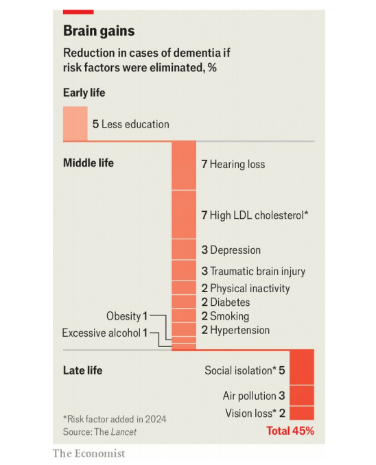

# How to reduce the risk of developing dementia

A healthy lifestyle can prevent or delay almost half of cases

原文：

Some of the best strategies for reducing the chances of developing dementia

are, to put it kindly, impracticable. Don’t grow old; don’t be a woman;

choose your parents carefully. But although old age remains by far the

biggest risk factor, women are more at risk than men and some genetic

inheritances make dementia more likely or even almost inevitable, the latest

research suggests that as many as 45% of cases of dementia are preventable

—or at least that their onset can be delayed.

说得好听点，一些降低患痴呆症几率的最佳策略是不切实际的。不要变老；不要做女人；慎重选择父母。但是，尽管老年仍然是迄今为止最大的风险因素，女性比男性面临的风险更大，并且一些遗传因素使痴呆症更有可能甚至几乎不可避免，但最新研究表明，多达45%的痴呆症病例是可以预防的——或者至少他们的发病可以推迟。

学习：

dementia：美 [dɪˈmenʃə] 痴呆；老年痴呆症

develop dementia：患上老年痴呆症

to put it kindly：说得好听一点

genetic inheritances：基因遗传

preventable：可阻止的；可预防的；

onset：开始；开端；发生

原文：

That is the conclusion of the latest report, published on July 31st, of the

*Lancet* commission on dementia, which brings together leading experts from

around the world, and enumerates risk factors that, unlike age, are

“modifiable”. It lists 14 of these, adding two to those in its previous report in2020: 

untreated vision loss; and high levels of LDL cholesterol. Most news

about dementia seems depressing, despite recent advances in treatments for

some of those with Alzheimer’s disease, much the most common cause of

the condition. Most cases remain incurable and the numbers with the

condition climb inexorably as the world ages. That the age-related incidence

of dementia can actually be reduced is a rare beacon of hope.

这是《柳叶刀》痴呆症委员会7月31日发布的最新报告的结论，该委员会汇集了来自世界各地的顶尖专家，列举了与年龄不同的“可改变”的风险因素。它列出了其中的14种，在2020年的上一份报告中增加了两种:未经治疗的视力丧失；和高水平的低密度脂蛋白胆固醇。大多数关于痴呆症的消息似乎令人沮丧，尽管最近对一些阿尔茨海默病病患者的治疗取得了进展，这是该疾病最常见的原因。大多数病例仍然无法治愈，随着世界的老龄化，患有这种疾病的人数不可阻挡地攀升。与年龄相关的痴呆症发病率实际上可以降低，这是一个罕见的希望灯塔。

学习：

Lancet：美 [ˈlænsət] 柳叶刀（一种小型锋利的外科手术刀）

leading experts：顶尖专家

enumerate：列举；枚举

modifiable：美 ['mɑdə,faɪəbl] 可更改的；可变更的；可修正的

vision loss：丧失视力

cholesterol：美 [kəˈlestərɔːl] 胆固醇

incurable：美 [ɪnˈkjʊrəbl] 无法治愈的；无药可救的；绝症的；

inexorably：美 [ɪn'eksərəblɪ] 无情地；冷酷地；不可阻挡地

beacon：美 [ˈbiːkən] 信号灯；信标；灯塔；

incidence：美 [ˈɪnsɪdəns] 发生率；发生范围；影响范围

原文：

The modifiable risk factors include smoking, obesity, physical inactivity,

high blood pressure, diabetes and drinking too much alcohol (see chart). The

best way to reduce the risk of developing dementia is to lead what has long

been considered to be a healthy life: avoiding tobacco and too much alcohol

and taking plenty of exercise (but avoiding those forms of it that involve

repeated blows to the head or bouts of concussion, a list which includes

boxing, American football, rugby and lacrosse).

可改变的风险因素包括吸烟、肥胖、缺乏锻炼、高血压、糖尿病和饮酒过量(见图表)。降低患痴呆症风险的最佳方式是过长期以来被认为是健康的生活:不吸烟、不酗酒，并进行大量锻炼(但要避免那些涉及反复击打头部或脑震荡发作的锻炼形式，包括拳击、美式足球、橄榄球和长曲棍球)。

学习：

obesity：美 [oʊˈbisəti] 肥胖 **注意发音**

physical inactivity：缺乏锻炼

avoid tabacco：不吸烟

concussion：美 [kənˈkʌʃn] 脑震荡

lacrosse：美 [ləˈkrɔːs] 长曲棍球

原文：

It also means having a good diet, defined in one study cited by the

commission as: “Eat at least three weekly servings of all of fruit, vegetables

and fish; rarely drink sugar-sweetened drinks; rarely eat prepared meat like

sausages or have takeaways.” So it is not surprising that LDL cholesterol has

been added to its not-to-do list. It is also important to exercise the brain: by

learning a musical instrument or a foreign language, for example—or even

by doing crossword and sudoku puzzles.

这也意味着有一个良好的饮食，在委员会引用的一项研究中定义为:“每周至少吃三份水果、蔬菜和鱼；很少喝含糖饮料；很少吃香肠之类的熟肉或外卖。”因此，低密度脂蛋白胆固醇被列入“不可为”的名单就不足为奇了。锻炼大脑也很重要:例如，通过学习一种乐器或一门外语——或者甚至通过做纵横字谜和数独游戏。

学习：

diet：美 [ˈdaɪət]饮食；日常食物；规定饮食

have a good diet：良好的饮食

sugar-sweetened drinks：含糖饮料

sausages：美 [ˈsɔːsɪdʒɪz] 香肠；腊肠；（sausage的复数）

have takeaways：点外卖

exercise the brain：锻炼大脑

musical instrument：乐器

sudoku：美 [suˈdoʊkuː] 数独，**注意发音**

原文：

Some physical ailments do not bring heightened risks of cardiovascular

disease or cancer but have been shown to make dementia more likely. One is

untreated hearing loss. The *Lancet* commission’s report from 2020

concluded this was the biggest of its 12 risk factors, a conclusion shared by

this latest study. People with hearing loss are about twice as likely as others

to develop dementia. The wider availability and use of hearing aids would

probably be the single intervention most effective in reducing the incidence

of dementia.

一些身体疾病不会增加患心血管疾病或癌症的风险，但已被证明更有可能导致痴呆症。一种是未经治疗的听力损失。柳叶刀委员会2020年的报告得出结论，这是其12个风险因素中最大的一个，这项最新研究也认同这一结论。听力损失的人患痴呆症的可能性大约是其他人的两倍。更广泛地获得和使用助听器可能是降低痴呆症发病率最有效的单一干预措施。

学习：

ailments：美 [ˈeilmənts] 小病；小病（ailment复数形式）；疾病；（ailment的复数）

physical ailments：身体疾病

heightened：（使）加强；提高，升高；（heighten的过去式和过去分词）          

cardiovascular：英 [ˌkɑːdiəʊˈvæskjələ] 心血管的

cardiovascular disease：心血管疾病

hearing loss：听力损失、丧失听力

hearing aids：助听器

原文：

It is also not surprising that eyesight problems have been added to the latest

dementia-risks list. It is unclear why impaired hearing and vision should

have such an impact on the risk of dementia. One idea is that they all have a

common cause. That hearing aids are very effective in protecting against

dementia, however, argues against that theory for deafness. Diabetes,

however, is a risk factor for both failing eyesight and dementia.

视力问题被列入最新的痴呆症风险名单也就不足为奇了。尚不清楚为什么听力和视力受损会对痴呆症的风险产生如此大的影响。一个想法是他们都有一个共同的原因。然而，助听器对预防痴呆症非常有效，这反驳了耳聋的理论。然而，糖尿病是视力下降和痴呆症的一个危险因素。

学习：

eyesight：视力；视觉能力；视觉

impaired：受损的；功能受限的；损坏的；有（身体、智力）缺陷的；出毛病的

deafness：美 [ˈdɛfnɪs] 耳聋

原文：

Others speculate that people straining to understand what is said to them or

to navigate a world made hazy by poor eyesight suffer a debilitating

increased “cognitive load”. It may also be that these problems inhibit

people’s social lives and make them lonelier. Social isolation and depression

are also important risk factors.

其他人推测，努力理解别人对他们说的话或在一个因视力不佳而变得模糊的世界中导航的人会遭受“认知负荷”的增加。也可能是这些问题抑制了人们的社交生活，让他们更加孤独。社会孤立和抑郁也是重要的危险因素。

学习：

hazy：朦胧的；模糊的；不清晰的

poor eyesight：视力不好

debilitating： 美 [dɪ'bɪləˌteɪtɪŋ] 使衰弱；使虚弱；（debilitate的现在分词形式）

social lives：社交生活

## **Against the world**

原文：

Some of the modifiable risk factors are, in fact, far beyond any individual’s

control. For example, it makes a big difference how many years of education

someone has had. Broadly speaking, the higher the level of educational

attainment, the lower the risk of dementia. Polluted air is another risk factor.

And the only guaranteed way to escape that is to move.

事实上，一些可改变的风险因素是任何个人都无法控制的。例如，一个人受教育的年限有很大的不同。一般来说，受教育程度越高，患痴呆症的风险越低。污染的空气是另一个风险因素。唯一能保证逃脱的方法就是搬家。

学习：

broadly speaking：一般来说

educational attainment：受教育程度

原文：

Again, the mechanism by which air pollution contributes to dementia risk is

disputed. The danger comes from fine particles known as PM2.5 (defined as

those measuring less than 2.5 millionths of a metre in diameter) that, if

inhaled, can increase the risk of strokes, heart disease, lung cancer and

respiratory diseases—some of which are themselves risk factors for

dementia. But a more direct cardiovascular link is also possible: the particles

could enter the bloodstream and affect the walls of blood vessels, making

them less efficient in clearing the brain of waste.

同样，空气污染导致痴呆症风险的机制也存在争议。危险来自被称为PM2.5的细颗粒物(定义为直径小于2.5百万分之一米的颗粒物)，如果被吸入，会增加中风、心脏病、肺癌和呼吸系统疾病的风险——其中一些疾病本身就是痴呆症的风险因素。但更直接的心血管联系也是可能的:颗粒可能进入血液，影响血管壁，使它们在清除大脑废物方面效率更低。

学习：

fine particles：细微颗粒；细小颗粒物          

millionths：美 ['mɪljənθ] 百万分之一；（millionth的复数）

respiratory：美 [ˈrespərətɔːri] 呼吸的；与呼吸有关的；呼吸系统的

respiratory diseases：呼吸系统疾病

bloodstream：美 [ˈblədˌstrim] 血流；血液循环

blood vessels：血管

wall of blood vessels：血管壁

原文：

Longitudinal studies into the causes of dementia take years to run and are

complex to organise. They can be controversial and raise ethical problems

(randomised-controlled trials, for example, might be possible only if some

curable conditions were left untreated). That can make definitive

conclusions hard to reach. Many experts, for example, had wanted sleeping

disorders added to the list of risk factors. Some studies do, in fact, suggest

that poor sleep patterns in middle age may contribute to a higher risk of

dementia in later life. But the evidence is mixed, with other studies

suggesting that some sorts of insomnia are actually associated with a

diminished risk of developing dementia.

对痴呆症病因的纵向研究需要数年时间，而且组织起来也很复杂。它们可能会引起争议，并引发伦理问题(例如，只有在某些可治愈的疾病未得到治疗的情况下，随机对照试验才有可能)。这使得很难得出明确的结论。例如，许多专家希望将睡眠障碍加入到风险因素的清单中。事实上，一些研究确实表明，中年时期不良的睡眠模式可能会增加晚年患痴呆症的风险。但证据是复杂的，其他研究表明，某些类型的失眠实际上与患痴呆症的风险降低有关。

学习：
longitudinal：美 [ˌlɑːndʒəˈtuːdnl] 纵的；纵向的；纵贯的；纵深的

ethical problems：伦理问题；道德问题；伦理道德问题          

definitive：美 [dɪˈfɪnətɪv] 决定性的；最终的；最后的；权威性的；明确的

sleeping disorders：睡眠障碍

insomnia：美 [ɪnˈsɑːmniə] 失眠

原文：

Nevertheless, there is plenty of evidence to show that the risk factors

outlined by the commission are salient. In rich Western countries, for

example, the incidence rate of dementia has declined by 13% per decade

over the past 25 years, consistently across studies. Gill Livingston, a

professor in the psychiatry of older people at University College London and

leader of the *Lancet* commission, has summed up the evidence of progress in

North America and Europe as “a 25% decrease in the past 20 years”. Such

rapid and significant change can only be the result of changes in modifiable

risk factors.

然而，有大量证据表明，委员会所概述的风险因素非常突出。例如，在富裕的西方国家，在过去的25年里，痴呆症的发病率每十年下降13%,各种研究一致。伦敦大学学院老年人精神病学教授兼柳叶刀委员会主席吉尔·利文斯顿(Gill Livingston)将北美和欧洲的进步证据总结为“过去20年下降了25%”。这种快速而显著的变化只能是可改变的风险因素变化的结果。

学习：

salient：美 [ˈseɪliənt] 显著的；突出的；显眼的；重要的

incidence rate：发病率

psychiatry： 美 [saɪˈkaɪətri] 精神医学；精神病学

原文：

Despite the upbeat tone of the commission’s report, in some countries, such

as China and Japan, the age-related incidence of dementia is climbing. In

Japan the overall age-adjusted prevalence rate doubled from 4.9% in 1985 to

9.6% in 2014. And according to the China Alzheimer Report of 2022, the

incidence of Alzheimer’s in that country had “steadily increased”, making it

the fifth-most important cause of death in the country in that year.

尽管该委员会的报告语气乐观，但在中国和日本等一些国家，与年龄相关的痴呆症发病率正在攀升。在日本，经年龄调整的总体患病率翻了一番，从1985年的4.9%升至2014年的9.6%。根据2022年中国阿尔茨海默病报告，该国阿尔茨海默病的发病率“稳步上升”，成为该国当年第五大死亡原因。

学习：

upbeat：美 [ˈʌpbiːt] 乐观的；积极向上的；

原文：

Nobody doubts that the prevalence of dementia is going to climb fast in the

next decades as humanity ages. All the more reason for dementia-risk

reduction to become a global policy priority. ■

没有人怀疑，随着人类年龄的增长，痴呆症的患病率将在未来几十年快速攀升。因此，降低痴呆症风险应该成为全球政策的重中之重。■

## 后记

2024年8月12日19点11分于上海。

