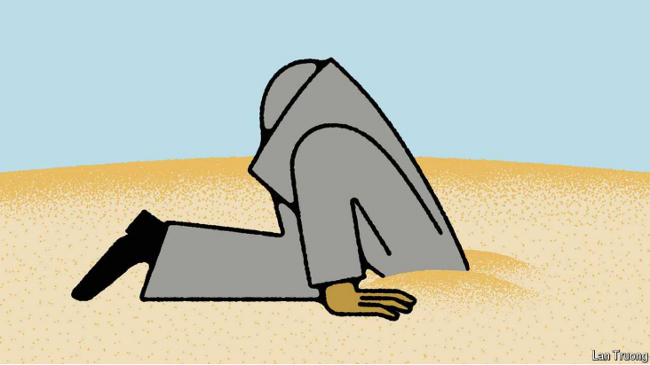

# India cannot fix its problems if it pretends they do not exist

The government’s response to bad news is to stick its fingers in its ears

stick its fingers in its ears： 塞住耳朵，自欺欺人

>[Don't bury your head in the sand](http://idioms.thefreedictionary.com/bury+head+in+the+sand)
>Fig. to ignore or hide from obvious signs of danger. (Alludes to an ostrich, which is believed incorrectly to hide its head in a hole in the ground when it sees danger.)
>*"Stop burying your head in the sand. Look at the statistics on smoking and cancer."*

原文：

TWO SURPRISING results came out in India on June 4th. One was the

conclusion of a six-week-long general election in which the ruling Bharatiya

Janata Party (BJP) expected an easy victory on the back of its hugely popular

leader, Narendra Modi, the prime minister. Exit polls forecast as many as

340 of 543 seats for the BJP. Instead, the party limped in with just 240 and

formed a government only in coalition.

6月4日，印度公布了两个令人惊讶的结果。一个是为期六周的大选结束，执政的印度人民党(BJP)预计在其广受欢迎的领导人、总理纳伦德拉·莫迪的支持下会轻松获胜。出口民调预测BJP将获得543个席位中的340个。相反，该党仅获得240个席位，勉强进入议会，并仅组成联合政府。

学习：

hugely popular：广受欢迎的

limp in：一瘸一拐的走进来

原文：

For a cohort of 2.3m Indians it was that day’s other result that was more

important. A month earlier they had sat a national entrance test to compete

for some 110,000 medical-college seats. Scores released on June 4th showed

a surprising—and unprecedented—67 candidates with perfect grades,

including six from just one testing centre.

对于230万印度人来说，那天的另一个结果更为重要。一个月前，他们参加了全国入学考试，竞争大约11万个医学院席位。6月4日公布的分数显示了令人惊讶的——前所未有的——67名考生获得了满分，其中6名来自一个考试中心。

学习：

cohort： 美 [ˈkoʊhɔːrt]（有共同特点或举止类同的）一群人；一批人

sit：参加考试

>这里的 "sat" 是 "sit" 的过去式，意思是 "参加考试"。在这段文字中，"sat a national entrance test" 表示 "参加了一次全国入学考试"。
>
>例子：学生们参加了全国入学考试，竞争约11万个医学院的席位。 (The students sat a national entrance test to compete for around 110,000 medical college seats.)

原文：

What followed was no surprise at all. Allegations of corruption were flung

about. The government denied that exam papers had leaked. The matter

reached the Supreme Court, which ruled that there were leaks but they were

not systemic. But not before an exasperated chief justice sighed, “Let us not

be in self-denial because self-denial is only adding to the

problem...Everyone knows there was a leak.”

接下来的事情一点都不意外。关于腐败的指控四处流传。政府否认试卷泄露了。这件事传到了最高法院，最高法院裁定确实存在漏洞，但不是系统性的。但在此之前，一位被激怒的首席大法官叹息道:“让我们不要自我否定，因为自我否定只会增加问题...每个人都知道有泄漏。”

学习：

rule：裁定

exasperated：美 [ɪɡˈzæspəreɪtɪd] 恼火的；恼怒的；烦恼的；愤怒的

>这里的 "flung about" 表示 "被四处抛出" 或 "到处指控"。在这段文字中，"Allegations of corruption were flung about" 意味着 "腐败的指控被四处抛出" 或 "人们四处指控腐败"。
>
>例子：在考试结果公布后，腐败的指控被四处抛出。 (After the exam results were released, allegations of corruption were flung about.)

原文：

Denial is the first, and often the only, response of India’s government to bad

news. Last month analysts at Citigroup, a bank, noted that India would at

best manage to create 9m of the 12m new jobs it needs annually to absorb

new entrants to the workforce. Unemployment was in part responsible for

the BJP’s electoral disappointment. But the government responded with the

dubious claim that it had created 20m jobs on average every year between

2018 and 2022, a period that includes the covid-19 pandemic.

否认是印度政府对坏消息的第一反应，通常也是唯一的反应。上个月，花旗银行的分析师指出，印度每年需要1200万个新工作岗位来吸收新劳动力，最多只能创造900万个。失业是BJP选举失败的部分原因。但政府回应称，在2018年至2022年期间(包括新冠肺炎疫情)，它平均每年创造2000万个就业岗位。

学习：

Citigroup：花旗银行

dubious：美 [ˈduːbiəs] 怀疑的；可疑的；不确定的；不可靠的

原文：

That pandemic, according to official figures, killed half a million Indians.

The World Health Organisation (WHO) estimates the toll at ten times greater.

(*The Economist*’s model puts it at between 2m and 9.4m.) The government

dismissed the WHO, citing “questionable methodology”.

根据官方数据，疫情杀死了50万印度人。世界卫生组织(世卫组织)估计死亡人数要比这多十倍。(《经济学人》的模型认为在200万到940万之间。)政府驳回了世卫组织，称其“方法有问题”。

学习：
toll：伤亡人数；死伤数量

原文：

Mr Modi’s government has never seen a methodology it likes. Last year the

Global Hunger Index, a measure of undernutrition, ranked India 111th out of

125 countries. The government said it had “serious methodological issues”.

India ranks 176th of 180 countries on an environmental index. “Unscientific

methods”. What about the World Bank’s human capital index, which

measures health and education? “Major methodological weaknesses”. The

World Press Freedom Index? “Methodology which is questionable”. The

Freedom in the World Index, EIU Democracy Index and V-DEM indices? “Serious

problems with the methodology”. Sometimes the government does not even

like its own data. In 2019 it withheld the release of unflattering consumption

numbers, promising fresh ones with “a refinement in the survey

methodology”.

莫迪政府从未见过自己喜欢的方法。去年，衡量营养不良的全球饥饿指数将印度排在125个国家的第111位。政府表示，它有“严重的方法问题”。根据环境指数，印度在180个国家中排名第176位。“不科学的方法”。世界银行衡量健康和教育的人力资本指数怎么样？“方法上的主要弱点”。世界新闻自由指数？“值得怀疑的方法论”。世界自由指数、EIU民主指数和V-DEM指数？“方法论的严重问题”。有时政府甚至不喜欢自己的数据。2019年，它拒绝发布令人不快的消费数据，承诺用“调查方法的改进”来提供新的数据。

学习：

undernutrition：营养不良；营养不足

withhold：不提供；不给予；不支付；拒绝提供；拒绝给予

unflattering：不讨好的；不美化的；不恭维的；有损形象的

原文：

When there is no methodology to question, the government sometimes

shoots the messenger. Several foreign journalists have been denied

permission to work in India. Last year a BBC documentary about religious riots

in Gujarat in 2002, when Mr Modi ran the state, was banned from the Indian

internet. In July the government demanded that YouTube remove a

documentary about Indian spies in Australia.

当没有方法论可以质疑时，政府有时会枪毙信使。几名外国记者被拒绝在印度工作。去年，一部BBC纪录片讲述了2002年莫迪执政时期古吉拉特邦的宗教骚乱，这部纪录片在印度互联网上被禁。7月，政府要求YouTube删除一部关于印度间谍在澳大利亚的纪录片。

原文：

YouTube is increasingly in the cross-hairs. A recent survey found that as

many Indians now rely on it for news as upon television and newspapers.

YouTubers have emerged as a crucial source of opposing views in a

landscape dominated by pro-BJP mainstream media, especially during the

recent election. The BJP’s response is to tame them. A bill making its way

through the legislative process would require content-creators to register

with the government and imposes onerous compliance costs, carrying the

threat of criminal liability. The intent is to drive independent voices offline

or at least steer them away from topics of substance.

YouTube越来越成为关注的焦点。最近的一项调查发现，现在依赖互联网获取新闻的印度人与依赖电视和报纸的一样多。在一个由亲BJP的主流媒体主导的环境中，尤其是在最近的选举期间，YouTubers已经成为反对意见的重要来源。BJP的反应是驯服它们。一项通过立法程序的法案将要求内容创作者向政府注册，并征收繁重的合规成本，还可能带来刑事责任。其目的是将独立的声音驱赶到线下，或者至少引导他们远离实质性的话题。

学习：

cross-hairs: (枪支或其他仪器上帮助瞄准的）十字丝，十字瞄准线，焦点

原文：

Yet India’s problems are real. Youth unemployment stands at 16%. Among

fresh graduates it is 41%. An analysis of the government’s own data by the

*Hindustan Times*, a national daily, found that just 56% of Indians eat three

meals a day. Pretending that these problems do not exist will not make them

go away.

然而，印度的问题是真实的。青年失业率保持在16%。在应届毕业生中，这一比例为41%。全国性日报《印度斯坦时报》对政府数据的分析发现，只有56%的印度人一日三餐。假装这些问题不存在不会让它们消失

学习：

fresh graduates：应届毕业生

原文：

It is also self-defeating for a party that likes winning elections. Had Mr Modi

received better information, he might have run a more effective campaign

that acknowledged widespread concerns. He has projected himself as an

almost god-like figure, demanding fact-free loyalty. But as this year’s

election shows, not everyone still keeps the faith. ■

对于一个喜欢赢得选举的政党来说，这也是弄巧成拙。如果莫迪得到了更好的信息，他可能会发起一场承认普遍担忧的更有效的运动。他把自己描绘成一个近乎神一样的人物，要求无事实依据的忠诚。但是正如今年的选举所显示的，并不是每个人都仍然保持这种信念。■

学习：

self-defeating：弄巧成拙的；适得其反的；事与愿违的

## 后记

2024年8月13日16点16分于上海。

