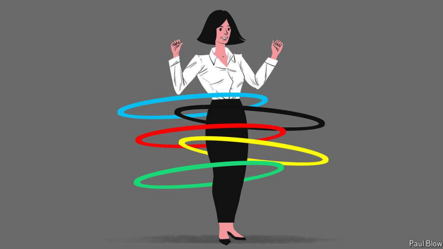

# What can Olympians teach executives?

Olympian：美 [əˈlɪmpiən] 奥运会选手

Citius, altius, spurious

>“Citius, altius, spurious” 是对奥林匹克格言 “Citius, Altius, Fortius”（更快、更高、更强）的一个戏仿或讽刺。原始格言强调了运动员在体育竞赛中的追求卓越和不断超越自我的精神，而在这里，"spurious"（虚假的、不真实的）替换了“Fortius”，暗示某些CEO可能从奥林匹克运动员那里学到的不是真正的品质或能力，而是一些表面上的、虚假的东西。
>
>详细解释：
>- **Citius**: 更快
>- **Altius**: 更高
>- **Spurious**: 虚假的、不真实的
>
>这种替换暗示了作者对一些企业高管从奥林匹克运动员身上学到的所谓“领导力”品质的怀疑态度，认为这些品质可能并不如宣传的那样真实和有价值。
>
>例句：  
>英文: "Citius, altius, spurious" might describe how some executives strive for superficial success rather than genuine improvements.  
>中文: "更快、更高、虚假" 可能描述了一些高管追求表面上的成功，而不是实质性的改进。

原文：

I WANT TO BE successful. That person is successful. So that person can teach me

how to be successful. This syllogism helps explain the torrent of podcasts,

books and speeches devoted to the secrets of high performance. It is one

reason why executive-leadership courses draw on case studies from well

beyond business: politics, the army and even the Roman empire. And it has

been much in evidence before and during the Olympics, which end in Paris

on August 11th.

我想成功。那个人是成功的。所以那个人可以教我如何成功。这个三段论有助于解释致力于高绩效秘密的播客、书籍和演讲的洪流。这也是高管领导力课程借鉴商业之外的案例研究的原因之一:政治、军队甚至罗马帝国。在8月11日于巴黎结束的奥运会之前和期间，这一点都很明显。

学习：
syllogism：美 [ˈsɪləˌdʒɪzəm] 三段论；演绎推理

torrent：美 [ˈtɔːrənt] 洪流；激流；急流

原文：

Consultancies ask what CEOs can learn from the world’s best athletes.

Executives attend events in which Olympians describe what makes them

tick. Articles breathlessly assess the leadership qualities of Simone Biles, an

American gymnast who pulled out of the Tokyo games and made a

triumphant return in Paris. Bob Bowman, a swimming coach, wrote a book

in 2016 called “The Golden Rules”, based on his success shepherding

Michael Phelps to greatness; the triumphs in this year’s games of Léon

Marchand, a French swimmer who is also one of his charges, should give

sales a bump.

咨询公司询问首席执行官们能从世界上最好的运动员身上学到什么。高管们参加奥运选手描述他们成功原因的活动。文章屏息评估西蒙妮·比尔斯的领导才能，她是一名美国体操运动员，退出了东京奥运会，并在巴黎凯旋归来。游泳教练鲍勃·鲍曼(Bob Bowman)在2016年写了一本名为《黄金规则》(The Golden Rules)的书，该书基于他带领迈克尔·菲尔普斯(Michael Phelps)走向伟大的成功经历；法国游泳运动员莱昂·马尔尚也是他的赞助人之一，他在今年奥运会上的胜利应该会推动销售。

学习：

consultancies：美 [kənˈsʌltnsi:z] 咨询公司；顾问工作；顾问职位；（consultancy的复数）          

gymnast：美 [ˈdʒɪmnæst] 体操运动员；体操选手

pull out of：退出

triumphant：美 [traɪˈʌmfənt] 胜利的；大获全胜的；欢欣鼓舞的 **注意发音**

shepherding：英 ['ʃepədɪŋ] 照看；（shepherd的现在分词）

bump: 销售额的增长

>在这里，"bump" 指的是销售额的增长或提升。具体来说，是指由于 Léon Marchand 的成功表现，Bob Bowman 所写的书《The Golden Rules》的销量可能会有所增加。
>
>例句：
>英文: The new product launch gave the company's sales a significant bump.
>中文: 新产品的发布使公司的销售额显著增长。

原文：

There are threads that connect sporting success and business success.

Getting to the games requires intense dedication and hard work. Sporting

excellence rests on the efforts of multiple people, not just a single individual.

The people on the podium in Paris are competitive and resilient. It is true

that all these things are helpful in the workplace, but so is being able to dress

yourself. Some things simply don’t need saying. Not that this stopped one

consultancy from putting out research in 2023 marvelling at the fact that

“100% of professional athletes and CEOs spend time mentally preparing”

before a big competition or meeting.

体育成功和商业成功之间有着千丝万缕的联系。参加奥运会需要强烈的奉献精神和努力工作。优秀的体育运动依赖于多人的努力，而不仅仅是一个人的努力。站在巴黎领奖台上的人都很有竞争力，也很有韧性。诚然，所有这些东西在工作场所都是有帮助的，但能够打扮自己也是如此。有些事情根本不需要说。这并没有阻止一家咨询公司在2023年发布研究，惊叹于“100%的职业运动员和首席执行官在大型比赛或会议前花时间做心理准备”这一事实。

学习：

podium：美 [ˈpoʊdiəm] 领奖台；

thread:连接不同事物之间的相似点

>
>
>在这里，"thread" 指的是连接或贯穿不同事物之间的共同点或相似性。在这个语境中，"threads" 指的是连接体育成功和商业成功之间的共同点或相似之处。
>
>例句：
>英文: There are threads of creativity and innovation that connect successful entrepreneurs and great artists.
>中文: 成功的企业家和伟大的艺术家之间有着创造力和创新的共同点。

原文：

If some of the similarities between sports and the workplace are the stuff of

cliché, many of the differences are too big to be helpful. Sporting contests

have the objective clarity of finishing positions; most jobs lack such simple

metrics. A four-year Olympic cycle building to a contest that may last only

seconds has few obvious analogues in business. Sports-stars-turned-speakers

and business audiences both have an interest in pretending that an Olympic

final is like getting ready for a big presentation or end-of-year results. If that

were really the case, more executives would go to Olympic training camps

to talk to athletes about their greatest earnings calls.

如果说运动和工作场所之间的一些相似之处是老生常谈，那么许多差异太大了，没有什么帮助。体育竞赛有客观明确的终点位置；大多数工作缺乏这样简单的衡量标准。四年一次的奥运周期造就了一场可能只持续几秒钟的比赛，但在商业领域却鲜有明显的相似之处。体育明星出身的演讲者和商业观众都有兴趣假装奥运会决赛就像是在为一场大型演示或年终结果做准备。如果真的是这样的话，更多的高管会去奥运训练营和运动员谈论他们最大的收入。

学习：
cliche：美 [kliˈʃeɪ] 陈词滥调；陈腐思想；

原文：

The athletes who win medals at the games are blessed not just with

prodigious determination but also immense natural gifts. “I got more speed

in my little finger than most people have in their whole body, and I was just

born that way,” Michael Johnson, a legendary sprinter, recently told “The

High Performance Podcast”, a popular show that tries desperately to extract

life lessons for mortals from people with superhuman skills. The job of

managers is partly to identify such superstars, but their real task is getting

the best out of a workforce whose talents will vary and whose jobs will not

depend as heavily on genetics. “As soon as I saw that kid log on, I knew he

was special,” are words you do not often hear.

在奥运会上赢得奖牌的运动员不仅有惊人的决心，还有巨大的天赋。传奇短跑运动员迈克尔·约翰逊最近告诉热门节目《高性能播客》(The High Performance Podcast)，他说:“我小指的速度比大多数人全身的速度都快，我生来就是如此。”该节目竭力从拥有超人技能的人身上汲取人生教训。经理们的工作部分是识别这样的超级明星，但他们真正的任务是从劳动力中获得最好的东西，这些劳动力的才能各不相同，他们的工作也不会严重依赖于基因。“当我看到那个孩子登录时，我就知道他很特别，”这是你不常听到的话。

学习：

prodigious：美 [prəˈdɪdʒəs] 巨大的；庞大的；巨大无比的；惊人的

prodigious  determination：惊人的决心

immense natural gifts：巨大的天赋

sprinter：短跑运动员；

>
>
>在这里，传奇短跑运动员迈克尔·约翰逊（Michael Johnson）提到的“little finger”（小指）是一种夸张的说法，旨在强调他天生的速度优势。通过说“我的小指头的速度比大多数人全身的速度还要快”，他强调了自己与生俱来的天赋和能力。这种说法突显了他的天赋是多么的超凡和独特。

原文：

The comparisons between sports and business can raise some interesting

questions, although they are not necessarily the ones you might expect. In

her book “The Long Win”, Cath Bishop, a former Olympian turned

consultant, describes how a rigid focus on winning can be self-defeating

whether you are in a singlet or a suit. Elite athletes increasingly like to talk

about trusting in the process—focusing on the performance rather than on

the results. Divorcing the way a business decision is made from its actual

outcome is a discipline that companies might benefit from, too.

体育和商业之间的比较可能会引发一些有趣的问题，尽管它们不一定是你可能会想到的问题。Cath Bishop是一名前奥运会顾问，在她的书《漫长的胜利》中，她描述了无论你是穿着汗衫还是西装，对胜利的执着追求都会弄巧成拙。精英运动员越来越喜欢谈论过程中的信任——关注表现而不是结果。将商业决策的方式从实际结果中分离出来，也是一种公司可能从中受益的原则。

学习：

singlet：美 [ˈsɪŋɡlət] 背心；无袖汗衫；运动背心

原文：

The pressure on competitive sports teams to cut corners in pursuit of success

can lead to toxic cultures and outright cheating, just as it can within firms.

The way that Olympians get feedback from coaches and the motivation that

comes from genuinely mastering a skill: these, too, are things to reflect on.

竞技运动队为了追求成功而偷工减料的压力会导致有毒文化和彻头彻尾的欺骗，就像在公司内部一样。奥运选手从教练那里获得反馈的方式，以及来自真正掌握一项技能的动力:这些也是值得反思的事情。

学习：

outright：彻底的；完全的；

原文：

But these parallels are not really why people listen to the podcasts or turn up

at the events. They want a simple formula for success. And they want to hear

what it is like to run faster, jump higher and vault better than anyone else.

They want to hear stories that can have no conceivable value back in the

office (how Mr Bowman broke Mr Phelps’s goggles on purpose before a

race to prepare him for anything, or why Mr Johnson ran in that famously

upright style). If they can pretend it’s good for their career, so much the

better. ■

但这些相似之处并不是人们听播客或出现在活动现场的真正原因。他们想要一个简单的成功公式。他们想听听比别人跑得更快、跳得更高、跳得更好是什么感觉。他们想听在办公室里没有听不到的故事(鲍曼先生如何在比赛前故意打破菲尔普斯的护目镜，让他做好准备，或者约翰逊先生为什么以那种著名的直立方式跑步)。如果他们能假装这对自己的职业有好处，那就更好了。■

学习：

vault：美 [vɔːlt] 跳跃；跃过；用手或撑杆跳过；撑杆跳

conceivable：可想象的；可能的；想得到的；设想得到的；

goggles：美 [ˈɡɑːɡlz] 护目镜；风镜；（goggle的复数）

## 后记

2024年8月13日19点46分于上海。

