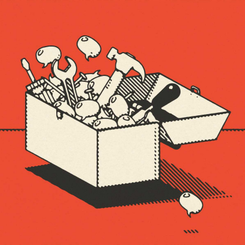
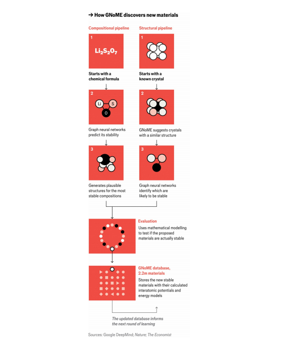

# LLMs will transform medicine, media and more

But not without a helping (human) hand

原文：

Artificial Intelligence (AI) can be described as the art of getting computers

to do things that seem smart to humans. In this sense it is already pervasive.

Satnav software uses search algorithms to find the quickest route from your

house to that new restaurant; airplanes land themselves; traffic cameras use

optical character recognition to identify the letters on the number plate of a

speeding car; thermostats adjust their temperature settings based on who is

at home. This is all AI, even if it is not marketed as such. When AI works

consistently and reliably, runs an old joke, it is just called engineering.

(Conversely AI, goes another joke, is the stuff that does not quite work yet.)

人工智能(AI)可以被描述为让计算机做对人类来说似乎很聪明的事情的艺术。从这个意义上说，它已经无处不在。卫星导航软件使用搜索算法找到从你家到那家新餐馆的最快路线；飞机自己着陆；交通摄像头使用光学字符识别来识别超速行驶的汽车号牌上的字母；恒温器根据谁在家来调节温度设置。这都是人工智能，即使它不是这样营销的。一个老笑话说，当人工智能持续可靠地工作时，它才被称为工程。(相反，另一个笑话说，人工智能是还不太管用的东西。)

学习：

Satnav：美 [ˈsætnæv] 卫星导航

thermostats：美 [ˈθɜrməˌstæts] 温度调节装置；恒温控制器；（thermostat的复数）

consistently and reliably：持续可靠地

原文：

The AI that is hogging so much of the world’s attention now—and sucking up

huge amounts of computing power and electricity—is based on a technique

called deep learning. In deep learning linear algebra (specifically, matrix

multiplications) and statistics are used to extract, and thus learn, patterns

from large datasets during the training process. Large language models (LLMs)

like Google’s Gemini or OpenAI’s GPT have been trained on troves of text,

images and video and have developed many abilities, including “emergent”

ones they were not explicitly trained for (with promising implications, but

also worrying ones). More specialised, domain-specific versions of such

models now exist for images, music, robotics, genomics, medicine, climate,

weather, software-coding and more.

现在吸引了世界如此多注意力的人工智能——并吸收了大量的计算能力和电力——是基于一种称为深度学习的技术。在深度学习中，线性代数(特别是矩阵乘法)和统计用于在训练过程中从大型数据集提取并学习模式。大型语言模型(LLM ),如谷歌的Gemini或OpenAI的GPT，已经在文本、图像和视频的宝库中接受了训练，并开发了许多能力，包括他们没有明确训练过的“涌现”能力(具有有希望的影响，但也有令人担忧的影响)。这种模型的更专业、特定领域的版本现在存在于图像、音乐、机器人、基因组学、医学、气候、天气、软件编码等等。

学习：

hogging：全部占有； （hog的现在分词）

hog attention：占据注意力

trove：（有价值或令人喜爱的）藏品；埋藏物；宝库

## **Beyond human comprehension**

原文：

Rapid progress in the field has led to predictions that AI is “taking over drug

development”, that it will “transform every aspect of Hollywood

storytelling”, and that it might “transform science itself” (all claims made in

this newspaper within the past year). It is said that AI will speed up scientific

discovery, automate away the tedium of white-collar jobs and lead to

wondrous innovations not yet imaginable. AI is expected to improve

efficiency and drive economic growth. It might also displace jobs, endanger

privacy and security, and lead to ethical conundrums. It has already outrun

human understanding of what it is doing.

该领域的快速进展导致了一些预测，即人工智能将“接管药物开发”，它将“改变好莱坞讲故事的每个方面”，并且它可能“改变科学本身”(所有这些都是本报在过去一年中提出的说法)。据说，人工智能将加速科学发现，自动消除白领工作的单调乏味，并导致尚未想象的奇妙创新。人工智能有望提高效率，推动经济增长。它还可能取代工作，危及隐私和安全，并导致道德难题。它已经超越了人类对它在做什么的理解。

学习：

tedium：美 [ˈtidiəm] 厌倦；无聊；冗长；枯燥；乏味；

wondrous：美 [ˈwʌndrəs] 令人惊叹的；奇异的；非凡的；

displace jobs：取代工作

conundrum：美 [kəˈnəndrəm]  难题；谜题；谜语；复杂难解的问题

原文：

Researchers are still getting a handle on what AI will and will not be able to

do. So far, bigger models, trained on more data, have proved more capable.

This has encouraged a belief that continuing to add more will make for

better AI. Research has been done on “scaling laws” that show how model

size and the volume of training data interact to improve LLMs. But what is a

“better” LLM? Is it one that correctly answers questions, or that comes up with

creative ideas?

研究人员仍在研究人工智能能做什么和不能做什么。迄今为止，经过更多数据训练的更大的模型被证明更有能力。这鼓励了一种信念，即继续增加更多将有助于更好的人工智能。已经对“缩放定律”进行了研究，该定律显示了模型大小和训练数据量如何相互作用以改进LLM。但是什么是“更好的”LLM呢？是能正确回答问题的，还是能提出创造性想法的？

原文：

It is also tricky to predict how well existing systems and processes will be

able to make use of AI. So far, the power of AI is most apparent in discrete

tasks. Give it images of a rioting mob, and an AI model, trained for this

specific purpose, can identify faces in the crowd for the authorities. Give an

LLM a law exam, and it will do better than your average high-schooler. But

performance on open-ended tasks is harder to evaluate.

预测现有的系统和流程将能够在多大程度上利用人工智能也很棘手。到目前为止，人工智能的力量在离散任务中表现得最为明显。给它一个暴乱的暴徒的图像，一个为此特定目的训练的人工智能模型可以为当局识别人群中的面孔。给大模型一个法律考试，它会比你的普通高中生做得更好。但是开放式任务的表现更难评估。

学习：

high-schooler：高中生

open-ended task：开放式任务

原文：

The big AI models of the moment are very good at generating things, from

poetry to photorealistic images, based on patterns represented in their

training data. But such models are less good at deciding which of the things

they have generated make the most sense or are the most appropriate in a

given situation. They are less good at logic and reasoning. It is unclear

whether more data will unlock the capability to reason consistently, or

whether entirely different sorts of models will be needed. It is possible that

for a long time the limits of AI will be such that the reasoning of humans will

be required to harness its power.

目前的大型人工智能模型非常擅长基于它们的训练数据中表示的模式来生成东西，从诗歌到真实感图像。但这种模型不太擅长决定它们生成的哪些东西在特定情况下最有意义或最合适。他们不太擅长逻辑和推理。还不清楚更多的数据是否会释放持续推理的能力，或者是否需要完全不同种类的模型。有可能在很长一段时间内，人工智能的极限将是，人类的推理将需要驾驭它的力量。

学习：

photorealistic：相片般真实的；逼真的

unlock the capability：释放xxx的能力

原文：

Working out what these limits are will matter in areas like health care. Used

properly, AI can catch cancer earlier, expand access to services, improve

diagnosis and personalise treatment. AI algorithms can outperform human

clinicians at such tasks, according to a meta-analysis published in April in

*npj Digital Medicine*. But their training can lead them astray in ways that

suggest the value of human intervention.

在医疗保健等领域，找出这些限制是很重要的。如果使用得当，人工智能可以更早地发现癌症，扩大服务范围，改善诊断和个性化治疗。根据4月份发表在npj Digital Medicine上的一项元分析，人工智能算法在这些任务上可以胜过人类临床医生。但是他们的训练会让他们误入歧途，这暗示了人类干预的价值。

学习：

catch cancer：发现癌症

clinicians：临床医生；（clinician的复数）

astray：美 [əˈstreɪ] 迷路；偏离正确路径；误入歧途

原文：

For example, AI models are prone to exacerbating human bias due to “data

distribution shifts”; a diagnostic model may make mistakes if it is trained

mostly on images of white people’s skin, and then given an image of a black

person’s skin. Combining AI with a qualified human proved the most

effective. The paper showed that clinicians using AI were able to increase the

share of people they correctly diagnosed with cancer from 81.1% to 86.1%,

while also increasing the share of people told correctly they were cancer-

free. Because AI models tend to make different mistakes from humans, AI-

human partnerships have been seen to outperform both AI and humans alone.

例如，AI模型容易因“数据分布偏移”而加剧人类偏见；如果一个诊断模型主要根据白人的皮肤图像进行训练，然后给出一个黑人的皮肤图像，那么它可能会出错。将人工智能与合格的人类结合起来被证明是最有效的。该论文显示，使用人工智能的临床医生能够将他们正确诊断患有癌症的人的比例从81.1%增加到86.1%，同时还增加了正确告知他们没有癌症的人的比例。由于人工智能模型往往会犯与人类不同的错误，人工智能与人类的合作已经被视为优于人工智能和人类单独的合作。

学习：

cancer-free：未患癌的

## **The robotic method**

原文：

Humans might be less necessary to explore new hypotheses in science. In

2009 Ross King at the University of Cambridge said that his ultimate goal

was to design a system that will function as an autonomous lab, or as a

“robot scientist”. Dr King’s AI scientist, called Adam, was engineered to

come up with hypotheses, use its robotic arm to perform experiments,

collect results with its sensors and analyse them. Unlike graduate students

and postdocs, Adam never needs to take a break to eat or sleep. But AI

systems of this type are (for now) restricted to relatively narrow domains

such as drug discovery and materials science. It remains unclear whether

they will deliver much more than incremental gains over human-led

research.

人类可能不太需要在科学中探索新的假设。2009年，剑桥大学的Ross King说，他的最终目标是设计一个可以作为自主实验室或“机器人科学家”的系统。King 博士的人工智能科学家亚当被设计成提出假设，使用机器人手臂进行实验，用传感器收集结果并进行分析。与研究生和博士后不同，亚当从不需要休息吃饭或睡觉。但这种类型的人工智能系统(目前)仅限于相对狭窄的领域，如药物发现和材料科学。目前还不清楚它们是否会比人类主导的研究带来更多的收益。

原文：

AI techniques have been used in science for decades, to classify, sift and

analyse data, and to make predictions. For example, researchers at Project CETI

collected a large dataset of whale vocalisations, then trained an AI model on

this data to work out which sounds might have meaning. Or consider

AlphaFold, a deep neural network developed by Google DeepMind. Trained

on a massive protein database, it can quickly and accurately predict the

three-dimensional shapes of proteins, a task that once required days of

careful experimentation and measurement by humans. GNoME, another AI

system developed by DeepMind, is intended to assist in the discovery of

new materials with specific chemical properties (see diagram).

人工智能技术已经在科学领域应用了几十年，用于分类、筛选和分析数据，并进行预测。例如，CETI项目的研究人员收集了一个庞大的鲸鱼发声数据集，然后根据这些数据训练了一个人工智能模型，以找出哪些声音可能有意义。或者考虑一下谷歌DeepMind开发的深度神经网络AlphaFold。在庞大的蛋白质数据库上训练，它可以快速准确地预测蛋白质的三维形状，这项任务曾经需要人类进行数天的仔细实验和测量。DeepMind开发的另一个AI系统GNoME旨在协助发现具有特定化学性质的新材料(见图)。

学习：

vocalization：发声

原文：

AI can also help make sense of large flows of data that would otherwise be

overwhelming for researchers, whether that involves sifting through results

from a particle collider to identify new subatomic particles, or keeping up

with scientific literature. It is quite impossible for any human, no matter how

fastidious a reader, to digest every scientific paper that might be relevant to

their work. So-called literature-based discovery systems can analyse these

mountains of text to find gaps in research, to combine old ideas in novel

ways or even to suggest new hypotheses. It is difficult to determine, though,

whether this type of AI work will prove beneficial. AI may not be any better

than humans at making unexpected deductive leaps; it may instead simply

favour conventional, well-trodden paths of research that lead nowhere

exciting.

人工智能还可以帮助研究人员理解大量的数据流，否则这些数据流将不堪重负，无论是涉及筛选粒子对撞机的结果以识别新的亚原子粒子，还是跟上科学文献。对任何人来说，不管读者多么挑剔，消化每一篇可能与他们的工作相关的科学论文都是不可能的。所谓的基于文献的发现系统可以分析这些堆积如山的文本，找出研究中的差距，以新的方式结合旧的想法，甚至提出新的假设。然而，很难确定这种类型的人工智能工作是否有益。在进行意想不到的演绎推理步骤跳跃方面，人工智能可能并不比人类强多少；相反，它可能更倾向于传统的、被广泛使用的研究途径，这些途径不会带来任何令人兴奋的结果。

学习：

collider：美 [kəˈlaɪdər] 对撞机（产生两股高速运动的粒子相互冲撞）

particle collider：粒子对撞机

subatomic：美 [ˌsəbəˈtɑmɪk] 亚原子的

fastidious：美 [fæˈstɪdiəs] 挑剔的；苛求的

deductive：美 [dɪˈdʌktɪv] 演绎的；推理的；逻辑推导的；

trodden：踏；践踏；踩；走；行走；步行；（tread的过去分词）

well-trodden path：经常有人走的路

原文：

In education there are concerns that AI—and in particular bots like ChatGPT—

might actually be an impediment to original thinking. According to a study

done in 2023 by Chegg, an education company, 40% of students around the

world used AI to do their school work, mostly for writing. This has led some

teachers, professors and school districts to ban AI chatbots. Many fear that

their use will interfere with the development of problem-solving and critical

thinking skills through struggling to solve a problem or make an argument.

Other teachers have taken an altogether different tack, embracing AI as a tool

and incorporating it into assignments. For example, students might be asked

to use ChatGPT to write an essay on a topic and then critique it on what it gets

wrong.

在教育界，有人担心人工智能——尤其是ChatGPT这样的机器人——可能实际上是原创思维的障碍。根据教育公司Chegg在2023年完成的一项研究，全球40%的学生使用人工智能完成他们的学校作业，主要是写作。这导致一些教师、教授和学校禁止AI聊天机器人。许多人担心他们的使用会干扰解决问题和批判性思维技能的发展，通过努力解决问题或进行争论。其他教师采取了完全不同的策略，将人工智能作为一种工具，并将其融入作业中。例如，学生可能会被要求使用ChatGPT就某个主题写一篇文章，然后就它的错误之处进行评论。

学习：

impediment：美 [ɪmˈpedɪmənt] 障碍；阻碍；妨碍

an impediment to：是xxx的阻碍

original thinking：原创思维

altogether：全部；完全地；彻底地；总体上

altogether different：完全不同的

## **Wait, did a chatbot write this story?**

原文：

As well as producing text at the click of a button, today’s generative AI can

produce images, audio and videos in a matter of seconds. This has the

potential to shake things up in the media business, in fields from podcasting

to video games to advertising. AI-powered tools can simplify editing, save

time and lower barriers to entry. But AI-generated content may put some

artists, such as illustrators or voice actors, at risk. In time, it may be possible

to make entire films using AI-driven simulacra of human actors—or entirely

artificial ones.

除了点击一个按钮产生文本，今天的生成式人工智能可以在几秒钟内产生图像、音频和视频。这有可能改变媒体行业，从播客、视频游戏到广告等领域。人工智能工具可以简化编辑，节省时间，降低准入门槛。但人工智能生成的内容可能会让一些艺术家，如插画师或配音演员面临风险。随着时间的推移，使用人工智能驱动的人类演员的拟像来制作整部电影——或者完全虚拟的电影——也许是可能的。

学习：

in a matter of：大约在

lower barriers to entry：降低准入门槛

illustrators：插画师；插图画家（illustrator的复数形式）；

simulacra： 美 [ˌsɪmjʊ'leɪkrə] 模拟物；影；像；（simulacrum的复数）

原文：

Still, AI models can neither create nor solve problems on their own (or not yet

anyway). They are merely elaborate pieces of software, not sentient or

autonomous. They rely on human users to invoke them and prompt them,

and then to apply or discard the results. AI’s revolutionary capacity, for better

or worse, still depends on humans and human judgment.■

尽管如此，人工智能模型既不能自己创造问题，也不能自己解决问题(至少现在还不能)。它们仅仅是精心制作的软件，没有感知能力或自主性。它们依赖人类用户来调用和提示它们，然后应用或丢弃结果。无论好坏，人工智能的革命能力仍然取决于人类和人类的判断。■

学习：

elaborate：复杂的；精心设计的

elaborate pieces of software：精心制作的软件      

sentient：美 [ˈsɛn(t)ʃ(i)ənt]有知觉力的；有感知能力的；能感知的； **注意发音**

autonomous：自主的；

for better or worse：无论好坏；不管结果如何；不管结果怎样

## 后记

2024年8月16日14点18分于上海。

