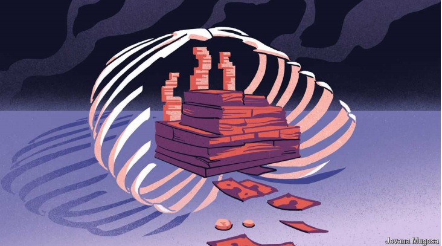

# A gruesome corpse scandal sparks outrage in China

gruesome： 美 [ˈɡrusəm] 恐怖的；可怕的；令人厌恶的；令人反感的；骇人听闻的；触目惊心的

corpse：美 [kɔːrps] 尸体；遗体

outrage：愤怒；义愤；

The government’s reaction has been to stifle any discussion of 4,000 stolen bodies

原文：

“WHEN A PROPER respect towards the dead is shown at the end and

continued after they are far away, the moral force of a people has reached its

highest point.” That precept appears in the “Analects”, a collection of

sayings attributed to Confucius. What, then, to make of the news that from

2015 to 2023 a Chinese crime ring stole, dismembered and sold more than

4,000 corpses for use in manufacturing bone grafts?

“当对死者的适当尊重在最后表现出来，并在他们离开后继续下去时，一个民族的道德力量就达到了最高点。”这句话出现在《论语》中，这是一部孔子的语录。那么，从2015年到2023年，一个中国犯罪团伙窃取、肢解并出售了4000多具尸体用于制造移植的骨骼的消息是怎么回事？

学习：

a people：一个民族

precept：美 [ˈpriːsept]（思想、行为的）准则；规则；原则；教诲；

analects：美 [ˌænəˈlekts] 文选；语录；摘录；选集

ring：集团；团伙

crime ring：犯罪团伙

dismember：肢解；分割…的躯体

graft：嫁接；移植；移植的皮肤；移植的骨骼

原文：

The *Paper*, a state-owned online publication, broke the story on August 8th.

The scandal involves bodies taken from crematoria and medical laboratories

in several provinces. The bodies were allegedly cut up and then transported

for processing at a company called Shanxi Aorui Biomaterials in Taiyuan,

the capital of Shanxi province. The scheme is said to have generated 380m

yuan ($53m) in revenue. Nearly 80 people have reportedly been detained.

国有在线出版物《人民日报》于8月8日披露了这一消息。丑闻涉及几个省的火葬场和医学实验室的尸体。据称，这些尸体被切割，然后运送到山西省省会太原的一家名为Shanxi Aorui Biomaterials公司进行处理。据说该计划已经产生了3 . 8亿元人民币(5300万美元)的收入。据报道，近80人被拘留。

学习：
crematoria：美 [ˌkremə'tɔrɪr] 火葬场；（crematorium的复数）

allegedly：据说

detain：拘留

broke the story：首次报道

>这里的“broke the story”意思是“首次报道”或“爆出新闻”。
>
>解释：这句话的意思是，这个国家拥有的在线出版物《Paper》在8月8日首次报道了这一新闻。
>
>例句：The New York Times broke the story about the politician's scandal before any other news outlet.（《纽约时报》在其他任何新闻媒体之前首次报道了这位政治家的丑闻。）

原文：

The story has sparked public outrage in China. (Families of the deceased

received cremated remains that were either incomplete or fake.) The article

by the *Paper* was taken down within hours. So were reports from a handful

of other official outlets. Censors have also stifled discussion of the scandal

on social media. Some people are wondering if officials were involved.

Government agencies manage the firms that provide funeral services and

handle remains.

这个故事在中国引发了公愤。(死者家属收到的火化遗体要么不完整，要么是假的。)报纸上的这篇文章在几小时内就被撤下了。其他一些官方媒体的报道也是如此。审查人员还压制了社交媒体上对丑闻的讨论。一些人怀疑是否有官员参与其中。政府机构管理提供殡葬服务和处理遗体的公司。

学习：
deceased：死者；已故者；逝世者；去世的

cremate：火化

funeral services：殡葬服务

remains：遗体；遗骸；残骸；

原文：

There is also suspicion that big state-owned medical companies may have

purchased the tainted bone grafts (knowingly or not). One of them,

Sinopharm, issued a statement on August 9th saying that reports of its

involvement in the scandal were incorrect. It denies having had any business

dealings with Shanxi Aorui Biomaterials.

也有人怀疑大型国有医疗公司可能购买了受污染的移植的骨骼(有意或无意)。其中之一，国药集团，在8月9日发表声明称其卷入丑闻的报道是不正确的。该公司否认与 Shanxi Aorui Biomaterials有任何业务往来。

原文：

Less than a week after the *Paper* filed its story, state media reported that the

authorities in a number of provinces have been investigating misconduct in

the funeral industry. But there was no mention of body snatching. Rather,

officials have been combatting “petty corruption and small-scale

malfeasance”.

该报报道后不到一周，官方媒体报道称，多个省份的当局一直在调查殡葬业的不当行为。但是没有提到抢尸。相反，官员们一直在打击“小腐败和小规模渎职”。

malfeasance：美 [ˌmælˈfizəns] 不法行为；渎职

>
>
>这里的“snatching”意思是“抢夺”或“偷窃”。
>
>解释：这句话的意思是，与其说官方在调查“抢尸体”的行为，不如说他们在打击“小规模的腐败和不正当行为”。
>
>例句：The thief was caught snatching a purse from an elderly woman in broad daylight.（小偷在光天化日之下被抓到从一位老年妇女手中抢夺钱包。）

原文：

The state-media report quoted Peng Xinlin, a law professor whose remarks

amount to a bureaucratic translation of Confucius. Corruption in the funeral

sector, said Mr Peng, “undermines the credibility of the party and

government, disrupts public order and erodes social norms.” But the now-

censored words of Yi Shenghua are more reflective of the public mood. Mr

Yi, a lawyer, shared information about the theft of corpses with the *Paper*.

He then wrote online: “In the culture of Chinese tradition and thought, it is

absolutely impossible to accept this kind of reality.” ■

官方媒体的报道引用了法学教授Peng Xinlin的话，他的话相当于对孔子的官僚化翻译。Peng Xinlin先生说，殡葬行业的腐败“损害了党和政府的信誉，扰乱了公共秩序，侵蚀了社会规范。”但是现在被审查的Yi Shenghua的话更能反映公众的情绪。律师Yi先生与Paper分享了有关盗窃尸体的信息。他随后在网上写道:“在中国传统和思想的文化中，绝对不能接受这种现实。”■

## 后记

2024年8月19日19点13分于上海。

