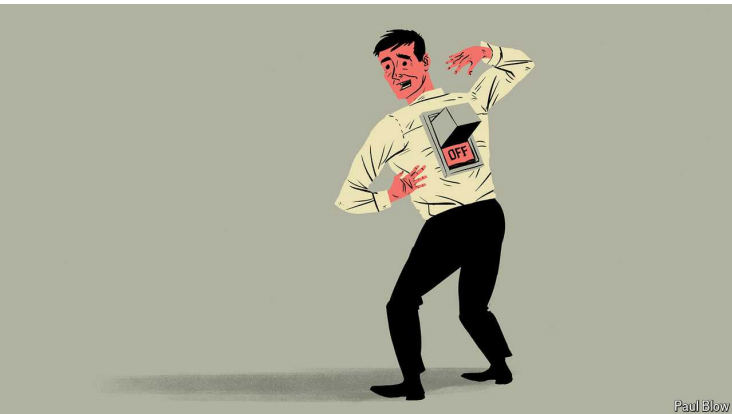

# How to take proper breaks from work

The matinée test

>"Matinée test" 这个短语指的是在工作日的白天，尤其是早上或下午，特意安排一个个人活动，比如看场电影（matinée 指的是白天的早场电影）。这个测试用来衡量你是否能够真正放松并脱离工作压力，享受一个与工作无关的活动。
>
>在上下文中，"matinée test" 是一种用来检验你能否在工作日中途真正放松的方式。如果你在这样的时候感到紧张或有罪恶感，说明你可能很难彻底脱离工作状态。这个测试强调了在忙碌的工作中，找到时间放松和休息的重要性。

原文：

The year 1843 was a tremendous one for humanity. *The Economist* was

founded. Almost as importantly, the modern weekend started to take shape.

A campaign was launched in Manchester to give industrial workers half a

day off on Saturdays, designed to ensure that more of them turned up ready

to work on Monday morning. It succeeded, and the practice was eventually

adopted into law; over time, a five-day week has become the norm in most

countries.

1843年对人类来说是不平凡的一年。《经济学人》创刊。几乎同样重要的是，现代周末开始形成。曼彻斯特发起了一项运动，让产业工人在周六休息半天，旨在确保更多的人在周一早上准备好工作。它成功了，这一做法最终被采纳为法律；随着时间的推移，五天工作制已经成为大多数国家的惯例。

学习：
tremendous：<口>极好的；非常的；惊人的；精彩的

take shape：形成；成形；具体化

原文：

Whether it is the weekend, the summer holidays that many people in the

northern hemisphere are currently taking or the daily rest periods that

companies give to their employees, the right for people to take breaks is

uncontested. But for white-collar workers in particular, the boundaries

between working time and non-working time have become very blurry. It is

standard practice to eat lunch hunched over your desk: look down at your

keyboard and you will see far more crumbs than characters. It is normal to

look at emails in the evening, at weekends and on holiday.

无论是周末、北半球许多人目前正在休的暑假，还是公司给员工的每日休息时间，人们休息的权利都是无可争议的。但尤其对于白领来说，工作时间和非工作时间的界限已经变得非常模糊。伏案吃饭是标准的做法:低头看你的键盘，你会看到更多的面包屑而不是字符。晚上、周末、节假日看邮件很正常。

学习：

hunch：弓背；弓身

look down at：低头看；低头瞧；俯视          

crumbs：美 [krʌmz] 碎屑（尤指食物的）；面包屑；（crumb的复数）

原文：

Deploring this development is too simple: the ability to choose when and

where you work suits lots of people. But it has also created the impression

that you are always contactable. As long ago as 2013, Melissa Mazmanian

of the University of California, Irvine and Wanda Orlikowski and JoAnne

Yates of the MIT Sloan School of Management coined the term “the autonomy

paradox” to describe how greater flexibility for individuals has led to

diminished freedom for everyone to switch off.

谴责这种发展太简单了:选择何时何地工作的能力适合很多人。但这也给人留下了这样的印象:你总是可以联系到的。早在2013年，加州大学欧文分校的Melissa Mazmanian和麻省理工学院斯隆管理学院的Wanda Orlikowski和JoAnne Yates创造了“自主悖论”一词来描述个人更大的灵活性如何导致每个人关闭的自由减少。

学习：

deploring：谴责；悲悼；强烈反对；哀叹；（deplore的现在分词形式）

coin：创造（新的词）

原文：

Breaking out of this trap is hard. As a little experiment to assess your own

degree of freedom, try to follow a recommendation from Cal Newport, a

thoughtful writer on how the performative busyness of modern work

impedes the ability to get important stuff done. In his latest book, “Slow

Productivity”, Mr Newport advocates deliberately varying the intensity of

work. Among other things, he suggests setting aside a weekday afternoon

once a month to see a film.

打破这个陷阱很难。作为评估你自己自由度的一个小实验，试着遵循Cal Newport的建议，他是一位有思想的作家，关于现代工作的表演性忙碌如何阻碍了完成重要事情的能力。在他的新书《缓慢的生产力》中，纽波特先生提倡有意识地改变工作强度。除此之外，他建议每个月抽出一个工作日的下午去看一场电影。

学习：
thoughtful：富有思想的；认真思考的          

thoughtful writer：有思想的作家

intensity of work：工作强度

原文：

Taking three hours off every so often ought not to feel outlandish if you

catch up on your work later. But few employers would react well to an out-

of-office message that reads “I am watching Deadpool & Wolverine and will

be slower to respond than normal.” So an uncomfortable degree of

subterfuge is required.

如果你后来赶着工作，偶尔休息三个小时应该不会觉得奇怪。但很少有雇主会对一条“我正在看《死侍与金刚狼》，回复会比平时慢”的不在办公室的信息反应良好因此，需要一种令人不安的托词。

学习：

every so often：偶尔；不时

outlandish：古怪的；异乎寻常的

subterfuge：美 [ˈsəbtərˌfjudʒ] 诡计；秘密手段；托辞；

原文：

First, following Mr Newport’s advice, you label the time as a “personal

appointment”; never has a calendar entry looked more suspicious. Before

you enter the cinema you check around for colleagues. A handful of single

people are in there: you wonder how many of them are also at a “personal

appointment”. You are told to turn off your phone, the ultimate working

hours transgression. The moment you leave you check it to make sure all

hell has not broken loose in your absence. During the film you feel guilty

that you have been munching popcorn while everyone else has been

working. The whole experience is sufficiently draining that you need another

rest.

首先，按照纽波特先生的建议，你把这个时间标为“个人约会”；从来没有一个日历条目看起来更可疑。在你进入电影院之前，你四处寻找同事。少数单身人士在那里:你想知道他们中有多少人也在“个人约会”。你被告知关掉手机，这是对工作时间的最大侵犯。你离开的时候检查一下，确保你不在的时候一切都没有失控。看电影的时候，当其他人都在工作的时候，你却在吃爆米花，这让你感到内疚。整个经历令人筋疲力尽，你需要再休息一会儿。

学习：
transgression：违反；逸出；犯罪；罪过

munching：美 [mʌntʃɪŋ] 大声咀嚼；（munch的现在分词）

munching popcorn：吃爆米花

break loose：失控

>**Break loose**: 这里的 "break loose" 意思是失控或爆发。结合上下文，这句话的意思是，在你离开期间可能会发生某种紧急情况或混乱。
>
>- 例句：When the CEO resigned, all hell broke loose at the company.（当首席执行官辞职时，公司陷入了一片混乱。）

drain: 耗尽精力，感到疲惫

>**Drain**: 这里的 "drain" 指的是耗尽精力或感到疲惫。结合上下文，作者指的是看电影的整个经历让人感到疲惫，以至于需要再次休息。
>
>- 例句：The long meeting drained all my energy.（长时间的会议让我感到精疲力尽。）

原文：

Managers may well feel that their workforce shouldn’t be heading off to the

cinema whenever it feels like it. But organisations should ensure that their

employees do not mistake exhaustion for accomplishment or breaks for

laziness. Mr Newport cites the example of 37signals, a software firm that

works in six-week cycles. At the end of each cycle, developers take one or

two weeks off scheduled projects to slow the pace.

经理们可能会觉得，他们的员工不应该想去电影院就去电影院。但是组织应该确保他们的员工不会把疲惫误认为是成就，或者把休息误认为是懒惰。纽波特先生举了37signals的例子，这是一家软件公司，工作周期为六周。在每个周期结束时，开发人员会从预定的项目中抽出一到两周的时间来降低节奏。

学习：
may well：很可能

原文：

Slack, another software firm, ran a survey in which they found that only two

in five of their employees felt comfortable taking breaks. It then conducted

an experiment in which it prompted some of its workers to take time off

during the day, and found that this led to marked improvements in their

productivity and job satisfaction.

另一家软件公司Slack进行了一项调查，他们发现只有五分之二的员工对休息感到舒适。然后，该公司进行了一项实验，促使一些员工在白天休假，结果发现这显著提高了他们的生产率和工作满意度。

学习：

marked：明显的；显著的；

marked improvements：显著的提升

原文：

If the encouragement of your employer is not forthcoming, some simple

habits can still make for better breaks. If you decide to work at weekends or

on holidays, only do so during set periods so that you get at least some

extended time off the treadmill.

如果你的雇主不鼓励你，一些简单的习惯仍然可以让你休息得更好。如果你决定在周末或假日工作，那就只在固定的时间内工作，这样你至少可以有更多的时间离开枯燥乏味的工作。

学习：

forthcoming：即将到来的；即将发生的；可获得的；

treadmill： 美 [ˈtredmɪl] 跑步机；单调的工作；枯燥乏味的工作（或生活方式）；

原文：

During the workday, one tip stands out. A recent review of the research on

work breaks by Zhanna Lyubykh of Simon Fraser University and her

colleagues concluded that being outside was a better way to recharge. A

study of nurses by Makayla Cordoza, now of Vanderbilt University School

of Nursing, and her co-authors found that breaks in the hospital garden

mitigated the risk of burnout more than staying indoors. Switching off is

hard enough. Staying in the office makes it tougher still. ■

在工作日，有一个提示很突出。西蒙弗雷泽大学的詹娜·柳比赫和她的同事最近对工作休息时间的研究进行了回顾，得出结论:外出是一种更好的充电方式。范德比尔特大学护理学院的Makayla Cordoza和她的合著者对护士进行了一项研究，发现在医院花园休息比呆在室内更能减轻职业倦怠的风险。关掉（远离工作）已经够难了。呆在办公室里更是难上加难。■

##  后记

2024年8月20日15点47分于上海。

