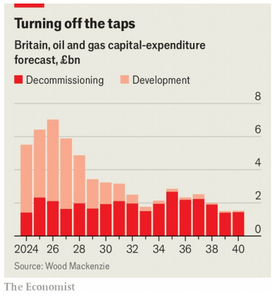

# Britain’s oil and gas industry faces an uncertain future

Small operators in the North Sea are struggling with a tax squeeze

原文：

The oil and gas industry is a volatile business. Swings in energy prices and

the precarious nature of drilling into seabeds are part and parcel of the trade,

says David Latin, chairman of Serica Energy, a producer in the North Sea.

He once ran oil and gas fields threatened with blockades and militant attacks

during a civil war in Libya. He likens the experience to operating in Britain,

where a tumultuous tax regime has made it “impossible” to invest.

石油和天然气行业是一个不稳定的行业。北海生产商Serica Energy的董事长大卫·拉丁(David Latin)表示，能源价格的波动和海底钻探的不稳定性是这种交易的重要组成部分。在利比亚内战期间，他曾经经营过受到封锁和武装分子袭击威胁的油田和天然气田。他将这种经历比作在英国经营，那里混乱的税收制度使得投资“不可能”。

学习：
precarious：美 [prɪˈkeriəs] 不稳定的；不牢固的；

parcel：美 [ˈpɑːrsl] 一片土地；一部分；一份；

part and parcel：重要组成部分；重要的部分；必要部分

tumultuous：美 [tuːˈmʌltʃuəs] 嘈杂的；骚乱的；混乱的；

原文：

North Sea oil and gas has been used in Britain for 50 years. But as the

country targets net zero greenhouse-gas emissions by 2050, which will rely

on a shift to green energy, the industry must be wound down. The Labour

government has promised to ban new exploration, though some sites could

run beyond 2050. Industry bosses say an uncertain fiscal regime is making

the transition harder.

北海石油和天然气在英国已经使用了50年。但是，由于该国的目标是到2050年实现温室气体净零排放，这将依赖于向绿色能源的转变，该行业必须逐渐减少。工党政府承诺禁止新的勘探，尽管一些地点可能会运行到2050年以后。行业老板们表示，不确定的财政体制使得转型更加困难。

学习：
greenhouse：温室；玻璃温室；

原文：

Much of the upheaval has come from a tax squeeze. In 2022 Rishi Sunak,

then the chancellor, introduced a 25% Energy Profits Levy (EPL) on oil and

gas firms; seven months later it was bumped up to 35%. Initially due to end

in 2025, the tax was extended until 2028—and later to 2029. What began as

a one-off levy on high profits caused by the spike in oil and gas prices after

Russia’s invasion of Ukraine has given way to a drawn-out tax that has been

constantly fiddled with.

大部分剧变来自税收紧缩。2022年，时任财政大臣的希·苏纳克对石油和天然气公司征收25%的能源利润税(EPL );七个月后，这一比例上升到了35%。该税最初定于2025年结束，后来延长至2028年，后来又延长至2029年。俄罗斯入侵乌克兰后，石油和天然气价格飙升导致的高额利润开始被一次性征税所取代，取而代之的是一种被不断篡改的长期税收。

学习：
one-off：一次性

drawn-out：拖延的；冗长的；延长的；

fiddle：篡改（数字、记录等）

原文：

Politicians are still tinkering. Oil and gas prices have dipped below the highs

of 2022. However the EPL will be increased to 38% from November and

extended to March 2030. Stacked on top of corporation tax and an existing

surcharge on North Sea profits, that will raise the effective tax rate to 78%—

among the highest in the world. Rachel Reeves, the chancellor, also says she

wants to scrap the levy’s “unjustifiably generous” 29% investment

allowance, which permits companies to claim some of their exploration

costs.

政治家们仍在进行调整。石油和天然气价格已经回落到2022年的高点以下。然而，从11月起，能源利润税（EPL）将增加到38%，并延长至2030年3月。加上公司税和现有的北海利润附加税，实际税率将提高到78%——这是全球最高的税率之一。财政大臣雷切尔·里夫斯还表示，她希望取消税收中的“毫无正当理由的”29%投资津贴，这项津贴允许公司申报部分勘探成本。

学习：

tinkering：修补；粗修；（tinker的现在分词）          

dipped：下沉；下降；（dip的过去式和过去分词）          

surcharge：额外费用；附加费；增收费；超载费

scrap：废弃；抛弃；取消；丢弃；

>这里提到的**“29% investment allowance”** 是一种**减税措施**。具体来说，这项措施允许公司将部分勘探成本从其应纳税额中扣除，从而减少公司需要支付的税款。因此，这项投资津贴是为公司提供税收优惠，帮助他们抵消部分勘探成本。
>
>财政大臣雷切尔·里夫斯希望取消这项津贴，意味着未来公司将无法再享受这部分税收减免，从而实际上会**增加公司需要缴纳的税款**。

原文：

Norway has equally high taxes. But it has done more to cushion the blow,

allowing producers to claim back all of their exploration costs. It has also

provided more stability, maintaining the same rates for nearly three decades.

British oil and gas fields tend to be old, which contributes to higher running

costs. Britain has “among the highest break-even cost and highest cost-per-

barrel in the world,” according to Steve Bowyer, who manages the North

Sea assets at EnQuest, a producer in Aberdeen.

挪威有同样高的税收。但是它做了更多的事情来缓冲这一打击，允许生产商索回他们所有的勘探成本。它还提供了更大的稳定性，在近30年的时间里保持了同样的利率。英国的油田和天然气田往往都很老，这导致了更高的运营成本。根据史蒂夫·鲍耶的说法，英国是“世界上盈亏平衡成本和每桶石油成本最高的国家之一”，他在阿伯丁的一家生产商EnQuest管理北海资产。

学习：

cushion：美 [ˈkʊʃn] 减轻冲击；起缓冲作用；缓和冲击；

break-even：盈亏平衡点；收支相抵点；不赚不赔的状态

原文：

British firms have continued to invest in the ageing basin even as larger

companies, including Shell and ExxonMobil, have sought higher profits

elsewhere. But British banks no longer fund their projects. Nor can the

industry count on much sympathy from the public, which may help to

explain the stance of politicians. The frosty climate stands in contrast to Ms

Reeves’s courtship of other business leaders. For Serica, which produces 5%

of Britain’s natural gas, the shift to clean energy feels less like a transition

than a cliff-edge.

尽管包括壳牌和埃克森美孚在内的大公司已经在其他地方寻求更高的利润，英国公司仍继续在老龄化的海盆投资。但是英国银行不再资助他们的项目。该行业也不能指望公众的同情，这可能有助于解释政治家的立场。严寒的气候与里夫斯女士向其他商业领袖奉承形成了鲜明对比。对于生产英国5%天然气的Serica公司来说，向清洁能源的转变更像是悬崖边上的过渡。

学习：
basin：美 [ˈbeɪsn] 海盆；盆地；凹地；

frosty：寒冷的；结霜的

courtship：讨好；奉承；取悦

原文：

Harbour Energy, the North Sea’s largest producer, has slashed investments

and hundreds of jobs. EnQuest might divert funds to South-East Asia. Tax

rises could see investment fall by 55% over the next decade, a drop of £20bn

($25.4bn), according to Stifel, an investment bank. A disorderly decline

risks making it harder for workers to retrain, as happened with the closure of

Britain’s coal mines in the 1980s. It would also bring forward

decommissioning costs; some firms might be put off shifting their

investment into green projects.

北海最大的生产商海港能源公司已经削减了投资和数百个工作岗位。恩奎斯特可能会将资金转移到东南亚。据投资银行Stifel称，增税可能导致未来十年投资下降55%,减少200亿英镑(254亿美元)。无序的下降会使工人更难接受再培训，就像20世纪80年代英国煤矿关闭时发生的那样。这还会增加拆除费用；一些公司可能会推迟将投资转向绿色项目。

学习：
slash：削减（价格、预算等）；大幅减少

decommission：美 [ˌdikəˈmɪʃən]  使退役（船只、飞机等）；停止使用（设备、核反应堆等）；关闭；拆除；

原文：

Britain is still reliant on fossil fuels, imports of which are likely to grow with

the North Sea’s demise. Three-quarters of the country’s energy still comes

from oil and gas; in the mid-2030s, half will. “We might all disappear but

demand won’t,” says Mr Latin. As wind turbines sprout up along Britain’s

coastlines, it is right to phase down fossil-fuel production. But back in

Libya, Mr Latin at least knew that oil and gas fields would be needed once

the war ended. This time feels different. ■

英国仍然依赖化石燃料，随着北海的消亡，化石燃料的进口可能会增加。该国四分之三的能源仍然来自石油和天然气；在2030年代中期，一半会。“我们可能都会消失，但需求不会，”拉丁先生说。随着风力涡轮机在英国沿海拔地而起，逐步减少化石燃料的生产是正确的。但是回到利比亚，拉丁先生至少知道一旦战争结束，石油和天然气田将会被需要。这次感觉不一样。■

学习：
reliant：依赖的；

fossil fuels：化石燃料 美 [ˈfɑːsl] **注意发音**

demise：死亡；消亡；逝世；终止

sprout：出现；涌现；

## 后记

2024年8月22日18点55分于上海。

