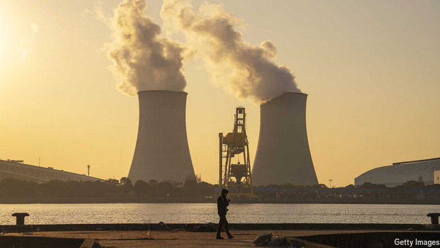

# Time for China to get serious about its methane emissions

Officials mull a future of less coal and fewer cows—and don’t like it

methane：美 [ˈmeθeɪn] 甲烷（一种无色无味的可燃气体，常用作燃料）；

mull：仔细考虑；慎重考虑；

原文：

CHINA IS OFTEN criticised for its emissions of carbon dioxide, which

dwarf those of other countries. By way of defence, Chinese leaders can at

least point to their official goal of having those emissions peak by 2030. But

China is also the world’s biggest emitter of methane, another greenhouse

gas. It produces about 14% of global emissions each year. When it comes to

methane, Chinese leaders have less to say in their defence. They are just

starting to grapple with the problem.

中国经常因其二氧化碳排放量而受到批评，这使得其他国家相形见绌。作为辩护，中国领导人至少可以指出他们的官方目标，即在2030年达到排放峰值。但是中国也是世界上最大的甲烷排放国，甲烷是另一种温室气体。它每年产生大约14%的全球排放量。当谈到甲烷时，中国领导人没有多少话为自己辩护。他们刚刚开始着手解决这个问题。

学习：

dwarf：使相形见绌；使失色；使显得不重要；

grapple with：应对；努力对付；努力应对          

原文：

Methane is responsible for nearly 45% of the increase in the Earth’s

temperature since the Industrial Revolution. Cutting emissions of the gas is a

promising way to slow global warming because it remains in the atmosphere

for just a decade, so might soon be gone. Carbon dioxide, in contrast, lingers

for over a century.

自工业革命以来，甲烷对近45%的地球温度上升负有责任。减少这种气体的排放是减缓全球变暖的一种有希望的方式，因为它在大气中只存在十年，所以可能很快就会消失。相比之下，二氧化碳会存在一个多世纪。

学习：

linger：继续存留；缓慢消失；流连；

原文：

China has two big sources of methane emissions. The first is coal mining,

which accounts for 40% of such discharges. The process liberates the gas

from coal seams. Miners then vent it (and other gases) directly into the

atmosphere. Abandoned mines, of which China has around 12,000, leak

methane as well. The second big source is farms. Cows belch methane.

Microbes in rice paddies produce it, too.

中国有两大甲烷排放源。首先是煤矿开采，占此类排放的40%。这个过程释放出煤层中的气体。然后矿工将它(和其他气体)直接排放到大气中。中国有大约12000个废弃的矿井，它们也泄漏甲烷。第二大来源是农场。奶牛会排放甲烷。稻田里的微生物也会产生这种物质。

学习：

discharge：释放；排出；

seam：煤层；

vent：排放（气体、液体）

belch：打嗝；喷出（烟、火等）；吐出（气体等）

microbes：美 [ˈmaɪˌkroʊbz] 微生物；（microbe的复数）

paddy：稻田；

原文：

In November officials published an “action plan” for dealing with the gas. It

aims to improve the monitoring of emissions by using drones and satellites.

These are necessary steps because much of the stuff enters the atmosphere

unnoticed. In 2019 researchers at Harvard University used satellite data to

measure China’s methane emissions. They reached a figure a fifth higher

than the government’s estimate.

11月，官员们公布了一项处理这些气体的“行动计划”。它旨在通过使用无人机和卫星来改善对排放的监控。这些都是必要的步骤，因为许多物质进入大气层时都没有被注意到。2019年，哈佛大学的研究人员利用卫星数据测量了中国的甲烷排放量。他们得出的数字比政府的估计高出五分之一。

原文：

Now officials look set to go a step further. The government has proposed

tightening the rules on emissions from coal mines. They are currently

allowed to vent gases that are less than 30% methane. The new draft

regulations would lower that number to 8%. Mining companies would have

to install equipment to capture gases with higher concentrations.

现在，官员们似乎要更进一步。政府已经提议收紧对煤矿排放的规定。目前，他们被允许排放甲烷含量低于30%的气体。新的法规草案将把这一数字降至8%。矿业公司将不得不安装设备来捕捉更高浓度的气体。

学习：

coal mines：煤矿

原文：

But even according to the government’s own data (which do not include

leaks from abandoned mines) the new venting rules would lead to only a 7%

reduction in methane emissions from the coal-mining sector. Compare that

with the “Global Methane Pledge” signed by 150-odd countries. It calls for

methane emissions to be cut by 30% from 2020 levels by the end of the

decade. China is not a signatory.

但即使根据政府自己的数据(不包括废弃矿井的泄漏)，新的通风规则也只会导致煤矿部门甲烷排放量减少7%。相比之下，150多个国家签署了“全球甲烷承诺”。它呼吁到2020年，甲烷排放量要比2020年减少30%。中国不是签约国。

学习：

signatory：美 [ˈsɪɡnəˌtɔri] （协议的）签署者；签署方；

原文：

To really make a dent in emissions, China would have to dig up much less

coal, says Sun Xiaopu of the Institute for Governance & Sustainable

Development, a think-tank in America. It would also have to make changes

to the way farms are managed. Fewer cows would help. And rice paddies

could be irrigated for shorter periods, giving bacteria less time to grow.

美国智库治理与可持续发展研究所的Sun Xiaopu 说，要想真正减少排放，中国必须减少对煤炭的开采。它还必须改变农场的管理方式。更少的奶牛会有所帮助。稻田可以灌溉更短的时间，给细菌更少的时间生长。

学习：

make a dent：引起注意；产生印象          

dig up：挖出；挖掘；开垦          

irrigate：灌溉；滋润（土壤）；浇水；

原文：

Such moves seem unlikely, though. In the minds of Chinese officials, energy

and food security trump climate concerns. China has lots of solar panels and

wind turbines, but coal still supplies over half of its energy, because it is

reliable. In fact, China is opening more coal mines. It also plans to expand

its stock of cattle. Little wonder, then, that it has not committed to a hard

target for reducing methane emissions. ■

不过，这些举措似乎不太可能。在中国官员看来，能源和食品安全比气候问题更重要。中国有很多太阳能电池板和风力涡轮机，但煤炭仍然提供一半以上的能源，因为它是可靠的。事实上，中国正在开发更多的煤矿。它还计划扩大其牲畜存栏量。难怪它没有承诺减少甲烷排放的硬性目标。■

学习：

trump：胜过；赢；

## 后记

2024年8月28日12点24分于上海。

