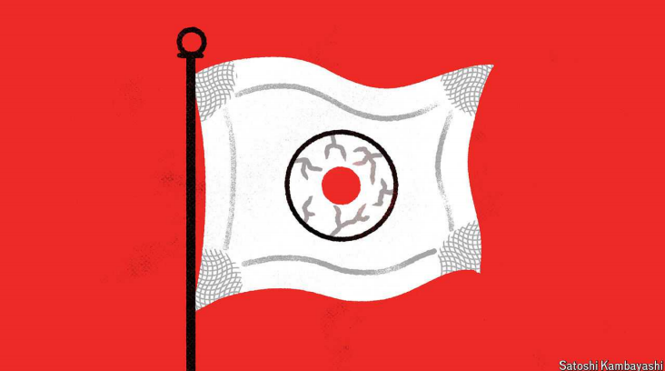

# Can Japan’s zombie bond market be brought back to life?

Ueda Kazuo begins on a dangerous mission

原文：

Visitors to Tokyo in the 1990s arrived in a city that looked like the future. A

megalopolis of high-rise buildings, neon lights and new technology left a

mark on those who witnessed it. But the city has not changed all that much

since. Today some travellers joke that Tokyo still looks like a vision of the

future—just one planned in 1990.

20世纪90年代来东京的游客来到了一个看起来像未来的城市。高层建筑、霓虹灯和新技术的大都市给目睹者留下了深刻的印象。但自那以后，这座城市并没有发生太大的变化。今天，一些旅行者开玩笑说，东京看起来仍然像是未来的景象——只是1990年计划的一个景象。

学习：

megalopolis：美 [ˌmɛɡəˈlɑpələs] 特大城市；大都市区；巨型都市；超大城市 **注意发音**

high-rise：高层的；多层的；高耸的；高楼的；

neon：美 [ˈniːɑːn] 氖；氖气；霓虹灯；氖灯

neon light：霓虹灯

原文：

Something similar is going on with Japan’s monetary policy. The country’s

central bank experimented with zero interest rates and asset purchases a full

decade before its peers in the West got in on the act after the global financial

crisis of 2007-09. Today, however, Japan looks like a vision of the monetary

past. Central banks elsewhere have begun to reduce their asset piles. The

Bank of Japan’s hoard still sits at record levels.

日本的货币政策也有类似的情况。在2007年至2009年全球金融危机爆发后，日本央行在西方同行采取行动之前整整十年就尝试了零利率和资产购买。然而，今天的日本看起来像是过去货币时代的景象。其他地方的中央银行已经开始减少他们的资产。日本央行的储备仍处于创纪录水平。

学习：

central bank：央行

hoard：美 [hɔːrd] 囤积；贮藏；储存

原文：

Ueda Kazuo, its governor, says that he wants to allow financial markets to

set long-term interest rates again, after the BoJ tried for years to control yields

on Japan’s ten-year government bonds. This will not happen anytime soon.

According to plans announced in July, the bank will still be purchasing

assets worth ¥2.9trn ($20bn) a month by March 2026, four years after the

Federal Reserve’s purchases came to an end. On August 23rd Mr Ueda was

forced to reiterate to Japanese parliamentarians that the central bank does

indeed plan to sell its holdings, eventually.

日本央行行长上田一雄表示，他希望允许金融市场再次设定长期利率，此前日本央行多年来一直试图控制日本十年期政府债券的收益率。这不会很快发生。根据7月份宣布的计划，到2026年3月，即美联储结束购买4年后，该行仍将每月购买价值2.9万亿日元(合200亿美元)的资产。8月23日，上田被迫向日本议员重申，央行确实计划最终出售其持有的资产。

学习：

parliamentarian：美 [ˌpɑrləmənˈtɛriən]  议会议员；国会议员；议会专家；

原文：

The achingly slow pace of change reflects the profound risks, both to

Japan’s financial institutions and to the government’s fiscal health. Over the

past dozen years the BoJ’s bond-buying campaign, which was introduced in

an attempt to reverse two decades of economic stagnation, has outstripped

those of other central banks by a mile. All told, the bank’s assets now run to

126% of Japan’s GDP, more than five times those of the Fed as a share of

America’s output. The BoJ owns more than half of outstanding Japanese

government bonds.

极其缓慢的变革步伐反映了日本金融机构和政府财政健康面临的巨大风险。在过去的十几年里，日本央行的债券购买活动(旨在扭转20年的经济停滞)远远超过了其他央行。总之，该银行的资产现在达到日本GDP的126%,是美联储占美国产出份额的五倍多。日本央行拥有超过一半的未偿日本政府债券。

学习：

achingly：美 ['eɪkɪŋlɪ] 极其；十分；

achingly slow pace：很慢

outstrip：超过

all told：总共；合计；总计；一共          

outstanding：未偿还的

原文：

This has had the effect of putting the private sector to sleep. Before the BoJ’s

more aggressive bond purchases began in 2013, depository institutions

(mostly commercial banks) owned 40% of Japan’s government bonds.

Today they own less than 10%. In a regular survey by the central bank, bond

traders moan about market liquidity and the scarcity of particular securities.

Over the past decade a large majority of respondents has continued to report

that the market functions poorly.

这产生了让私营部门沉寂的效果。在日本央行2013年开始更激进的债券购买之前，存款机构(主要是商业银行)持有40%的日本政府债券。今天他们拥有不到10%份额。在央行的定期调查中，债券交易员抱怨市场流动性和特定证券的稀缺。在过去十年中，绝大多数受访者一直认为市场运行不佳。

学习：

depository：存款的

moan：呻吟；抱怨；悲叹

原文：

Yet despite investors’ complaints about the scarcity of bonds, enticing them

to replace the BoJ will be tough. The maths of the bond market means that

when yields are very low, long-term securities are vulnerable to large price

moves even if yields rise by just a little—something known as “duration

risk”. For this reason, banks face regulatory limits on how much long-dated

debt they can buy, so as to avoid blow-ups like the one that last year brought

down America’s Silicon Valley Bank. A study by the Japan Centre for

Economic Research, a think-tank, suggests that these rules would limit

private-sector bond purchases to ¥100trn, or less than a fifth of the BoJ’s

holdings.

然而，尽管投资者抱怨债券稀缺，但吸引他们取代日本央行将是困难的。债券市场的数学意味着，当收益率非常低时，长期证券很容易受到大幅价格波动的影响，即使收益率仅上升一点点——这被称为“久期风险”。出于这个原因，银行面临着可以购买多少长期债务的监管限制，以避免像去年搞垮美国硅谷银行那样的大爆炸。智库日本经济研究中心的一项研究表明，这些规则将私人部门债券购买限制在100万亿日元以内，不到日本银行持有量的五分之一。

学习：

enticing：吸引；引诱；诱惑；（entice的现在分词）          

long-dated：长期的；长期有效的；长期持有的

brought down：击落；打倒；搞垮          

原文：

More attractive prices would help bring back buyers. Japan’s ten-year bonds

currently offer yields of around 0.9%. By the BoJ’s own estimate, its bond

holdings depress yields on long-term government bonds by just under a

percentage point. A return of more like 2% would certainly appeal to a far

greater pool of potential investors. Rising yields would also increase the

number of bonds that Japanese banks could buy under the same interest-rate

regulations, because violent price moves would be less likely.

更有吸引力的价格将有助于吸引买家。日本十年期债券目前的收益率约为0.9%。根据日本央行自己的估计，其持有的债券将长期政府债券的收益率压低了不到一个百分点。更接近2%的回报率肯定会吸引更多的潜在投资者。收益率上升还会增加日本银行在相同利率监管下可以购买的债券数量，因为价格剧烈波动的可能性会降低。

学习：

violent price moves：价格剧烈波动

原文：

But such an increase in yields would introduce another threat. Japan’s vast

bond market reflects the government’s huge debt, which was accumulated

while interest rates were low and falling. A doubling of the average interest

rate on government bonds, from 0.8% to just 1.6%, would raise interest

payments to 17% of Japan’s government budget. That would be up from less

than 9% today and an amount equivalent to half the state’s social-security

spending.

但收益率的这种增长会带来另一种威胁。日本庞大的债券市场反映了政府的巨额债务，这些债务是在利率低且不断下降时积累起来的。政府债券的平均利率翻一番，从0.8%提高到1.6%，将会使利息支出增加到日本政府预算的17%。这一比例将从目前的不到9%上升到相当于日本国家社会保障支出的一半。

原文：

Any attempt to bring the bond market back to life at a faster pace would,

therefore, become a political nightmare, necessitating swingeing spending

cuts or hefty tax rises. At the same time, however, proceeding at a glacial

pace carries its own costs, not least that it leaves the BoJ incapacitated in the

event of another downturn, because officials would struggle to launch an

aggressive bond-buying campaign. There are, in short, no good options for

Japan’s central bankers. The country represents a cautionary tale from the

monetary past. ■

因此，任何让债券市场以更快的速度复苏的尝试，都将成为一场政治噩梦，迫使政府大幅削减支出或大幅增税。然而，与此同时，以极慢的速度前进也有其自身的成本，尤其是它会让日本央行在另一场衰退中无能为力，因为官员们将很难发起积极的债券购买活动。简而言之，日本央行行长没有什么好的选择。日本代表了过去货币政策的一个警示。■

学习：

necessitating：迫使；需要；使成为必需；（necessitate的现在分词形式）          

swingeing：巨大的；猛烈的；大幅度的；

>
>"证券"（security）是一种金融工具，代表对某种经济实体的财务权益。它包括以下几种主要类型：
>
>1. **股票**（Stock/Equity）：股票代表公司所有权的一部分。当你购买一家公司股票时，你就拥有了这家公司的一部分。股票持有者通常有权获得公司的利润分配（如股息）和参与公司决策的投票权。
>
>2. **债券**（Bond）：债券是公司、政府或其他机构发行的一种债务工具。购买债券的人相当于借钱给发行者，并在到期日获得本金和约定的利息。债券持有者是债权人，而不是所有者。
>
>3. **衍生工具**（Derivatives）：衍生工具是基于其他资产（如股票、债券、商品或货币）的价值波动而设计的金融合约，常见的有期货、期权和掉期等。
>
>4. **混合证券**（Hybrid Securities）：这类证券兼具股票和债券的特点，例如可转换债券（Convertible Bonds），它可以在一定条件下转换为公司的股票。
>
>5. **投资基金**（Investment Funds）：投资基金是一种集合投资工具，投资者通过购买基金份额，间接持有一篮子证券，如股票基金或债券基金。
>
>综上所述，证券不仅包含股票和债券，还包括其他类型的金融工具。

## 后记

2024年8月31日19点54分于上海。

