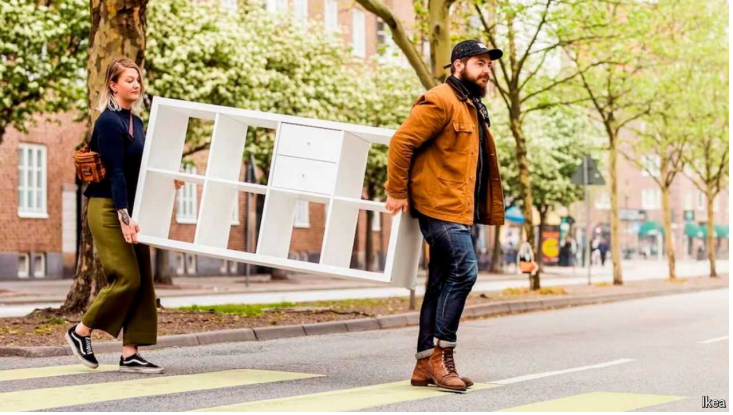

# Can IKEA disrupt the furniture business again?

It wants to help you sell your Billy bookcase

disrupt： 颠覆，彻底改变

> 这里的 **"disrupt"** 是指“颠覆”或“彻底改变”某个行业或市场的现有运作方式，通常通过引入创新的做法或技术来打破现有格局。举例子：
>
> - **"Uber disrupted the taxi industry by introducing a mobile app-based ride-hailing service"**（Uber通过推出基于手机应用的打车服务颠覆了出租车行业）。
> - **"IKEA disrupted the traditional furniture business by popularizing affordable, flat-pack furniture that customers could assemble themselves"**（IKEA通过普及便宜的、顾客自己组装的平板包装家具，颠覆了传统家具行业）。

IKEA：宜家

>
>
>IKEA（宜家）是全球知名的家具和家居用品品牌，总部位于瑞典。宜家以其简约现代的设计风格、实用的功能性和亲民的价格广受消费者喜爱。品牌最大的特点之一是其“自行组装”的模式，消费者可以在商店挑选产品后将其带回家，按照说明书自行组装，降低了运输和装配成本。宜家提供的产品种类丰富，从家具到厨房用具、装饰品、家纺等应有尽有，适合不同风格和预算的顾客需求。此外，宜家还倡导环保和可持续发展，致力于通过环保材料和节能设计来减少对环境的影响。
>
>宜家的购物体验也是其成功的重要因素之一，顾客可以在宽敞的展厅中参观各类家居陈列，获得设计灵感，同时享受其著名的瑞典美食，如肉丸和热狗等。
>
>IKEA is a globally renowned furniture and home goods brand headquartered in Sweden. It is known for its minimalist, modern design, functional products, and affordable prices. One of IKEA's key features is its "self-assembly" model, where customers purchase flat-packed products and assemble them at home, which reduces shipping and assembly costs. IKEA offers a wide range of items, from furniture to kitchenware, decor, and textiles, catering to various styles and budgets.
>
>The brand also promotes sustainability, using eco-friendly materials and energy-efficient designs to reduce its environmental impact. IKEA's shopping experience is a significant part of its success, with spacious showrooms offering customers inspiration for home decor. Additionally, IKEA is famous for its Swedish cuisine, such as meatballs and hot dogs, enhancing the overall experience for visitors.

原文：

There are worse ways to spend a lazy Saturday than to take a trip to one of

IKEA’s giant furniture stores. Young children can be swiftly deposited at

*Småland*, the supervised play area, leaving you to navigate the maze of flat-

pack furniture and bric-a-brac at your leisure; you might even stop at the

restaurant for a plate of Swedish meatballs.

有比去宜家的大型家具店旅行更糟糕的方式度过慵懒的周六（说明宜家是个不错的去处）。年幼的孩子可以很快被安置在smaland，这是一个有人监管的游戏区，让你在闲暇时在平面包装家具和小摆设的迷宫中穿行；你甚至可能会在餐馆停下来吃一盘瑞典肉丸。

学习：

>第一句话的意思是：去宜家家具店逛逛是一个不错的选择，用来形容周六的休闲时光，意思是有很多比这更无聊的事情。

take a trip：旅行；出游；去旅行；

deposit：放置，安置

play area：玩耍区；游戏区；游戏场地          

flat-pack：平板包装；扁平包装；平板式包装家具

bric-a-brac：小摆设；小装饰品；小古董；小玩意；

meatballs：肉丸

原文：

IKEA’s cheap products—and its knack for getting shoppers to walk away with

bagfuls of adornments they never knew they needed—have made it into the

world’s biggest furniture company, with €48bn ($53bn) in annual sales last

year. The company, which is held privately through a bewildering network

of foundations, controls around 9% of the fragmented global furniture

market. In an effort to keep growing, it has been investing in its e-commerce

offering and adding new store formats. Its latest experiment, in second-hand

furniture, could help it get both bigger and greener.

宜家的廉价产品——以及让购物者带着一大包他们从来不知道自己需要的装饰品离开的诀窍——已使其成为世界上最大的家具公司，去年的年销售额为480亿英镑(合530亿美元)。这家通过令人困惑的基金会网络私人控股的公司，控制着9%左右支离破碎的全球家具市场。为了保持增长，它一直在投资电子商务产品，并增加新的商店模式。它在二手家具上的最新实验，可以帮助它变得更大更环保。

学习：

knack：诀窍；技巧

bagful：美 [ˈbægfəl]  满满一袋

adornments：美 [əˈdɔ:nmənts] 装饰；装饰品；（adornment的复数）

annual sales：年销售额

bewildering：使人困惑的；令人困惑的；使迷惑；（bewilder的现在分词）          

fragmented：片断的；成碎片的；使成碎片；（fragment的过去分词）；

原文：

In the past few years IKEA has been busily trying to make buying its wares

more convenient, particularly for customers without a car. As much as they

might enjoy wandering around one of its giant stores, many shoppers do not

have a day to spare to buy two folding chairs, says Jesper Brodin, the boss of

INGKA, which owns most of IKEA’s shops (though not its intellectual property).

Online sales, which the company was initially slow to adopt, have been a

priority since the covid-19 pandemic, when nearly all IKEA shops were closed.

They now account for 23% of the total.

在过去的几年里，宜家一直忙于让购买商品变得更加方便，特别是对没有车的顾客。INGKA的老板Jesper Brodin说，尽管他们可能喜欢逛宜家的大型商场，但许多购物者一天也抽不出时间来买两把折叠椅，INGKA拥有宜家的大部分商店(尽管不是其知识产权)。该公司最初对网上销售的接受速度较慢，但自从新冠肺炎疫情事件以来，几乎所有的宜家商店都关门了，网上销售就成了公司的重中之重。他们现在占总数的23%。

学习：

wares：货物；商品；制品；（ware的复数）

folding chairs：折叠椅

原文：

IKEA has also been moving its stores closer to customers. It now has “planning

centres” in central locations where customers can put together their ideal

kitchen, bedroom or bathroom. Smaller stores in busy shopping districts

have cropped up in numerous cities, too. In July IKEA invested in a tower being

built on Manhattan’s Fifth Avenue; a new shop will open on Oxford Street in

central London in the spring. The company has also been buying malls

where it intends to make IKEA the anchor tenant. In November INGKA bought

Churchill Square, the main shopping centre in Brighton, in southern

England. It will set up shop on a site once occupied by Debenhams, a failed

department store.

宜家也一直在把商场搬到离顾客更近的地方。现在，该公司在中心位置设有“规划中心”，顾客可以在这里组合出自己理想的厨房、卧室或浴室。繁华购物区的小商店也在许多城市出现。7月，宜家投资了曼哈顿第五大道上正在建造的一座塔楼；一家新店将于春季在伦敦市中心的牛津街开业。该公司还一直在收购购物中心，打算让宜家成为主要租户。11月，英格卡收购了英国南部布莱顿的主要购物中心丘吉尔广场。它将在曾经被一家失败的百货公司Debenhams占据的地方开店。

学习：

crop up：（常指出其不意地）出现；发生；突然发生；意外地出现

>
>
>这里的 **"crop up"** 意思是“突然出现”或“逐渐涌现”。举例子：近年来，在大城市的繁华购物区里，许多小型宜家门店突然涌现。例如："New coffee shops have cropped up all over the neighborhood"（这个社区里突然出现了很多新的咖啡店）

tenant：美 [ˈtenənt] 租户；房客；承租人

anchor tenant: 核心租户，主要租户

>**"Anchor tenant"** 指的是在购物中心或商业地产中占据主要位置的核心租户，通常是大品牌或大型商店，能够吸引大量客流。例如：**宜家**在购物中心里常常是**"anchor tenant"**，通过吸引大量顾客来提高整个商场的客流量。类似的例子是，在很多商场里，\**沃尔玛\**或**百货公司**可能也是核心租户。

set up shop：开店；开业；

department store：百货商店；百货公司          

原文：

Both developments are new for IKEA, but hardly for the industry. More novel is

its recent announcement of a platform for people to sell their secondhand IKEA

furniture online, beginning with trials in Oslo and Madrid that will run until

December, ahead of a worldwide rollout next year. IKEA customers can already

sell their furniture back to the firm at its shops, a service more than 200,000

customers made use of last year, twice as many as in 2022. The company’s

secondhand platform will allow people to palm their old furniture off to new

buyers directly. IKEA will provide recommended prices, generic photos and

product details (including, importantly, assembly instructions); sellers can

then add their own pictures and choose their price. The buyer collects the

furniture.

这两项发展对宜家来说都是新的，但对整个行业来说都不算什么。更新奇的是，它最近宣布了一个平台，供人们在线出售二手宜家家具，首先在奥斯陆和马德里进行试验，将持续到12月，明年将在全球推广。宜家顾客已经可以在自己的商店将家具卖回给公司，去年有超过20万顾客使用这项服务，是2022年的两倍。该公司的二手平台将允许人们把旧家具直接转手给新买家。宜家将提供建议价格、通用照片和产品细节(重要的是，包括组装说明)；卖家可以添加自己的图片并选择价格。买家领取家具。

学习：

rollout：首次展示

palm off: 甩卖

>这里的 **"palm"** 意思是“把不想要的东西推销给别人”或者“甩卖”。举例子：当有人试图将旧物品卖给其他人时，可以说 **"He tried to palm off his old car to me"**（他试图把他那辆旧车卖给我）。

collect: 领取

>
>
>**"Collect"** 在这里的意思是“收取”或“领取”。举例子：买家可以亲自来领取他们购买的家具，例如 **"The buyer will come to collect the package tomorrow"**（买家明天会来领取包裹）。

原文：

IKEA products already account for around a third of secondhand-furniture sales

by volume, according to Mr Brodin. Although the platform will be free to

use, at least at first, it will provide IKEA a way to encourage sellers back to its

stores. If they opt for an IKEA voucher as payment, they receive a 15% bonus

on the sale price.

据Brodin先生说，宜家产品已经占到二手家具销量的三分之一左右。尽管该平台可以免费使用，但至少在一开始，它将为宜家提供一种鼓励卖家重返商场的方式。如果他们选择宜家优惠券作为付款方式，他们将获得售价15%的奖励。

学习：

voucher：美 [ˈvaʊtʃər] 代金券；代币券；优惠券

## **It has legs**

原文：

Besides boosting sales, the platform should help IKEA towards another of its

ambitions: to be greener. Mr Brodin reckons sustainability and profitability

can go together. Since 2016 the company has expanded its sales by a third

but reduced carbon emissions from its operations by half, and from its

supply chain by a fifth. Four-fifths of the energy consumed by its stores and

factories is now from renewable sources. In Germany, its largest market

outside its home country of Sweden, it operates 23 solar plants and five wind

farms (it sells its excess power to the grid). By making it easier for people to

sell their old furniture, fewer Billy bookcases will end up in the bin—and

more flat-pack furniture will end up in living rooms. ■

除了促进销售，该平台还能帮助宜家实现另一个目标:变得更环保。Brodin先生认为可持续性和盈利性可以共存。自2016年以来，该公司的销售额增加了三分之一，但其运营的碳排放量减少了一半，供应链的碳排放量减少了五分之一。其商店和工厂消耗的五分之四的能源来自可再生能源。在其母国瑞典之外的最大市场德国，它运营着23个太阳能发电厂和5个风力发电厂(它将多余的电力出售给电网)。通过让人们更容易出售旧家具，更少的Billy毕利书柜会被扔进垃圾箱，更多的平板包装家具会被扔进客厅。■

## 后记

2024年9月11日19点35分于上海。

