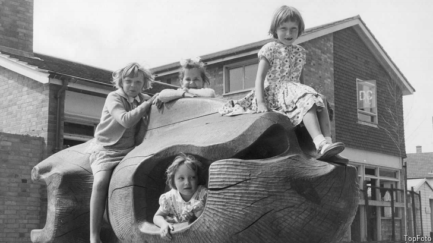

# Why have Britain’s new towns become fashionable again?

The politics of social class is one reason

fashionable：流行的；时髦的；潮流的；

原文：

Some governments have precious places—towns and villages that express

their vision of Britain, that are filled with the sort of people who voted for

them. For Boris Johnson’s governments, the place was Teesside, a Brexity

part of north-east England. David Cameron haunted factories around Derby,

a city in the East Midlands, in order to show that he understood ordinary

people. But few were fooled: Lord Cameron will always be associated with

the rich, untroubled town of Chipping Norton in the Cotswolds.

一些政府拥有珍贵的地方——表达他们对英国愿景的城镇和村庄，那里住满了为他们投票的人。对于鲍里斯·约翰逊(Boris Johnson)的政府来说，这个地方就是英国东北部的脱欧区蒂塞德。大卫·卡梅伦经常出没于英格兰东部中部城市德比周围的工厂，以表明他理解普通人。但很少有人被愚弄:卡梅伦勋爵将永远与科茨沃尔德富裕宁静的奇平诺顿镇联系在一起。

学习：

untroubled：无忧无虑的；平静的；不受干扰的

原文：

The new government’s precious place seems to be Stevenage, a town of

90,000 people about 25 miles (40km) north of London. Sir Keir Starmer

went there in 2020 to launch his campaign to lead the Labour Party. He has

returned several times since. In July Labour won the seat from the Tories.

One of his ministers, Lady Taylor, led the local council for 16 years.

Another, Matthew Pennycook, went there to announce that the government

intends to build more towns like it. For Stevenage and its ilk, it is a

remarkable reversal.

新政府最看重的地方似乎是斯蒂夫尼奇，这是一个位于伦敦以北大约25英里(40公里)的拥有9万人口的小镇。凯尔·斯塔莫爵士在2020年去那里发起他领导工党的运动。从那以后，他回来过几次。7月，工党从保守党手中赢得了席位。他的一位部长泰勒女士领导地方议会长达16年。另一个叫马修·彭尼库克的人去那里宣布政府打算建造更多这样的城镇。对于Stevenage及其同类来说，这是一个显著的逆转。

学习：

ilk：类型；种类；同类；

原文：

Stevenage was a pioneer—the first settlement to be designated under the

1946 New Towns Act. It was one of eight built around London after the

second world war, with the aim of arresting the capital’s spread and

providing superior homes for factory workers. Other new towns sprang up in

Scotland, near Liverpool, in north-east England and in the Midlands.

史蒂夫内奇是一个先驱——第一个根据1946年新城法案指定的定居点。这是第二次世界大战后在伦敦周围建造的八个建筑之一，目的是阻止首都的扩张，为工厂工人提供更好的住房。其他新城镇出现在苏格兰、利物浦附近、英格兰东北部和中部。

学习：

designated：美 [ˈdezɪɡneɪtɪd] 指定的；特指的 **注意发音**

settlement：定居点；居住区；

arrest：阻止；中止；抑制；

spring up：涌现；兴起；崛起

原文：

The new towns were planning and architectural showcases, bold and

experimental except in their building material, which was invariably

concrete. Stevenage contains “Radburn” streets, where homes open onto

footpaths, and has one of Britain’s first pedestrianised shopping centres. The

new towns were meant to be social utopias, too. In 1946 Lewis Silkin, the

town-planning minister, insisted that they must be socially mixed: “We must

not make them towns inhabited by people of one income level, and that the

lowest.”

新的城镇是规划和建筑的展示，大胆和实验，除了他们的建筑材料，总是混凝土。斯蒂夫尼奇有“拉德本”街道，那里的住宅通向人行道，并且有英国第一个步行购物中心。新城镇本来也是社会乌托邦。1946年，城市规划部长路易斯·西尔金坚持认为，它们必须是社会融合的:“我们不能让它们成为某一收入水平的人居住的城镇，以及最低收入水平的人居住的城镇。”

学习：

footpaths：人行道；小路；（footpath的复数）

原文：

They did not quite work out that way. Middle-class people moved to less

concrete places, leaving the new towns to skilled manual workers. Many

have remained more working-class than their environs. The 2021 census

showed that 33% of adults in Stevenage are professionals, managers or

technicians, compared with 40% in Hertfordshire, the surrounding county. Jo

Ward, curator of Stevenage Museum, says the town has lots of decent three-

bedroom houses but few of the grander ones that might entice affluent

people.

结果并不完全是这样。中产阶级搬到了不太有混凝土的地方，把新城镇留给了熟练的体力劳动者。许多人比他们周围的人更像工人阶级。2021年的人口普查显示，史蒂夫内奇33%的成年人是专业人士、经理或技术人员，而周围的赫特福德郡为40%。史蒂夫内奇博物馆的馆长乔·沃德说，这个镇上有很多不错的三居室房子，但很少有吸引富人的大房子。

学习：

manual workers：体力劳动者

environs：美 [ɪnˈvaɪrənz] 周围地区；郊区；周边环境；

entice：吸引

原文：

Two decades ago Britain’s new towns were on their uppers. In 2002 a

parliamentary select committee described them as “experiencing major

problems”. Their buildings and infrastructure, which had been built in an

austere era, were crumbling. Residents were scared to use their many

walkways, which had been created to keep people safe from cars. Their

design was “inappropriate to the 21st century”.

二十年前，英国的新城镇还很繁荣。2002年，一个议会特别委员会称他们“遇到了重大问题”。他们的建筑和基础设施是在艰苦的时代建造的，现在已经摇摇欲坠。居民们害怕使用他们的许多人行道，这些人行道是为了保护人们远离汽车而建造的。他们的设计“不适合21世纪”。

学习：

austere：简朴的；朴质的；朴素的

crumbling：坍塌；（crumble的现在分词）

walkways：走道；（walkway的复数）

原文：

Until recently, the very term was politically taboo. The last Labour

government promised to build “millennium villages”; then, a few years later,

it said it would create “eco towns”. The Conservative-led coalition of 2010-

15 promised “locally led garden cities” (which, like the millennium villages

and the eco towns, failed to appear in any number). So why is the current

government talking about new towns again?

直到最近，这个词还是政治上的禁忌。上届工党政府承诺建设“千年村”；然后，几年后，它说它将创建“生态城镇”。2010-2015年保守党领导的联盟承诺“地方领导的花园城市”(像千禧村和生态城镇一样，没有出现在任何数字中)。那么，为什么现任政府又在谈论新城镇呢？

学习：

taboo：美 [təˈbuː] 禁忌；忌讳；避讳；

原文：

One possibility is that the existing ones have come to seem less peculiar and

more part of Britain’s “urban patina”, as Mark Clapson, an expert on new

towns, puts it. Blocks of flats have sprouted in the middle of Stevenage, as

they have in older towns. Conventional suburbs have appeared on its fringes.

Some of these are built on land controlled by neighbouring rural authorities,

which were thereby able to satisfy government demands to build more

homes without spoiling their villages.

正如新城镇专家马克·克莱普森所说，一种可能是现有的已经变得不那么奇特，更多的是英国“城市古色”的一部分。像在老城区一样，在斯蒂文内奇市中心，公寓大楼拔地而起。传统的郊区已经出现在它的边缘。其中一些建在由邻近农村当局控制的土地上，因此能够满足政府的要求，在不破坏村庄的情况下建造更多的房屋。

学习：

patina：美 [pəˈtinə] [材]铜绿；绿锈；铜锈；氧化层；

sprout: 出现；涌现

原文：

The politics of social class may explain the turn, too. Sir Keir talks often

about his working-class origins: during the general-election campaign, he

repeated that his father was a tool-maker beyond the point at which it

became a joke. That is in line with his fondness for new towns: even when

they were unfashionable, many working-class people associated the towns

with staggering improvements in their lives.

社会阶级的政治也可以解释这种转变。基尔爵士经常谈到他的工人阶级出身:在大选期间，他反复强调他的父亲是一个工具制造商，这已经成为一个笑话。这与他对新城镇的喜爱是一致的:即使在它们不流行的时候，许多工人阶级也将城镇与他们生活的惊人改善联系在一起。

学习：

staggering：令人震惊的；难以置信的

原文：

The early residents felt they had entered paradise. Marie Cousins, who

moved to Stevenage in 1957, found her house astonishingly luxurious

compared with the flat she had shared in inner London. Her children ran up

and down the stairs, shouting “these are our stairs,” and repeatedly flushed

the toilet. “The best move we ever made,” she told the authors of a book

published in 1991.

早期的居民觉得他们已经进入了天堂。玛丽·卡曾斯于1957年搬到史蒂夫内奇，她发现自己的房子与她在伦敦市中心合租的公寓相比，豪华得令人吃惊。她的孩子在楼梯上跑上跑下，喊着“这是我们的楼梯”，反复冲马桶。“这是我们做过的最好的一步，”她对1991年出版的一本书的作者说。

学习：

flush the toilet：冲马桶

原文：

The new towns evoke an era of confident government, when Labour

ministers could decree that a town would be built and it would appear. But if

anybody thinks building another new town the size of Stevenage will be

easy or uncontroversial, they will be disappointed. Environmental and

planning laws have grown into fearsome obstacles. South-east England,

which most needs new housing, is thick with villagers who defend their

patches vigorously. Labour says it is trying to reduce these barriers, but

making existing cities bigger and denser would be simpler.

新城镇唤起了一个自信政府的时代，那时劳工部长可以下令建造一个城镇，它就会出现。但是如果任何人认为建造另一个像斯蒂文内奇这么大的新城镇会很容易或者没有争议，他们会失望的。环境法和规划法已经成为可怕的障碍。最需要新住房的英格兰东南部，到处都是积极捍卫自己土地的村民。工党表示，他们正在努力减少这些障碍，但让现有的城市变得更大、更密集会更简单。

学习：

decree：美 [dɪˈkriː] 颁布法令；下达命令；裁定；

fearsome：令人害怕的；吓人的

patches：小块土地；

原文：

Even building Stevenage was hard. Residents of an existing settlement, now

known as Old Stevenage, named the new town “Silkingrad” in reference to

the town-planning minister. A filing cabinet in the central library contains

newspaper clippings about the plans, with headlines like “The coming

invasion by Londoners” and “300 people fight for town”. New towns may

be in vogue again, but they will provoke some familiar opposition. ■

甚至建造史蒂夫内奇也很困难。一个现有定居点的居民，现在被称为老斯蒂文内奇，以城市规划部长的名字命名这个新城镇为“西尔金格拉德”。中央图书馆的文件柜里有关于这些计划的剪报，标题是“伦敦人即将入侵”和“300人为城镇而战”。新城镇可能会再次流行，但它们会激起一些熟悉的反对。■

学习：

in vogue：流行

## 后记

2024年9月18日18点33分于上海。

