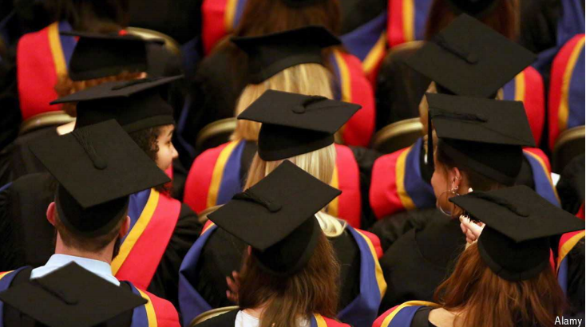

# Britain should let university tuition fees rise

Domestic students have been paying less in real terms every year

原文：

In 2012 politicians in Britain burned lots of political capital by raising the

cap on how much English universities can charge domestic undergraduates

in tuition fees. Sir Nick Clegg, the deputy prime minister at the time, had

previously pledged not to raise fees and never lived down the U-turn. This

political folk memory helps explain why the Labour Party, which took

power in July and has campaigned in the past to abolish tuition fees, will

find it difficult to raise the cap again. That is nonetheless what it should do.

2012年，英国政客通过提高英国大学向国内本科生收取的学费上限，消耗了大量政治资本。时任副首相的尼克·克莱格爵士此前曾承诺不会提高学费，后来改变立场提高学费。这种政治上的民间记忆有助于解释为什么工党会发现很难再次提高学费上限。工党在7月份掌权，过去曾发起废除学费的运动。然而，这是它应该做的。

学习：

U-turn: 立场大转变

>“U-turn” 在政治或决策语境中指的是突然的政策或立场大转变，通常与之前承诺或立场相违背。这里指的是 Nick Clegg 之前承诺不提高学费，但后来改变立场，支持提高学费上限。
>
>**例子**：
>
>- **English**: The government made a U-turn on its tax policy after facing public backlash.
>- **中文**：在面临公众强烈反对后，政府在税收政策上做出了大转变。

live down：设法让人忘记或者淡化

>“Live down” 意思是设法让人们忘记或淡化某件令人尴尬或不光彩的事情，通常指经过一段时间后消除它带来的负面影响。这里指的是 Nick Clegg 无法摆脱自己改变立场的负面影响，始终被此事困扰。
>
>**例子**：
>
>- **English**: He made a terrible mistake at work and has been trying to live it down ever since.
>- **中文**：他在工作中犯了一个严重错误，从那以后一直在努力让人们淡忘这件事。

原文：

The financial strains on British universities are becoming hard to ignore. In

the academic year just gone 40% of British universities ran deficits. The

number is probably higher now. How to handle a failing university is no

longer an academic question. The effect of tighter immigration rules on

numbers of foreign students, who pay higher fees than native ones, is one

reason why the universities are under pressure. But the sinking value of

tuition fees is another. The cap of £9,000 ($11,880) that was put in place 12

years ago has been raised only once since then, and by a tiny amount, to

£9,250. Inflation has eaten away at its value: it is now worth less than

£6,500 in 2012 money.

英国大学的财政压力变得难以忽视。在刚刚过去的学年，40%的英国大学出现赤字。现在这个数字可能更高了。如何处理一所失败的大学不再是一个学术问题。更严格的移民规定对外国学生数量的影响，他们比本地学生支付更高的费用，这是大学面临压力的原因之一。但是学费的贬值是另一个原因。12年前设立的9000英镑(11880美元)的上限自那以后只提高了一次，而且幅度很小，达到了9250英镑。通货膨胀侵蚀了它的价值:以2012年的币值计算，它现在的价值不到6500英镑。

学习：

strains：压力

原文：

Some argue that charging for higher education is wrong, and England should

go back to the old days of free tuition, courtesy of the taxpayer. In fact,

England’s student-finance regime offers a lot to like. Britons with degrees

earn 35% more than their peers who stop studying after secondary school.

Given these high private returns, it is fair that they should pay a big chunk of

the cost of their education. Student-loan repayments do not end in

bankruptcy: graduates in England start paying only when their annual

income exceeds a threshold (currently £25,000 for this year’s borrowers).

The previous jump in tuition fees has not put off poorer students; and most

graduates in a recent poll said their debts had not had a “negative impact” on

their lives.

一些人认为高等教育收费是错误的，英格兰应该回到过去的免费学费时代，这是对纳税人的礼遇。事实上，英国的学生资助制度有很多优点。拥有学位的英国人比中学毕业后停止学习的同龄人多挣35%。考虑到这些高额的私人回报，他们应该支付很大一部分教育费用是公平的。学生贷款的偿还不会以破产告终:英格兰的毕业生只有当他们的年收入超过一个阈值时才开始支付(目前今年的借款人是25，000英镑)。之前学费的上涨并没有吓退贫困学生；在最近的一次民意调查中，大多数毕业生表示，他们的债务没有对他们的生活产生“负面影响”。

学习：

courtesy：美 [ˈkɜːrtəsi] 礼貌；谦恭；殷勤

## **From learners to earners**

原文：

Every way of funding degrees has its flaws. Countries that pour a lot of

public money into higher education generally limit how many students can

go to university (as did England, until 2015). It is hard to argue that higher

earning graduates are the worthiest recipients of any new government

spending. And relying on ever more foreign students to subsidise domestic

ones is also not a sustainable solution. If fees for home students remain

stuck, higher-paying foreigners will eventually start displacing them. Flows

of foreign cash are volatile, and benefit universities in famous cities such as

London more than others. Also, voters like immigration even less than they

like fees.

每一种资助学位的方式都有其缺陷。向高等教育投入大量公共资金的国家通常会限制能上大学的学生数量(英国也是如此，直到2015年)。很难说高收入的大学毕业生是任何新的政府支出的最有价值的接受者。依靠越来越多的外国学生资助国内学生也不是一个可持续的解决方案。如果本国学生的学费不变，付钱多的外国人最终会取代他们。外国现金的流动是不稳定的，而且伦敦等著名城市的大学比其他地方受益更多。此外，选民对移民的喜爱甚至不如对费用的喜爱。

原文：

Those who would keep fees frozen point out that some students get poor

value for money. A number pursue qualifications that are unlikely to boost

their earnings; they may be better off with shorter courses or

apprenticeships. But the choice is theirs and, besides, constraining fees for

every student is not an answer to that problem. Britain’s university regulator

has been stepping up its policing of courses with high dropout rates and of

those that lead too few graduates to good jobs. In 2017 the government

required universities to meet minimum standards before taking advantage of

the small increase in the fee cap. It could try something like that again.

那些冻结学费的人指出，一些学生的钱花得不值得。许多人追求不太可能增加收入的资格证书；他们可能更适合短期课程或学徒。但是选择权是他们的，此外，限制每个学生的费用并不能解决这个问题。英国大学监管机构一直在加强对高辍学率课程和那些导致太少毕业生找到好工作的课程的监管。2017年，政府要求大学在利用费用上限小幅增长之前达到最低标准。它可以再次尝试类似的事情。

原文：

Universities say that if fees had tracked inflation, the cap would now be

more than £12,000. A sudden increase on that scale would be unwise. The

reforms of 2012 provided universities with a very large bump in income,

some of which they wasted. The cap was set at a high level in the vain

expectation that some institutions might choose to charge less. But neither

students nor the country are well served by allowing the real value of fees to

fall for ever. Labour should let them rise. ■

大学表示，如果学费跟随通货膨胀，上限现在将超过12000英镑。如此规模的突然增长是不明智的。2012年的改革给大学带来了巨大的收入增长，其中一些被浪费了。这一上限被定得很高，是因为一些机构可能会选择收取更低的费用，但这种期望落空了。但是，让学费的实际价值永远下降，对学生和国家都没有好处。工党应该让他们上升。■

## 后记

2024年9月20日13点55分于上海。

