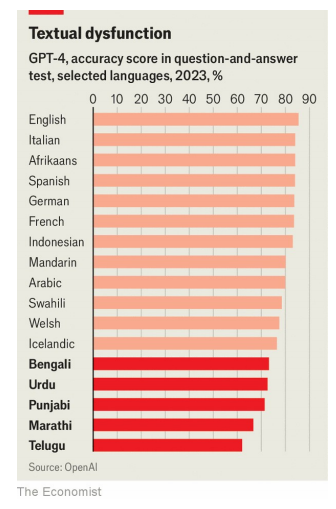

# India has a unique opportunity to lead in AI

Its development will be unlike China’s or America’s

原文：

HINDI IS THE world’s most widely spoken language after English and

Mandarin. Yet it constitutes only 0.1% of all freely accessible content on the

internet. That is one obstacle to India developing its own generative

artificial-intelligence (AI) models, which rely on vast amounts of training

data. Another is that Hindi is spoken by less than half the country. More than

60 other languages have at least 100,000 speakers. Data for some of them

simply do not exist online, says Manish Gupta, who leads DeepMind,

Google’s AI arm, in India. Natives of those languages stand to miss out on the

AI revolution.

印地语是仅次于英语和汉语的世界上使用最广泛的语言。然而，它只占互联网上所有免费内容的0.1%。这是印度开发自己的生成式人工智能(AI)模型的一个障碍，这些模型依赖于大量的训练数据。另一个原因是印度只有不到一半的人说印地语。60多种其他语言至少有10万人使用。谷歌人工智能部门DeepMind在印度的负责人马尼什古普塔(Manish Gupta)表示，其中一些人的数据根本不存在于网上。这些语言的本地人注定会错过人工智能革命。

学习：

Hindi：印地语

miss out on：将…遗漏；错过；错失          

原文：

Generative AI tools such as ChatGPT, a chatbot, are powered by large language

models, or LLMs. The “language” bit is crucial: without a corpus of data it is

impossible to make models, whether large or tiny. That is one reason why,

two years into the new AI race triggered by the launch of ChatGPT, India has yet

to produce any noteworthy AI innovations. But behind the scenes the

government, non-profit outfits, Indian startups and global tech giants are

working to adapt the technology to the country’s needs. The pace and scale

of their success will influence India’s progress in the coming century. It will

also offer lessons for other developing countries.

聊天机器人ChatGPT等生成性人工智能工具由大型语言模型(LLM)提供支持。“语言”这一点至关重要:没有一个数据语料库，就不可能建立模型，无论是大模型还是小模型。这就是为什么在ChatGPT启动引发的新一轮人工智能竞赛开始两年后，印度仍未产生任何值得关注的人工智能创新。但在幕后，政府、非营利机构、印度初创公司和全球科技巨头正在努力使这项技术适应该国的需求。他们成功的速度和规模将影响印度在未来一个世纪的发展。它也将为其他发展中国家提供经验。

原文：

There are two big reasons for India to develop its own AI capabilities. First, as

a rising power it is wary of depending on foreign technology. Second, it

could be transformative for development. “The real value comes from how

you apply these technologies to make a difference to people,” says Nandan

Nilekani, a tech grandee.

印度发展自己的人工智能能力有两大原因。首先，作为一个正在崛起的大国，它对依赖外国技术持谨慎态度。第二，它可以为发展带来变革。“真正的价值来自于你如何应用这些技术给人们带来变化，”技术大亨南丹·尼勒卡尼说。

学习：

grandee：美 [ɡrænˈdi] 贵族；显贵；大人物

原文：

For a better sense of India’s AI challenges—and opportunities—consider the

analogy of cooking dinner. The raw ingredients for AI are data. In the absence

of a well-stocked pantry India is doing the equivalent of growing its own

food. AI4Bharat, a research lab at the Indian Institute of Technology in

Chennai, has sent people across the country to manually collect voice

recordings in 22 languages. Google is doing something similar. Both feed

into Bhashini, a government project to create a translation system for Indian

languages.

为了更好地理解印度的人工智能挑战和机遇，考虑一下做饭的类比。人工智能的原材料是数据。在缺乏储备充足的食品储藏室的情况下，印度相当于在自己种植食物。钦奈印度理工学院的研究实验室AI4Bharat已经派人到全国各地手动收集22种语言的录音。谷歌也在做类似的事情。两者都被纳入Bhashini，一个为印度语言创建翻译系统的政府项目。

学习：

well-stocked：储存极多的；备货充足的          

pantry：食品贮藏室；食品贮藏柜；厨房储藏室          

原文：

Next, the data are blended, simmered and seasoned using a recipe known as

a model. Models can be huge, with lots of ingredients and many complicated

steps, or they can be relatively straightforward. The recipes behind ChatGPT or

Google’s Gemini are enormous. But for India’s purposes, simpler ones may

suffice. One idea is to use open-source models, such as Meta’s Llama, as a

base sauce, and then add ingredients or tweak the techniques according to

local needs. Sarvam AI, a startup in Bangalore, is going down this route.

接下来，使用一种被称为模型的配方对数据进行混合、煨煮和调味。模型可以很大，有很多成分和复杂的步骤，也可以相对简单。ChatGPT或谷歌的Gemini背后的配方是巨大的。但是对于印度的目的来说，简单一些就足够了。一种想法是使用开源模型，如Meta的Llama，作为基础酱，然后根据当地需求添加配料或调整技术。班加罗尔的初创公司Sarvam AI正在走这条路。

学习：

blended：混合；协调；（blend的过去式和过去分词）

simmered：炖

seasoned：加作料于；调味（season的过去式和过去分词）

suffice：美 [səˈfaɪs] 足够；满足需要； **注意发音**

原文：

Lastly, cooking requires the skilful harnessing of power. Just as turning

ingredients into food depends on the application of heat, so AI relies on

specialised computer chips. The sort needed to build and run sophisticated AI

models are expensive and in short supply globally. Earlier this year the

government said it would acquire 10,000 of them at a cost of 50bn rupees

($600m) to make computation power available at subsidised prices. And

Indian innovators are exploring other types of chips that may be better suited

to their purposes.

最后，烹饪需要巧妙利用能量。正如将原料转化为食物依赖于热量的应用，人工智能也依赖于专门的计算机芯片。构建和运行复杂的人工智能模型所需的那种东西价格昂贵，而且在全球范围内供不应求。今年早些时候，印度政府表示将以500亿卢比(6亿美元)的价格购买1万台这样的计算机，以便以补贴价格提供计算能力。印度创新者正在探索其他类型的芯片，可能更适合他们的目的。

原文：

What, then, will all this effort produce? As in the West, the most visible

products will at first be chatbots. The difference is that these will be tailored

to immediate, practical uses, revolving around translation and simplifying

dealings between citizens and the state. Moreover, Indians use the internet

largely as an audiovisual, rather than textual medium. So Indian AI products,

unlike Western ones, will be voice-first or exclusively voice-based.

那么，所有这些努力会产生什么结果呢？和西方一样，最引人注目的产品首先是聊天机器人。不同的是，这些将被定制为直接、实际的用途，围绕翻译和简化公民与国家之间的交易。此外，印度人在很大程度上将互联网作为一种视听媒体，而不是文本媒体。因此，与西方产品不同，印度的人工智能产品将是语音优先或完全基于语音的。

学习：

audiovisual： 视听的；视听教学的

原文：

Take form-filling, which can seem like India’s national pastime. Allowing

citizens to verbally answer questions in their own language, which a

machine inputs into forms, would widen access and remove middlemen.

Automating checklists for compendious compliance rules or bots that assist

in interpreting requirements could make the process less soul-crushing. “For

the first time with UPI [a home-grown digital-payments system] we can say

something in India is better than the rest of the world. But the truth is that

every other damn thing is not better,” says Vivek Raghavan, a co-founder of

Sarvam. AI, he reckons, “has the ability to flatten that, if everything became

easier to do”.

以填表为例，这似乎是印度的一项全国性娱乐活动。允许公民用他们自己的语言口头回答问题，并由机器输入表格，这将拓宽渠道，消除中间人。为简明的遵从性规则或帮助解释需求的机器人自动化清单可以使过程不那么令人心碎。“有了UPI(一个本土的数字支付系统),我们第一次可以说印度的某些东西比世界其他地方更好。但事实是，其他所有该死的事情并没有变得更好，”Sarvam的联合创始人Vivek Raghavan说。他认为，人工智能“有能力消除这种情况，如果一切变得更容易的话”。

学习：

form-filling：填表

pastime：娱乐活动；消遣；消遣方式；

middlemen：中间人；（middleman的复数）

compendious：美 [kəmˈpɛndiəs] 简明的；简洁的；

compliance：遵守；服从；顺从；遵循

soul-crushing：令人心碎的

原文：

AI could also help in areas such as education and health. One study in 2022

found that less than half of Indian students in year five could read at the

level of year two. The health-care system, too, is in dire shape. Cheap, mass-scale 

personalised tutors could start tackling the crisis in learning. Systems

that help in interpreting lab results, assist in diagnoses, or take on

administrative work could free up doctors to see more patients. The sclerotic

justice system could be sped up by automating some of the procedural tasks

that take up as much as half of judges’ time.

人工智能还可以在教育和卫生等领域提供帮助。2022年的一项研究发现，不到一半的五年级印度学生能够达到二年级的阅读水平。医疗保健系统也处于可怕的境地。廉价、大规模的个性化导师可以开始解决学习中的危机。有助于解释实验室结果、辅助诊断或承担行政工作的系统可以让医生腾出时间来看更多的病人。僵化的司法系统可以通过自动化一些占用法官多达一半时间的程序任务来加速。

学习：

dire：极其严重的；极差的；极糟的

sclerotic：美 [skləˈrɑdɪk] 硬化的；僵化的；

原文：

Many of these challenges exist across the developing world. With a few

notable exceptions, non-European languages are poorly represented online.

India’s advantage will come not from pushing at the boundaries of AI, but

from solving chronic, basic problems of the sort rich countries no longer

think about. India has a unique perspective that could enable it “to build out

the next set of AI-led companies in many more categories than exist,” says

Dev Khare of Lightspeed Venture Partners.

许多这些挑战存在于发展中国家。除了几个明显的例外，非欧洲语言在网上很少出现。印度的优势将不是来自对人工智能边界的突破，而是来自解决富裕国家不再考虑的那种长期的、基本的问题。光速创投(Lightspeed Venture Partners)的戴夫哈雷(Dev Khare)表示，印度有一个独特的视角，这可能使其“在比现有更多的类别中打造出下一批人工智能主导的公司”。

原文：

All this echoes the country’s approach to “digital public infrastructure”, its

name for technology platforms backed by the government and built upon by

private companies. India has invested in identity systems, digital payments,

data management and open protocols, all built at a low cost. The success of

these efforts at home has prompted the government to promote their use

abroad as a means of winning goodwill and projecting power. If Indian

techies can find ways to train and run AI systems frugally, that expertise, too,

will be attractive to other developing countries.

所有这一切都呼应了该国的“数字公共基础设施”方法，这是由政府支持、私营公司建设的技术平台的名称。印度在身份系统、数字支付、数据管理和开放协议方面进行了投资，所有这些都是以低成本构建的。这些努力在国内的成功促使政府在国外推广使用，作为赢得好感和投射力量的一种手段。如果印度的技术人员能够找到节俭地训练和运行人工智能系统的方法，这些专业知识也将吸引其他发展中国家。

学习：

techie：美 [ˈtɛki]  技术专家；技术迷；科技人员；

frugally：节约地；节省地

原文：

India’s AI success is by no means guaranteed. Some are sceptical of the

government’s 10,000-chip plan: the state has a poor record of using its

research-and-development resources effectively, and the idea that

bureaucrats would decide which projects are worthy is unappealing to many.

The use of small models to solve big problems remains untested. And even

if India lines up the ingredients, recipes and power it needs, it still faces a

severe shortfall of chefs. According to the Takshashila Institution, a think

tank in Bangalore, 8% of the world’s top AI researchers are from India. The

proportion of them that actually work in India rounds to zero. ■

印度的人工智能成功绝非板上钉钉。一些人对政府的10，000芯片计划持怀疑态度:该政府在有效利用其研发资源方面记录不佳，官僚决定哪些项目有价值的想法对许多人来说没有吸引力。使用小模型来解决大问题还没有经过检验。即使印度准备好所需的原料、食谱和能源，它仍然面临厨师的严重短缺。根据班加罗尔智库Takshashila Institution的数据，全球顶尖人工智能研究人员中有8%来自印度。他们中真正在印度工作的比例趋近于零。■

学习：

by no means：绝不；决不；丝毫不

## 后记

2024年10月8日11点31分于上海。

