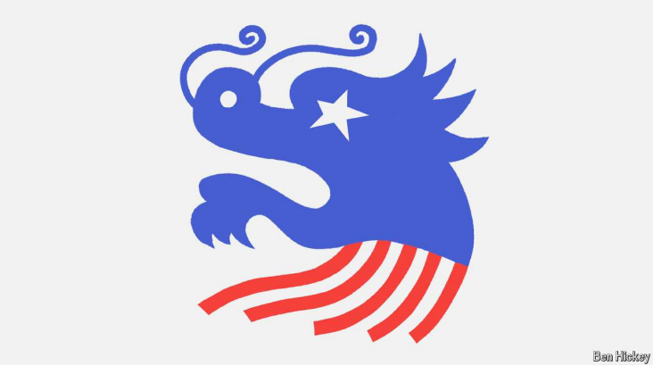
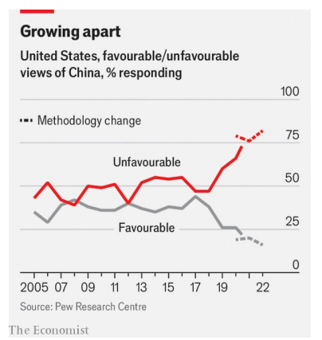

# The next American president will be a China hawk

Donald Trump may seek to decouple America’s economy, while Kamala Harris favours more targeted pressure

原文：

ALTHOUGH BRITAIN still claims to have a “special relationship” with the

United States, no country could contest China’s claim to have the most

important one. America’s next president will have to take stewardship of the

bilateral relationship at a time when mutual animosity and distrust are high.

He or she will have to steer carefully to avoid fracturing the global economy

or, much worse, plunging two of the world’s military superpowers into an

armed conflict.

尽管英国仍声称与美国有着“特殊关系”，但没有哪个国家能与中国争夺最重要的关系。美国的下一任总统将不得不在相互敌意和不信任高涨的时候掌管双边关系。他或她将不得不小心驾驶，以避免分裂全球经济，或者更糟糕的是，将两个世界军事超级大国拖入武装冲突。

学习：

stewardship：管理；管理工作          

animosity：敌意；仇恨；憎恶

plunge into：陷入；投身；把…放入

原文：

Raja Krishnamoorthi, a Democratic congressman who is the party’s highest-

ranking member on the influential House Select Committee on the Chinese

Communist Party, identifies three top issues in the next president’s China

portfolio. First, how to deter conflict, “especially in the South China Sea and

Taiwan area”. Second, China’s “use of technology to surveil, to hack and to

pre-position malware in our critical infrastructure”. And third, China’s

“economic aggression”, particularly “overcapacity in the green-goods

sector”, such as in the country’s export-driven solar and electric-vehicle

industries.

民主党国会议员Raja Krishnamoorthi是该党在颇具影响力的众议院中国共产党特别委员会中的最高级别成员，他指出了下一任总统中国投资组合中的三个首要问题。首先，如何阻止冲突，“尤其是在南海和台湾地区”。第二，中国“利用技术来监视、攻击和预先放置恶意软件到我们的关键基础设施中”。第三，中国的“经济侵略”，特别是“绿色产品领域的产能过剩”，比如该国出口驱动的太阳能和电动汽车行业。

原文：

A hardline stance towards China is firmly bipartisan. No matter what the

election result is, that will not change. Mr Krishnamoorthi says Xi Jinping,

China’s president, does not grasp “the depths of people’s anger” towards the

Chinese Communist Party “for any number of reasons”. Inside America, the

anger flows not just from the loss of jobs to unbalanced trade but also from

fentanyl deaths—“the fact that the vast majority of fentanyl precursors come

from China, and they’re not doing anything about it.”

对中国的强硬立场是坚定的两党立场。无论选举结果如何，这都不会改变。Krishnamoorthi先生说，中国国家主席“出于各种原因”，没有领会到人们对中国共产党“愤怒的程度”。在美国国内，愤怒不仅来自失业和不平衡的贸易，也来自芬太尼的死亡——“事实上，绝大多数芬太尼前体来自中国，而他们对此没有采取任何行动。”

学习：

hardline：不妥协的；强硬的；强硬路线          

原文：

As a result of a law championed by congressional China hawks, ByteDance,

a China-based company, will be forced to sell TikTok, the social-media

company it owns, to an approved owner by January 19th 2025 or else it will

be banned in America. The company is contesting the legality of the forced

sale in court.

国会对华鹰派支持的一项法律的结果是，一家总部位于中国的公司字节跳动将被迫在2025年1月19日之前将它拥有的社交媒体公司抖音出售给一个被认可的所有者，否则它将在美国被禁售。该公司在法庭上对强制销售的合法性提出质疑。

学习：

champion：支持

原文：

Eyck Freymann, a China scholar at the Hoover Institution, a think-tank, also

puts the next president’s China problems into three groupings. Handily, these

are alliterative: “trade, tech and Taiwan”. On trade, “China’s overcapacity

problem is getting worse,” Mr Freymann says, but the government cannot

abide mass unemployment in its outward-facing economy. Donald Trump’s

solution is broad-based tariffs of 60% on Chinese goods. Kamala Harris

opposes these, but she would still have to manage frictions with Mexico,

Europe and countries in South-East Asia if they become even larger conduits

of Chinese goods into America than they already are.

智库胡佛研究所的中国问题学者艾克·弗莱曼也将下一任总统的中国问题分为三类。这些都是头韵:“贸易、科技和台湾”。在贸易方面，“中国的产能过剩问题正在恶化，”Freymann先生说，但是政府不能容忍其外向型经济中的大规模失业。唐纳德·特朗普的解决方案是对中国商品征收60%的广泛关税。卡玛拉·哈里斯反对这些，但是如果墨西哥、欧洲和东南亚国家成为比现在更大的中国商品进入美国的通道，她将不得不处理与这些国家的摩擦。

学习：

groupings：派；集团；分组；分类；（grouping的复数）

handily：便利地；巧妙地；方便地

alliterative：英 [əˈlɪt(ə)rətɪv] 头韵的；押头韵的；

abide：接受；忍耐

conduits：美 [ˈkɔndits] 导管；水管；沟渠；（conduit的复数）

原文：

On technology, neither candidate would ease President Joe Biden’s

expansive export controls for sensitive goods such as advanced

semiconductors. Ms Harris would perhaps make technocratic adjustments to

the “small yard, high fence” approach that Jake Sullivan, Mr Biden’s

national security adviser, has touted. The policy is supposed to ensure not

just American military supremacy but also command of the technologies of

the future, including artificial intelligence and quantum computing. Ms

Harris would probably remain an adherent of the other China-policy slogan

of the Biden administration, “derisking, not decoupling”.

在技术方面，两位候选人都不会放松美国总统乔·拜登(Joe Biden)对先进半导体等敏感商品的广泛出口管制。哈里斯女士也许会对拜登先生的国家安全顾问杰克·沙利文鼓吹的“小院子，高栅栏”的方法进行技术官僚式的调整。这项政策不仅应该确保美国的军事优势，还应该确保对未来技术的掌控，包括人工智能和量子计算。哈里斯女士可能会继续坚持拜登政府的另一个对华政策口号“去中国化，而不是脱钩”。

学习：

touted：兜售；吹捧；（tout的过去式和过去分词）

supremacy：霸权；优势；

原文：

A Trump administration could be quite different. Robert O’Brien, a former

(and perhaps future) national security adviser under Mr Trump, wrote in an

article in *Foreign Affairs* published this summer that “Washington should, in

fact, seek to decouple its economy from China’s,” which he said Mr Trump

had actually begun to do “without describing it as such”. Mr O’Brien is one

of several “superhawks” in Republican circles—including Matt Pottinger

and Mike Pompeo, other former senior Trump-administration figures—who

are likely to rile Chinese officials more than the Democrats. Whether Mr

Trump will actually listen to them, or will instead choose a more

transactional approach with Mr Xi, of whom he has spoken admiringly, is a

very different matter.

特朗普政府可能会有很大不同。特朗普手下的前(也许是未来的)国家安全顾问罗伯特·奥布莱恩在今年夏天发表在《外交事务》上的一篇文章中写道，“事实上，华盛顿应该寻求让美国经济与中国经济脱钩，”他说特朗普实际上已经开始这样做了，“但没有这样描述”。奥布莱恩是共和党圈子里的几个“超级鹰派”之一，包括马特·波廷杰和迈克·蓬佩奥等特朗普政府的前高级官员，他们可能比民主党人更激怒中国官员。特朗普是否会真的听取他们的意见，还是会选择与Xi采取更具交易性的方式，这是一个非常不同的问题。

学习：

rile：激怒；惹恼；

原文：

Such nuances involving Washington’s China factions will matter hugely

when it comes to the most vexing challenge of all: continuing to deter China

from a military invasion of Taiwan. Arms sales to Taipei have increased

considerably, even as the formal policy remains “strategic ambiguity”—

deliberate uncertainty over how extensively America would intervene if

China attacked. A military conflict in the Taiwan Strait between two

nuclear-armed superpowers would be harrowing. It would also be an

economic calamity and would probably trigger a global recession.

当面临最棘手的挑战:继续阻止中国对台湾的军事入侵时，华盛顿的中国派系之间的这些细微差别将非常重要。对台军售大幅增加，尽管正式的政策仍然是“战略模糊”——如果中国攻击，美国将在多大程度上干预的故意不确定性。两个拥有核武器的超级大国在台湾海峡发生军事冲突将是令人痛心的。这也将是一场经济灾难，并可能引发全球经济衰退。

学习：

vexing：使人烦恼的，令人焦虑的          

harrowing：悲惨的；令人伤心的；痛心的；

calamity：灾难；灾祸

原文：

And these are not the only tensions that need managing. Elsewhere in the

South China Sea, Chinese coastguard vessels, often backed by navy ships,

have repeatedly rammed and harassed coastguard ships from the Philippines,

with which America has a treaty alliance. Japan and South Korea are willing

to shade themselves under America’s nuclear umbrella for now. If in doubt,

they have the industrial and scientific ability to construct their own.

这些并不是唯一需要管理的紧张关系。在南海的其他地方，中国海警船经常在海军舰艇的支持下，不断冲撞和骚扰菲律宾的海警船，美国与菲律宾有条约联盟。日本和韩国愿意暂时躲在美国的核保护伞下。如果有疑问，他们有工业和科学能力来建造自己的。

学习：

rammed：撞击；强迫通过或接受（ram的过去式和过去分词）

原文：

It is no wonder then that America’s allies, especially those in Asia, are

waiting for the election results with gritted teeth. If the next president

mishandles relations with China, it will have dire consequences for them all.■

难怪美国的盟友，尤其是亚洲的盟友，正咬紧牙关等待选举结果。如果下一任总统处理与中国的关系不当，将会给他们所有人带来可怕的后果。■

学习：

no wonder：怪不得；不足为奇；不足为怪；

gritted：咬紧牙关；研磨；覆以砂砾；（grit的过去式）

dire：极其严重的；极差的；极糟的

## 后记

2024年10月16日19点54分于上海。

