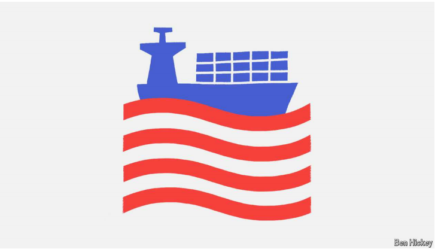
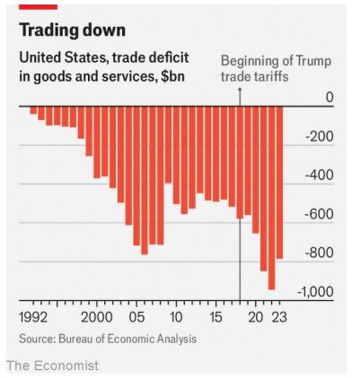

# What America’s presidential election means for world trade

The first in a series of eight concise briefs on the consequences of the 2024 election

原文：

In the 1990s presidential hopefuls fought over how much America should

open itself up to commerce with other countries. Nowadays, the trade debate

revolves around how much America should close itself off. Donald Trump is

the more radical of the two candidates, with a vision for tariffs that would

turn the clock back nearly a century on economic strategy. Kamala Harris is

less extreme but still sees a world in which America is best served by soft

protectionism, featuring subsidies for favoured industries.

20世纪90年代，总统候选人就美国应该在多大程度上开放与其他国家的贸易展开了争论。如今，贸易辩论围绕着美国应该在多大程度上封闭自己。唐纳德·特朗普(Donald Trump)是两位候选人中较为激进的一位，他对关税的愿景将使经济战略倒退近一个世纪。卡玛拉·哈里斯没有那么极端，但仍认为软保护主义对美国最为有利，其特点是为受青睐的行业提供补贴。

学习：

hopefuls：有希望获得成功的人；种子选手；（hopeful的复数）

revolves：围绕；（revolve的第三人称单数）

原文：

For Mr Trump the direction of travel is absolutely clear. In his first term in

the White House he called himself a “tariff man”, arguing that levies on

foreign countries were a way to maximise American economic power. He

started with tariffs on washing machines and solar panels, then turned to

steel and aluminium, before finally getting into a trade war with China. And

that may have been a mere prelude for what he would do in a second term.

对特朗普来说，前进的方向非常明确。在白宫的第一个任期内，他自称为“关税人”，认为向外国征税是最大化美国经济实力的一种方式。他先是对洗衣机和太阳能电池板征收关税，然后转向钢铁和铝，最后与中国打起了贸易战。这可能只是他在第二个任期内所做事情的前奏。

原文：

He has vowed to slap a tariff on all imports into America. Earlier in the

campaign he said this universal tariff might be 10%; recently he has upped

the ante to 20%. But his fiercest statements are focused on China,

threatening tariffs of up to 60% on made-in-China goods. He has also

mooted stripping China of its most-favoured-nation status, a decision that

would strike at the foundations of the already weakened World Trade

Organisation.

他发誓要对所有美国进口商品征收关税。在竞选的早期，他说这个普遍关税可能是10%；最近，他将赌注提高到了20%。但他最激烈的言论集中在中国，威胁对中国制造的商品征收高达60%的关税。他还提出取消中国的最惠国待遇，这一决定将打击已经削弱的世界贸易组织的基础。

学习：

slap：惩罚；处以罚金

slap a tariff on：征税

ante：赌注；底注（扑克牌游戏中每位玩家在发牌前必须交纳的赌注）

mooted：提出…供讨论；（moot的过去式）

原文：

From a legal perspective, Mr Trump ought to have a fairly easy path to

putting higher tariffs on China. He could deem China to be in violation of

the trade deal signed during his first term (China’s imports from America

have fallen far short of unrealistic targets) and then increase tariffs as

punishment. The path to a universal tariff is more fraught, however. Some

experts think that Mr Trump might declare America’s trade deficit to be a

national emergency, allowing him to invoke the International Emergency

Economic Powers Act, which would give him the authority to implement his

desired across-the-board levy. Companies would be likely to challenge that

in court, and may well end up successfully overturning the tariff. But the

legal process would take months, giving Mr Trump plenty of time to throw

the global trading system into chaos.

从法律角度来看，特朗普应该有一条相当容易的途径对中国征收更高的关税。他可以认为中国违反了他第一个任期内签署的贸易协定(中国从美国的进口远远低于不切实际的目标)，然后提高关税作为惩罚。然而，通往全球关税的道路更加坎坷。一些专家认为，特朗普可能会宣布美国的贸易逆差为国家紧急状态，允许他援引《国际紧急经济权力法》(International Emergency Economic Powers Act)，这将赋予他实施他渴望的全面征税的权力。公司可能会在法庭上挑战这一点，并很可能最终成功推翻关税。但法律程序需要几个月的时间，这给了特朗普充足的时间让全球贸易体系陷入混乱。

学习：

deem：认为；视为；认定

fraught：充满紧张的；充满风险的

path to xxx is fraught：道路很坎坷

原文：

Many Republicans remain sceptical—rightly—about the economic effects of

tariffs. Yet Mr Trump will have one argument that will appeal to them:

tariffs would help to pay for the tax cuts they want. America imports about

$3trn-worth of goods a year, so a 10% tariff would, in theory, generate

roughly $300bn of federal revenue. The trouble is that tariffs would weigh

on American growth, especially as other countries retaliate. Mr Trump’s

trade policies would take the economy on a contentious and risky path.

许多共和党人仍然对关税的经济影响持怀疑态度，这是正确的。然而，特朗普将有一个对他们有吸引力的理由:关税将有助于支付他们想要的减税。美国每年进口价值约3万亿美元的商品，因此，理论上，10%的关税将产生约3000亿美元的联邦收入。麻烦在于，关税将拖累美国的增长，尤其是在其他国家进行报复的时候。特朗普的贸易政策将把美国经济带上一条充满争议和风险的道路。

学习：

weigh on：打压          

weigh on growth：打压增长，拖累增长

retaliate：报复

原文：

Ms Harris’s views on trade, as on many other topics, are cloudier. She is

certainly not a champion of free trade. When Mr Trump renegotiated

America’s trade deal with Mexico and Canada in 2020, she was one of only

ten senators to vote against it, arguing that it was especially weak in its

environmental protections. And like Mr Biden, Ms Harris displays no

enthusiasm for traditional trade negotiations. At the same time she is most

definitely not a “tariff woman”. She regularly describes Mr Trump’s

universal-tariff idea as a national sales tax, and has made it the focal point of

her criticism of Mr Trump’s economic plans, citing estimates that it would

raise prices for the typical family by about $4,000 per year.

哈里斯女士对贸易的观点，就像对许多其他话题一样，更加模糊不清。她当然不是自由贸易的拥护者。当特朗普在2020年重新谈判美国与墨西哥和加拿大的贸易协定时，她是仅有的十名投反对票的参议员之一，理由是该协定在环境保护方面尤其薄弱。和拜登先生一样，哈里斯女士对传统的贸易谈判没有表现出热情。同时，她绝对不是一个“关税女人”。她经常把特朗普的普遍关税想法描述为一种全国性的销售税，并把它作为她批评特朗普经济计划的焦点，引用的估计是，这将使典型家庭的价格每年提高约4000美元。

学习：

focal：焦点的；中心的；关键的；

原文：

As for what she would do, Ms Harris’s positions appear to largely build on

President Joe Biden’s approach to trade on two fronts. First, she is calling

for subsidies to build up the country’s manufacturing muscle. In her platform

she has called it the “America Forward” tax credit, saying it would direct

tens of billions of dollars to help America succeed in the industries of the

future, including clean energy—potentially similar to the industrial subsidies

in Mr Biden’s Inflation Reduction Act that have worried other countries.

至于她会怎么做，哈里斯的立场似乎主要建立在美国总统乔拜登(Joe Biden)在两条战线上的贸易策略上。首先，她呼吁提供补贴，以增强该国的制造业实力。在她的政纲中，她称之为“美国前进”税收抵免，称它将引导数百亿美元帮助美国在未来的产业中取得成功，包括清洁能源——可能类似于拜登先生的通货膨胀削减法案中令其他国家担忧的产业补贴。

原文：

The second front is a willingness to take punitive trade actions against China

“when it breaks the rules”, as she puts it. The implication is that she would

continue to support tariffs on China, similar to the increases recently

implemented by the White House against Chinese electric vehicles and

semiconductors, among other things. To her mind, the distinction is that her

tariffs are strategic, whereas Mr Trump’s reflect a blunderbuss approach.

Many economists are less sanguine: a little protectionism is better than a lot

but it still is harmful to growth.

第二条战线是她所说的“当中国违反规则时”对中国采取惩罚性贸易行动的意愿。这意味着她将继续支持对中国征收关税，类似于白宫最近对中国电动汽车和半导体等产品征收的关税。在她看来，区别在于她的关税是战略性的，而特朗普的关税反映了一种笨拙的方法。许多经济学家不那么乐观:一点点保护主义比很多保护主义要好，但它仍然对增长有害。

学习：

punitive：美 [ˈpjunədɪv] 惩罚性的；处罚的

blunderbuss：笨拙的人；冒失鬼；粗心大意的人

sanguine：美 [ˈsæŋɡwɪn] 乐观的；充满信心的；充满希望的

原文：

All this should leave the world with a rather discouraging view of where

America is headed on trade. Under Mr Trump America would build up its

tariff walls. Ms Harris is less keen on walls but she is not about to build

bridges. ■

所有这些都应该让世界对美国的贸易走向有一个相当沮丧的看法。在特朗普治下，美国将筑起关税壁垒。哈里斯女士对墙不那么感兴趣，但她也不打算造桥。■

## 后记

2024年10月16日20点44分于上海。

